# EventBus


---

[TOC]

---


## 概述

EventBus（事件总线），是 Guava 中事件驱动机制的实现。

**事件驱动个人理解可以说是对观察者模式的一种实现**，被观察的相关参数被进一步封装为事件对象（EventObject）。

<br>

另外，观察者模式的需要**被观察者持有观察者的引用**，这就造成了两者之间的耦合，在 Guava 中**使用三方代持的方式**，进一步消除了耦合性。


## 使用示例

```java
public class Main {

	public static class Event<A> extends EventObject {

		/**
		 * Constructs a prototypical Event.
		 *
		 * @param source The object on which the Event initially occurred.
		 * @throws IllegalArgumentException if source is null.
		 */
		public Event(A source) {
			super(source);
		}
	}

	/**
	 * 定义监听事件
	 *
	 * @param event 希望监听的事件
	 */
	@Subscribe
	public void event(Event<String> event) {
		System.out.println(event.getSource());
	}

	public static void main(String[] args) {
		// 初始化总线
		EventBus eventBus = new EventBus();
		// 注册监听器
		eventBus.register(new Main());
        	// 定义事件
		Event<String> event = new Event<>("chenqwwq");
		// 发布事件
		eventBus.post(event);
		// 取消监听器注册
		eventBus.unregister(Main.class);
	}
}
```

<br>

所有的注册和事件发布都是通过 EventBus 调用实现，所以 EventBus 可以使用单例实现，提供一个全局的访问点，方便调用。

<br>

## 源码实现

<br>


### 监听器注册流程

以下是 EventBus#register 的整个流程：

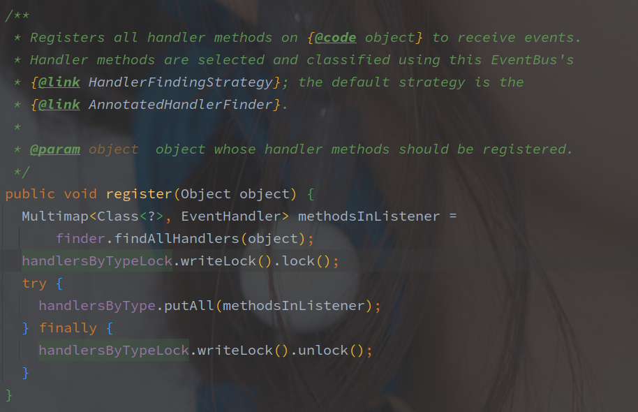

首先通过 HandlerFindingStrategy#findAllHandlers 查找出类中所有 EventHandler，HandlerFindingStrategy 默认是 **AnnotatedHandlerFinder**，解析的就是 @Subscribe 注解。

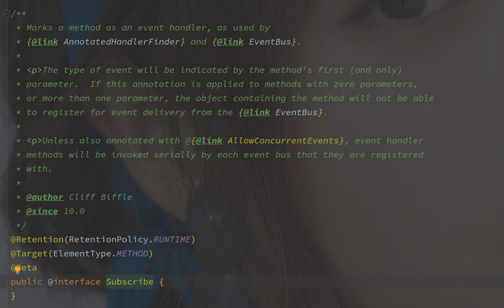

@Subscribe 就是一个标示性的注解，没有任何参数，并且只能标记在方法上，以下是 **AnnotatedHandlerFinder** 的实现代码：

<br>

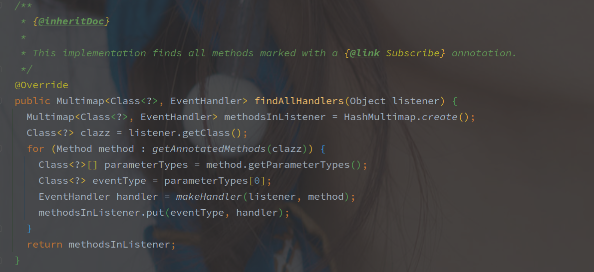

通过 AnnotatedHandlerFinder#getAnnotatedMethods 方法找到所有的被 Subscribe 标记的方法，中间会通过 LoadingCache 作为缓存。

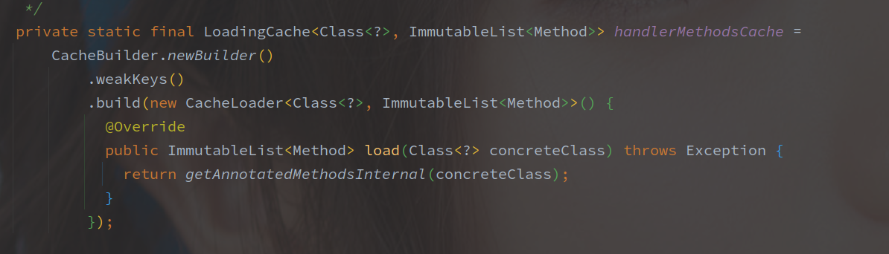

LoadingCache 中如果缓存不存在，则调用内部的 AnnotatedHandlerFinder#getAnnotatedMethodsInternal 方法获取 Method 列表，该方法就是扫描类的每个方法判断是否标记了 @Subscribe。

获取到所有的方法之后，开始遍历每个 Method，**并将方法的第一个参数作为事件类型，**通过 makeHandler 创建 EventHandler。

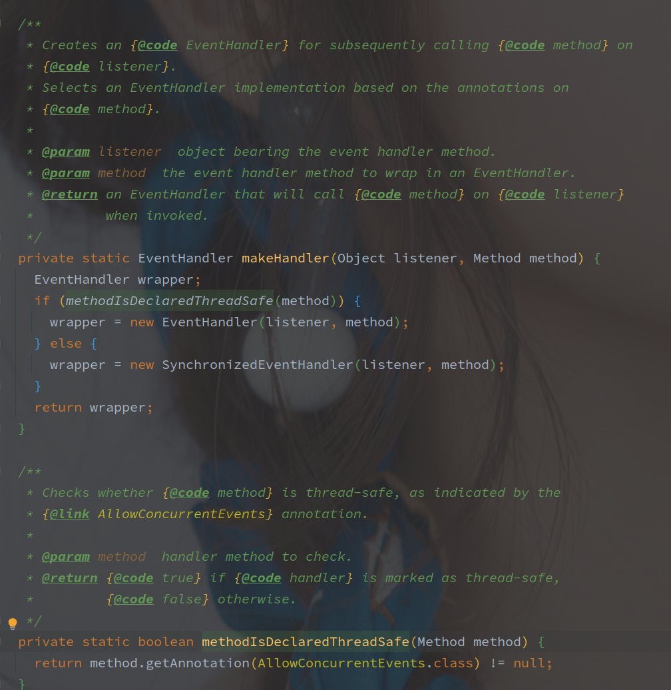

**通过是否标注 @AllowConcurrentEvents 表示方法的执行是否线程安全**，@AllowConcurrentEvents 也是一个标示性注解。

**如果非线程安全方法，则会创建 SynchronizedEventHandler 对象，线程安全则创建 EventHandler。**

SynchronizedEventHandler 直接继承了 EventHandler，并标记 handleEvent 方法为 synchronize。

<br>

解析完整个类之后，最终的结果以 Multimap 保存，并添加到外层的 EventBus 中。

> 以最后的第一个参数的初始类型为 Key，不考虑父类。


#### 监听器注册流程小结

**EventBus#register 方法会对参数类进行解析，获取其中的监听方法（默认为 @Subscribe 注解标识的方法），并包装为 EventHandler 对象，最终以 Map<EventType,Set<EventHandler>> 类似的结构保存。**

EventBus 是核心中的核心，注册、取消注册、事件发布等操作都通过其调用实现（类似 SpringBoot 的 ApplicationContext。

默认情况下，监听方法都是非线程安全的，会使用 synchronized 保证并发的安全性，所以在方法并发安全的情况下可以标记 @AllowConcurrentEvents 注解。

**以监听方法的第一个参数作为监听的事件类型，并且以基本类型注册，忽略父类。（注册的时候忽略父类**

> **EventBus 的事件并不需要特殊的类型**，注册的时候也是以 Class 对象为 Key。


<br>

<br>


### 事件发布流程

​	以下是事件发布流程（EventBus#post）的源码实现：

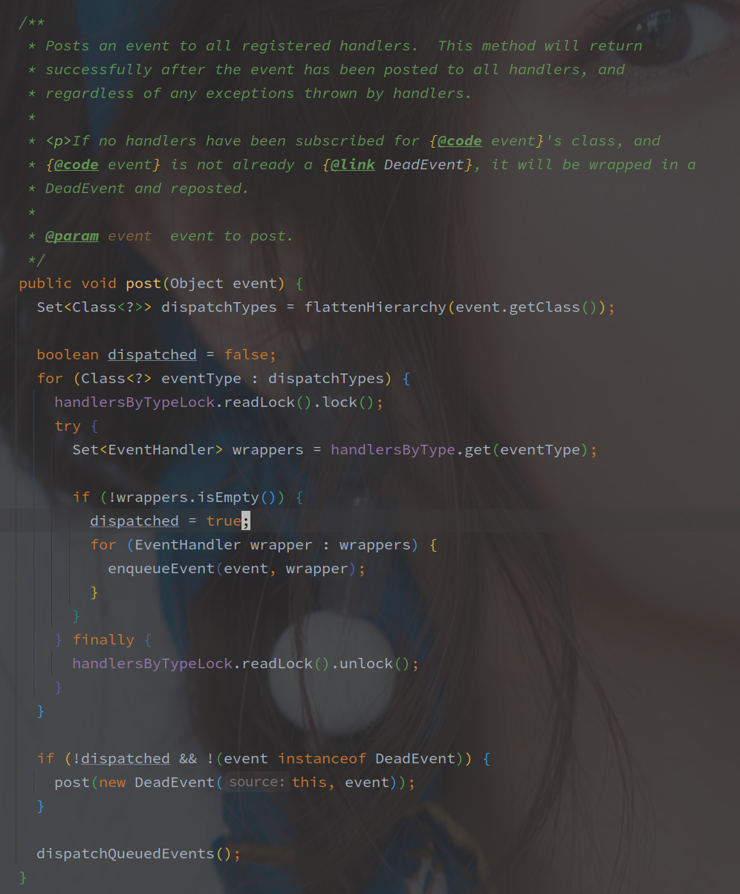

首先是**获取发布事件类型的整个所有父类包括当前类型**，以如下形式获取：

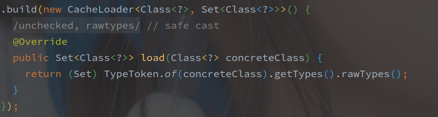

（TypeToken 是 Gooogle reflect 包下的，而不是 Gson 的包。）

例如最开始的示例，通过 Event 获取到的所有 Class，包括 Event，EventObject，Serializable，Object 四个类，也就是 Event 及其全部的父类（包括接口。

之后就是遍历所有的  Class 对象，获取所有的监听的 EventHandler。

> handlersByType 就是 Map<Class,Set<EventHandler>> 的映射关系，以此作为事件调度。

事件及其处理入队列，实现逻辑如下：

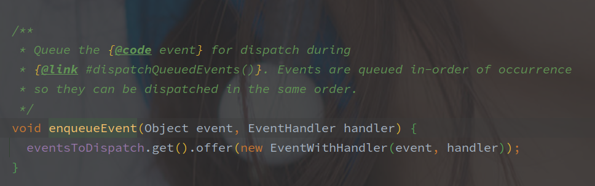

**入队列就是通过 ThreadLocal 的 Queue 保存了该 <Event,EventHandler> 的集合。**

如果没有响应该事件的 EventHandler，事件会进一步被包装为 DeadEvent，然后继续率先发布该事件，**所有的类和接口只要有一个存在对应的 EventHandler 对象，就表示调度成功。**

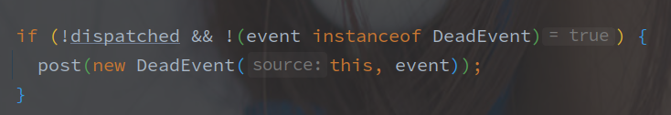

event 不能为 DeadEvent 是避免套娃，先调用的 post 方法发布 DeadEvent。

> 此时还没有别的事件的响应调用，所以 DeadEvent 是先于普通事件调用的。

之后就是实际的 EventHandler 方法调用：

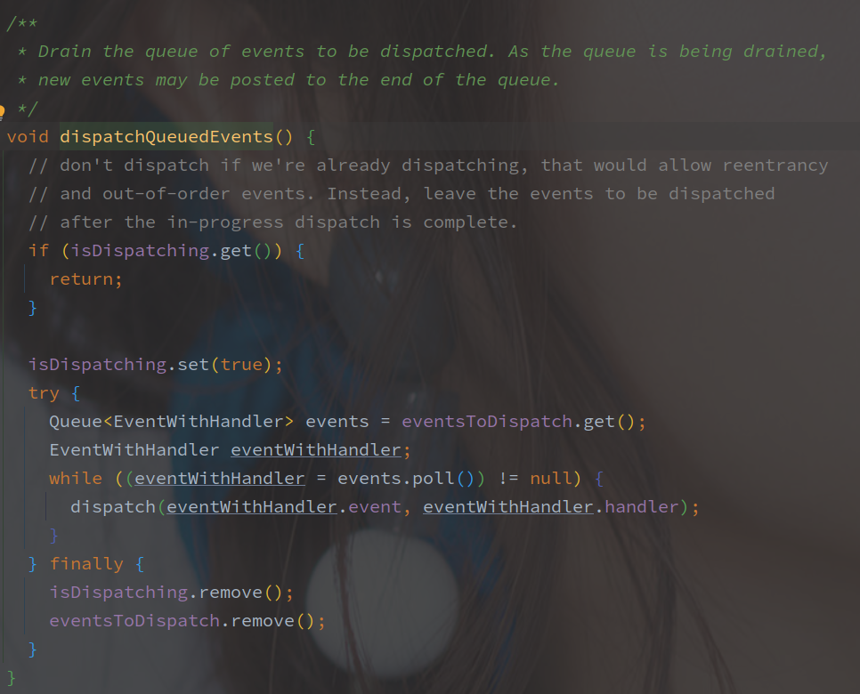

这里会标记进入 dispatching 状态，通过 isDispatching（通过 ThreadLocal 保存的 Boolean 类型。

之后是取出所有的 EventWithHandler 方法，并调用 EventHandler#handleEvent 方法：

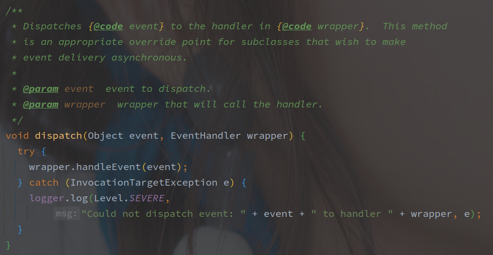

默认的 handleEvent 就是 Method#Invoke 方法：

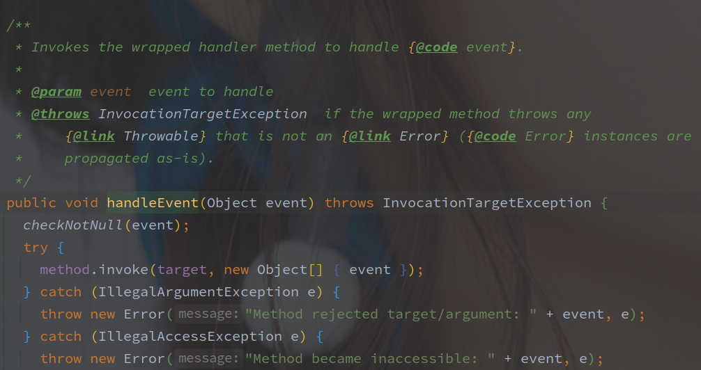

### 事件发布小结

事件的发布和处理流程如下：

1. 获取需要发布的事件的所有上层类和接口
2. 遍历所有类和接口获取对应的 EventHandler，并存入 ThreadLocal
3. 若当前事件没有找到对应 EventHandler，则发布 DeadEvent 事件
4. 遍历 ThreadLocal 的 Queue ，触发对应 EventHandler 调用

<br>

> Q：并发安全性

整个事件发布流程，中转的数据都是保存在 ThreadLocal 中的，包括是否正在调度的状态。

事件调度和触发也都是在一个线程中完成的，所以也不存在线程安全问题。

> 因为是单线程调度和触发，所以同步的事件处理也需要注意调用的时间，并不是 POST 之后就立马返回。

另外在调度的时候，会上一个 readLock，是对 Map<Class,Set<EventHandler>> 的线程安全维护。

<br>


> Q: DeadEvent 的作用？

DeadEvent 的作用在类注释中有部分解释：

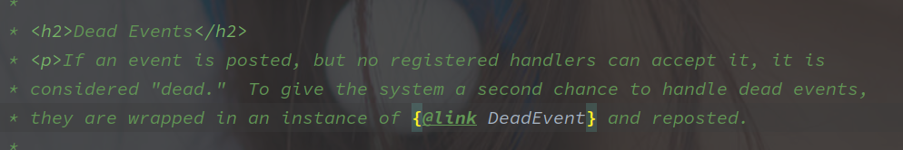

是希望给系统一个二次处理的机会，如果事件没有被正确调度，那么通过 DeadEvent 也可以获取到该事件并处理。

<br>


> Q： 为什么使用 ThreadLocal 保存 Event 和 EventHandler？

**为的是尽量减少 readLock 的时间。**

因为调用的执行事件不固定，如果调用卡主会导致 readLock 时间被拉长。

先遍历上锁生成事件，全部 EventHandler 确定之后再统一处理，是减少写锁占用的有效手段，ThreadLocal 也就成了保存的最佳方法。

isDispatching 状态我是真不知道为啥维护。

