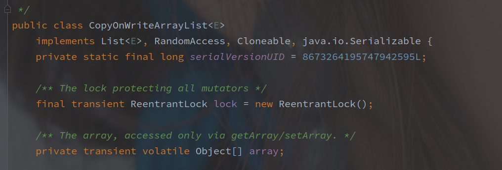
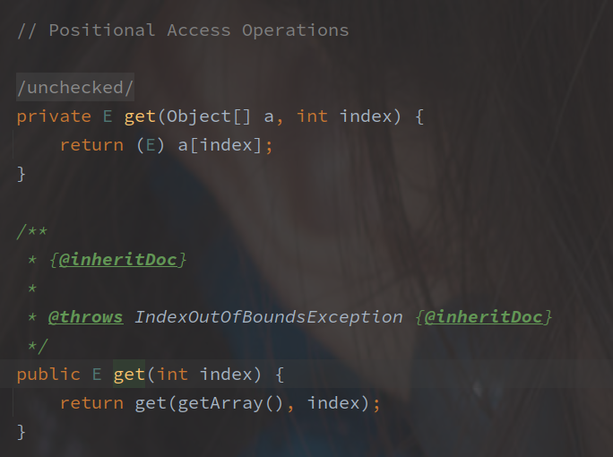
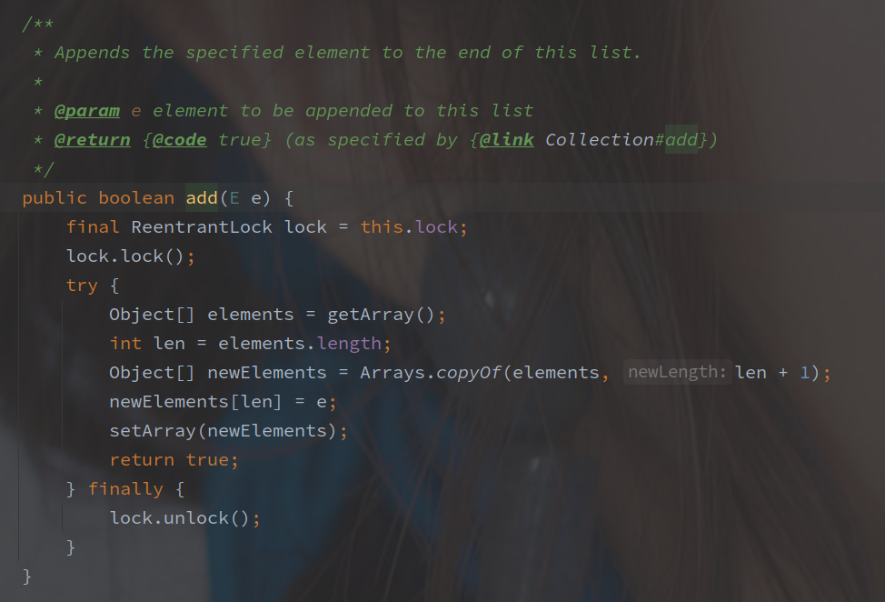
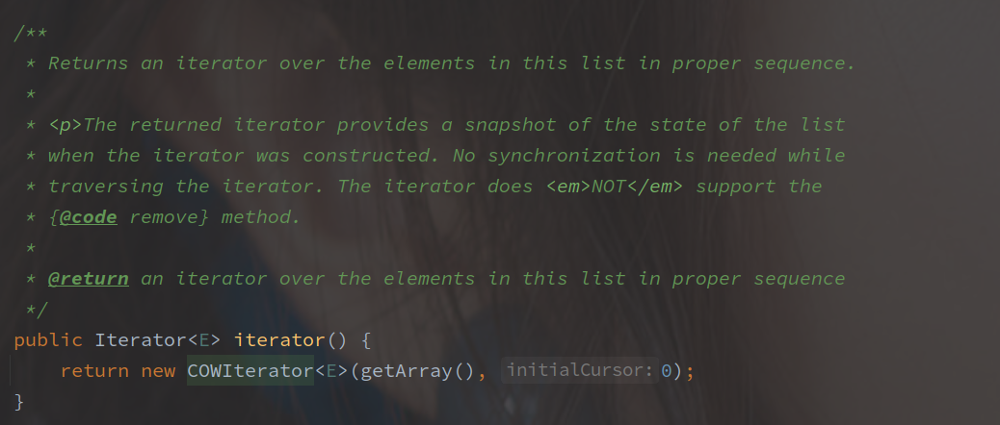
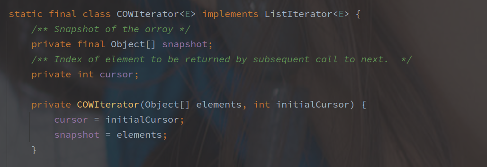

# CopyOnWriteArrayList 源码

---

[toc]

---

## 概述

CopyOnWriteArrayList 是 ArrayList 的并发安全版本，底层仍然是**数组实现，可以保证无锁化读取以及整体的并发安全。**

 

## 源码实现

### 成员变量

CopyOnWriteArrayList 的缓存变量只有两个：

- lock - 写时锁
- array - 数据集合

volatile 修饰是非常必要的，**因为存在多线程情况下整体的数组替换，所以需要保证并发情况下的可见性。**

对于 array 并没有直接操作的地方，都是通过 getArray / setArray 来实现的。

 

 

### 读写操作

以下是 CopyOnWriteArrayList 的读取操作的源码：

CopyOnWriteArrayList 的随机读写操作是**完全无锁**的，性能非常的优秀。

再接下来是写操作：

方法中使用 Arrays.copyOf 方法**从原数组中复制了一份快照出来**，并且新数组大小为原数组+1，之后在快照上修改内容，并且立马替换了原数组。

方法全程是在上锁的情况下完成了，所以**写操作还是需要大面积上锁的，和一般的并发安全集合一样。**

> 这里也能将将看出 COW 的缺点，对内存的消耗随着原始数据的增加也会扩大，并发时可能占据多倍的内存。

可以再来看看遍历的操作：

获取当前的元素集合，并且创建 COWIteratior，初始游标为 0。

初始之后，变量保存为一份 snapshot，其他的遍历方法基本都类似了。

 

## 总结

CopyOnWriteArrayList 基于写时创建副本数组的机制，可以在读时完全避免上锁，但是也存在以下两个问题：

- 一致性问题

像迭代的时候，是以原数组作为快照的，所以如果存在数据修改此时是无法感知的，只有方法结束之后才可正常访问。

- 内存占用问题

只要是写都会复制一份原始数据的快照，所以在原始数据量大或者写入频繁的时候，CopyOnWriteArrayList 可能就不太合适了。

> CopyOnWriteArrayList 适用于数据量小，且读多写少的情况。

 

> CopyOnWriteArrayList 的优点

有些不了解 COW 的优化点，读时虽然能无锁，但是写的时候直接创建数据快照这个消耗也太大了，所以联想到 ArrayList 在并发下的情况：

如果没有适用 COW，以遍历和删除某个元素并发为例子，删除某个元素需要将其后的数据前移，所以遍历可能遗漏部分数据，如果是添加则可能重复读取某部分数据，如果并发删除可能会出现正常数据被误删的情况。

COW 解决了以上场景的并发安全问题，但是个人感觉使用场景可能仍然有限。