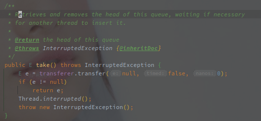
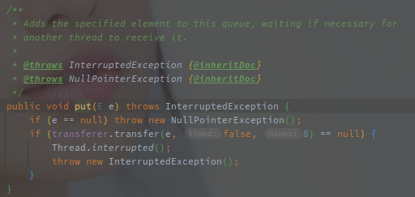
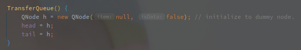

# SynchronousQueue

---

[TOC]

---


## 概述

SynchronousQueue 继承于 BlockingQueue，因此也不接受任何 NULL 值。

和其他 BlockingQueue 不同的是，**SynchronousQueue 不保存任何元素，甚至无法查看或者遍历其中的元素，只有在有线程删除的时候才可以进行添加元素，反之亦然。**

并且 **SynchronousQueue 的主要逻辑集中在 Put / Take 这对方法**上，调用 offer 添加元素时，如果没有配对的删除操作也不会阻塞。


> SynchronousQueue 就是**线程的一对一匹配器**，生产和消费两种线程互相匹配。

<br>

## 实现原理

SynchronousQueue 包含了公平和非公平两种模式。

> 公平和非公平模式的含义：

**公平是指先来先服务（FIFO），以 TransferQueue 实现**，例如先来的消费进程会和先来的生产进程匹配。

**非公平则是后来先服务（FIFO），以 TransferStack 实现**，按照 Stack 弹出的顺序和另一类型的线程匹配。

<br>

### Take / Put 方法

以下是 SynchronousQueue#take 的方法实现：



然后是 SynchronousQueue#put 的方法实现：



两个方法的实现都是通过 Transferer#transfer 实现的，**主要的区别就是参数，put 的时候会将元素作为第一个参数。**

> **以下就称为 Put 线程和 Take 线程。**

<br>

### TransferQueue

TransferQueue 使用链表的形式保存待匹配的线程节点。

以下为构造函数的实现：



所以初始化的 TransferQueue，就是单个的 NULL 节点（头尾节点相同）。

然后就是 TransferQueue#transfer 方法的实现，主要关注以下几个点：

- 如何阻塞/保存待匹配的线程
- 如何匹配线程（线程匹配如何保证 FIFO）

以下是该方法的源码实现：

```java
@SuppressWarnings("unchecked")
E transfer(E e, boolean timed, long nanos) {
    QNode s = null; // constructed/reused as needed
	// 是否是 put 线程
    boolean isData = (e != null);
    for (;;) {
        QNode t = tail;
        QNode h = head;
        // 未初始化完毕
        if (t == null || h == null)         // saw uninitialized value
            continue;                       // spin
       	// 当前没有待匹配的线程或者当前线程和末尾线程类型相同
        // 此时需要阻塞当前线程
        if (h == t || t.isData == isData) { // empty or same-mode
            QNode tn = t.next;
            if (t != tail)                  // inconsistent read
                continue;
            // 修复 tail 指针，一定是指向末尾
            if (tn != null) {               // lagging tail
                advanceTail(t, tn);
                continue;
            }
            // 是否需要阻塞，除了 take / put 之外还会有不需要阻塞的方法
            if (timed && nanos <= 0)        // can't wait
                return null;
			// 创建需要入队列的节点
            if (s == null)
                s = new QNode(e, isData);
            // 将新节点置为t的后继节点
            if (!t.casNext(null, s))        // failed to link in
                continue;
            // 将新节点置为 tail 节点
            advanceTail(t, s);              // swing tail and wait
            // 阻塞到条件满足，方法中会有自旋
            Object x = awaitFulfill(s, e, timed, nanos);
            if (x == s) {                   // wait was cancelled
                clean(t, s);
                return null;
            }
            if (!s.isOffList()) {           // not already unlinked
                advanceHead(t, s);          // unlink if head
                if (x != null)              // and forget fields
                    s.item = s;
                s.waiter = null;
            }
            return (x != null) ? (E)x : e;
        } else {                            // complementary-mode
            // 有待匹配的节点并且线程类型不同
            // 此时需要唤醒阻塞的线程并返回相关数据
            QNode m = h.next;               // node to fulfill 
            // 调用期间发生了改变
            if (t != tail || m == null || h != head)
                continue;                   // inconsistent read
            // 获取携带的数据
            Object x = m.item;
            // 满足以下条件会重试：
            if (isData == (x != null) ||    // m already fulfilled
                x == m ||                   // m cancelled
                // Item 会被替换
                // 如果 Put 线程等待，后来的 Take 线程会置空其中的item
                // 如果 Take 线程等待，后来的 Put 线程会将数据放置到 item 中
                !m.casItem(x, e)) {         // lost CAS
                advanceHead(h, m);          // dequeue and retry
                continue;
            }
            // 配对成功
            advanceHead(h, m);              // successfully fulfilled
            // 唤醒阻塞的线程
            LockSupport.unpark(m.waiter);
            return (x != null) ? (E)x : e;
        }
    }
}
```

> **方法中纯粹靠 CAS 来实现无锁化并发**（看起来有些懵）。

TransferQueue 使用 head 和 tail 维护单向队列，入队列时 tail 向后，出队列时 head 向后，同个时间链表内只会存在相同类型的 QNode。

> **当前线程的类型根据是否携带数据调用判断，如果入参 e != null，则为 Put 线程，反之则为 Take 线程。**

无论是 Put 还是 Take 线程，执行时如果没有匹配线程，则会尝试进入阻塞状态，是否需要阻塞也根据后面两个入参判断，如果当前存在可以匹配的线程，则会尝试唤醒阻塞中的线程。

**阻塞线程会和对应的元素 e，一起被包装为 QNode，并且下挂到链表末尾。**

> **Put / Take 两种线程的数据的交换使用 QNode.item 元素来实现。**

Put 线程匹配上 Take 线程后会将自身数据 CAS 到 Take 对应的 QNode 中，反之一样，如果**取消则将 QNode 对象赋值给 item。**


### TransferStack

**TransferStack 使用单个的 head 变量指向 Stack 的栈顶，每次匹配都是从栈顶取节点。**


## SynchronousQueue 的作用

### 使用 SynchronousQueue 作为线程池的任务队列

> 线程池中使用 BlockingQueue#offer 添加任务，使用 BlockingQueue#take 以及 BlockingQueue#poll(time) 获取线程（定时和不定时）。

SynchronousQueue 的 offer 方法**不会阻塞当前线程，如果没有匹配的线程则直接返回添加失败**。

所以线程池中使用 SynchronousQueue 作为任务队列时，当核心线程池满了之后，会直接尝试添加非核心线程，直到线程数达到最大。

## 参考

[SynchronousQueue 实现原理](https://zhuanlan.zhihu.com/p/29227508)