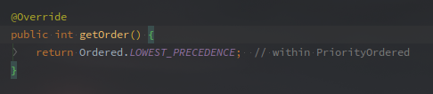
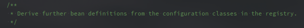
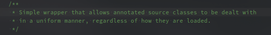
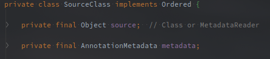

# Configuration类读取流程

>  本来只想简单看一下ConfigurationClassPostProcessor的，但是发现是个无底深坑，流程很复杂，细节也很多。

本文主要以上下文刷新阶段所调用的ConfigurationClassPostProcessor为切入点，分析整个JavaConfig类（用于配置@Conf）的加载过程。

包括一部分自动配置的部分（@Import）。


<!-- more -->

---

[TOC]


## ConfigurationClassPostProcessor

该类实现了BeanDefinitionRegistryPostProcessor，所以在上下文刷新阶段被调用。

负责加载所有的JavaConfig类，以及所有BeanDefinition。

以下即为ConfigurationClassPostProcessor的类签名：

 

图中可以看到，ConfigurationClassPostProcessor实现了BeanDefinitionRegistryPostProcessor接口，另外还有PriorityOrdered，以及一串的XXXXAware接口。

Aware接口会在创建该对象的时候注入进依赖，但是调用是发生在上下文刷新阶段，不知道这个注入如何实现。

BeanDefinitionRegistryPostProcessor接口子类会在刷新阶段统一被调用。

实现了PriorityOrdered则说明相比于实现了Ordered的以及普通的，该类具有较高的执行优先级。

**该类在SharedMetadataReaderFactoryContextInitializer#CachingMetadataReaderFactoryPostProcessor中通过BeanFactoryPostProcessor的形式注册到上下文中。**


另外需要注意的是：

 

根据PriorityOrdered的重载方法。

**该类具有最低优先级，所以任何实现了BeanDefinitionRegistryPostProcessor和PriorityOrdered接口的类都会在其之前被执行。**

这里的最低优先级是指在实现了PriorityOrdered的所有类。

BeanPostProcessor执行流程相关内容可以看下面：

[PostProcessorRegistrationDelegate](./PostProcessorRegistrationDelegate.md)


ConfigurationClassPostProcessor也实现了BeanFactoryPostProcessor的postProcessBeanFactory方法，但此处可能不会展开讲。


### #postProcessBeanDefinitionRegistry 

类的直接调用方法，上下文刷新时整体流程就是从这里切入的。

 

注释中就能看出，该方法的作用就是从Registry的Configuration类中往外衍生，获取更多的BeanDefinition。

所以以BeanDefinitionRegistry作为入参。

```java
// ConfigurationClassPostProcessor
// Debug进来的第一个方法
@Override
public void postProcessBeanDefinitionRegistry(BeanDefinitionRegistry registry) {
    	// 获取BeanDefinitionRegistry
        int registryId = System.identityHashCode(registry);
    	// 检查是否有执行过该BeanPostProcessor
        if (this.registriesPostProcessed.contains(registryId)) {
                throw new IllegalStateException(
                    "postProcessBeanDefinitionRegistry already called on this post-processor against " + registry);
        }
        if (this.factoriesPostProcessed.contains(registryId)) {
                throw new IllegalStateException(
                    "postProcessBeanFactory already called on this post-processor against " + registry);
        }
    	// 添加进去，证明已经执行过
        this.registriesPostProcessed.add(registryId);
		
   		// 进一步调用
        processConfigBeanDefinitions(registry);
}
```

该方法中的逻辑就是在具体处理JavaConfig类前做一些验证。

获取当前Registry的HashCode，如果已经执行过则会在成员变量中保留，因此可以判断是否执行过。

processConfigBeanDefinitions方法看来就是主要的处理逻辑了。


### #processConfigBeanDefinitions 

```java
public void processConfigBeanDefinitions(BeanDefinitionRegistry registry) {
        List<BeanDefinitionHolder> configCandidates = new ArrayList<>();
    	// 获取名称
    	// 此处也可以看到，Configuration的来源是BeanDefinitionRegistry
        String[] candidateNames = registry.getBeanDefinitionNames()；
		// 遍历筛选标识了Configuration的类
        for (String beanName : candidateNames) {
                BeanDefinition beanDef = registry.getBeanDefinition(beanName);
            	// 根据debug日志，猜测应该是配置文件是否已经加载的标志
                if (beanDef.getAttribute(ConfigurationClassUtils.CONFIGURATION_CLASS_ATTRIBUTE) != null) {
                        if (logger.isDebugEnabled()) {
                            	logger.debug("Bean definition has already been processed as a configuration class: " + beanDef);
                        }
                // 检查是否符合Configuration类，可以看一下什么样的才是符合规范的Configuration类
                // 具体执行逻辑可以看ConfigurationClassUtils
                } else if (ConfigurationClassUtils.checkConfigurationClassCandidate(beanDef, this.metadataReaderFactory)) {
                    	configCandidates.add(new BeanDefinitionHolder(beanDef, beanName));
                }
        }

        // Return immediately if no @Configuration classes were found
    	// 若Configuration类为空，直接退出，好理解
        if (configCandidates.isEmpty()) {
                return;
        }

        // Sort by previously determined @Order value, if applicable
    	// 根据Order排序
    	// 在Check的时候就会把Order的值提取出来放到属性中，这次再次获取
        configCandidates.sort((bd1, bd2) -> {
                int i1 = ConfigurationClassUtils.getOrder(bd1.getBeanDefinition());
                int i2 = ConfigurationClassUtils.getOrder(bd2.getBeanDefinition());
                return Integer.compare(i1, i2);
        });

        // Detect any custom bean name generation strategy supplied through the enclosing application context
    	// 处理单例Bean，将BeanRegistry转化为单例形式
    	// 并设置本地BeanNameGenerator
        SingletonBeanRegistry sbr = null;
        if (registry instanceof SingletonBeanRegistry) {
                sbr = (SingletonBeanRegistry) registry;
                if (!this.localBeanNameGeneratorSet) {
                        BeanNameGenerator generator = (BeanNameGenerator) sbr.getSingleton(
                            AnnotationConfigUtils.CONFIGURATION_BEAN_NAME_GENERATOR);
                        if (generator != null) {
                            	// 两个BeanNameGenerator成员变量，具体作用未知。
                                this.componentScanBeanNameGenerator = generator;
                                this.importBeanNameGenerator = generator;
                        }
                }
        }
	
    	// 空的情况下创建环境容器
    	// 可能只是需要一个容器，并不会对环境有什么要求
        if (this.environment == null) {
            	this.environment = new StandardEnvironment();
        }

        // Parse each @Configuration class
    	// 创建Configuration类的解析器
    	// 此处可以看到全部参数都沿用了当前的
        ConfigurationClassParser parser = new ConfigurationClassParser(
            this.metadataReaderFactory, this.problemReporter, this.environment,
            this.resourceLoader, this.componentScanBeanNameGenerator, registry);

        Set<BeanDefinitionHolderbeanDef> candidates = new LinkedHashSet<>(configCandidates);
        Set<ConfigurationClass> alreadyParsed = new HashSet<>(configCandidates.size());
        do {
            	// 解析并验证筛选后剩余的
                parser.parse(candidates);
                parser.validate();
				// 从Parser的成员变量中获取
            	// 估计该成员变量就是解析之后存放ConfigurationClasses的
                Set<ConfigurationClass> configClasses = new LinkedHashSet<>(parser.getConfigurationClasses());
                configClasses.removeAll(alreadyParsed);

                // Read the model and create bean definitions based on its content
            	// 阅读模型并根据其BeanDefinition创建内容
                if (this.reader == null) {
                        this.reader = new ConfigurationClassBeanDefinitionReader(
                            registry, this.sourceExtractor, this.resourceLoader, this.environment,
                            this.importBeanNameGenerator, parser.getImportRegistry());
                }
            	// 读取BeanDefinition，
            	// ！！！这一步才是读取所有的BeanDefinition的主要流程
                this.reader.loadBeanDefinitions(configClasses);
                alreadyParsed.addAll(configClasses);

                candidates.clear();
            	// 判断BeanDefinition是否有多出来
                if (registry.getBeanDefinitionCount() > candidateNames.length) {
                        String[] newCandidateNames = registry.getBeanDefinitionNames();
                        Set<String> oldCandidateNames = new HashSet<>(Arrays.asList(candidateNames));
                        Set<String> alreadyParsedClasses = new HashSet<>();
                        for (ConfigurationClass configurationClass : alreadyParsed) {
                            	alreadyParsedClasses.add(configurationClass.getMetadata().getClassName());
                        }
                    	// 遍历多出来的BeanDefinition是否有符合条件的Configuration类
                        for (String candidateName : newCandidateNames) {
                                if (!oldCandidateNames.contains(candidateName)) {
                                        BeanDefinition bd = registry.getBeanDefinition(candidateName);
                                        if (ConfigurationClassUtils.checkConfigurationClassCandidate(bd, this.metadataReaderFactory) &&
                                            	!alreadyParsedClasses.contains(bd.getBeanClassName())) {
                                            	candidates.add(new BeanDefinitionHolder(bd, candidateName));
                                        }
                                }
                        }
                    	candidateNames = newCandidateNames;
            }
        } while (!candidates.isEmpty());

        // Register the ImportRegistry as a bean in order to support ImportAware @Configuration classes
        if (sbr != null && !sbr.containsSingleton(IMPORT_REGISTRY_BEAN_NAME)) {
            	sbr.registerSingleton(IMPORT_REGISTRY_BEAN_NAME, parser.getImportRegistry());
        }

        if (this.metadataReaderFactory instanceof CachingMetadataReaderFactory) {
            // Clear cache in externally provided MetadataReaderFactory; this is a no-op
            // for a shared cache since it'll be cleared by the ApplicationContext.
            	((CachingMetadataReaderFactory) this.metadataReaderFactory).clearCache();
        }
}
```

流程如下：

1. 从BeanDefinitionRegistry中获取所有的BeanDefinition
2. 筛选合法的ConfigurationClass并按照Order排序
3. 创建ConfigurationClassParser
4. 对经过筛选的BeanDefinition进行解析，验证
5. ConfigurationClassBeanDefinitionReader加载所有Configuration类中的BeanDefinition
6. 继续从Registry中获取新的BeanDefinition，然后的回到第四步循环，直到没有新增（这里就没有排序了）。
7. 注册特殊的Bean对象，清除缓存。

总结一下好像就是：

**筛选候选的Configuration类，创建对应的Parser类，循环解析直到Registry中没有产生新的符合Configuration条件的BeanDefinition。** 


## ConfigurationClassUtils

该类都是一些在加载ConfigurationClass的时候的相关工具类。

主要是检查判断用。


### #checkConfigurationClassCandidate

```java
// ConfigurationClassUtils
public static boolean checkConfigurationClassCandidate(
        BeanDefinition beanDef, MetadataReaderFactory metadataReaderFactory) {
    	// 获取类名称
        String className = beanDef.getBeanClassName();
    	// BeanDefinition对象中的className为空或者工厂方法不为空则退出。
        // 退出逻辑未知？？
        if (className == null || beanDef.getFactoryMethodName() != null) {
            	return false;
        }
	
    	// 转化为AnnotationMetadata
    	// 不同的BeanDefinition有不同的转化方式
        AnnotationMetadata metadata;
        if (beanDef instanceof AnnotatedBeanDefinition &&
                className.equals(((AnnotatedBeanDefinition) beanDef).getMetadata().getClassName())) {
                // Can reuse the pre-parsed metadata from the given BeanDefinition...
                metadata = ((AnnotatedBeanDefinition) beanDef).getMetadata();
        } else if (beanDef instanceof AbstractBeanDefinition && ((AbstractBeanDefinition) beanDef).hasBeanClass()) {
                // Check already loaded Class if present...
                // since we possibly can't even load the class file for this Class.
               Class<?> beanClass = ((AbstractBeanDefinition) beanDef).getBeanClass();
               if (BeanFactoryPostProcessor.class.isAssignableFrom(beanClass) ||
                        BeanPostProcessor.class.isAssignableFrom(beanClass) ||
                        AopInfrastructureBean.class.isAssignableFrom(beanClass) ||
                        EventListenerFactory.class.isAssignableFrom(beanClass)) {
                        return false;
                    }
                    metadata = AnnotationMetadata.introspect(beanClass);
        } else {
                try {
                    	MetadataReader metadataReader = metadataReaderFactory.getMetadataReader(className);
                    	metadata = metadataReader.getAnnotationMetadata();
                } catch (IOException ex) {
                        if (logger.isDebugEnabled()) {
                            	logger.debug("Could not find class file for introspecting configuration annotations: " +
                                         	className, ex);
                        }
                        return false;
                }
        }
		
    	// AnnotationMetadata转化成功，之后的metadata可以直接用。
    	// 获取配置Map
        Map<String, Object> config = metadata.getAnnotationAttributes(Configuration.class.getName());
    	// 设置属性，这里可以看到
    	// CONFIGURATION_CLASS_ATTRIBUTE这个属性在检查的时候塞进去的
        if (config != null && !Boolean.FALSE.equals(config.get("proxyBeanMethods"))) {
            	beanDef.setAttribute(CONFIGURATION_CLASS_ATTRIBUTE, CONFIGURATION_CLASS_FULL);
        } else if (config != null || isConfigurationCandidate(metadata)) {
            	beanDef.setAttribute(CONFIGURATION_CLASS_ATTRIBUTE, CONFIGURATION_CLASS_LITE);
        } else {
            	return false;
        }

        // It's a full or lite configuration candidate... Let's determine the order value, if any.
    	// 设置Order属性
        Integer order = getOrder(metadata);
        if (order != null) {
            	beanDef.setAttribute(ORDER_ATTRIBUTE, order);
        }

        return true;
}
```

显而易见的，该类主要是对beanDef的检查，**判断是否符合Configuration类的条件。**

能成为Configuration类的BeanDefinition的条件如下：

1. ClassName不为空
2. FactoryMethodName为空
3. 如果是AbstractBeanDefinition，则不能继承`BeanFactoryPostProcessor`，`BeanPostProcessor`，`AopInfrastructureBean`，`EventListenerFactory`中的任意一种


### #isConfigurationCandidate 

该类用于初步检查是否是Configuration类。

```java
// ConfigurationClassUtils
private static final Set<String> candidateIndicators = new HashSet<>(8);
static {
        candidateIndicators.add(Component.class.getName());
        candidateIndicators.add(ComponentScan.class.getName());
        candidateIndicators.add(Import.class.getName());
        candidateIndicators.add(ImportResource.class.getName());
}

public static boolean isConfigurationCandidate(AnnotationMetadata metadata) {
        // 是接口就直接退出
        if (metadata.isInterface()) {
            	return false;
        }

        // Any of the typical annotations found?
    	// 标示了candidateIndicators中的任意一个注解，四个基本注解在上面
        for (String indicator : candidateIndicators) {
                if (metadata.isAnnotated(indicator)) {
                        return true;
                }
        }

        // Finally, let's look for @Bean methods...
    	// 检查带@Bean注释的方法
        try {
            	return metadata.hasAnnotatedMethods(Bean.class.getName());
        } catch (Throwable ex) {
                if (logger.isDebugEnabled()) {
                    	logger.debug("Failed to introspect @Bean methods on class [" + metadata.getClassName() + "]: " + ex);
                }
                return false;
        }
}
```

该类中可以看出成为Configuration类的候选条件：

1. 不能是接口
2. 标识了`@Component`，`@ComponentScan`，`@Import`，`@ImportResource`中的一个。
3. 类中有方法被@Bean标识

注意此处只是候选，是否可以解析还需要Check去判断。


## SourceClass

对source class的简单包装。

 

如类注释中所说，主要是为了以统一的方式处理这些Source Class，而忽略他们的加载过程。


### 成员变量

 

类中只有如上两个成员变量


### getMemberClasses - Configuration类中获取Bean

```java
public Collection<SourceClass> getMemberClasses() throws IOException {
    		// 复制一份配置源
			Object sourceToProcess = this.source;
    		// 从成员变量的注释中可以看到
    		// source就是Class或者MetadataReader
			if (sourceToProcess instanceof Class) {
                // 转化为类对象
				Class<?> sourceClass = (Class<?>) sourceToProcess;
				try {
                    	// 此处获取所有的内部类
                        Class<?>[] declaredClasses = sourceClass.getDeclaredClasses();
                        List<SourceClass> members = new ArrayList<>(declaredClasses.length);
                        for (Class<?> declaredClass : declaredClasses) {
                            // 遍历，包装并添加到members中
                            members.add(asSourceClass(declaredClass, DEFAULT_EXCLUSION_FILTER));
                        }
                    	// 返回
                        return members;
				} catch (NoClassDefFoundError err) {
					// getDeclaredClasses() failed because of non-resolvable dependencies
					// -> fall back to ASM below
					sourceToProcess = metadataReaderFactory.getMetadataReader(sourceClass.getName());
				}
			}

			// ASM-based resolution - safe for non-resolvable classes as well
			MetadataReader sourceReader = (MetadataReader) sourceToProcess;
			String[] memberClassNames = sourceReader.getClassMetadata().getMemberClassNames();
			List<SourceClass> members = new ArrayList<>(memberClassNames.length);
			for (String memberClassName : memberClassNames) {
				try {
					members.add(asSourceClass(memberClassName, DEFAULT_EXCLUSION_FILTER));
				}
				catch (IOException ex) {
					// Let's skip it if it's not resolvable - we're just looking for candidates
					if (logger.isDebugEnabled()) {
						logger.debug("Failed to resolve member class [" + memberClassName +
								"] - not considering it as a configuration class candidate");
					}
				}
			}
			return members;
		}
```

**该方法会自行判断从反射和ASM两种方式返回source的内部类。**

在以反射获取内部类的时候，需要注意`sourceClass.getDeclaredClasses()`，该方法会获取自身的所有内部类，包括私有的，但是不包括父类的。

所以在Configuration中，私有的内部类也能被配置。