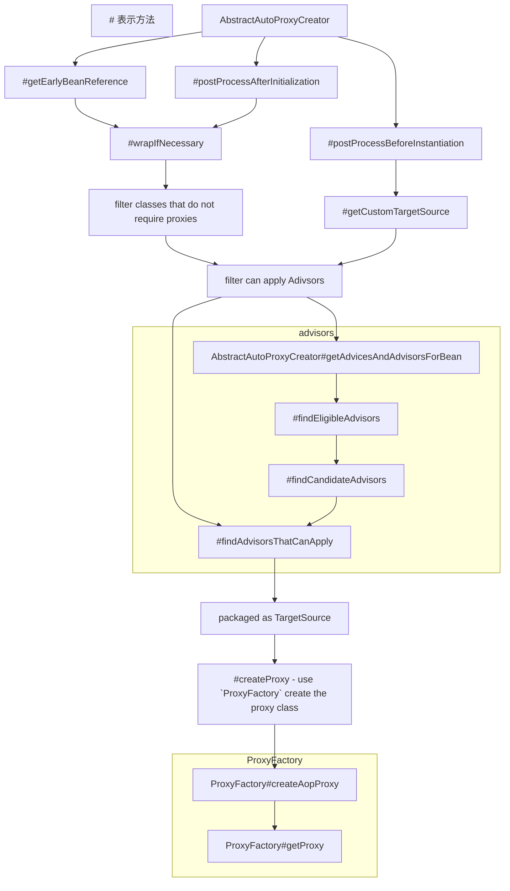

```mermaid
graph TD 
    title[# 表示方法]
 	A[AbstractAutoProxyCreator] --> B[#getEarlyBeanReference]
 	A --> C[#postProcessAfterInitialization]; A --> D[#postProcessBeforeInstantiation]; 
 	B --> E[#wrapIfNecessary];   C --> E;
 	E --> F[filter classes that do not require proxies]
    --> J[filter can apply Adivsors]--> Q[#findAdvisorsThatCanApply]
    --> H[packaged as TargetSource] --> P[#createProxy - use `ProxyFactory` create the proxy class]
    D --> #getCustomTargetSource --> J; 
    
    subgraph advisors
    		K[AbstractAutoProxyCreator#getAdvicesAndAdvisorsForBean] --> #findEligibleAdvisors --> #findCandidateAdvisors --> Q
    end
    J --> K
    
    subgraph ProxyFactory
     	 O[ProxyFactory#createAopProxy] --> ProxyFactory#getProxy
    end
    P --> O
    
```

