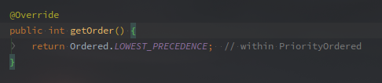

# ConfigurationClassPostProcessor

> 本来是统一讲流程的，但是如果整个流程一起讲好像太多了，而且除了Configuration的加载，该类还作为BeanFactoryPostProcessor的实现，所以独立成一个文件。

<!-- more -->

---

[TOC]


## 概述

以下即为ConfigurationClassPostProcessor的类签名：

 

图中可以看到，ConfigurationClassPostProcessor实现了BeanDefinitionRegistryPostProcessor接口，另外还有PriorityOrdered，以及一串的XXXXAware接口。

**实现了BeanDefinitionRegistryPostProcessor，所以自然而然该类在上下文刷新阶段就会被调用。**

而且还是两次，调用的方法分别是：

- postProcessBeanDefinitionRegistry - 加载所有JavaConfig类
- postProcessBeanFactory

另外需要注意的是：

 

根据PriorityOrdered的重载方法。

**该类具有最低优先级，所以任何实现了BeanDefinitionRegistryPostProcessor和PriorityOrdered接口的类都会在其之前被执行。**

这里的最低优先级是指在实现了PriorityOrdered的所有类。

BeanFactoryPostProcessor执行流程相关内容可以看下面：

[PostProcessorRegistrationDelegate](./PostProcessorRegistrationDelegate.md)

实现了Aware接口，也就意味着该类会在创建该对象的时候注入相关的依赖。


**该类在SharedMetadataReaderFactoryContextInitializer#CachingMetadataReaderFactoryPostProcessor中通过BeanFactoryPostProcessor的形式注册到上下文中。**


## 主要方法

该类的主要方法还是两个钩子方法，以此作为基础再来看延伸的特性。


### #postProcessBeanDefinitionRegistry

该方法作为BeanDefinitionRegistryPostProcessor的直接实现，在postProcessBeanFactory之前被调用。

**该方法的作用就是加载所有BeanDefinition，以Registry中已存在的JavaConfig类为源.**

以下就是postProcessBeanDefinitionRegistry的源码：

```java
@Override
public void postProcessBeanDefinitionRegistry(BeanDefinitionRegistry registry) {
    // 获取registry对象的HashCode
    int registryId = System.identityHashCode(registry);
    if (this.registriesPostProcessed.contains(registryId)) {
        throw new IllegalStateException(
            "postProcessBeanDefinitionRegistry already called on this post-processor against " + registry);
    }
    if (this.factoriesPostProcessed.contains(registryId)) {
        throw new IllegalStateException(
            "postProcessBeanFactory already called on this post-processor against " + registry);
    }
    this.registriesPostProcessed.add(registryId);

    processConfigBeanDefinitions(registry);
}
```

方法体内其实并没有太复杂的逻辑，主要就是判断一下入参的Registry是否处理过。

registriesPostProcessed和factoriesPostProcessed两个成员变量分别对应着两个钩子方法。

执行过该方法的Registry的HashCode会被放到上述registriesPostProcessed变量里面，以此判断是否已经执行。


#### #processConfigBeanDefinitions 

```java
public void processConfigBeanDefinitions(BeanDefinitionRegistry registry) {
        List<BeanDefinitionHolder> configCandidates = new ArrayList<>();
    	// 获取名称
    	// 此处也可以看到，Configuration的来源是BeanDefinitionRegistry
        String[] candidateNames = registry.getBeanDefinitionNames()；
		// 遍历筛选标识了Configuration的类
        for (String beanName : candidateNames) {
                BeanDefinition beanDef = registry.getBeanDefinition(beanName);
            	// 根据debug日志，猜测应该是配置文件是否已经加载的标志
                if (beanDef.getAttribute(ConfigurationClassUtils.CONFIGURATION_CLASS_ATTRIBUTE) != null) {
                        if (logger.isDebugEnabled()) {
                            	logger.debug("Bean definition has already been processed as a configuration class: " + beanDef);
                        }
                // 检查是否符合Configuration类，可以看一下什么样的才是符合规范的Configuration类
                // 具体执行逻辑可以看ConfigurationClassUtils
                } else if (ConfigurationClassUtils.checkConfigurationClassCandidate(beanDef, this.metadataReaderFactory)) {
                    	configCandidates.add(new BeanDefinitionHolder(beanDef, beanName));
                }
        }

        // Return immediately if no @Configuration classes were found
    	// 若Configuration类为空，直接退出，好理解
        if (configCandidates.isEmpty()) {
                return;
        }

        // Sort by previously determined @Order value, if applicable
    	// 根据Order排序
    	// 在Check的时候就会把Order的值提取出来放到属性中，这次再次获取
        configCandidates.sort((bd1, bd2) -> {
                int i1 = ConfigurationClassUtils.getOrder(bd1.getBeanDefinition());
                int i2 = ConfigurationClassUtils.getOrder(bd2.getBeanDefinition());
                return Integer.compare(i1, i2);
        });

        // Detect any custom bean name generation strategy supplied through the enclosing application context
    	// 处理单例Bean，将BeanRegistry转化为单例形式
    	// 并设置本地BeanNameGenerator
        SingletonBeanRegistry sbr = null;
        if (registry instanceof SingletonBeanRegistry) {
                sbr = (SingletonBeanRegistry) registry;
                if (!this.localBeanNameGeneratorSet) {
                        BeanNameGenerator generator = (BeanNameGenerator) sbr.getSingleton(
                            AnnotationConfigUtils.CONFIGURATION_BEAN_NAME_GENERATOR);
                        if (generator != null) {
                            	// 两个BeanNameGenerator成员变量，具体作用未知。
                                this.componentScanBeanNameGenerator = generator;
                                this.importBeanNameGenerator = generator;
                        }
                }
        }
	
    	// 空的情况下创建环境容器
    	// 可能只是需要一个容器，并不会对环境有什么要求
        if (this.environment == null) {
            	this.environment = new StandardEnvironment();
        }

        // Parse each @Configuration class
    	// 创建Configuration类的解析器
    	// 此处可以看到全部参数都沿用了当前的
        ConfigurationClassParser parser = new ConfigurationClassParser(
            this.metadataReaderFactory, this.problemReporter, this.environment,
            this.resourceLoader, this.componentScanBeanNameGenerator, registry);

        Set<BeanDefinitionHolderbeanDef> candidates = new LinkedHashSet<>(configCandidates);
        Set<ConfigurationClass> alreadyParsed = new HashSet<>(configCandidates.size());
        do {
            	// 解析并验证筛选后剩余的
                parser.parse(candidates);
                parser.validate();
				// 从Parser的成员变量中获取
            	// 估计该成员变量就是解析之后存放ConfigurationClasses的
                Set<ConfigurationClass> configClasses = new LinkedHashSet<>(parser.getConfigurationClasses());
                configClasses.removeAll(alreadyParsed);

                // Read the model and create bean definitions based on its content
            	// 阅读模型并根据其BeanDefinition创建内容
                if (this.reader == null) {
                        this.reader = new ConfigurationClassBeanDefinitionReader(
                            registry, this.sourceExtractor, this.resourceLoader, this.environment,
                            this.importBeanNameGenerator, parser.getImportRegistry());
                }
            	// 读取BeanDefinition，
            	// ！！！这一步才是读取所有的BeanDefinition的主要流程
                this.reader.loadBeanDefinitions(configClasses);
                alreadyParsed.addAll(configClasses);

                candidates.clear();
            	// 判断BeanDefinition是否有多出来
                if (registry.getBeanDefinitionCount() > candidateNames.length) {
                        String[] newCandidateNames = registry.getBeanDefinitionNames();
                        Set<String> oldCandidateNames = new HashSet<>(Arrays.asList(candidateNames));
                        Set<String> alreadyParsedClasses = new HashSet<>();
                        for (ConfigurationClass configurationClass : alreadyParsed) {
                            	alreadyParsedClasses.add(configurationClass.getMetadata().getClassName());
                        }
                    	// 遍历多出来的BeanDefinition是否有符合条件的Configuration类
                        for (String candidateName : newCandidateNames) {
                                if (!oldCandidateNames.contains(candidateName)) {
                                        BeanDefinition bd = registry.getBeanDefinition(candidateName);
                                        if (ConfigurationClassUtils.checkConfigurationClassCandidate(bd, this.metadataReaderFactory) &&
                                            	!alreadyParsedClasses.contains(bd.getBeanClassName())) {
                                            	candidates.add(new BeanDefinitionHolder(bd, candidateName));
                                        }
                                }
                        }
                    	candidateNames = newCandidateNames;
            }
        } while (!candidates.isEmpty());

        // Register the ImportRegistry as a bean in order to support ImportAware @Configuration classes
        if (sbr != null && !sbr.containsSingleton(IMPORT_REGISTRY_BEAN_NAME)) {
            	sbr.registerSingleton(IMPORT_REGISTRY_BEAN_NAME, parser.getImportRegistry());
        }

        if (this.metadataReaderFactory instanceof CachingMetadataReaderFactory) {
            // Clear cache in externally provided MetadataReaderFactory; this is a no-op
            // for a shared cache since it'll be cleared by the ApplicationContext.
            	((CachingMetadataReaderFactory) this.metadataReaderFactory).clearCache();
        }
}
```

流程如下：

1. 从BeanDefinitionRegistry中获取所有的BeanDefinition
2. 筛选合法的ConfigurationClass并按照Order排序
3. 创建ConfigurationClassParser
4. 对经过筛选的BeanDefinition进行解析，验证两个
5. ConfigurationClassBeanDefinitionReader加载所有Configuration类中的BeanDefinition
6. 继续从Registry中获取新的BeanDefinition，然后的回到第四步循环，直到没有新增（这里就没有排序了）。
7. 注册特殊的Bean对象，清除缓存。

总结一下好像就是：

**就是筛选候选的Configuration类，创建对应的Parser类，循环解析直到Registry中没有产生新的BeanDefinition。** 

ConfigurationClassParser的执行逻辑可以看:

[ConfigurationClassParser](./utils/ConfigurationClassParser.md)

