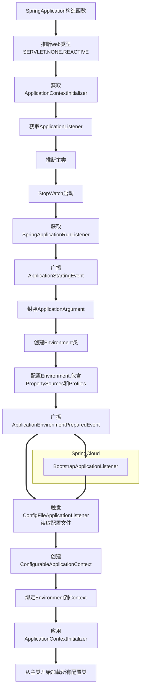

```mermaid
graph TD
		SpringApplication构造函数 ==> 推断web类型SERVLET,NONE,REACTIVE
		==> 获取ApplicationContextInitializer ==> 获取ApplicationListener 
		==> 推断主类 ==> StopWatch启动 ==> 获取SpringApplicationRunListener
		==> 广播ApplicationStartingEvent ==> 封装ApplicationArgument
   ==> 创建Environment类 ==> 配置Environment,包含PropertySources和Profiles ==> A[广播ApplicationEnvironmentPreparedEvent]
   A ==> D[触发ConfigFileApplicationListener读取配置文件]
   D ==> 创建ConfigurableApplicationContext ==> B[绑定Environment到Context]
   A ==> C;  C ==> D
  B ==> 应用ApplicationContextInitializer ==> 从主类开始加载所有配置类
  
     subgraph SpringCloud
   			C[BootstrapApplicationListener]
   end

```

