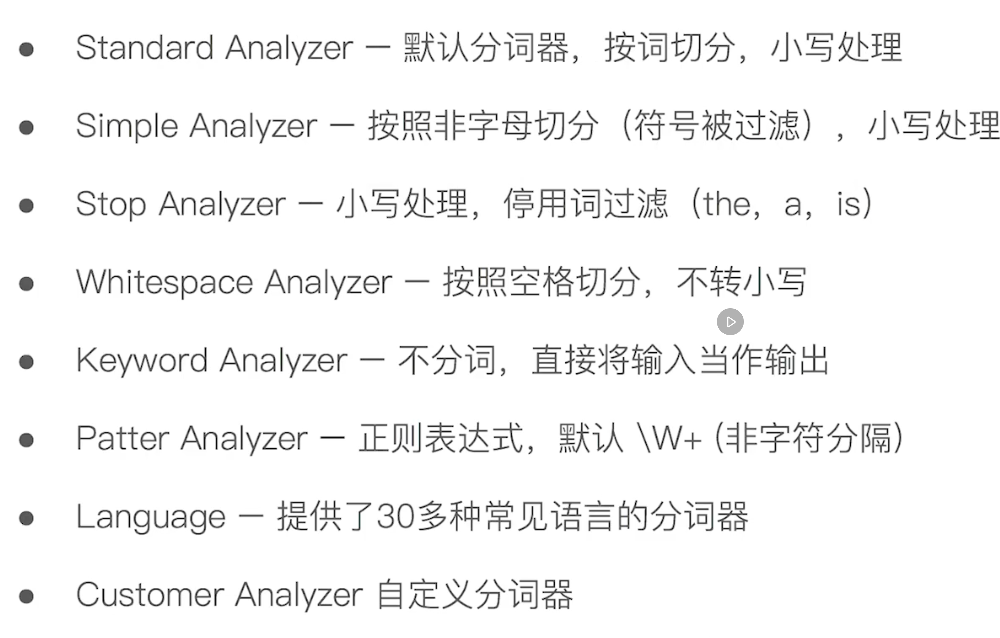

 

# Elasticsearch

## 基本概念

索引，文档，节点，分片。（类型（Type）在索引中区分不同的文档，基本已经弃用，干他妈的

### 文档（Document

ES 面向文档，文档是搜索的最小单位，文档以 JSON 格式保存，每个文档包含一个 Unique ID。

文档的元数据包含以下：

- _index - 文档所属的索引名称
- _type - 文档所属的类型名（7.0之后 _type 只有 _doc 
- _id - 文档的唯一 ID
- _source - 原始的 JSON 数据
- _score - 相关性打分
- _version - 文档版本信息，作为乐观锁

 

### 索引（Index

索引就是一类相似文档的集合，每个索引都有自己的 Mapping 定义，用于映射文档的字段名和字段类型。

Shard 体现的就是物理空间的概念，索引散布在所有的 Shard 中，由 Setting 定义。

 

### 节点（Node

节点就是一个 ES 实例进程，节点可以通过 node.name 设定名称，节点在启动时会被分配到一个 UID，并保存。

#### Master-eligible nodes 和 Master Node

每个节点默认都是 Master-eligible nodes 节点，可以参与选主节点，并且在第一个节点启动的时候自选为 Master，**Master 节点负责集群的所有信息的维护。**

包含节点信息，分片的路由信息，所有索引相关的信息。

（Master-eligible 可以在启动时设定为 false。

#### Data Node 和 Coordinating Node

Data Node 负责保存所有分片数据，Coordinating Node 负责接收 Client 请求，并且转发请求到特定的节点，如果数据存在于多个节点，那么 Coordinating Node 还要负责最终的数据聚合。

每个节点默认都是 Coordinating Node。

Hot & Warm Node 冷热节点，用于数据的冷热区分，热节点通常有更好的 IO 和 CPU 性能。

##### Primary Shard 和 Replica Shard

主分片用于解决的是数据的横向扩展问题，通过对文档 UID 的 Hash 进行数据的分片存储。（主分片数在索引创建后不可更改。

副本分片用于解决数据的高可用以及持久性问题，副本分片就是主分片的拷贝。 

### 分片（Shard

## 操作

index / create / delete / update / get 

_msearch / _mget / _bulk

## 倒排索引

倒排索引包含了如下两个部分；

1. 单词词典（Term Dictionary - 记录了文档里的所有单词，以及单词到倒排列表的关系，一般可以使用 B+ 树或者 Hash 拉链法实
2. 倒排列表（Posting List - 记录单词对应的文档集合
   - 倒排索引项（Posting，一个倒排索引项对应一个文档
     - 文档 Id（Unique Id
     - 词频 - 单词在文档中出现的次数
     - 位置（Position  - 单词位置，用于语句的搜索
     - 便宜（单词的开始和结束位置，用于高亮显示

针对文档中每一个需要搜索的关键字段，都会创建自己的倒排索引。（所以，不需要查询直接忽略

## 分词器（Analyzer

分析（Analysis  ，就是指把字段中的内容转换为一系列的单词（Term / Token 的过程。

ES 使用了分词器的概念，Analyzer 专门用于 Asalysis。

Analyzer 的组成：

- Character Filters（字符过滤器，针对原始文本进行处理，例如解析 HTML
- Tokenizer（分词器
- Token Filters（词过滤器

ES 自带的分词器：

**GET /_analyze** 用于对特定的 Analyzer 进行测试，或者对指定的字段进行测试机，又或者测试自定义的分词器。

Icu_analyzer，IK 

## 搜索

RequestBody 和 URI Search

RequestBody 支持更多类型的查询

## Reference

- [ES 分布式架构及其底层原理](https://segmentfault.com/a/1190000015256970)
- 