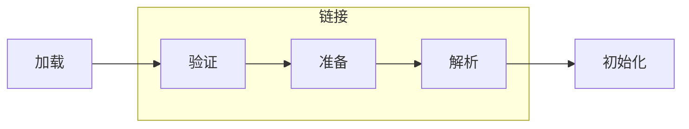
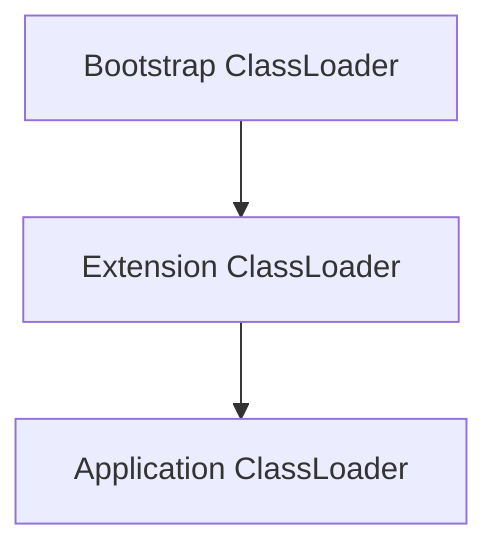
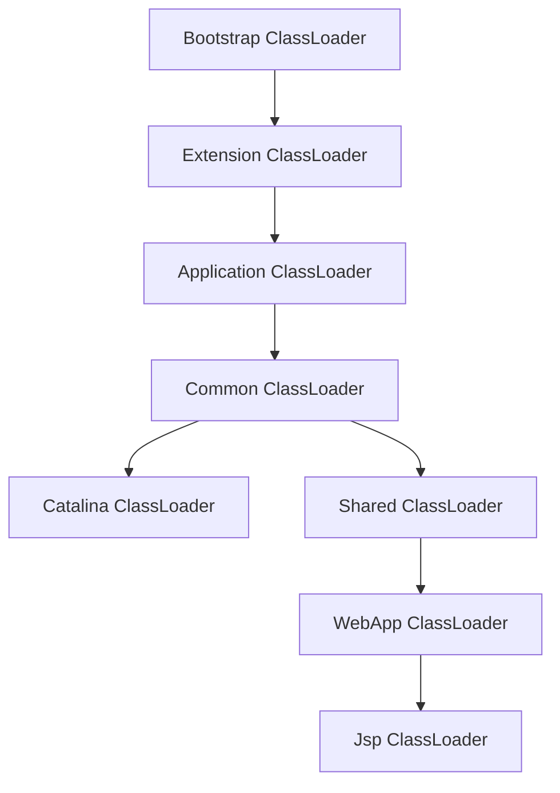

# JVM 的类加载子系统

## 概述

类加载的就是 Java 中查找 class 文件，验证并生成 Class 方法的过程。

## 类加载的流程

## 基本的类加载器

以上是 JDK 中提供的三种基础的类加载器。

## 基本的 ClassLoader 实现

> Class.forName 会触发类的初始化，但 ClassLoader.loadClass 不会。

> 非常重要的一点：
>
> **类优先由触发类加载的类所属的类加载器加载。**

## 双亲委派机制

Java 中推荐的使用的每一个类加载器都继承 AppClassLoader 类，该类是三大基本加载器之一。

### 双亲委派机制的实现原理

由 ClassLoader 的 loadClass 方法实现。

### 双亲委派机制的优势

## 线程上下文加载器

## 打破双亲委派机制的情况

### Tomcat 的类加载机制

### JDK 的 SPI 实现 - JDBC Driver 实现的加载

JDBC 的核心类定义在 Java 的核心库，由 Bootstrap 加载，但是三方的实现却是在 ClassPath 里，需要使用 Application 来加载。

在 Java 的核心类加载三方实现的时候默认就是从  Application 加载，此时就会出现 ClassNotFound。

 

**JDBC 就在采用的方法就是 TCCL (Thread Context Class Loader) 线程上下文类加载器。**

在核心类中获取当前线程中绑定的类加载器，由此优先高级别类加载器调用低级别类加载器的实现。

 

参考 DriverManager 获取 Driver 的实现。

首先该类的静态初始化块中就包含了 Driver 的类加载流程。

在 loadInitialDrivers 方法中调用了 ServiceLoader 的 load 方法：

而在 ServiceLoader 中就包含了对线程上下文类加载器的调用：

### Spring 的类加载机制

Spring 的类加载场景比较复杂，所以基本是统一采用 TCCL 来实现类加载。