# EventBus

> - 2021/09/28  - （基于 Guava 15.0，真他妈老啊，有空看看新的 EventBus 吧。


---

[TOC]

---


## 概述

EventBus（事件总线），是 Guava 中事件驱动机制的实现。

**事件驱动个人理解可以说是对观察者模式的一种实现**，被观察的相关参数被进一步封装为事件对象（EventObject）。

<br>

另外，观察者模式的需要**被观察者持有观察者的引用**，这就造成了两者之间的耦合，在 Guava 中**使用三方代持的方式**，进一步消除了耦合性。

> 简单总结 EventBus 对于观察者模式的优化：
>
> 1. 将观察的参数抽象为 Event 事件
> 2. 将观察者和被观察者解耦，更易于扩展


## 使用示例

```java
public class Main {

	public static class Event<A> extends EventObject {

		/**
		 * Constructs a prototypical Event.
		 *
		 * @param source The object on which the Event initially occurred.
		 * @throws IllegalArgumentException if source is null.
		 */
		public Event(A source) {
			super(source);
		}
	}

	/**
	 * 定义监听事件
	 *
	 * @param event 希望监听的事件
	 */
	@Subscribe
	public void event(Event<String> event) {
		System.out.println(event.getSource());
	}

	public static void main(String[] args) {
		// 初始化总线
		EventBus eventBus = new EventBus();
		// 注册监听器
		eventBus.register(new Main());
        	// 定义事件
		Event<String> event = new Event<>("chenqwwq");
		// 发布事件
		eventBus.post(event);
		// 取消监听器注册
		eventBus.unregister(Main.class);
	}
}
```

<br>

所有的注册和事件发布都是通过 EventBus 调用实现，所以 **EventBus 可以使用单例实现，提供一个全局的访问点，方便调用**。

<br>

## 源码实现

<br>

EventBus 是核心中的核心，**注册、取消注册、事件发布**等操作都通过其调用实现（类似 SpringBoot 的 ApplicationContext，所以下文基本都是 EventBus 的源码。


### 监听器注册流程

监听器的注册主要目的是解析出每个监听器以及对应的监听事件，并将事件和监听器类型的映射保存到 EventBus。

> **EventBus 使用 Class 作为具体的事件，以方法为单位对事件进行监听（一个类中可能包含多个监听器，并且使用方法的第一个参数作为监听的 Event 类型**

<br>

EventBus 的监听器注册**以 Object 为入参**，进行解析。

以下是 EventBus#register 的整个流程：

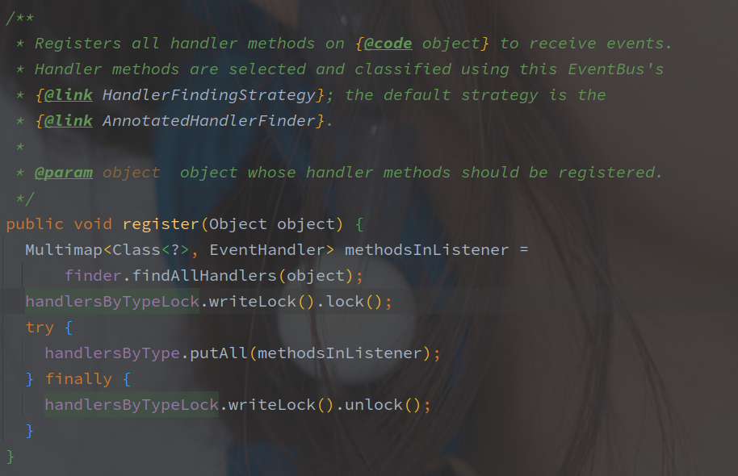


**首先通过 HandlerFindingStrategy#findAllHandlers 查找出类中所有 EventHandler**，HandlerFindingStrategy 默认是 **AnnotatedHandlerFinder**（也就是 源码中的 finder 对象，解析的就是 @Subscribe 注解。

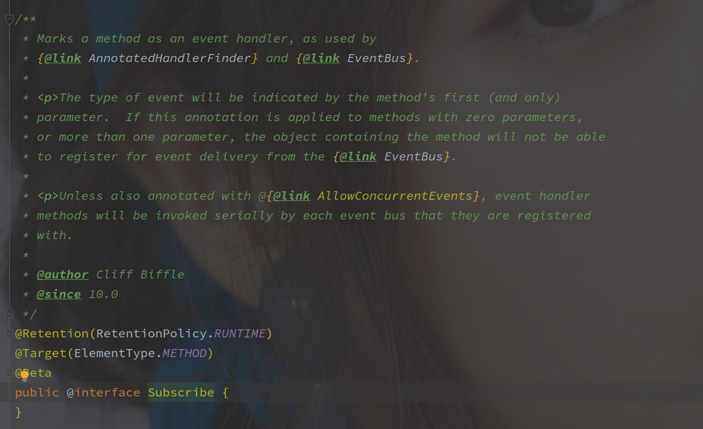


@Subscribe 就是一个标示性的注解，没有任何参数，并且只能标记在方法上，以下是 **AnnotatedHandlerFinder** 的实现代码：

<br>

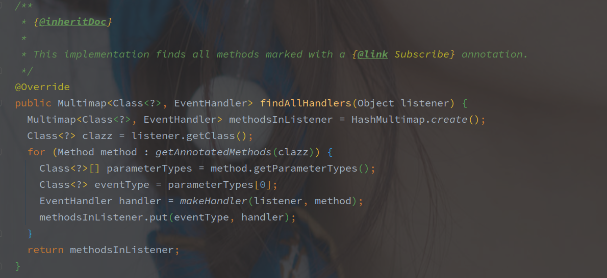


通过 AnnotatedHandlerFinder#getAnnotatedMethods 方法找到所有的被 Subscribe 标记的方法（中间会通过 LoadingCache 作为缓存。

> 最终是通过反射来实现的方法签名遍历。


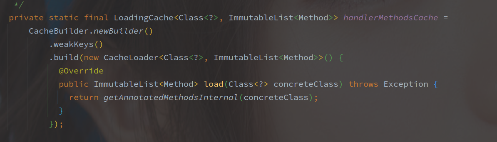

LoadingCache 中如果缓存不存在，则调用内部的 AnnotatedHandlerFinder#getAnnotatedMethodsInternal 方法获取 Method 列表。

（该方法就是扫描类的每个方法判断是否标记了 @Subscribe。

获取到所有的监听器方法之后，开始遍历每个 Method，**并将方法的第一个参数作为事件类型，**通过 makeHandler 创建 EventHandler。

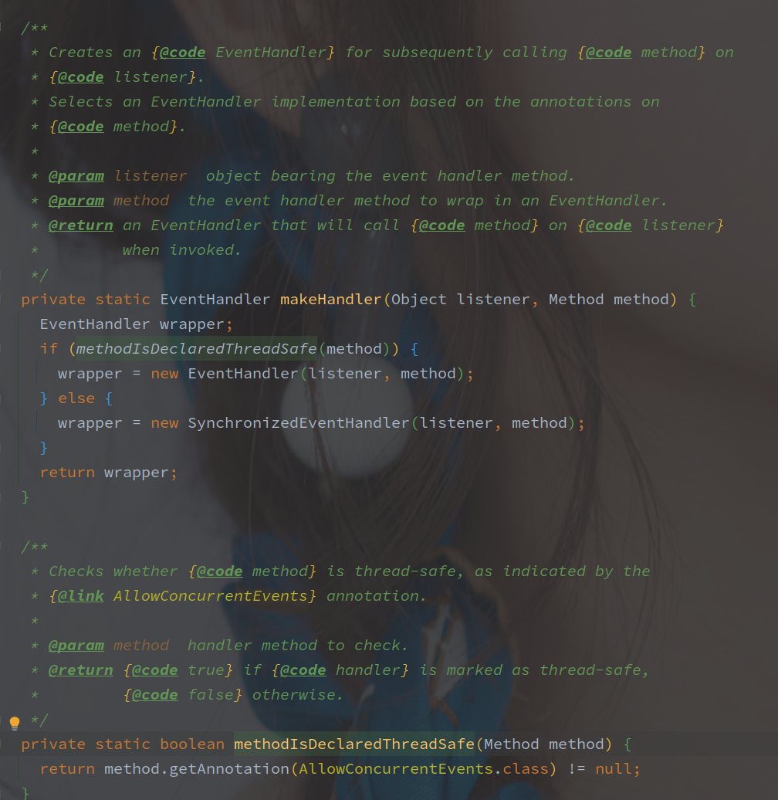

**通过是否标注 @AllowConcurrentEvents 表示方法是否允许并发执行**。（@AllowConcurrentEvents 也是一个标示性注解。

**如果非线程安全方法，则会创建 SynchronizedEventHandler 对象，线程安全则创建 EventHandler。**

SynchronizedEventHandler 直接继承了 EventHandler，并标记 handleEvent 方法为 synchronize。

> EventBus 的线程安全是直接使用 synchronized 来实现的。

<br>

解析完整个类之后，最终的结果以 Multimap 保存，并添加到外层的 EventBus 中。

> 以方法的第一个参数的 Class 类型为 Key，不考虑父类。


#### 监听器注册流程小结

简单理解，注册就是通过 EventBus#register 将事件的处理器抽取出来，和所监听的事件组成一种映射关系缓存到 EventBus。

处理器的抽取依靠的是 @Subscribe 注解，监听的事件是被其标记的方法的第一个参数。

另外使用 @AllowConcurrentEvents 来表示处理器是否允许并发执行，可以并发执行的方法会直接被包装为 EventHandler，如果不是则包装为 SynchronizedEventHandler。

<br>

<br>


### 事件发布流程

​	以下是事件发布流程（EventBus#post）的源码实现：

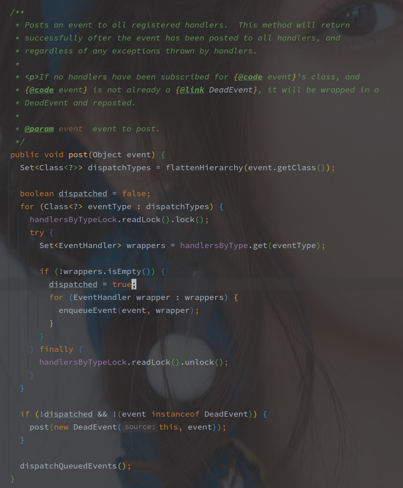

首先是**获取发布事件类型的整个所有父类包括当前类型**，以如下形式获取：

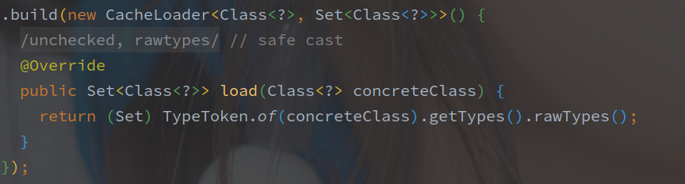

（TypeToken 是 Gooogle reflect 包下的，而不是 Gson 的包。）

例如最开始的示例，通过 Event 获取到的所有 Class，包括 Event，EventObject，Serializable，Object 四个类（也就是 Event 及其全部的父类，包括接口。

之后就是遍历所有的  Class 对象，获取所有的监听的 EventHandler。

> handlersByType 就是 Map<Class,Set<EventHandler>> ，是缓存的映射关系，以此作为事件调度。

事件及其处理入队列，实现逻辑如下：

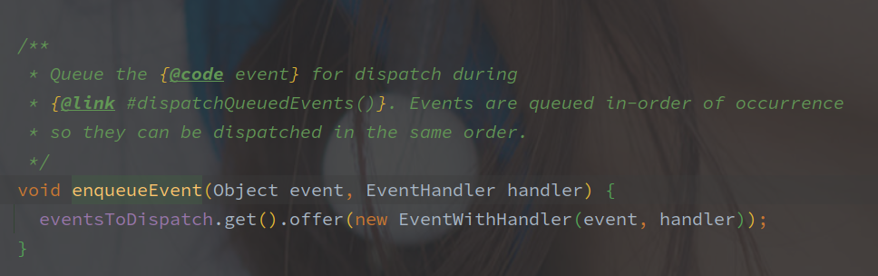

**入队列就是通过 ThreadLocal 的 Queue 保存了该 <Event,EventHandler> 的集合。**

如果没有响应该事件的 EventHandler，事件会进一步被包装为 DeadEvent，然后继续直接发布该事件，**所有的类和接口只要有一个存在对应的 EventHandler 对象，就表示调度成功。**

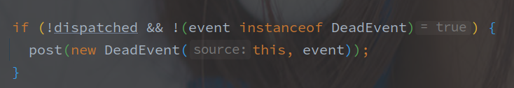

event 不能为 DeadEvent 是避免套娃，先调用的 post 方法发布 DeadEvent。

> 此时还没有别的事件的响应调用，所以 DeadEvent 是先于普通事件调用的。

之后就是实际的 EventHandler 方法调用：

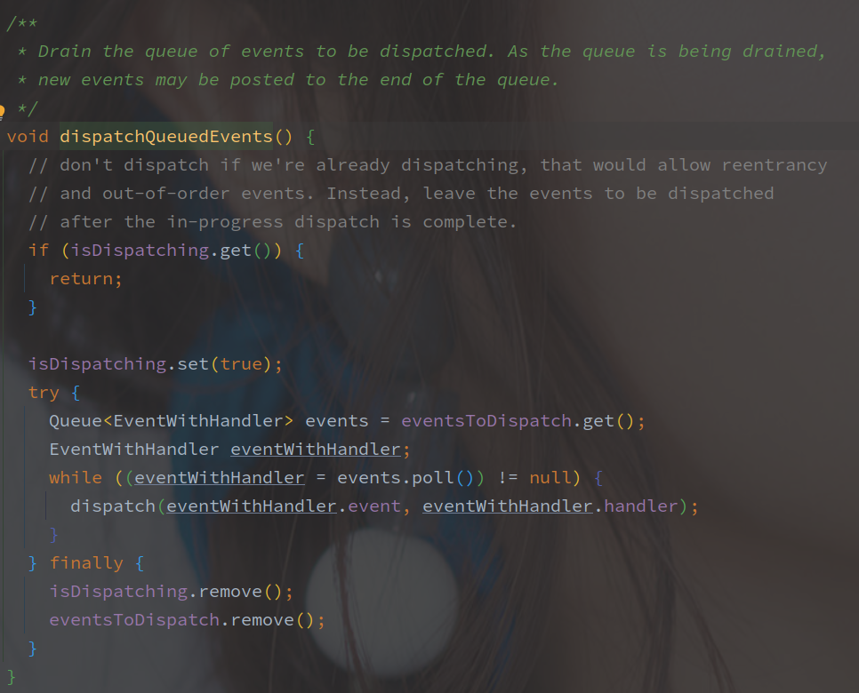

这里会标记进入 dispatching 状态，通过 isDispatching（通过 ThreadLocal 保存的 Boolean 类型。

之后是取出所有的 EventWithHandler 方法，并调用 EventHandler#handleEvent 方法：

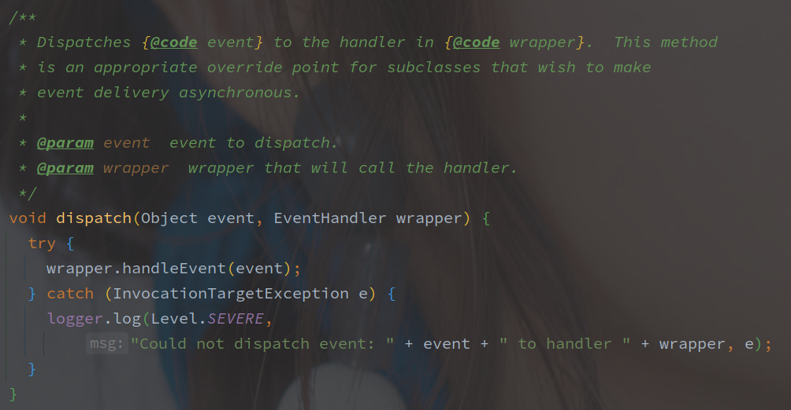

默认的 handleEvent 就是 Method#Invoke 方法：

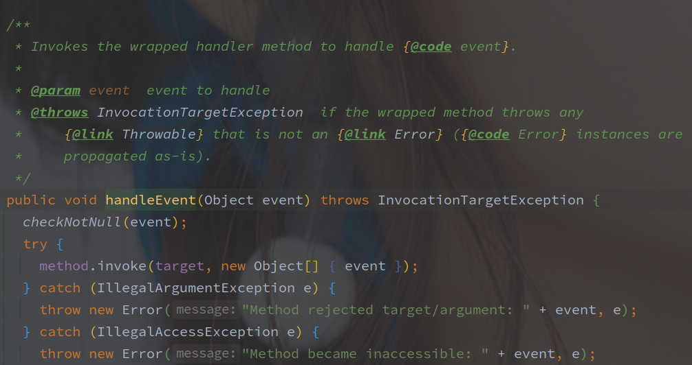


### 事件发布小结

事件发布的关键就是通过发布的事件类型获取对应的处理器（ EventBus 直接使用 Map 保存，所以这一步是简单的），并且执行处理器。

发布的事件不单单是当前类型，而是整个类族都会遍历一遍查找对应的执行器（为了 Map 读取的线程安全，所以查找的时候也是会上锁的。），并且不是找到了立马执行，因为如果单个事件处理器执行缓慢，会影响到后续的调度，所以 EventBus 会讲获取到的执行器和事件打包缓存在 ThreadLocal 中，整体结束之后在一起执行。

EventBus 新增了 DeadEvent（类比于 RabbitMQ 的死信？），在没有找到映射的处理器时会直接将原事件包装为 DeadEvent 并发布。

事件的发布和处理流程如下：

1. 获取需要发布的事件的所有上层类和接口
2. 遍历所有类和接口获取对应的 EventHandler，并存入 ThreadLocal
3. 若当前事件没有找到对应 EventHandler，则发布 DeadEvent 事件
4. 遍历 ThreadLocal 的 Queue ，触发对应 EventHandler 调用


## EventBus 总结


> EventBus 对于观察者模式的优化

观察者模式的要点就是被观察者持有观察者的引用，并且在特定的时间调用，组织被观察者想要的参数并调用观察者。

整个流程就有被观察者和观察者高度耦合的问题，被观察者需要持有观察者的引用，并要在特定的时期调用

简单总结 EventBus 对于观察者模式的优化：

1. 将观察的参数抽象为 Event 事件
2. 将观察者和被观察者解耦，更易于扩展


<br>

> @AllowConcurrentEvents 注解的作用：

未被标记的监听方法使用 syncrhonrized 包裹执行，效率相对来说会比较慢。

如果是无状态的方法执行，还是标记上的好。


<br>

> Q：并发安全性

整个事件发布流程，中转的数据都是保存在 ThreadLocal 中的，包括是否正在调度的状态。

事件调度和触发也都是在一个线程中完成的，所以也不存在线程安全问题。

> 因为是单线程调度和触发，所以同步的事件处理也需要注意调用的时间，并不是 POST 之后就立马返回。

另外在调度的时候，会上一个 readLock，是对 Map<Class,Set<EventHandler>> 的线程安全维护。

<br>


> Q: DeadEvent 的作用？

DeadEvent 的作用在类注释中有部分解释：

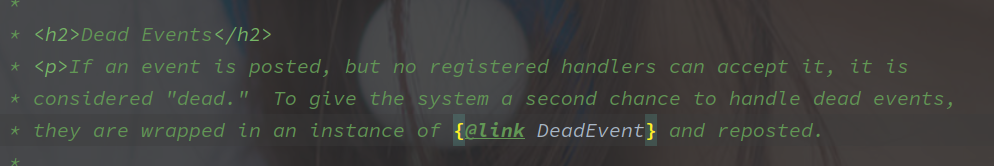

是希望给系统一个二次处理的机会，如果事件没有被正确调度，那么通过 DeadEvent 也可以获取到该事件并处理。

<br>


> Q： 为什么使用 ThreadLocal 保存 Event 和 EventHandler？

**为的是尽量减少 readLock 的时间。**

因为调用的执行事件不固定，如果调用卡主会导致 readLock 时间被拉长。

先遍历上锁生成事件，全部 EventHandler 确定之后再统一处理，是减少写锁占用的有效手段，ThreadLocal 也就成了保存的最佳方法。

isDispatching 状态我是真不知道为啥维护。


> 个人感觉需要注意的点

EventBus 注册监听器的时候会以 Event 的最底层类型作为目标事件，而事件发送的时候匹配 EventHandler 的时候会使用 Event 整个类族去匹配。

例如，单独注册的 Object 的监听器，会被所有的事件触发，利用该性质可以通过类的继承关系来做特殊功能的监听。


## 高版本的 EventBus

> 之前也不知道在哪里看的 15.0 版本的 Guava 代码（尴尬，最近公司将本都事件发布的方式从 EventBus 更换为 ApplicationContext，抓紧也看一波。
>
> **高版本是指 31.0.1-jre 版本。**
>
> ---- 2021-12-22


### 高低版本的 EventBus 对比

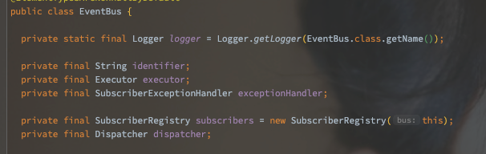

高版本的 EventBus 对整个模块进行了更细的抽象。

**SubscriberRegistry 负责解析 @Subscriber 注解，并且持有了 Event 和 Subscriber 的映射（对 EventBus 来说，该类无法自定义。**

**Dispatcher 负责事件的调度，继承该接口可以自定义调度逻辑。**

Executor 是事件执行器（同步和异步的区别一大部分就在这了吧，同步的 Executor 实现如下（就是由调用线程执行任务。

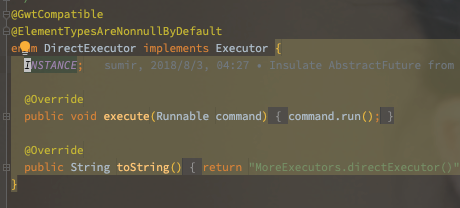


### SubscriberRegistry - 监听器注册/取消注册

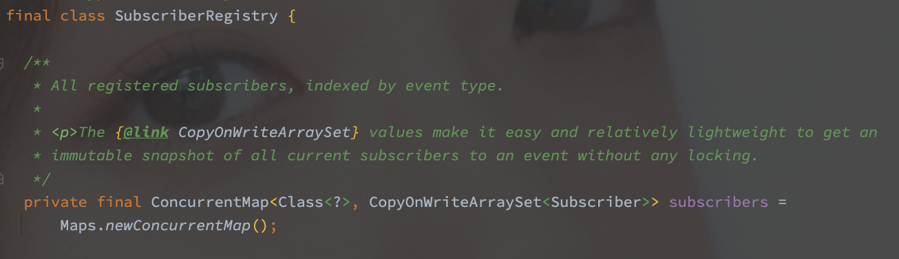

新的 EventBus 抽取了监听器（Subscriber）的概念，**使用 SubscriberRegistry 作为事件和监听器映射的持有者**（15.0 的实现中是直接使用 EventBus 持有的。

Subscriber 中包含了归属的 EventBus，监听类，以及单个的监听方法，也包括执行器（Executor），是对监听所需对象的整合。

另外就是修改了线程安全策略，直接**使用 CopyOnWriteArraySet 来保存单个事物的不同监听器**（如果对应的监听器过多还是会有坑。

其他的依旧未变，同样使用方法的第一个参数作为事件并注册，在使用 COW 之后不需要额外的上锁。


### Dispatcher - 事件发布流程

和注册流程类似，新版本的事件发布流程抽取出了调度者（Dispatcher ）的概念，使用 Dispatcher 进行不同形式的调度。

默认的提供了以下三种：

1. ImmediateDispatcher
2. LegacyAsyncDispatcher
3. PerThreadQueuedDispatcher（默认）

<br>

具体的发布流程还是从 EventBus#post 开始，先从 Subscriber 中获取到对应的 Subscriber，之后就是将 Event 和 Subscriber 交由 Dispatcher 调度。

（可以认为 Dispatcher 决定了事件的执行方式。

接下来就是以上三种调度器的执行方式上的区别：

<br>

#### ImmerdiateDispatcher - 即时调度

```java
@Override
void dispatch(Object event, Iterator<Subscriber> subscribers) {
  checkNotNull(event);
  while (subscribers.hasNext()) {
    subscribers.next().dispatchEvent(event);
  }
}
```

该调度器的逻辑等于没有，就是直接执行（并不是完全同步，异步的逻辑包含在 Subscriber 里面。

对于该调度器来说，同步执行的时候，如果调度的事件嵌套（执行调度事件的时候又触发了另外一个事件），此时会先执行完后触发的事件。

对于异步执行来说，因为不影响后续的执行所以基本上没什么区别。


####  LegacyAsyncDispatcher - （异步调度？

```java
// 对于 EventBus 来说全局唯一的队列（不同线程都可以访问的到
private final ConcurrentLinkedQueue<EventWithSubscriber> queue =
  Queues.newConcurrentLinkedQueue();

@Override
void dispatch(Object event, Iterator<Subscriber> subscribers) {
  checkNotNull(event);
  // 直接将 Subscriber 和 Event 打包添加到队列
  while (subscribers.hasNext()) {
    queue.add(new EventWithSubscriber(event, subscribers.next()));
  }

  EventWithSubscriber e;
  // 循环从队列中获取待调度的任务
  while ((e = queue.poll()) != null) {
    e.subscriber.dispatchEvent(e.event);
  }
}
```

该调度器应该**仅仅适合用于异步线程的调度。**

使用全局的并发队列来保存待调度的任务，并且使用 queue.poll 获取任务并调度，此种方式可能使当前线程调度到别的任务。

如果以同步的形式执行的话，当前线程执行完之后可能立即去处理别的线程提交的任务（例如 Tomcat 的 Worker 线程，处理完当前请求触发的事件之后还要去处理别的请求任务？闹呢


#### PerThreadQueuedDispatcher - 单线程队列的调度器

```java
private static final class PerThreadQueuedDispatcher extends Dispatcher {
  // 使用 ThreadLocal 保存队列，队列又进一步保存了 Event
  private final ThreadLocal<Queue<Event>> queue =
    new ThreadLocal<Queue<Event>>() {
    @Override
    protected Queue<Event> initialValue() {
      return Queues.newArrayDeque();
    }
  };
	// 当前是否处于调度的状态。
  private final ThreadLocal<Boolean> dispatching =
    new ThreadLocal<Boolean>() {
    @Override
    protected Boolean initialValue() {
      return false;
    }
  };

  @Override
  void dispatch(Object event, Iterator<Subscriber> subscribers) {
    checkNotNull(event);
    checkNotNull(subscribers);
    // 获取或者初始化任务队列
    Queue<Event> queueForThread = queue.get();
    // 将任务添加到队列中，因为队列和线程绑定所以不担心线程问题
    queueForThread.offer(new Event(event, subscribers));

    // 开始事件调度 （1
    if (!dispatching.get()) {
      dispatching.set(true);
      try {
        Event nextEvent;
        // 也是从队列中获取任务并且逐个调度
        while ((nextEvent = queueForThread.poll()) != null) {
          while (nextEvent.subscribers.hasNext()) {
            nextEvent.subscribers.next().dispatchEvent(nextEvent.event);
          }
        }
      } finally {
        dispatching.remove();
        queue.remove();
      }
    }
  }
```

该调度器的作用就是对于嵌套的事件而言，它可以保证**顺序调度。**

以同步事件来说，当执行某个事件A的时候如果触发了另外一个事件B，不会即时就开始执行该事件B，而是将其添加到线程本地的队列中，在（1 处就结束了。

而后在事件A执行完毕之后会开始事件B的执行。

对于异步事件也是，总是在事件A完全调度完之后才会进行事件B的调度。


### 异步事件调度的执行

区别于原来异步的实现，高版本直接将 Executor 包含进了 Subscriber 里面，并且在初始化的时候直接获取的 EventBus 中的队列。


## EventBus 和 Spring 的异同 

EventBus 的抽象分为 Dispatcher，Evecutor，SubscriberRegistry，由 SubscriberRegistry 持有所有的监听器。

Spring 并没有细分各类抽象，ApplicationContext 起到了类似于 EventBus 的作用，而 Dispatcher 和 SubscriberRegistry 由广播器（ApplicationEventMulticaster）来实现。

<br>

EventBus 中注册是单个方法，并且将方法第一个参数作为监听目标事件，Spring 注册的则是一整个实现类（通过模板方法模式+责任链模式的方式），监听的目标并没办法立即获得，而是通过 support 方法判断。

<br>

通过事件来查找对应的监听器的时候，EventBus 可以通过 Map 直接获取（需要遍历 Event 及其父类），而 Spring 中的查找需要遍历所有监听器的 support 方法并缓存其结果。

<br>

Spring 并咩有将事件调度过程抽象，调度方式是基本的 for 循环，而 EventBus 支持多种的调度形式，可能更加合理。

<br>

