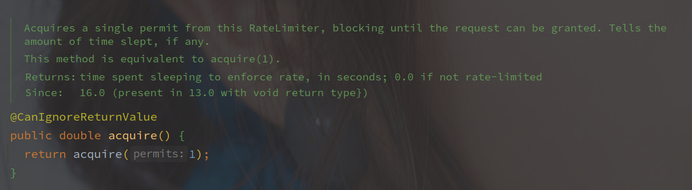
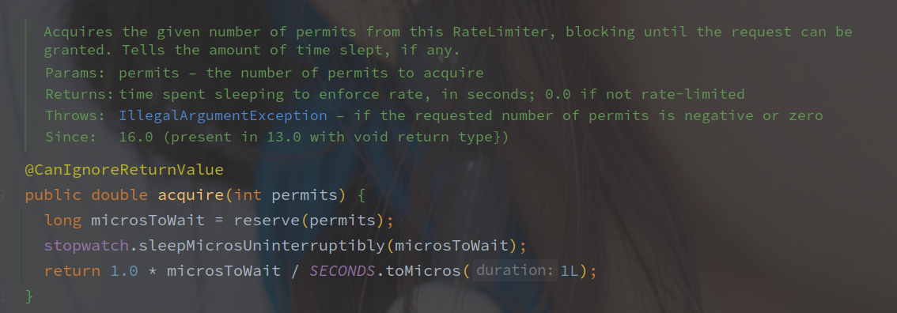
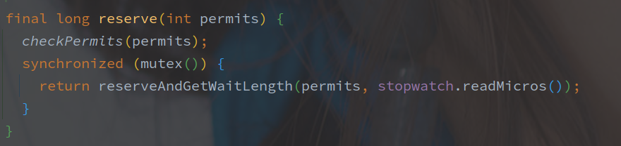
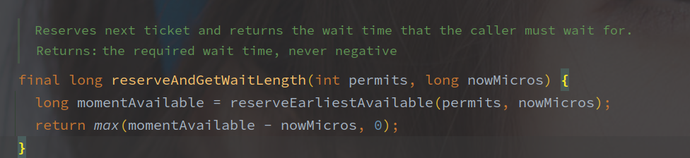

# RateLimiter

---

[TOC]

---


## 概述

RateLimiter  是 Guava 工具包中的令牌桶限流器的实现。

[相关限流算法](../../系统设计/限流算法.md)

## Demo

```

```


## 相关组件

### SleepingStopwatch

Stopwatch 是 Guava 中的计时器实现，SleepStopwatch 持有 Stopwatch 的引用来获取启动的时间以及线程的 Sleep。


## 源码分析

先从 acquire 看起，**该方法是无超时的获取令牌**。

> 这个调用链路有点长的，每个方法就几行。



直接调用的 acquire 方法，参数为希望的令牌数，默认为1。

 


reserve 方法用来获取 permits 可用的时间，而 SleepingStopwatch#sleepMicrosUninterruptibly 方法用来挂起线程直到可用，最后返回等待事件。

reserve 方法实现如下：



mutex 是以双重锁加载的单例 Object 对象，作为锁资源。

SleepStopwatch#readMicros 用来获取类启动到当前的时间戳



reserveEarliestAvailable 该方法在子类 SmoothRateLimiter 实现。

```java
// SmoothRateLimiter#reserveEarliestAvailable
@Override
final long reserveEarliestAvailable(int requiredPermits, long nowMicros) {
    // 该方法用来重新统计 permits 的数目
    resync(nowMicros);
    // 目前的
    long returnValue = nextFreeTicketMicros;
    // 需要消耗的 permit
    double storedPermitsToSpend = min(requiredPermits, this.storedPermits);
    // 需要等待的令牌数
    double freshPermits = requiredPermits - storedPermitsToSpend;
    // storePermitsToWaitTime 由子类实现
    long waitMicros =
        storedPermitsToWaitTime(this.storedPermits, storedPermitsToSpend)
        + (long) (freshPermits * stableIntervalMicros);
    // 需要加上等待时间
    this.nextFreeTicketMicros = LongMath.saturatedAdd(nextFreeTicketMicros, waitMicros);
    // 当前令牌减去需要消耗的
    this.storedPermits -= storedPermitsToSpend;
    // 返回nextFreeTicketMicros
    return returnValue;
}

/** Updates {@code storedPermits} and {@code nextFreeTicketMicros} based on the current time. */
  void resync(long nowMicros) {
        // if nextFreeTicket is in the past, resync to now
      // nextFreeTicketMicros 就是上次获取 permit 的时间
        if (nowMicros > nextFreeTicketMicros) {
            // 计算产生的新的 permits 的数量
            // coolDownIntervalMicros 为冷却时间，方法由子类实现
          double newPermits = (nowMicros - nextFreeTicketMicros) / coolDownIntervalMicros();
            // 求出当前的 permit 的数量
          storedPermits = min(maxPermits, storedPermits + newPermits);
            // 更新 nextFreeTicktMicros 的值
          nextFreeTicketMicros = nowMicros;
}
  
```

> **RateLimiter 使用经过的时间来计算令牌的数目。**