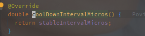
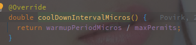

# RateLimiter

---

[TOC]

---


## 概述

RateLimiter  是 Guava 工具包中的令牌桶限流器的实现。

[相关限流算on法](../../系统设计/限流算法.md)

RateLimiter 的实现中包含两种：

1. SmoothBursty - 平滑生成 Permit，可以应对突发流量
2. SmoothWarmingUp - 平滑生成 Permit，并且带有热启动的效果

## Demo

```java
public class Main {
	public static void main(String[] args) throws InterruptedException {
		// 1s 创建一个 permit
		// 最终创建的对象是 SmoothBursty
		final RateLimiter rateLimiter = RateLimiter.create(1);
		for (int i = 0; i < 10; i++) {
			rateLimiter.acquire();
			System.out.println(LocalTime.now().getSecond());
			if (i == 5) {
				TimeUnit.SECONDS.sleep(2);
			}
		}
	}
}

// 输出如下：
// 22
// 23
// 24
// 25
// 26
// 27
// 29
// 29
// 30
// 31
```

中间间隔了几秒之后，连续输出了两个，因为创建的 SmoothBursty 默认支持1s的突发流量（1s创建一个 Token，所以它也只囤积1个 Token。


```java
public class Main {
	public static void main(String[] args) throws InterruptedException {
        // 最终创建的对象是 SmoothWarmingUp，并且有5s的预热期
		final RateLimiter rateLimiter = RateLimiter.create(5, Duration.ofSeconds(5));
		while (true){
			rateLimiter.acquire();
			System.out.println(LocalTime.now().getSecond());
		}
	}
}

// 输出如下:
//		44
//		45
//		46
//		46
//		47
//		47
//		47
//		48
//		48
//		49
//		49
//		49
//		49
//		50
//		50
//		50
//		50
//		50
```

输出从44开始，逐渐会稳定在每秒五个值。


## 相关组件

### SleepingStopwatch

Stopwatch 是 Guava 中的计时器实现，SleepStopwatch 持有 Stopwatch 的引用来获取启动的时间以及线程的 Sleep。


## 源码分析

### 关键成员变量

| 变量名               | 变量含义                                |
| -------------------- | --------------------------------------- |
| maxPermits           | 最大的 Permit 数                        |
| storedPermits        | 当前的 Permit 数                        |
| stableIntervalMicros | 固定的产生速率，多少毫秒产生一个 Permit |
| nextFreeTicketMicros | 下一次产生 Permit 的时间                |

**RateLimiter 中以相对的时钟周期作为计算的标准，记录当前统计过 Permit 的时间，作差并除以速率计算生成的 Permit。**

> 相对时钟周期使用 Stopwatch 作为统计工具，类初始化的时候会开启计时，之后读取的时间都是于开始时间的差值。


先从 acquire 看起，**该方法是无超时的获取令牌**。


直接调用的 acquire 方法，参数为获取的令牌（Premit）数，默认为1。

 

**reserve 方法用来获取 permits 可用的时间，最终返回的是需要等待的时间**，而 SleepingStopwatch#sleepMicrosUninterruptibly 方法用来挂起线程一定的时间。

RateLimiter#reserve 的实现如下：


### reserveAndGetWaitLength - 保存并获取等待藏独


mutex 是以双重锁加载的单例 Object 对象，作为锁资源，**SleepStopwatch#readMicros 用来获取类启动到当前的时间戳。**


### reserveEarliestAvailable  -  查看最早可用时间   

该方法在子类 SmoothRateLimiter 实现。

```java
// SmoothRateLimiter#reserveEarliestAvailable
@Override
final long reserveEarliestAvailable(int requiredPermits, long nowMicros) {
    // 该方法用来重新统计 permits 的数目，参数就是应用的启动时间
    resync(nowMicros);
    // 下次可用的相对时钟周期
    long returnValue = nextFreeTicketMicros;
    // 此次消耗的 permit
    // 因为 Permit 的数目可能不够，所以取希望的和现存的最小值
    double storedPermitsToSpend = min(requiredPermits, this.storedPermits);
    // 需要等待的令牌数
    double freshPermits = requiredPermits - storedPermitsToSpend;
    // storePermitsToWaitTime 由子类实现
    long waitMicros =
        storedPermitsToWaitTime(this.storedPermits, storedPermitsToSpend)
        + (long) (freshPermits * stableIntervalMicros);
    // 需要加上等待时间
    this.nextFreeTicketMicros = LongMath.saturatedAdd(nextFreeTicketMicros, waitMicros);
    // 当前令牌减去需要消耗的
    this.storedPermits -= storedPermitsToSpend;
    // 返回 nextFreeTicketMicros
    return returnValue;
}
```

> **RateLimiter 使用经过的时间来计算令牌的数目。**

### resync - 重新统计当前的 Permit

该方法使用当前的相对时钟数来重新计算剩余的 Permit。

```java
/** Updates {@code storedPermits} and {@code nextFreeTicketMicros} based on the current time. */
  void resync(long nowMicros) {
        // if nextFreeTicket is in the past, resync to now
      // nextFreeTicketMicros 就是上次获取 permit 的时间
        if (nowMicros > nextFreeTicketMicros) {
            // 计算产生的新的 permits 的数量
            // coolDownIntervalMicros 为冷却时间，方法由子类实现
          double newPermits = (nowMicros - nextFreeTicketMicros) / coolDownIntervalMicros();
            // 求出当前的 permit 的数量
          storedPermits = min(maxPermits, storedPermits + newPermits);
            // 更新 nextFreeTicktMicros 的值
          nextFreeTicketMicros = nowMicros;
}
  
```

RateLimiter 并没有使用相对直观的（另起线程生成 Token 的形式），而是以**相对时钟数之差**来计算目前的 Permit。

nextFreeTicketMicros 是最早可以获取到 Permit 的相对时间， nowMicros - nextFreeTicketMicros 就表示中间的间隔时间，处以 coolDownIntervalMicros() 就标识可以获取到的新的 Permit。

coolDownIntervalMicros() 表示 Permit 的获取间隔，在 SmoothBursty 和 SmoothWarmingUp 中有各自的实现。

以下为 SmoothBursty 的实现:



直接使用的 stableIntervalMicros，**表示以恒定的速率生成 Permit。**


