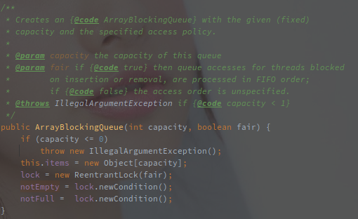
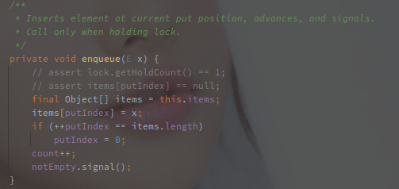
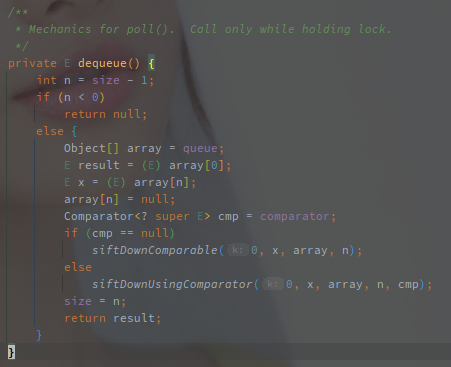
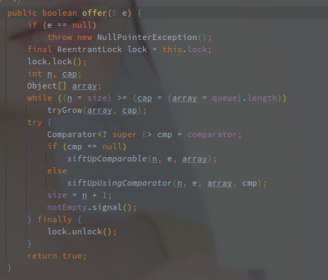
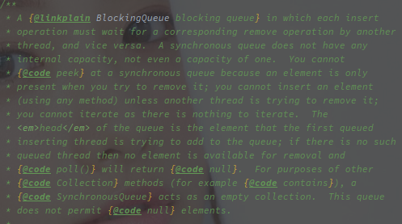

# BlockingQueue（阻塞队列）

---

[TOC]

---

## 概述

BlockingQueue 阻塞队列是 JUC 中新增的集合类，是特殊的 Queue，额外支持**在集合为空时获取阻塞，在集合满时添加阻塞的功能。**

**BlockingQueue 不接收任何的 null 值。**

<br>

**阻塞队列的基本实现就是采用 JUC 中提供的 ReentrantLock 重入锁和 Condition 竞态条件。**

> 使用 ReentrantLock 保证线程安全，使用 Condition 在特定条件下阻塞或唤醒线程。

阻塞队列提供了以下几种方法套件:

| 结果               | 插入        | 移除       | 获取    |
| ------------------ | ----------- | ---------- | ------- |
| 异常               | add         | remove     | element |
| true/false or null | offer       | poll       | peek    |
| 阻塞               | put         | take       |         |
| 等待               | offer(time) | poll(time) |         |


> 使用 ReentratLock 而非 synchronized 的原因：

await/signal 和 wait/notify 的对比:

- 前者基于 JUC 的 AQS 机制实现，而后者基于 JVM 的 Monitor 机制实现。
- await/signal 体系一次上锁可以对应多个 Condition，而 wait/notify，一次的上锁只支持一个等待队列

单锁的多条件队列可以提供更高的并发安全性。


<br>


> 以下为几种基本实现：

## ArrayBlockingQueue

**数组实现**的有界阻塞队列，新增和获取时都有可能被阻塞，**ArrayBlockingQueue 中采用单个重入锁，生成两个 Condition。**



ArrayBlockingQueue 的入队和出队基本都使用 enqueue 和 dequeue 方法来实现。

在 put 方法上锁，然后线程安全的执行 enqueue 方法，以下显示 put 方法的源码:


上锁后开始判断容量，如果容量已满则使用 notFull 阻塞当前线程，等待唤醒，唤醒之后进入 enqueue 方法。



添加元素到原数组，然后通过 notEmpty 唤醒因为集合为空被阻塞的线程。

> **ArrayBlockingQueue 没有扩容的说法，容量从初始化之后就是固定的。**


<br>

## LinkedBlockingQueue

LinkedBlockingQueue 就是**链表形式的阻塞队列**，以下为链表的 Node 节点:


**节点数据非常简单，线程的阻塞也是通过 Condition 实现的。**

以下是实现阻塞的相关变量:


takeLock 和 putLock 是在新增和获取的时候的锁对象，而对应的 notEmpty 和 notFull 就是空和满两种状态的条件。

> 这里可以看到，LinkedBlockingQueue 使用了两个 ReentratLock 来创建两个 Condition。
>
> 对比于 ArrayBlockingQueue 的单个 ReentrantLock，读写分离的锁会具有更高的并发性能。 


在 take() 方法中通过 takeLock 上锁，保证添加过程的线程安全，如果此时**队列为空则使用 notEmpty 阻塞当前线程**。

唤醒后继续执行添加逻辑，当资源有省的时候调用 notEmpty#signal，并调用 notFull 唤醒因为队列已满被阻塞的线程。

以下是 put 方法的源码:


put 方法使用 putLock 上锁，使用 notFull 阻塞添加线程，并且使用 notEmpty 唤醒阻塞线程。


## PriorityBlockingQueue 

优先级阻塞队列（PriorityBlockingQueue），该队列属于无界队列，所以不存在因为插入导致的线程阻塞。

内部使用**堆**来实现整体的有序性，并且会**自动扩容**。

以下是 PriorityBlockingQueue 的获取元素的过程：



**如果 dequeue 获取为空，则调用 notEmpty#await 阻塞调用进程。**

dequeue 方法的逻辑和正常的堆一样，从堆顶取元素，堆尾元素置顶并下沉（siftDown）。

可以参考 PriorityQueue 的实现：[PriorityQueue 的实现](./PrioritryQueue.md)

另外还有添加元素的过程：



添加元素的逻辑和堆一致，元素添加到堆尾并尝试上浮（siftUp），并且在添加成功之后唤醒 notEmpty 的条件阻塞。

并且还可以看到扩容的判断，**queue（Object 的数组）已经满了之后才会进行扩容。**

以下为扩容的逻辑：

```java
 // PriorityBlockingQueue#tryGrow
// oldCap 为旧容量，array 为旧数据
private void tryGrow(Object[] array, int oldCap) {
    	// 取消上锁，因为扩容准备阶段不需要阻塞
        lock.unlock(); // must release and then re-acquire main lock
        Object[] newArray = null;
    	// allocationSpinLock 就是扩容的乐观锁（CAS 替换）
        if (allocationSpinLock == 0 &&  UNSAFE.compareAndSwapInt(this, allocationSpinLockOffset, 0, 1)) {
            try {
                // 扩容的效率
                int newCap = oldCap + ((oldCap < 64) ?
                                       (oldCap + 2) : // grow faster if small
                                       (oldCap >> 1));
                if (newCap - MAX_ARRAY_SIZE > 0) {    // possible overflow
                    int minCap = oldCap + 1;
                    if (minCap < 0 || minCap > MAX_ARRAY_SIZE)
                        throw new OutOfMemoryError();
                    newCap = MAX_ARRAY_SIZE;
                }
                if (newCap > oldCap && queue == array)
                    // 创建新数组
                    newArray = new Object[newCap];
            } finally {
                allocationSpinLock = 0;
            }
        }
        if (newArray == null) // back off if another thread is allocating
            Thread.yield();
    	// 
        lock.lock();
        if (newArray != null && queue == array) {
            queue = newArray;
            // 拷贝数组
            System.arraycopy(array, 0, newArray, 0, oldCap);
        }
    }

```

队列的扩容分为两种：

- 小容量时（cap < 64）直接 old * 2 + 2
- 大容量时（cap >= 64）old * 1.5

> 整体来说，小容量的扩容速度更快。

扩容的整体流程就是：

1. 创建新数组
2. 从旧数组拷贝数据到新数组

> **准备期间（创建新数组期间）方法会先解锁（真的细），保证期间可以获取元素，同时采用另外的 CAS 锁来保证准备阶段的并发安全。**


<br>

## DelayQueue

延时队列（DelayQueue），该队列也属于**无界队列，内部直接使用了 PriorityQueue 保存数据。**

**DelayQueue 保存的元素必须要实现 Delayed 接口。**


Delayed 提供的是任务的比较以及任务剩余等待时间的获取（getDelay）。

> getDelay 方法获取的是任务**距离到期**的时间。

在来看延迟的逻辑，以下是队列的获取流程：

```java
// DelayQueue#take
public E take() throws InterruptedException {
    final ReentrantLock lock = this.lock;
    // 上锁
    lock.lockInterruptibly();
    try {
        for (;;) {
            E first = q.peek();
            // 如果队列为空，则直接阻塞
            if (first == null)
                available.await();
            else {
                long delay = first.getDelay(NANOSECONDS);
                // 任务到期之后弹出并返回
                if (delay <= 0)
                    return q.poll();
				// 任务并没有到期
                first = null; // don't retain ref while waiting
                // 已经有任务在等待，则直接阻塞
                if (leader != null)
                    available.await();
                else {
                    // 没有任务在阻塞的时候，直接将自己作为 leader
                    Thread thisThread = Thread.currentThread();
                    leader = thisThread;
                    try {
                        // 等待一段时间唤醒
                        available.awaitNanos(delay);
                    } finally {
                        if (leader == thisThread)
                            leader = null;
                    }
                }
            }
        }
    } finally {
        // 当前线程已经获取到任务和之后，如果 leader 为空则唤醒一个线程尝试获取首个任务
        if (leader == null && q.peek() != null)
            available.signal();
        lock.unlock();
    }
}
```

在获取任务的时候，队列如果没有到期的任务则会阻塞当前的线程。

> leader 变量用于减少任务的竞争和不必要的唤醒。

DelayQueue 需要在任务到期的时候唤醒一个线程去获取，leader 线程就是被选中的那个。

**所有的等待线程除了 leader 都是无限期等待的，只有 leader 是定时阻塞，阻塞到任务到期，**然后获取任务，在 leader 获取任务成功的同时，如果任务不为空则会唤醒下一个等待的线程。

以下是添加元素的方法，其中可以看到 leader 的作用：


添加任务的时候，如果当前的任务被放在堆顶，则会置空 leader 变量，因为 leader 等待的任务已经不是首个到期任务了。

然后唤醒一个线程去成为新的 leader 并阻塞等待。

> 旧的 leader 到期后发现任务没到期并且 leader 不为空则会变为无限阻塞。


## SynchronousQueue

同步队列（SynchronousQueue）是一个相对特殊的队列，以下是它的类注释：



**同步队列的插入动作必须等带对应的删除操作**，反之亦然（and vice versa）。

同步队列甚至没有任何内部的容量，**无法通过常规的 peek() 方法查看元素**，只有在尝试删除它的时候才能看到。

**同步队列无法迭代（iterate）遍历**，也没有什么好迭代的。

**队列不允许 null 元素**。

[SynchronousQueue 源码实现](./SynchronousQueue.md)