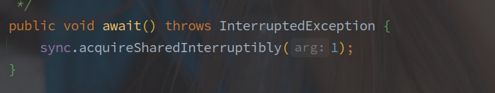
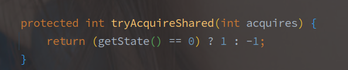
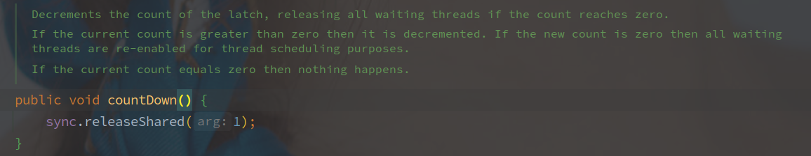
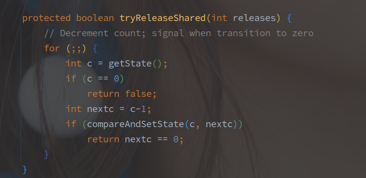

# CountDownLatch

> - chenqwwq 2019/03


---

[TOC]

---


## 概述

CountDownLatch 是利用 AQS 的**共享锁机制**实现的计数器，实现的是类似 N : N 的等待机制。

**调用 CountDownLatch#await 方法的所有线程会阻塞直到有指定个线程调用 CountDownLatch#countDown 方法。**

使用示例如下：

```java
public class Main {
	public static void main(String[] args) throws InterruptedException {
		CountDownLatch countDownLatch = new CountDownLatch(3);
		ExecutorService executorService = Executors.newFixedThreadPool(3);
		for (int i = 0; i < 3; i++) {
			executorService.submit(new Runnable() {
				@SneakyThrows
				@Override
				public void run() {
					TimeUnit.SECONDS.sleep(10);
					System.out.println("count down");
					countDownLatch.countDown();
				}
			});
		}
		countDownLatch.await();
		System.out.println("I am ready");
	}
}
// 输出结果:
// count down
// count down
// count down
// I am ready
```


## 源码实现

### AQS 的初始化

```java
public CountDownLatch(int count) {
    if (count < 0) throw new IllegalArgumentException("count < 0");
    this.sync = new Sync(count);
}
```

构造函数就会将 count 传入 Sync，此时的资源数目就是 count。


### await 的实现

CountDownLatch#await 方法调用的是 AQS 中共享锁的获取方法：



AbstractQueuedSynchronizer#acquireSharedInterruptibly 方法会首先调用实现类的 tryAcquireShared 方法：



上图可知，**await 不会阻塞的要求就是 AQS 的 state 等于 0，因为初始化的时候已经赋值 state 大于 0，所以此时线程会被包装成 Node 进入阻塞队列**。

> 按照 AQS 的逻辑，队首的节点会尝试调用 tryAcquireShared() 方法尝试获取锁，失败两次再进入阻塞队列，而非队首节点直接阻塞。

**因为 CountDownLatch 的 tryReleaseShared 实现，只要求 state 等于0就算是获取成功，所以只要在 await 之前调用的 countDown 方法也是有效的。**

### countDown 的实现



countDown 的方法直接是释放一个资源，方法直接进入 AQS 的资源释放流程，首先调用子类的 tryReleaseShared 方法。



tryReleaseShared 方法会完全忽视参数，每次都释放一个资源，也就是 `state - 1` 的操作，如果最后等于 0 表示释放成功。

如果资源完全释放（`state == 0`），则会唤醒队首节点，并由队首节点开始向后扩散共享锁资源，此时也就唤醒了所有的被 await 阻塞的线程。


## 总结

CountDownLatch 实现是类似计数器的功能，调用 await 的 N 个线程会阻塞等待 countDown 调用到最初的指定次数 N。

实现上，CountDownLatch 使用的是 AQS 的共享锁模式，初始化时指定锁资源为 N，只有在锁资源 N 等于 0 的时候才表示获取资源成功，否则当前线程都会被阻塞，而 countDown 方法就是释放锁资源的过程。