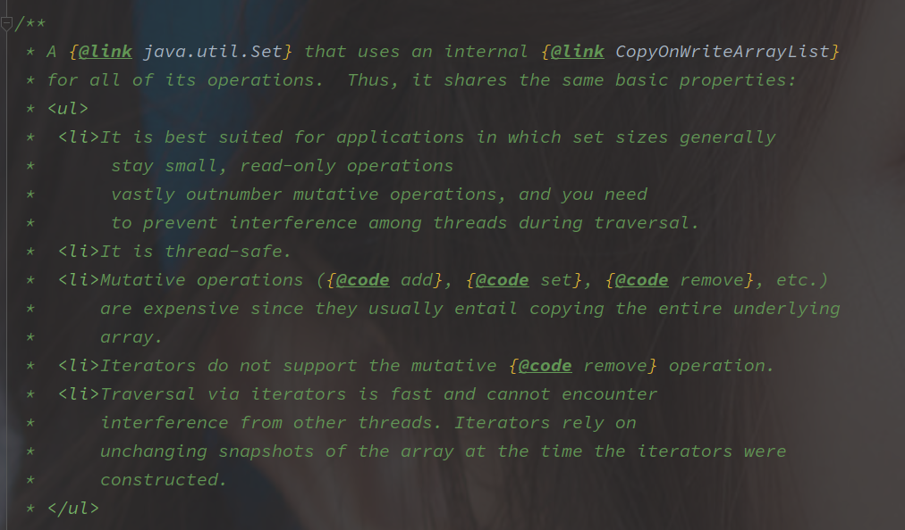
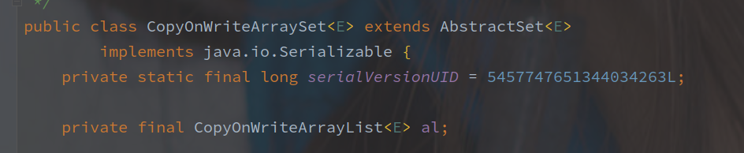

# CopyOnWriteArraySet 源码

---

[toc]

---

## 概述

CopyOnWriteArraySet 是对 Set 接口的并发安全实现。

以下为该类的类注释：

由类注释可以了解如下信息:

1. **CopyOnWriteArraySet 由 CopyOnWriteArrayList 实现内存操作。**
2. CopyOnWriteArraySet 适用于元素数量较少，并且读操作远远超过写操作的场景。
3. add / set / remove 消耗大，因为往往需要复制整个底层数组。
4. 迭代器不支持可变的 remove 操作
5. 迭代器依赖于快照，可以不受其他线程的干扰

> 感觉根据类注释已经能差不多了解该类的实现了。

## 源码实现

值得注意，CopyOnWriteArraySet 并没有和 HashSet 一样使用 Map 类型实现（在类注释中也说明了）。

> Map 类型通过 hash 函数，可以在最优 O(1) 的情况下确定是否有对应的元素存在。

**CopyOnWriteArraySet 采用了 CopyOnWriteArrayList 实现所有的内部操作，**成员变量如下：

## 总结

> emmm...
>
> 这个类的实现应该很明朗了。
>
> Set#contains 方法是通过对快照数组的遍历来实现的。
>
> Set#add 也是先通过对快照遍历来确定是否元素是否存在，然后执行 CopyOnWriteArrayList 的添加。
>
> 因为完全基于 CopyOnWriteArrayList 实现，所以 CopyOnWriteArrayList 的缺点它也完整的继承了，并且因为 add 和 contains 都是通过遍历比较（时间复杂度为 O(N)），所以在元素数量增加时执行效率随之降低。
>
> 元素的迭代也是通过快照来实现的，以此来避免别的线程的写操作的干扰，但是只保证最终一致性。

[CopyOnWriteArrayList](./CopyOnWriteArrayList.md)