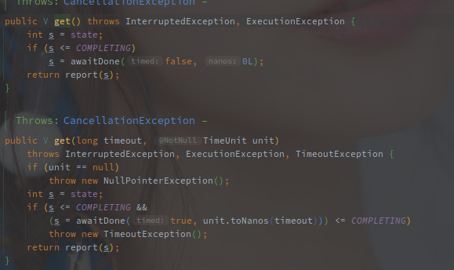
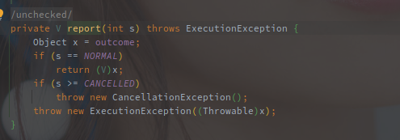
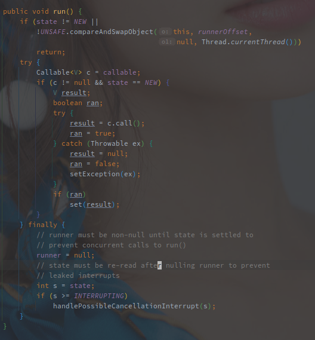
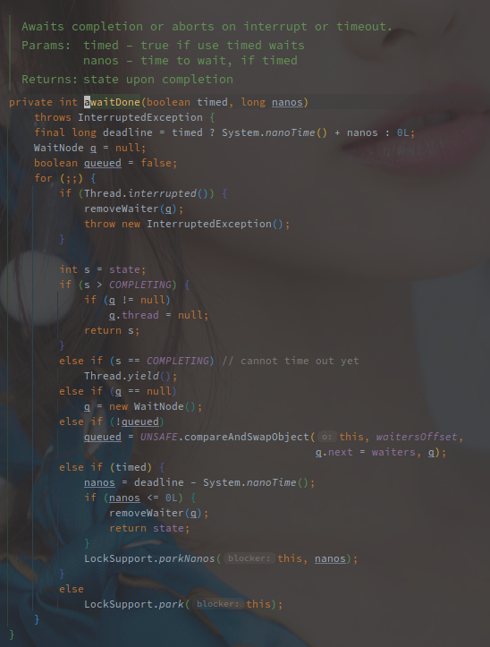
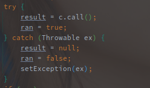
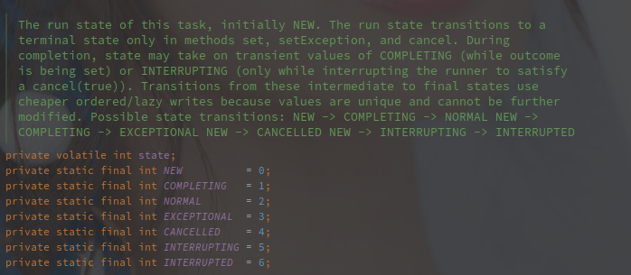

# FutureTask源码解析

[TOC]

---

## 概述

FutureTask 就是对一个异步任务的抽象，实现了 Future#get 方法，可以在任务未完成的时候实现阻塞获取。

FutureTask 内部实现了一个简易的双向链表保存等待的线程对象，未完成的时入队列（入队列依旧使用的 CAS 自旋）并使用 LockSupport 阻塞线程，完成之后唤醒阻塞的线程。

任务完成之后，如果有返回值会直接塞到 FutureTask@outcome 变量中。

### 相关类族

FutureTask 的继承关系图如下:

 

FutureTask 直接继承了 RunnableFuture，而 RunabkleFuture 又继承了 Future 和 Runnable 接口。

相当于 FutureTask 间接继承了 Runnable，**所以它可以作为一个任务向 ThreadPoolExecutor 提交并执行。**

另外的 Future 可以简单看一下它的方法列表：

| 方法名称           | 方法作用                                           |
| ------------------ | -------------------------------------------------- |
| cancel(boolean)    | 取消任务，布尔参数表示如果任务已经启动是否需要中断 |
| get()              | 阻塞获取任务结果                                   |
| get(long,TimeUnit) | 带超时时间的阻塞获取任务结果。                     |

> Future 在 JDK 中表示异步结果。
>
> cannel(Boolean) 方法的参数需要注意，如果为 ture 那么就算任务已经启动也会发出中断信号。
>
> Netty 中的 Future 增加了方法的回调。 

### 基本概念

以下是 FutureTask 的类注释:

FutureTask 是一个可以取消的异步计算任务，提供了 Future 中启动任务，取消任务以及在获取任务结果的基础实现，任务的结果只有在结束之后才能获取。get 方法会阻塞直到任务结束，在任务已经结束之后，不能重启或者取消。

FutureTask 可以用于包装 Callable 或者 Runnable 对象，因为 FutureTask 继承了 Runnable，所以 FutureTask 也可以用 Executor执行。

> 总而言之，FutureTask 就是一个异步的任务类型，它提供的作用如下:
>
> 1. 可以异步执行，因为 FutureTask 实现了 Runnable 接口。 
>
> 2. 提供结果的获取方法。
>
>    - 在结束之后 FutureTask 需要保存这个结果，
>
>    - 在未结束的时候阻塞获取结果的线程
>    - 在结束之后唤醒并通知对应线程
>
> 3. 可以在未结束之前随时取消任务，此时需要唤醒阻塞的线程

## 源码实现

### 获取任务结果

**FutureTask 中定义了 outcome 这个成员变量用于存储任务的执行结果。**

不仅包含正常的返回结果，如果执行有异常也会保存在 outcome。

通过 get() 方法获取任务的结果:

通过当前任务状态的对比，如果任务的状态小于 COMPLETING ，表示任务还没有结束，就进入阻塞的流程。

阻塞结束之后，会返回最新的任务状态（awaitDone 中的逻辑可以看下文），然后处理，如果任务已经完成，否则直接进行状态处理。

以下是状态的处理方法，**此时任务的状态肯定大于 COMPLETING :**

如果任务状态正常则返回正常的结果，否则都会报错，包含任务已经取消异常或者执行失败异常。

>FutureTask 通过状态来判断任务的执行结果，例如任务被取消就是 CANCELLED ，任务完成就是 NORMAL。
>
>具体的状态流转见下图。

这里直接就使用的的 outcome ，那么结果又是什么时候被赋值到这里的呢？

### 任务执行

接下来看 FutureTask 作为 Runnable 的 run() 方法:

刨除其他代码来说，整个 run() 的逻辑非常简单，就是调用 Callable 的 call() 方法，获取执行结果，然后 set 结果到FutureTask。

>   FutureTask  可以以  Callable  以及  Runnable  为原始对象，如果为  Runnable  就会先将其包装成一个  FutureTask  。
>
> 详细逻辑见构造函数。

以下为结果赋值方法：

先将状态从 NEW 变为 COMPLETING ，赋值到 outcome 之后又变为 NORMAL 。

> 任务在执行期间状态一直为 NEW 。
>
>   COMPLETING  状态下，任务已经执行完毕，进入任务结果的保存阶段。
>
> 保存完毕后，任务进入  NORMAL  状态。

修改为  NORMAL  状态之后，会进一步调用  finishCompletion  方法，该方法用于唤醒阻塞的等待线程。

> 除了 run 方法，另外还有 runAndReset 方法，该方法在执行完之后并不设置执行结果，并且状态还为 NEW。
>
> 在 ScheduledThreadPoolExecutor 中实现周期性任务就用了该方法。

### 阻塞及唤醒

先来看阻塞的逻辑，也就是  awaitDone  方法:

这里有类似AQS自旋入队列的逻辑。

每次循环前都会判断当前线程是否被中断，中断的话会将当前线程从Waiter中删除。

> 获取 FutureTask 的执行结果是可以中断的。

然后根据状态判断，如果状态大于  COMPLETING，说明任务已经完成，则直接返回当前的状态。

如果状态为  COMPLETING  ，则让出当前的CPU时间片，

如果  q  为空就创建一个  WaitNode，如果  queued  为false则将  q  也就是上次循环创建的  WaitNode  入队列。

创建的  WaitNode  会包含当前的线程:

>   WaitNode  就是简化版的链表，以所有阻塞的线程作为节点，保存所有等待结果的线程。
>
> 另外根据  UNSAFE  的方法调用情况可以看出新的  WaitNode  是添加到链表的头中的，也就是头插法。

之后根据是否有超时时间，调用对应的  LockSupport#park  方法挂起线程。

> 总结来说，阻塞的逻辑完整的就是创建  WaitNode  ，进入等待队列，挂起当前线程。
>
> 在任务一直在执行的情况下，
>
> 首次循环会创建一个  WaitNode  ，第二次循环会将  WaitNode  入队列，第三次循环会将当前的线程挂起。
>
> 如果第二步一直失败就会无限循环的尝试入队列，因此尝试获取结果的线程过多，导致竞争激烈，那么就会存在大量的循环。
>
> 理论上来说至少需要三次循环才会挂起当前线程，其中如果任务状态改变就会进入上述的几种状态的 if 语句。

再来说说唤醒的事情，也就是在  set()  和  setException()  中调用的  finishCompletion()  方法。

  finishCompletion  方法就是在任务执行完毕之后唤醒所有的阻塞线程的逻辑。

该方法就是从  waiters  开始遍历所有阻塞线程并一一唤醒。

> 因为  waiters  的入队顺序是头插法，所以此时的唤醒是根据阻塞事件的前后，以FILO的形式处理的。
>
> 最先等待的线程，最后被唤醒。
>
> 这里可以稍加修改，使支持头插法和尾插法。

  done()  是模板方法，可以在子类中实现，用于扩展。

### 任务取消

> 入参  mayInterruptIfRunning  的意思就是**如果任务已经启动是否需要中断**。

取消的方法相对简单，调用  runner  也就是正在执行任务的线程，然后中断它，中断之后状态变为  INTERRUPTED  。

> 前置的条件判断，只有状态为  NEW  的任务才可以取消。
>
> 新建和执行中的任务都是 New 的状态。

这是就会出现一种情况，如果执行任务的线程在线程池中，那么该线程会如何呢？

可以在  FutureTask  的  run()  方法中再看一眼:

如上图，异常其实在  FutureTask  的  run()  方法中全被 catch 住了，所以对于线程池或者普通线程来说就是类似普通的任务结束。

> 这里也是  FutureTask  的设计重点吧，  FuturTask  在执行包裹的任务(Runnable/Callable)的过程中不会向外抛出任何的异常，异常都是被当做正常的返回处理的。

另外就是这个状态的变化，取消  CNACELLED  并不一定是任务取消的最终状态，也可能是  INPERRUPTED  。

> 也就是说，取消任务的时候入参如果为  false  ，任务可能还是继续在执行的，只是结果不可见了。

上文也说过，如果最终获取的状态为  CANCELLED，会抛出  CancellationException  。

### 任务状态

以下是在  FutureTask  中定义的七种任务状态。

  NEW  表示初始状态以及执行中的状态，也就是说任务从创建到完成都是  NEW  的状态。

  COMPLETING  表示任务结束正在保存任务结果的状态。

  NORMAL  表示任务正常结束的状态。

  EXCEPTIONAL  表示任务执行出现异常的状态。

  CNACELLED  表示任务已经被取消。

  INTERRUPTING  表示任务正在中断中，  INPERRUPTED  表示任务已经中断。

## 总结

FutureTask 代表了一个可异步执行的任务，提供了任务结果的存放以及获取方法，也维护了任务的即时状态。

FutureTask 最终使用 LockSupport 来完成线程的阻塞和唤醒。

FutureTask 需要在任务没有完成的时候阻塞获取结果的线程，此时会将所有获取结果的线程组成一个链表。

其内部维护了一个单向的阻塞链表，采用**头插法**保存所有等待任务结果的线程对象，取消任务或者任务完成后从头开始唤醒所有线程处理。

> 因为头插法的缘故，第一个阻塞的线程反而是最后一个被唤醒的。

FutrueTask 中使用不同的状态表示当前的任务执行进度，以单个  outcome  表示异常和结果。

FutureTask是一个基本的异步任务模型，基于该种异步任务模型可以扩展出更多的东西，例如在  ScheduledThreadPoolExecutor  中的  ScheduledFutureTask  。

