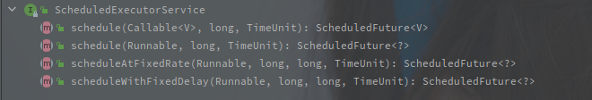
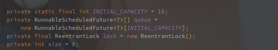
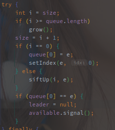
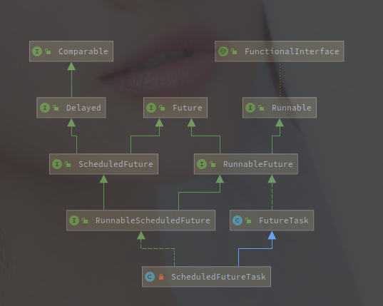
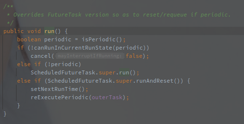
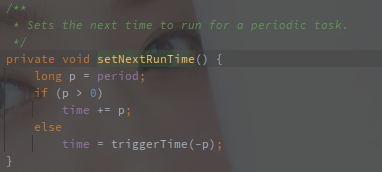
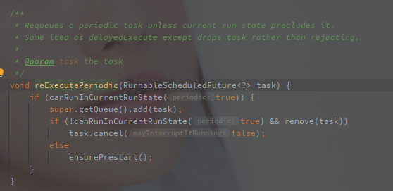

# ScheduledThreadPoolExecutor

> 2021/01/01 祝自己新年快乐。
>
> ScheduledThreadPoolExecutor的主要功能还是通过内部的 DelayedWorkQueue 以及 ScheduleFutureTask 来实现的。


---

[TOC]

---


## 概述


###  相关类族

 ScheduleThreadPoolExecutor 的类图如下:


首先 ScheduledThreadPoolExecutor 直接继承了 ThreadPoolExecutor ，**所以它也完全可以当做一个线程池来使用，可以 submit 相关任务**。

另外的相对于线程池，它额外继承了 ScheduledExecutorService 接口，表明它可以提供 **定时** 以及 **固定延迟** 的周期性任务。

以下是 ScheduledExecutorService 接口的方法API列表:



其中 scheduleAtFixedRate() 方法就是定时任务，如果上一次任务结束时下次任务时间已到则直接开始下一次任务。

x另外 scheduleWithFixedDelay() 方法就是固定延时的任务，任意两个任务之间保证固定的延时，就算上个任务拖到天荒地老，下个任务也会间隔一定延迟后再执行。


> 简单总结一下， ScheduledThreadPoolExecutor 可以执行的任务种类有如下四种种:
>
> 1. 正常任务（Runnable/Callable）
> 2. 延迟任务（One-Shot）
> 3. 固定频率任务（FixedRate）
> 4. 固定延迟任务 （FixedDelay）
>
> 一定程度上，定时任务和固定延迟任务其实也是基于延迟任务实现的，只要在任务完成之后重新将其加入等待队列就好。


> 线程池控制任务延迟调度的关键就在于 WorkQueue（等待队列） ，工作线程的执行逻辑照旧，**只要等待队列控制任务的下发时间就可以控制任务的延时执行。**

## 等待队列 -  DelayedWorkQueue 

 ScheduledThreadPoolExecutor 使用的内部类 DelayedWorkQueue ，就是类似于JDK中 DelayQueue 的实现，**使用堆排序保证每次获取的任务的时间戳都是最小的。**

以下是 DelayedWorkerQueue 的成员变量:



因为是内部类只供内部使用，所以直接使用的 RunnableScheduledFuture 的数组保存等待任务。


### 获取任务

**从 TreadPoolExecutor 的 getTask() 方法中得知从等待队列中获取任务主要使用的是阻塞队列的 take() 和 poll(time) 方法。**

以下是 DelayedWorkerQueue 的 take() 方法源码:

```java
// ScheduledThreadPoolExecutor$DelayedWorkQueue#take()
public RunnableScheduledFuture<?> take() throws InterruptedException {
  final ReentrantLock lock = this.lock;
  lock.lockInterruptibly();
  try {
    // 循环获取
    for (;;) {
      RunnableScheduledFuture<?> first = queue[0];
      // 队列为空的时候直接阻塞
      if (first == null)
        // 首先要明确的是，await之后会释放持有的lock的锁
        available.await();
      else {
        // 首个任务
        // 因为DelayedWorkQueue遵循堆排序，所以首个任务也就是最接近当前时间的任务
        long delay = first.getDelay(NANOSECONDS);
        // <= 0 也就表示任务到执行的时间了
        if (delay <= 0)
          // 结束获取
          return finishPoll(first);
        // 放弃引用
        first = null; // don't retain ref while waiting
        // 如果leadder不为空就等待
        if (leader != null)
          available.await();
        else {
          // leader为空就使用当前线程并阻塞当前线程到任务开始
          Thread thisThread = Thread.currentThread();
          leader = thisThread;
          try {
            // 这里是定时阻塞
            available.awaitNanos(delay);
          } finally {
            // 重新获取锁之后释放leader,因为没有在等待了
            if (leader == thisThread)
              leader = null;
          }
        }
      }
    }
  } finally {
    if (leader == null && queue[0] != null)
      // leader为空并且队列不为空
      // 这里只释放了其中一个线程
      available.signal();
    lock.unlock();
  }
}
```

> 理解以上代码之前有几个需要理解的前提:
>
> 1.   await() 等阻塞方法需要先获取 ReentrantLock 的锁。
> 2.   await() 等方法会立即释放持有的锁。
> 3. 被 await() 阻塞的线程在唤醒后需要再次获取相应的锁才能继续执行。


因为 DelayedWorkQueue 采用的堆排序，所以数组的第一个元素就是最小的元素。

首先获取到时间戳最小的任务，如果为空表明整个等待队列为空，此时直接阻塞获取的线程，等待任务添加后唤醒。

如果获取不为空，但是并没有到执行的时间，则进一步判断 leader 是否为空， leader 就表示第一个等待该任务就绪的线程。

如果为空表示没有线程在等待该任务，那么就是用当前线程等待该任务，并且阻塞当前线程直到任务就绪。

如果不为空表示已经有线程在等待执行该任务，那么此时就直接阻塞，因为最接近的任务都没有到执行时候，后面的任务就更加不可能了，所以这里采用的是永久的阻塞等待唤醒。


 leader 参数的使用算是一大亮点， leader 是 DelayedWorkQueue 的成员变量，**指明等待的首个线程，也就是等待队列开头的线程**。

从以上代码也可以看出来， leader 在第一个线程获取到未到期的队首任务时赋值，在获取到队首任务之后清除。

如果没有 leader 参数，那么所有获取到队首的任务判断任务未到期，则都会定时阻塞到任务开始的时间，这就又会造成线程资源的争抢，因为只允许一个线程获取，所以也没必要定时阻塞那么多。

>   leader 参数的使用最大程度上减少了不必要的定时等待。
>
> 因为只需要首个探知到任务未就绪的线程阻塞到任务就绪就好，其他线程没必要定时阻塞，因为也没有那么多任务给他们执行。
>
> 唤醒非 leader 的排队线程的地方有两个:
>
> 1.   leader 线程获取到该任务并且在 finally 中释放一个线程。
> 2.   offer 中添加任务成功后，如果列表仅此一个任务则唤醒一个等待线程。
>
> 在 DelayedWorkQueue 中每次只会释放一个阻塞的线程，所以不会有线程争抢资源的问题(或者说争抢的问题在更加底层的地方解决了)


### 添加任务

添加任务的流程就是一个常规的往堆里添加元素并且重新调整堆的流程，主要源码如下:



主要关注的是在添加的元素为堆首元素的时候会调用 signal 方法唤醒其中一个线程。

> 注意这里调用的是 signal，而非 signalAll，**每次只唤醒一个阻塞线程**就很大程度上避免了惊群效应。


### DelayedWorkQueue 的几种特殊场景

刚开始没有任务，所有尝试获取任务的都会被阻塞，此时添加一个任务，会随机唤醒一个线程再次去获取该任务并执行。

 如果队首的元素未到期，那么此时所有获取的线程都会被阻塞，但是首个获取的线程会将自己设置为 leader ，**并且开启定时阻塞，阻塞到任务到期**，而其他线程都是无限期阻塞。

通过 DelayedWorkQueue ，就已经可以实现延迟任务，接下来再来看定时以及固定延迟的任务实现。


> 通过 DelayedWorkQueue 已经实现了任务的延时执行，但是并咩有实现定期执行的功能，而定期执行的功能还是通过 ScheduledFutureTask 实现的。

## 异步任务 - ScheduledFutureTask

ScheduledFutureTask 是在 ScheduledThreadPoolExecutor 中特殊实现的 FutureTask，在支持异步执行的特性之外，增加了执行后的补充回调。

### 类族关系

以下为 ScheduledFutureTask 的类图：



 ScheduledFutureTask 直接继承了 FutureTask ，本身就是一个 Runnable 对象，在 ScheduledThreadPoolExecutor 中所有的任务都由它来表示，所有的 Runnable/Callable 都会被转化为 ScheduledFutureTask 执行或者保存。

除了 FutureTask 的分支，另外还继承了 RunnableScheduleFuture 接口，该接口定义了一些周期任务的基本方法签名。


### 任务执行和重入

以下是 ScheduledFutureTask#run() 的源码:



首先检查状态是否正确，如果状态不正确则执行取消方法。

如果不是周期性任务，则直接调用父类的 run 方法，此时会具体执行任务并且设置结果，修改状态。

如果是周期性任务，则调用的 runAndReset 方法，该方法执行完毕并不会修改状态，设置结果。

setNextRunTime 方法用来设定下一个任务执行时间:



这里就涉及到了周期性任务的两个种类，就是固定频率任务（FixedRate）固定延迟任务 （FixedDelay）。


**在包装的方法中可以看到固定延迟的任务 time 为负数的，**计算出下次方法执行的时间之后就是将任务重新添加到阻塞队列。

以下是 ScheduledThreadPoolExecutor#reExecutePeriodic 的方法源码:



调用了 getQueue().add() 方法直接将任务添加回 DelayedWorkQueue。


<br>

## 小结

> 延时/定时任务的实现

以 DelayedWorkQueue 参与整个任务调度的过程，以线程池为基础，延时/定时下发对应任务就可以实现。

添加任务的时候计算出需要执行的时间，并且以小顶堆的形式存储，每次获取都会判断任务是否到期。


> 周期性任务的实现

周期性任务是在延时/定时任务的基础上，对于已经执行的 Task，计算下次的执行时间并直接添加任务到队列。

具体的实现是在 ScheduledFutureTask#run() 中。