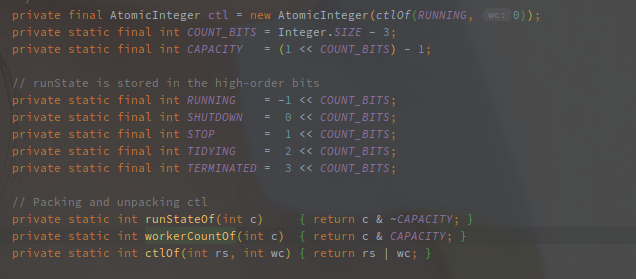
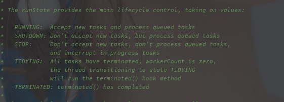
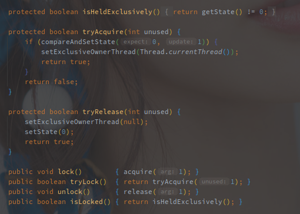
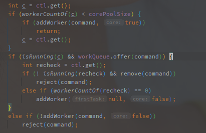
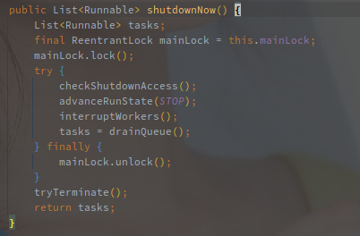
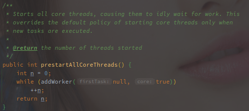
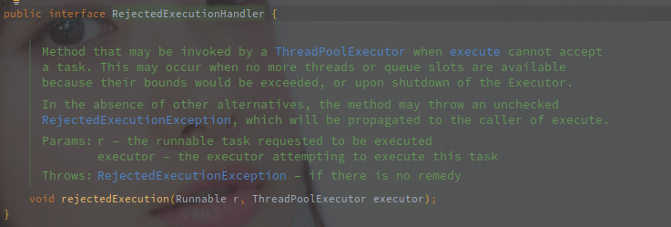
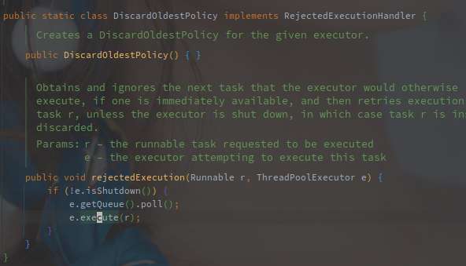

# ThreadPoolExecutor源码解析

> ThreadPoolExecutor就是JDK中的线程池实现。
>
> 基于 JDK 1.8


---

[TOC]

---


## 概述

线程池是常见的池化技术实现之一，旨在**重复使用现有的线程资源，已减少线程创建和销毁的消耗**，类似的池化操作还有内存池，连接池等。

Java 中的线程(  Thread )借由内核线程来实现，也就是说在 Java 中的每个 Thread 对象都会对应内核中的一个轻量级进程，线程的创建，销毁和调度都由内核完成，

对于线程的创建和销毁消耗都不小，而且线程状态的切换也需要用户态到内核态的切换。


> 进程和线程的区别:
>
> 1. 进程是CPU资源分配的基本单位，而线程是CPU调度的基本单位。
> 2. 一个进程可以包含多个线程，多个线程共享同一个进程下的内存等资源
> 3. 进程间的切换CPU需要保存线程，切换执行环境消耗会比线程大的多


**另一方面来说线程池也是线程资源的统一管理**，例如在一个消息队列的消费场景中，我就可以指定固定线程数的线程池来完成，而不需要手动去控制消费线程的创建。


ThreadPoolExecutor 是最基础的线程池，没有任何其他附加功能。

## 源码分析

> 基于 JDK 1.8.0_241

### 	构造函数

这个基本是面试都会问的问题了，非常重要，因为**设定不同的入参是我们控制线程池执行方式的最主要的方法。**

 

以上就是 ThreadPoolExecutor 类内所有的构造函数，以下是参数最完整的一个:

 

参数的含义如下:

| 参数名          | 含义                   |
| --------------- | ---------------------- |
| corePoolSize    | 核心池的线程数量       |
| maximumPoolSize | 最大线程数量           |
| keepAliveTime   | 空闲线程保活时间       |
| TimeUnit        | 空闲线程保活的时间单位 |
| workQueue       | 等待队列               |
| threadFactory   | 线程工厂               |
| handler         | 拒绝策略               |


另外的 `Executors` 类也帮我们快速的常见特定形式的线程池，比如单个线程的线程池或者无限等待队列的线程池等。	  

简单demo如下：

  


### 线程池状态和线程数

这里有蛮亮眼的设计，**以一个32位整型表示了两个线程池参数。**

**这样的设计使线程池的状态和线程数的设置可以同时进行，保证彼此的关联性，而且位运算的效率也不错。**

 


如上图所示，**ctl是一个 AtomicInteger 类型的对象，高3位表示当前线程池的状态，低29位表示线程的数目。**

COUNT_BITS 是表示线程数目的位数，也就是29位，这里也可以看出来，线程池的线程上限就是2^29个。

CAPACITY 表示线程的数目上限，也用于求线程数以及线程状态，具体可以看下面 `runStateOf` 以及 `workerCountOf` 两个方法。


接下来看线程池的状态:

 

整理如下:

| 状态标示   | 状态含义                                                     |
| ---------- | ------------------------------------------------------------ |
| RUNNING    | 线程池正常运行，可以接收新的任务并执行。                     |
| SHUTDOWN   | 线程池已经关闭，停止接受新的任务，但是排队中的任务以及执行中的任务都还要执行。 |
| STOP       | 线程池正式关闭，不仅不接受新的任务，排队中以及执行中的任务都需要取消或者中断。 |
| TIDYING    | 整理过渡状态，工作线程为0时就需要调用 terminated() 方法。    |
| TERMINATED | terminated()方法执行完毕就是终止状态。                       |

以上状态非常关键，因为不论是添加任务，执行任务，都需要先检查线程池的状态。

> 区分 `SHUTDOWN` 和 `STOP` 的状态，两种状态都表示线程池即将关闭，但不是完全关闭的状态。
>
> 两种状态都不会继续接受新的任务提交，但 `SHUTDOWN` 状态下会继续执行已提交的任务，而 `STOP` 会中断并取消任务。


### 其他相关组件对象

#### Worker

Worker 是 ThreadPoolExecutor 的内部类，同时也是**线程池中具体的工作线程的持有者。**

线程池中的所有工作线程都保存在以下的成员变量中:

 

Worker 作为 ThreadPoolExecutor 的内部类，自身**继承了AbstractQueuedSynchronizer**，并实现了Runnable接口。

以下是Worker中的内部变量，除了具体的工作线程 Thread 外，还有初始任务以及完成的任务计数。

 


**addWorker 方法中没有 firstTask 的调用则表示是直接添加工作线程消费阻塞队列中的任务，eg. (addWorker(null,boolean))**

下面是 Worker 中有关于 AQS 的方法实现:

 


`Worker` 的上锁和解锁就是 state 在0,1之间的变化。

> 任务提交到线程池中是单线程执行的，也就说是并不会有竞态问题，所以这个锁的作用自然不是保证线程安全。
>
> **这里的上锁的更像是表示线程的忙碌标志，**忙碌标记的作用就是在防止其他线程关闭当前任务。

这个很关键，下文会看到 runWorker 中在执行某个具体的任务之前都会先上锁，也就表示了线程正在执行一个任务，在忙碌状态。

**正是因为这个忙碌状态会导致其他线程获取锁失败，在类似 `interruptIdleWorkers()` 方法中就可以区分忙碌和空闲的工作线程。**


下面是线程池的具体执行逻辑源码。

### 添加任务入口 - execute

该方法用于向线程池添加新的任务，是 ThreadPoolExecutor 中最上层的方法。

方法源码如下:

 


**第一步获取 ctl 变量,判断是否可以使用核心线程池，如果线程池的工作线程数量小于 corePoolSize，就直接调用 addWorker 方法添加任务，执行成功就直接 return**。

添加失败或者当前线程数已经大于**corePoolSize** 则进入第二步。

> 所有的任务是优先创建核心线程处理的。


**第二步判断当前线程池是否为 RUNNING 状态，如果是则尝试将任务添加到工作队列。**

任务添加到 workQueue 成功之后还会再次检查当前线程池的状态，**如果状态不为 RUNNING，则移除当前任务，并执行拒绝逻辑。**

如果状态为 RUNNING 或者移除任务失败，那么可能迫于无奈的尝试去执行入队的任务，此时会去检查线程池中线程的数目，

当线程数目为0时添加一个不带初始任务的非核心线程去消费阻塞队列中的任务。

> 这里可能是工作线程在任务入队列的时候退出了，那么队列内的任务就只能等到下次添加任务的之后执行。


**第三步在线程不是RUNNING或者入队列失败的情况，**会直接调用 addWorker 尝试以非核心线程执行当前任务，如果还失败则执行拒绝策略。

addWorker 中也会前置检查，比如当前线程为 SHUTDOWN 但是因为 firstTask 不为空，所以会直接返回false，然后执行拒绝策略。


> 简单总结以下三个阶段:
>
> 1. 线程数小于 corePoolSize，直接启动线程执行
> 2. 大于 corePoolSize，入阻塞队列
> 3. 入队列失败，或者状态检查失败，直接拒绝策略


以下为线程池整体的任务添加逻辑:

 


以上就是线程池添加新任务最外层的逻辑，可能也是面试问的最多的地方吧。


### 添加任务 - addWorker

> addWorker方法的作用就是添加一个新的工作线程到线程池中，包括核心和非核心线程都是通过该方法添加的。

参数中的 firstTask 表示该工作线程的第一个任务，如果为空会在第一次 runWorker 的时候就尝试从等待中获取任务。

> **所以如果希望添加一个工作线程消费等待队列里的任务，就可以直接调用addWorker(null,true | false)来实现**。

core 表示是否希望以核心线程添加，true 和 false 仅仅和线程数检查有关。

```java
// firstTask表示希望执行的任务
// core表示是否是核心线程，false表示无所谓而不一定
// 返回值表示是否添加成功
private boolean addWorker(Runnable firstTask, boolean core) {
        retry:
     	// 外层的状态检查循环
        for (;;) {
            int c = ctl.get();
            int rs = runStateOf(c);
            // 能增加工作线程的情况
            // 1. 当前状态为RUNNING
            // 2. 当前状态为SHUTDOWN，但是阻塞队列不为空
            if (rs >= SHUTDOWN &&
                ! (rs == SHUTDOWN &&
                   firstTask == null &&
                   ! workQueue.isEmpty()))
                return false;
            // 内层线程数检查循环
            for (;;) {
                // 获取当前线程数
                int wc = workerCountOf(c);
                // 1.  当前线程数大于等于容量上限
                // 2.  以核心线程运行时大于corePoolSize
                // 3.  以非核心线程运行时大于maximumPoolSize
                // 满足以上条件就会退出，表示任务添加失败
                if (wc >= CAPACITY ||
                    wc >= (core ? corePoolSize : maximumPoolSize))
                    return false;
                // 递增线程池的线程数量
                // 成功就退出循环
                if (compareAndIncrementWorkerCount(c))
                    break retry;
                // 递增失败表示执行期间ctl被改变了,可能是状态或者线程数变了
                c = ctl.get();  // Re-read ctl
                // 如果是状态变了,就重新执行外面的循环
                // 如果是线程数目变了就执行内存循环就好了
                if (runStateOf(c) != rs)
                    continue retry;
                // else CAS failed due to workerCount change; retry inner loop
            }
        }
    
    	// 上面两个循环，外层循环检查状态，内存循环检查线程数
    	// 通过之后开始具体的添加工作线程的逻辑

    	// 这两个从名字也可以看出来，任务启动和添加是否成功
        boolean workerStarted = false;
        boolean workerAdded = false;
        Worker w = null;
        try {
            // 包装新的Worker
            w = new Worker(firstTask);
			// 创建新Worker的时候就会创建一个新线程
            final Thread t = w.thread;
            if (t != null) {
                final ReentrantLock mainLock = this.mainLock;
                // 上锁
                mainLock.lock();
                try {
                    // 重新获取线程池状态
                    int rs = runStateOf(ctl.get());
                    // 在RUNNING的状态下
                    // 或者SHUTDOWN时不添加任务只添加线程
                    if (rs < SHUTDOWN ||
                        (rs == SHUTDOWN && firstTask == null)) {
                        if (t.isAlive()) // precheck that t is startable
                            throw new IllegalThreadStateException();
                        // 添加到任务集合中
                        workers.add(w);
                        int s = workers.size();
                        // 重新计算最大的线程数
                        if (s > largestPoolSize)
                            largestPoolSize = s;
                        workerAdded = true;
                    }
                } finally {
                    mainLock.unlock();
                }
                // 线程添加成功
                if (workerAdded) {
                    // 直接开启线程，这里会去执行Worker的run方法
                    t.start();
                    workerStarted = true;
                }
            }
        } finally {
            // 线程没有启动成功的一些收尾工作
            if (! workerStarted)
                addWorkerFailed(w);
        }
        return workerStarted;
    }
```


添加任务的整个逻辑并不复杂，不过有多次的状态检查，因为在线程数检查的时候状态也可能会改变。

> 整个添加的流程就是
>
> 1.前置循环检查
>
>  2.添加工作线程

**前置检查流程如下:**

首先**检查状态**，状态不对直接就退出了。

> 可以添加线程的状态有以下两种:
>
> 1. 线程为RUNNING状态
> 2. 线程为SHUTDOWN状态，并且任务队列不为空
>
> 需要注意的是在SHUTDOWN状态下不允许携带初始任务创建工作线程，因为SHUTDOWN状态不允许添加新任务。

再来检查当前的线程数，线程数不满足也直接退出了，这里最大的线程数根据入参 core 来定:

> 如果添加的核心线程( core=true )，那么线程数上限为 `corePoolSize`。
>
> 如果添加的是非核心线程，那么线程数上限为 `maximumPoolSize`。

线程数检查通过之后会 CAS 增加线程数，失败重新检查线程数，成功后需要再次检查线程状态，线程状态改变需要重新检查线程状态。

**整个前置检查的逻辑主要检查线程池状态以及线程数。**


在经过前置检查之后，会将 firstTask 包装为 Worker，以下是 Worker 的构造函数。

 

> 这里有一个细节，就是会现将状态变为-1，此时 `Woker#lock()`方法就不会成功，等同于忙碌状态。

另外就是通过 ThreadFactory 创建一个新的线程，最后将新建的 Worker 对象添加到 `workers` 集合，然后启动线程。

> addWorker 的最后会直接调用 `Thread.start()` 方法，此时线程就已经启动。


#### 添加失败收尾 - addWorkerFailed

该方法在 addWorker 失败之后调用，比如添加失败或者启动失败等原因。

```java
private void addWorkerFailed(Worker w) {
    final ReentrantLock mainLock = this.mainLock;
    mainLock.lock();
    try {
        // 从工作集合中移除
        if (w != null)
            workers.remove(w);
        // 减去任务数
        decrementWorkerCount();
        // 尝试终止
        tryTerminate();
    } finally {
        mainLock.unlock();
    }
}
```

从工作线程集合中移除以及减少工作线程数目都是非常好理解的。

另外的添加 Worker 失败之后还会调用 tryTerminate 来检查线程池的状态，判断线程池是否应该 terminate。


### 开启工作线程 - runWorker

> 任务以 Runnable 形式接收，包装成 Worker 并添加到 workers 集合，添加成功开启线程执行任务。

以下就是worker的run方法，也就是工作线程执行逻辑入口：

 

很干脆的只有调用`runWorker`方法，不过会把自身引用当做入参传入。


以下就是runWorker()方法的全部源码.

```java
final void runWorker(Worker w) {
    // 获取当前线程
    Thread wt = Thread.currentThread();
    // 取出任务并置空原任务。
    Runnable task = w.firstTask;
    w.firstTask = null;
    // 允许中断，这里是+1，抵消掉了初始化Worker时的-1
    w.unlock(); // allow interrupts
    boolean completedAbruptly = true;
    try {
        // 这里是一直循环获取任务的
        // task==null时，会从getTask()方法获取下一个任务
        while (task != null || (task = getTask()) != null) {
            w.lock();
            // Worker的状态大于STOP的时候必须被中断
            if ((runStateAtLeast(ctl.get(), STOP) ||
                 // 这里真的太骚了！！！
                 // 如果或前面的判断为FALSE，会执行到这里将线程的中断清除，然后在判断
                 (Thread.interrupted() &&
                  runStateAtLeast(ctl.get(), STOP))) &&
                !wt.isInterrupted())
                // 以上的整个判断都是为了保证以下两点：
                // 1. 线程池状态在STOP以上的时候必须发生中断
                // 2. 不在STOP以上的时候，清除中断状态
                wt.interrupt();
            try {
                // 这里相当于模板模式，提供给子类实现的方法
                beforeExecute(wt, task);
                Throwable thrown = null;
                try {
                    // 真正执行Runnable
                    task.run();
                } catch (RuntimeException x) {
                    thrown = x; throw x;
                } catch (Error x) {
                    thrown = x; throw x;
                } catch (Throwable x) {
                    thrown = x; throw new Error(x);
                } finally {
                    // 同beforeExecute作用一样
                    afterExecute(task, thrown);
                }
            } finally {
                // 这里把Task置空，保证任务只被执行一次
                task = null;
                w.completedTasks++;
                w.unlock();
            }
        }
        // 执行到这里的情况就是while里的判断为false，即
        // task ==null && getTask()又获取不到新任务
        completedAbruptly = false;
    } finally {
        // Worker退出
        processWorkerExit(w, completedAbruptly);
    }
}
```

整个 `runWorker()` 方法可以简单看做一个大的 while 循环，所以 **while 中的条件完全控制线程的生命周期。**


**首次调用会执行 firstTask，如果 firstTask 为空那么会调用 getTask 获取阻塞队列中的任务。**

接下来就是 while 循环中对线程状态的判断，保证了以下两个关键点:

1. 线程池在 STOP 的状态下，当前线程必须中断。
2. 如果线程池不在 STOP 状态，那么线程就不能被中断，正式执行 Runnable 之前就需要清除中断状态。

现成的执行前后有 `beforeExecute` 以及 `afterExecute` 两个钩子方法，这两个是模板方法，子类可以实现以复制或增强线程池任务执行。

> 在 afterExecute 方法中直接将任务添加回任务队列，就可以实现简单的定时任务。

还有就是知道了每个 Worker 都会记录执行完成的任务数。


> Q: 任务执行流程中值得关注的就是Worker对中断的处理。

A: **首先要明确的就是具体的任务执行期间是不允许中断的。**

**另外的保证就是只有 STOP 状态下，工作线程才会在获取到任务的状态下主动退出，SHUTDOWN 状态仍然要执行完任务。**


> Q: 为什么单线程执行需要w.lock()方法上锁。**

这个上文有提到过，在 `interruptIdleWorkers()` 方法中可以看到，线程池中对于空闲的定义就是可以获取到锁，所以这里的上锁也就表明当前工作线程正忙。


> 如果 firstTask 为空并且 getTask 也没有获取到任务(不一定是阻塞队列为空)，那么工作线程就会进入退出流程。

退出流程就是对 `processWorkerExit()` 方法的调用。

另外退出需要考虑到正常退出(`getTask() -> return null`)以及异常退出(throw Exception)的情况。


#### Worker退出流程

参数中的 `comletedAbruptly` 字面意思就是**是否突然结束**，突然结束就表示是因为异常结束的，也就是说该参数表明了退出的两个场景，正常退出和异常退出。

```java
// Worker就是希望退出的线程
// completedAbruptly表示是否因为异常退出，
// 这个可以结合runWorker的代码，如果正常情况下没有获取到任务而退出，completedAbruptly会是false
private void processWorkerExit(Worker w, boolean completedAbruptly) {
    // 突然退出的的情况下需要减去WorkerCount
    // 非突然退出的时候在getTask就会减
    if (completedAbruptly)
        decrementWorkerCount();

    final ReentrantLock mainLock = this.mainLock;
    mainLock.lock();
    try {
        // 统计完成任务数
        completedTaskCount += w.completedTasks;
        // 删除工作线程
        workers.remove(w);
    } finally {
        mainLock.unlock();
    }
    // 尝试停止，这个方法很常见了
    tryTerminate();

    int c = ctl.get();
    // 状态小于STOP,也就是SHUTDOWN和RUNNING
    if (runStateLessThan(c, STOP)) {
        // 正常退出的情况下
        if (!completedAbruptly) {
            // allowCoreTreadTimeOut表示空闲的核心线程是否需要收回
            int min = allowCoreThreadTimeOut ? 0 : corePoolSize;
            // 如果阻塞队列中还有任务就必须留有线程执行
            if (min == 0 && ! workQueue.isEmpty())
                min = 1;
            // 线程足够就不需要添加
            if (workerCountOf(c) >= min)
                return; // replacement not needed
        }
        // 添加一个非核心线程
        addWorker(null, false);
    }
}
```

该方法首先会为突然退出的情况做处理，减去线程计数。

然后是公共的处理，在 `workers` 集合中删除退出的线程，有线程退出的情况下尝试修改线程状态到 `TERMINATE`。


之后会先判断线程的状态，只有线程状态为 `RUNNING` 或者 `SHUTDOWN` 的时候才会执行。

> ！！！**对于异常退出来说，会直接补充一个新的工作线程。**

对于正常的退出来说，如果不允许核心线程超时退出，那么整个线程池就必须保持核心线程池的线程个数，如果低于则补充。

如果允许核心线程超时退出，那么在长时间没有任务的情况下，允许核心线程池为空，但如果存在任务，那最少也要保留一个工作线程。


> 以下场景均发生在线程池为 `RUNNING` 或者 `SHUTDOWN` 状态下，也就是依旧允许执行任务的状态下，对于线程退出的操作：
>
> 1. 异常退出的情况下，会立马补充一个新的线程池。
> 2. 正常的退出的情况下，如果等待队列仍然有任务，那么至少需要保留一个线程，如果不允许核心线程超时退出，那么至少需要保留 `corePoolSize` 个线程。


> 核心线程的超时退出是指线程在长时间没有执行任务也就是空闲的时候需不需要退出，以节省资源。


### 获取任务 - getTask

该方法从名字来看就是获取任务的方法，准确来说是**从阻塞队列获取任务**的方法。

其中还包含了**对线程池状态的检测，以及对线程生命周期的控制**<font size=2>(这里的控制指的是 getTask 如果返回 null，那么`runWorker` 中的 while 循环就退出了)</font>。

```java
private Runnable getTask() {
    boolean timedOut = false; // Did the last poll() time out
    for (;;) {		// 循环获取
        int c = ctl.get();
        int rs = runStateOf(c);
        // 直接返回空并减去工作线程数的情况
        // 1. 线程池状态为SHUTDOWN，并且工作线程为空
        // 2. 线程池状态为STOP以上
        if (rs >= SHUTDOWN && (rs >= STOP || workQueue.isEmpty())) {
            // 这里已经减去了工作线程数
            decrementWorkerCount();
            return null;
        }
        int wc = workerCountOf(c);
        // 线程是否需要检测超时
        // wc大于corePoolSize的时候就相当于允许超时，允许淘汰
        boolean timed = allowCoreThreadTimeOut || wc > corePoolSize;
        // getTask的返回控制线程是否需要淘汰
        // 1. 线程数超过maximumPoolSize
        if ((wc > maximumPoolSize || (timed && timedOut))
            && (wc > 1 || workQueue.isEmpty())) {
            // 这里可以看一下和上面两个减去线程数的方法区别
            // 一个是直接减去，一个是CAS
            // 因为上面的是状态不对，而下面这个是数目不对
            // 数目减少之后需要重新检查
            if (compareAndDecrementWorkerCount(c))
                return null;
            continue;
        }

        try {
            // 根据
            // take()方法是可以检测中断的，所以不会造成死等
            Runnable r = timed ?
                // 等带一个超时时间，如果超时时间内没有获取到，则会返回null
                // 导致工作线程退出
                workQueue.poll(keepAliveTime, TimeUnit.NANOSECONDS) :
            // 这里要注意take会阻塞直到获取到任务或者发生中断
            workQueue.take();
            if (r != null)
                return r;
            timedOut = true;
        } catch (InterruptedException retry) {
            // 如果发生中断也不会使线程退出
            timedOut = false;
        }
    }

```

获取任务的流程简述如下:

首先检查当前线程池状态是否允许获取，**只有 RUNNING 以及 SHUTDOWN 的状态才允许获取任务。**

例如 STOP 或者更高的状态下，`getTask`方法会直接返回 null，从而导致工作线程的退出。

> 线程池中的线程主动退出的情况有以下两种:
>
> 1. 线程状态大于 SHUTDOWN
> 2. 线程状态为 SHUTDOWN，并且任务队列为空

接下来是线程的超时判断，有以下几种情况：

1. 当前线程数大于 maximumPoolSize，线程肯定需要退出。(具体使工作线程数大于 maximumPoolSize 的场景未知)
2. 工作线程数大于 corePoolSize 或者允许核心线程超时淘汰( allowCoreThreadTimeOut )，且获取超时的时候。(这里的超时在第二次进入循环的时候判断)

通过以上两种检查，最后就是获取任务，以上述第二点的线程数判断为基础，决定获取任务是否带超时时间。

> take() 会一直阻塞，直到获取到任务或者发生中断，poll() 可以指定阻塞等待的时间。


### 尝试终止 - tryTerminate

该方法在类中很多地方都会调用,比如 addWorker 失败，worker 线程退出等等情况。

相当于一个后置的检查方法，检查线程池应不应该进入TERMINATE状态，在可终止但是仍有线程在运行的情况下，尝试中断空闲线程。

```java
final void tryTerminate() {
    for (;;) {
        int c = ctl.get();
        // 如果线程池状态为RUNNING就直接返回
        if (isRunning(c) ||
            // 当前状态为TIDYING或者TERMINATED也退出
            runStateAtLeast(c, TIDYING) ||
            // 当前状态为SHUTDOWN并且队列有任务积压也退出
            (runStateOf(c) == SHUTDOWN && ! workQueue.isEmpty()))
            return;

        // 如果当前线程数不为0，就停止空闲的线程
        if (workerCountOf(c) != 0) { // Eligible to terminate
            interruptIdleWorkers(ONLY_ONE);
            return;
        }
        final ReentrantLock mainLock = this.mainLock;
        mainLock.lock();
        try {
            // 替换为TIDYING状态，并且执行terminated方法
            // 这里也可以看出来，TIDYING是一个过渡状态。
            if (ctl.compareAndSet(c, ctlOf(TIDYING, 0))) {
                try {
                    terminated();
                } finally {
                    ctl.set(ctlOf(TERMINATED, 0));
                    termination.signalAll();
                }
                return;
            }
        } finally {
            mainLock.unlock();
        }
        // else retry on failed CAS
    }
}
```

通过第一个对于线程池状态的判断，我们可以得出以下关于转化为 TERMINATED 状态的要求:

1. 线程池为 STOP 状态
2. 线程池为 SHUTDOWN 状态，但是 workerQueue (阻塞队列)必须为空


满足前面两个要求的线程池，调用该方法之后如果工作线程不为0，则尝试关闭空闲线程，

如果工作线程为0，则转化为TERMINATED状态。


 

### 中断空闲线程 - interruptIdleWorkers

该方法用来中断线程池中空闲的线程。

```java
// 入参onlyOne - 只关闭一个线程  
private void interruptIdleWorkers(boolean onlyOne) {
            final ReentrantLock mainLock = this.mainLock;
            mainLock.lock();
            try {
                    // 遍历工作线程集合
                    for (Worker w : workers) {
                        Thread t = w.thread;
                        // sInterrupted会检查线程是否已经中断
                        // w.tryLock就是空心啊
                        if (!t.isInterrupted() && w.tryLock()) {
                            try {
                                // 中断线程
                                t.interrupt();
                            // 非本线程自行中断会进行安全性检查，
                            // 这里直接忽略了安全性检查失败的异常
                            } catch (SecurityException ignore) {
                            } finally {
                                w.unlock();
                            }
                        }
                        // 如果只关闭一个的话现在就退出
                        if (onlyOne)
                            break;
                    }
            } finally {
                mainLock.unlock();
            }
    }
```

整体的方法逻辑就是遍历整个workers集合，调用 tryLock 方法尝试获取锁，成功就触发中断。

根据源码不难推断**`tryLock`就是验证线程是否空闲的方法**，在 ThreadPoolExecutor 的方法实现中调用 `interrupt()`方法之前，都会调用该方法。

结合[Worker的源码](#Worker)发现，tryLock 实际就是调用 `AQS#tryAcqurire` 方法，而 `AQS#tryAcquire` 方法就是尝试 CAS 替换 state 从 0 到 1，且只会尝试一次，所以 tryLock 只有state=0的时候才会成功，也就顺理成章的推断 **state=0 即表示线程空闲**。

所以也就验证了上文中提到的，AQS 的 state 属性在这里就表示当前线程是否空闲。


> **这里再次强调在线程池中的线程还在执行任务时，是无法被中断的，因为`tryLock`方法会失败。**
>
> 另外工作线程是否空闲的依据就是上锁是否成功(lock()是否返回为true)。


### 线程池关闭 - shutdown/shutdownNow

ThreadPoolExecutor中有很多种关闭线程的方式。

以下是强制关闭的方法 `shutdownNow()`:

 

该方法通过将线程池的状态置为 `STOP` 来关闭线程池，会中断所有执行中线程，最后返回阻塞队列中的任务，但是不包含正在执行的任务。

`interrupeWorkers` 源码如下:

 

`interruptWorkers()`方法会遍历调用 Worker 的 `interruptIfStarted()` 方法

 

第一个```getState() >= 0```的条件会过滤掉刚创建并没有调用`runWorker()`的线程。

其他线程不需要获取锁强制执行中断方法，可能会影响到正在执行中的任务。

drainQueue() 会返回所有阻塞队列中的任务。


> `interrupt()` 只是会将Java线程中的中断标记位置位，需要程序可以正确响应该中断。


以下算是优雅关闭的方法`shutdown()`

 

相同的检查之外，不同的是将状态变为 SHUTDOWN。

SHUTDOWN 状态下的线程并不会直接关闭而是会继续消费阻塞队列中的任务，此时只会关闭空闲线程，执行中的线程即使你把它中断了，它也会重置中断标记位。


> 直观的对比 `shutdown()` 和 `shutdownNow()` 就是在状态的设置上：
>
> STOP为 shutdownNow 方法也就是立即关闭，而SHUTDOWN对应的是 shutdown。


### 剩余方法

剩余的就是一些线程池的补充方法。

#### 预启动核心线程 - prestartCoreThread

 

该方法会新建最多一个核心线程，如果不满足添加核心线程的要求就不会添加。

#### 预启动所有核心线程 - prestartAllCoreThreads

 

该方法最多新建 `corePoolSize` 个线程，准确说是 `corePoolSize - workerCountOf(ctl.get())` 个线程。

#### 删除所有取消的任务 - purge

 

这里可以看到任务也是可以取消的。

### 任务队列

任务队列就是阻塞队列(BlockingQueue<Runnabke>)，在线程池中暂存任务的地方。

> 任务队列在线程池中的作用如下:
>
> **在提交任务时，如果当前线程数大于`corePoolSize`，任务就会尝试放入阻塞队列。**
>
> **线程执行完`firstTask`之后，就会尝试从阻塞队列中获取任务，获取是否成功决定了线程是否退出。**

常用的阻塞队列有以下几种:

#### ArrayBlockingQueue

使用该类队列可以管理最大的等待任务数，到达任务数上限之后会尝试开启非核心线程，失败执行拒绝策略。

内部和ArrayList一样使用数组实现。

#### LinkedBlockingQueue

该队列默认容量为`Integer.MAX_VALUE`，也可以指定固定的容量，一般来说使用默认容量作为无界队列。

内部和LinkedList一样使用链表实现。


> 通过自定义`BlockingQueue`的行为就可以来控制线程池的任务调度。
>
> 比如我先设置核心线程为0，那么此时所有的线程都会先进入等待队列再通过`getTask()`方法进行调度。
>
> `getTask()`方法又是通过`poll`或者`take`方法来获取的，所以重写这两个方法就能控制任务的具体调度。
>
> 例如`ScheduledThreadPoolExecutor`，只要控制任务的延迟下发就能使任务延时执行。


### 拒绝策略

拒绝策略是提交的任务实在无法执行的情况下的回调策略，在`ThreadPoolExecutor`中的接口定义如下:

 


> 执行拒绝策略的情况:
>
> 1. 工作线程大于`corePoolSize`的时候，入队列失败。
> 2. 入队列成功之后，状态发生改变，变成非`RUNNING`状态。


#### AbortPolicy

如果入队列失败直接抛异常。

#### DiscardPolicy

什么都不做，就当这个任务没出现过。

#### CallerRunsPolicy

谁调用的提交任务的方法，谁来执行。

#### DiscardOldestPolicy

丢弃队列头的任务，并继续添加任务。

DiscardOldestPolicy的源码如下:

 

在获取了阻塞队列之后直接调用的poll方法，弹出队列头的线程，然后再次添加当前任务。

## 总结

> Q: 添加工作线程的几个要求

1. 状态必须为 RUNNING 或者 SHUTDOWN，为 SHUTDOWN 时还需要任务队列不为空
2. 添加核心线程要求线程数小于`corePoolSize`
3. 添加非核心线程时要求线程数小于`maximumPoolSize`


> Q: 在满足状态的情况下，会添加工作线程的场景( addWorker 方法):

1. 当前工作线程数小于 corePoolSize 时，添加任务直接创建新线程执行
2. 线程数大于 corePoolSize 但小于 maximumPoolSize，并且此时入队列失败


> Q: 工作线程主动退出的情况:

1. 线程状态大于 SHUTDOWN，或者为 SHUTDOWN 时任务队列为空时
2. 当线程数大于 `maximumPoolSize` 时，队列为空的情况(在队列不为空时，即使线程数超标都不会管)
3. 线程数大于 `corePoolSize` 的情况下获取任务失败一次，并且任务队列为空。
4. 配置 `allowCoreThreadTimeOut` 为true后，获取任务失败一次，并且线程数大于0。

从以上情况的总结：**状态正常且任务队列不为空的情况下，几乎不会淘汰任何线程。**


`allowCoreThreadTimeOut` 需要开发者调用对应方法配置，源码如下:

 

在配置为true后，会立即清理一波空闲的工作线程。


> Q: 线程池的状态机

线程池的状态在ThreadPoolExecutor中显得格外重要，每个方法都会或多或少的检查一下。

正常的运行状态为RUNNING，调用 `shutdown()` 之后变为 `SHUTDOWN`，此时仍然会执行剩余的任务，调用  `shutdownNow`后会变为 `STOP` 此时会中断所有的线程。

`SHUTDOWN` 和 `STOP` 都是一种关闭中的状态，真正处于关闭的状态是 `TIDYING` 以及 `TERMINATED`。

`TIDYING` 也是一种过渡的状态，在执行完 `terminated()` 方法之后才会变为 `TERMINATED`。


> Q: 工作线程抛出异常后如何处理？


> Q: 线程池中的中断处理


> Q: 线程池中的并发控制