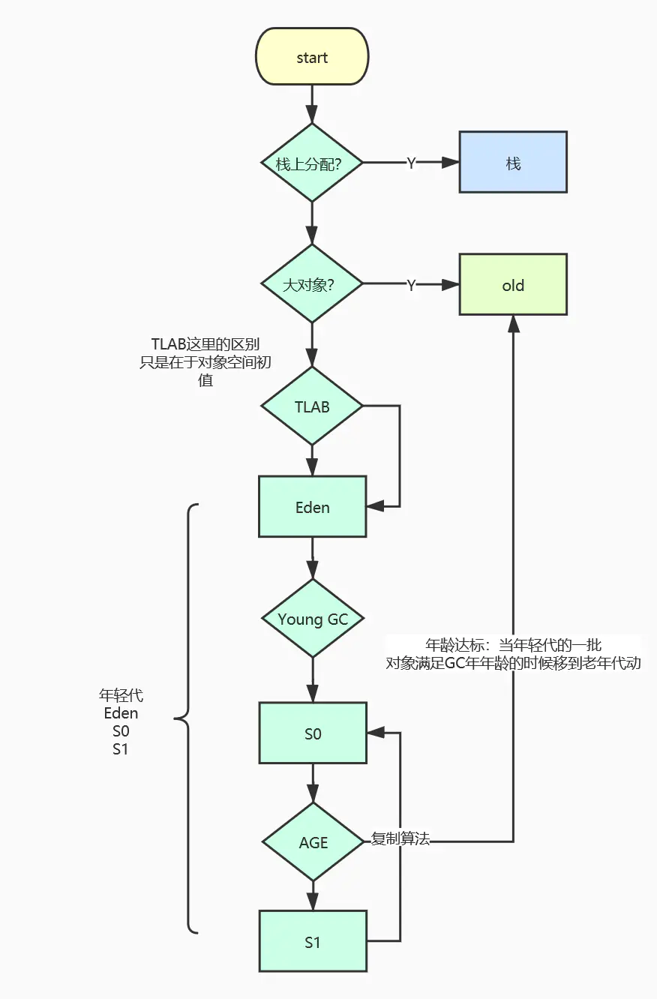

# JVM 的内存管理

## JVM 中的内存

JVM 是由 C 启动的，启动时会根据配置向操作系统直接申请一片空间，然后由程序自行管理，这部分内存就叫做**JVM内存（又或者叫做堆内存？）**。

另外在 Java 程序的执行过程自行申请的内存空间又被称为**直接内存或者叫堆外内存**。

 

**JVM 管理的内存是逻辑内存**，并不是实际在操作系统中的内存地址，随着 GC 的进行是可能发生变化的（收集-整理的 GC 算法下，整理时会移动对象到一片完整的内存，此时对象的实际地址就会发生变动。）

> 所有在调用 read/write 的时候，需要额外将 JVM 内的数据移动到直接内存，然后在调用系统调用，或者先写入到直接内存在移动到堆内。

## JMM（Java 内存模型）

JMM（Java 内存模型）就是 JVM 为了屏蔽底层不同硬件而定义的内存使用规则，JMM 中将内存分为主内存和工作内存，主内存所有线程共享，而工作内存由线程专有。

内存访问存在以下几种性质：

1. 原子性
2. 可见性
3. 顺序性

JMM 定义了八种原子性的指令：

1. lock / unlock
2. read / load
3. store / write
4. use
5. assign

另外还有　Happen-Before 原则用于辅助判断：

1. 管程锁定原则 - lock 肯定先于 unlock 执行
2. 程序次序原则 - 单线程下确保程序执行的相对顺序
3. 线程的开启，终止，中断原则
4. 传递性原则
5. volatile 原则
6. 对象终结（finalize()）原则

## JVM 的内存分区

JVM 的内存分区是逻辑上的概念，整体上可能还是一块内存。

按照是否线程私有来分，线程私有的区域如下：

1. PC - 程序计数器
2. Java 方法栈
3. 本地方法栈

共享的区域如下：

1. 方法区
2. 堆（Heap）

### PC - 程序计数器

指示的是当前执行程序的行号，每次执行完之后+1（指向下一条指令。

（**不确定内容**，猜测是根据方法栈栈顶方法确定所需要执行的指令地址，然后根据当前的计数器决定执行的方法指令行，因此在发生方法调用的时候 PC 置空；。

### Java 方法栈

Java 方法栈是 JVM 在执行 Java 代码的时候的主要结构。

Java 方法栈中最基础的结构就是栈帧，一个栈帧就表示一个方法，最底下的永远是 main 方法的栈帧，每次调用的时候会压入新的栈帧。

栈帧包含了以下几个成分：

- 成员变量表

保存方法参数以及内部定义的成员变量（以 Slot 形式）。

对于实例方法来说，表中第一个变量就是 this，指向当前实例对象。

- 方法返回地址

方法在结束的时候都需要返回被调用的地方。

方法的退出包含两种形式，一是正常的返回退出，而是二是异常退出。

正常退出时需要返回上层方法执行之前方法的后续流程，异常退出时需要将异常向上层方法抛出。

方法返回时的操作包含恢复上层方法的局部变量表和操作数栈，把该方法返回值压入调用者的操作数栈，调用程序计数器执行后面的指令。

- 动态链接 

Java 是支持动态分派或者说动态调用的语言，许多方法在最初并不知道最终的调用目标，因此只会在此处留下动态链接，最终调用时才会解析。

（动态链接就是符号引用，在类加载的时候部分可以确定的符号引用会直接被解析为直接引用，而部分不可确定的则作为动态链接保存。

方法的重载和重写就有此类区别。

方法的重载是指根据方法签名区分，相同方法名（不同于签名，签名包含参数类型）可以存在多个不同的方法，在类加载的时候根据调用的参数类型和数目就可以确定方法的直接引用此时就会被解析为直接引用（静态多分派）。

而重写就是继承并重新写方法逻辑，此时无法判断具体调用是父类还是子类，所以留下动态链接（动态单分派）。

- 操作数栈

所说的 Java 是基于栈执行语言，其中的栈就是指操作数栈。

Java 执行时的各种运算都是基于操作数栈实现的（区别于别的基于寄存器的语言。

Java 中实现一个简单的 c = a + b 的操作，会有如下几步操作：

1. 先将 a 取出并压入操作数栈
2. 将 b 取出压入操作数栈
3. 弹出栈顶两个元素相加，将结果压入操作数栈
4. 弹出栈顶元素赋值给 c

[R大的对栈式和寄存器式虚拟机的解释](https://www.zhihu.com/question/35777031)

### JNI 栈（本地方法栈）

用于执行 Native 方法的栈。

### 堆（Heap）

堆（Heap）是 JVM 中占比相当大的一块内存区域，大部分的对象都需要在堆中分配内存（少部分对象会有栈上分配的情况）。

堆同时也是 GC 的主要区域，-Xmx -Xms 等等都是对堆空间的设置。

[相关 GC 总结](../垃圾收集器.md)

### 方法区

方法区存储的就是方法的 Class 对象，但是 Java 中方法也是归属于某个类的，所以方法区中也是按照类保存的方法（类同时又按照 ClassLoader 保存）。

另外的方法区中保存了常量池，以及部分的符号引用。

Java 中提到的常量池可以分为文件常量池，运行时常量池，以及字符串常量池。

文件常量池就是 Class 文件中的常量，在相对靠前的文件区域会有 Pool，并使用数字来表示常量。

运行时常量池是在类加载的之后由文件常量池转化而来，字符串常量池则是 JVM 为了字符串复用而特地优化的。

 

Hotspot 虚拟机在1.8版本之后就完全取消了方法区的划分方法，转而改为元空间（Meta Space）。

元空间保存了原来方法区的 Class 类信息，而常量池和一些即时编译的代码则被移动到了堆中。

设立元空间的原因主要是方法区对 GC 的影响，原来的实现上方法区和堆实际上可能是相连的，分代垃圾收集的时候方法区也属于永久代，但是这块区域 GC 的效率非常低，不利于整体的 GC 效率，进行 Full GC 的时候也会拖慢整个 STW 的时间。

元空间的 GC 是独立的（不确定，CMS 好像可以参与元空间的 GC）。

## JVM 中的内存分配流程

start 表示对象的创建，类似 new Object()。

是否栈上分配需要考虑是否有引用逃逸（逃逸分析技术），分析过后如果没有逃逸现象，那么可以做以下优化：

- **标量替换**，将一个完整的对象分散为几个标量，标量可以简单理解为原始数据类型。
- **同步消除（锁消除）**，只被一个线程访问，所以该变量的同步可以消除。
- **栈上分配**，因为栈的对象随着出栈自动清理，所以栈上分配可以减少 GC 的压力。

对象首先尝试在 Eden 分配内存，不过为了避免多线程的内存争用，每个线程都有自己的 TLAB （Thread Local Allocation Buffer，默认仅仅占 Eden 区的1%，使用 ）。

| 参数                      | 作用                       | 默认值   |
| ------------------------- | -------------------------- | -------- |
| -XX:UseTLAB               | 是否开启线程本地内存缓冲区 | 默认开启 |
| -XX:TLABSize              | 缓冲区大小                 |          |
| -XX:+EliminateAllocations | 是否开启标量替换           | 默认开启 |

**上图涉及的是内存分配的流程，如果是 new 方法流程，那就需要从 ClassLoader 开始说起。**
