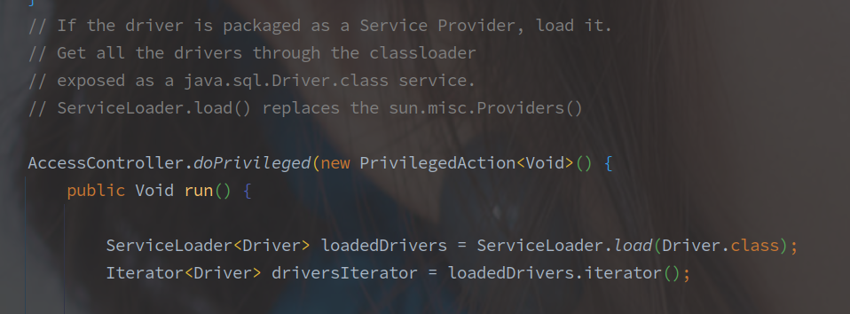
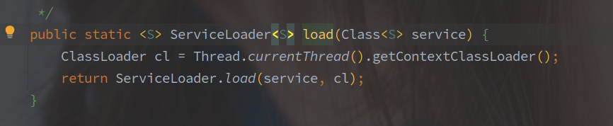

# JVM 的类加载子系统

## 概述

Java 的类加载子系统负责从网络或者本地文件等多途径获取以 .class 结尾的字节码文件，并解析成基本的 Class 类型。

加载子系统只负责类的加载，保证类的安全性，执行还是交给执行子系统的。

 

 

## 类加载的流程

**实际的类加载流程是交叉进行的，并不是线程执行，**比如加载到二进制流之后，验证就会开始文件结构验证。

 

- 加载

加载就是通过**类的全限定名**获取该类的字节码文件的二进制流，并将其转化为运行时的数据结构，也就是 Class 文件。

 

- 验证

验证是指对二进制流格式的验证，验证是否满足 JVM 的规范，是否会威胁到 JVM 自身的运行。

验证细分有以下四个部分：**文件结构验证，元数据验证，字节码验证，符号引用验证**。

在文件结构验证时候，二进制流就转化为了运行时数据结构，以后的验证都是对运行时结构的验证。

符号引用验证会在解析的时候执行。

 

- 准备

准备过程是给类变量分配空间的过程，并且回给类变量赋系统初值。

系统初值是指 JVM 默认的值，例如 boolean 类型默认会为 false 等。

 

- 解析

解析是对符号引用的解析，确保符号引用是全部有效，并将其转化为直接引用。

Class 文件常量池中就包含了一部分的符号引用。

 

- 初始化

初始化是执行 `<cinit>` 的过程。

`<cinit>`  就是从类文件中收集的包括静态初始化快，字面量初始化等等的语句。

> 有一个注意点就是静态初始化块是从上到下顺序执行的，并且先于构造函数的 <init> 执行。

 

 

### Class 加载的时机

1. 创建类实例对象的时候，通过 new，reflect 等途径 
2. 调用类的静态方法或者访问类的静态变量的时候
3. 初始化子类时发现父类未加载，会先加载父类

> 不全，代补充。

 

### Class 卸载的条件

1. 该类所有的实例都已被回收
2. 该类的 ClassLoader 已经被回收
3. 该类的 Class 对象没有在任何地方被引用

 

 

## 基本的类加载器

以上是 JDK 中提供的三种基础的类加载器。

- Bootstrap ClassLoader 

该类加载器使用 C 语言实现，和 JVM 绑定，用于加载 Java 核心库，例如 rt.jar 或者 bootstrap 目录下的依赖。

并且出于安全考虑，该加载器只会加载 java，javax，sun 开头的类。

- Extension ClassLoader

扩展的类加载器，使用 Java 语言编写，具体实现为 sun.misc.Launcher$ExtClassLoader。

用于加载 /jre/lib/ext 下的类库，以 Bootstrap ClassLoader 为其父类

- Application ClassLoader

应用类加载器，具体实现为 sun.misc.Launcher￥AppClassLoader。

用于加载 CLASSPATH 

 

 

## 基本的 ClassLoader 实现

> Class.forName 会触发类的初始化，但 ClassLoader.loadClass 不会。

> 非常重要的一点：
>
> **类优先由触发类加载的类所属的类加载器加载。**

 

 

## 自定义 ClassLoader 

 

 

## 热修复的 ClassLoader 的实现

 

 

## 双亲委派机制

Java 中推荐的使用的每一个类加载器都继承 AppClassLoader 类，该类是三大基本加载器之一。

 

 

### 双亲委派机制的实现原理

由 ClassLoader 的 loadClass 方法实现。

 

 

### 双亲委派机制的优势

 

 

## 线程上下文加载器

 

 

## 打破双亲委派机制的情况

 

 

### Tomcat 的类加载机制

 

 

### JDK 的 SPI 实现 - JDBC Driver 实现的加载

JDBC 的核心类定义在 Java 的核心库，由 Bootstrap 加载，但是三方的实现却是在 ClassPath 里，需要使用 Application 来加载。

在 Java 的核心类加载三方实现的时候默认就是从  Application 加载，此时就会出现 ClassNotFound。

 

**JDBC 就在采用的方法就是 TCCL (Thread Context Class Loader) 线程上下文类加载器。**

在核心类中获取当前线程中绑定的类加载器，由此优先高级别类加载器调用低级别类加载器的实现。

 

参考 DriverManager 获取 Driver 的实现。

首先该类的静态初始化块中就包含了 Driver 的类加载流程。

在 loadInitialDrivers 方法中调用了 ServiceLoader 的 load 方法：

而在 ServiceLoader 中就包含了对线程上下文类加载器的调用：

 

 

### Spring 的类加载机制

Spring 的类加载场景比较复杂，所以基本是统一采用 TCCL 来实现类加载。