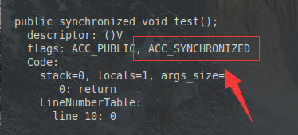
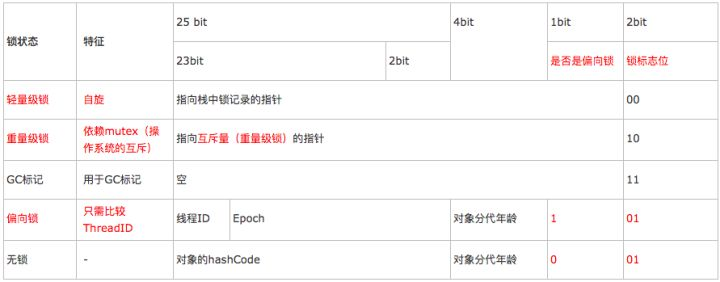
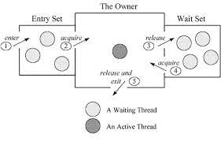

# synchronized

> synchronized 就是 JVM 提供的内置锁。

---

[TOC]

---

## 知识脑图


## 概述

synchronized 是 Java 提供的同步原语，背后是 Java虚拟机(JVM) 提供的 Monitor 机制。

> Java 中任何一个对象都可以作为监视器 (Monitor) 对象，因为 Monitor 是通过 C++ 实现的对于 Object 类的扩展机制，该对象保存了锁相关的数据结构，例如保存阻塞线程列表等。

synchronized 修饰的代码块只能由单个线程执行，以互斥锁的形式保证了其线程安全。

**synchronized 具有可重入性，单线程可以重复对一个对象上锁，而不会自我阻塞，但解锁还是一次性的。**

**synchronized 保证了程序的可见性和原子性以及有序性。<font size="2">(volatile只能保证可见性以及有序性，而无原子性)</font>**

**synchronized 不具备公平性，会导致饥饿，而使线程阻塞时间过长。**

> 饥饿就是指线程因为获取不到想要的资源而长时间不能执行。

另外和 synchronized 搭配使用的还有 wait()/notify()/notifyAll() 三个方法。

<br>

<br>

## synchronized的锁形式

`synchronized `有三种上锁形式，分别会对不同的对象上锁:

1. 修饰实例方法

   ```java
   // 此时的上锁对象为当前的实例
   public synchronized void syncMethod(){};
   ```

2. 修饰代码块

   ```java
   public void syncMethod(){
       // 此时上锁为lock对象.也可为Class对象 eg: lock.class
       synchronized(lock){}
   }
   ```

3. 修饰静态方法

   ```java
   // 此时的上锁对象为Class对象
   public static synchronized void syncMethod(){};
   ```

<br>

<br>

## synchronized的虚拟机层实现

synchronized 根据不同的上锁形式会有不同的实现方式。

1. 在修饰代码块时使用的是明确的 **monitorenter 和 monitorexit** 两个指令

    

    > 退出实际上是两次的，在方法执行完毕之后还会执行一次 monitorexit

    <br>

2. 在修饰方法(包括静态方法)时由方法调用指令读取运行时常量池方法中的  **ACC_SYNCHRONIZED** 隐式实现

      

<br>

<br>

## Mark Word

Mark Word  是  Java对象头 结构中除类型指针外的另一部分，用于记录  HashCode ，对象的年龄分代，锁状态标志等运行时数据。

> Java 的对象头包含了 **Mark Word，类型指针和对齐填充。**

下图中就比较清晰的展示了，不同情况下 Mark Word 的不同结构：



> Mark Word 相当于是锁的记录，查看 Mark Word 就可以确定当前 Monitor 锁的状态。<br>
>

<br>

## Monitor 监视器(管程)

Monitor 是虚拟机内建的用来实现同步的机制，原则上Java的每一个对象都可以作为 Monitor。

> `Monitor`的实现还是依赖于操作系统的`Mutex Lock`(互斥锁)来实现的，对于操作系统层面的实现不深究。
>
> 因为线程的阻塞，恢复以及 mutex 的调用等都涉及到用户态到内核态的切换，所以性能有限。



上图可以简单说明整个 Monitor 机制的工作方法。

Entry Set 存放所有竞争线程集合，Wait Set 存放所有的等待线程的集合。

> 都是用 Set 表示了，所以 synchronized 并不是公平锁，存在饥饿的情况。

进入同步代码块的时候，线程先加入到 Entry Set，如果获取到锁则变为 Owner，期间调用了 wait() 方法后，进入 Wait Set，调用了 notify() 之后回到 Entry Set 继续竞争锁资源，代码块执行完毕则会退出。

只有 Owner 代表的线程才可以执行标识的代码块，也就保证了锁的互斥性。

>Monitor 是以 C++ 实现的，虚拟机内建的互斥锁机制，Java中还可以使用 ReentrantLock 和 Condition 对象实现更加灵活的控制。
>
>Condition 中也有 await()/signal()/signalAll() 等配套方法。

<br>

<br>

## wait()/notify()/notifyAll()

>**以上三个方法都需要在获取到 Monitor 锁的状态下执行，也就是说在 synchronized 代码块中执行。**

以上三个方法都在 Object 类中声明。

> Class 对象也继承与 Object 对象，所以 Class 对象也能作为 Monitor 锁对象。

wait() 会释放当前的 Monitor 锁，并使线程进入 WAITING 或者 TIMED_WAITING 状态，在上图中就是进入到 Wait Set 中，另外 wait(long) 可以指定超时时间。 

notify() 会从当前的 Monitor 的 Wait Set 中唤醒一个等待的线程，notifyAll() 则是唤醒全部的线程。

>notify() 唤醒的线程会进入到 Entry Set，而不是直接获取到锁，当前线程也不会直接释放锁。
>
>所以如果通过 wait() 阻塞的线程重新执行时候需要重新判断执行条件。

<br>

<br>


## synchronized的优化<font size="2">(HotSpot)</font>

JDK1.6  之前  synchronized  一直为重量级锁，直接使用互斥锁阻塞线程，也就导致了一定的性能问题。

> 性能问题主要来源于线程状态的切换，以及用户态和内核态之间的来回切换。

HopSpot  在  JDK1.6 之后加入了**偏向锁，自旋锁，自适应自旋锁，轻量级锁等优化**.

锁级别从低到高依次是：无锁状态、偏向锁状态、轻量级锁状态和重量级锁状态，**绝大多数情况下，锁可以升级但不能降级。**

<br>

### 锁的转换关系


- 我觉得上图已经很好的展示了几个状态之间的转化，就不在赘述了.<font size="1">(估计也讲不好)</font>

<br>

#### 偏向锁相关问题

和群友讨论的时候发现的问题:**如果使用了偏向锁，那么势必会占据 MarkWord 中 HashCode 的位置，那么此时的 HashCode 又保存在哪里？**

在以下的文章中看的了答案，简单来说就是:

- HashCode 和偏向线程Id并不会共存，且 HashCode 的优先级高于偏向线程ID
- 如果处于偏向锁时，计算了 HashCode，那么锁会直接膨胀为重量级锁或者轻量级锁。
- 如果存在 HashCode ， MarkWord 即为不可偏向状态。
- 因为轻量级锁会将 Mark Word 复制到虚拟机的栈帧，所以轻量级锁和 HashCode 是可以共存的。

> 并不是十分确定。

<br>

### 自旋锁 & 自适应自旋锁

引入自旋锁是因为在很多时候线程并不会长时间持有锁，此时使用  Metux 阻塞线程没过一会儿又唤醒就得不偿失。

> **自旋锁就是一个循环，在等待持有锁的线程释放锁的过程中，不阻塞线程而让线程处于一直循环尝试获取锁的状态，从而避免了线程切换，阻塞的开销。**

自旋锁在自旋的过程中也会占用一部分的 CPU 时间，若一直无限制自旋也会白白浪费 CPU 资源，所以在此基础之上又引入了**自适应自旋锁**.

自适应自旋锁是对自旋锁的优化，**为自旋的次数或者时间设定一个上限，若超过这个上限一般会选择挂起线程或别的操作.**

<br>

### 锁消除

锁消除就是**在逃逸分析技术的支持下**，消除非公用资源的上锁步骤，从而提高性能。

```java
public void test(){
    StringBuffer s = new StringBuffer();
    String a1 = "CheN";
    String a2 = "bXxx";
    s.append(a1);
    s.append(a2);
}
```

如上面这段代码展示，其中 StringBuffer 类是线程安全的，方法都会有 synchronized 修饰，所以最少也会有偏向锁的机制在发挥作用，但 a1 和 a2 的作用域就在 test 方法中，完全不会逃逸到方法体外，也不会引起线程安全问题，此时甚至偏向锁都显得很没必要。

<br>

### 锁粗化

在一段代码中，若同步区域被限制的过小会导致线程频繁的进行锁的释放和获取操作.而此时锁粗化的作用就出来了，**虚拟机探测到该类情况会直接将锁的同步区域扩展到整个操作的外部**，从而消除无谓的锁操作。

```java
for(int i = 0;i < 10;i++){
    // 此时虚拟机会直接将锁的范围扩展到循环之外
    synchronized(this){
      	doSomething();
    }
}
```

<br>

<br>

## 相关文章

- [深入理解Java并发之synchronized实现原理](https://blog.csdn.net/javazejian/article/details/72828483)
- [Java并发——关键字synchronized解析](https://juejin.im/post/5b42c2546fb9a04f8751eabc)
- [HashCode和偏向锁](https://blog.csdn.net/saintyyu/article/details/108295657)
- [synchronized的源码级理解](https://mp.weixin.qq.com/s?__biz=MzkxNTE3NjQ3MA==&mid=2247488192&idx=1&sn=85fa12be29fef85d41c571b2c853de5d&chksm=c1627fb9f615f6af30d979b3e69bd7223e9e5e3e801a59f12cd492d00ea32623d55177f5e523&mpshare=1&scene=24&srcid=03027ZCVnPeq49L3bb4hjg9z&sharer_sharetime=1614644481827&sharer_shareid=22f066e400946fcffb59089626c6a1f2#rd)
