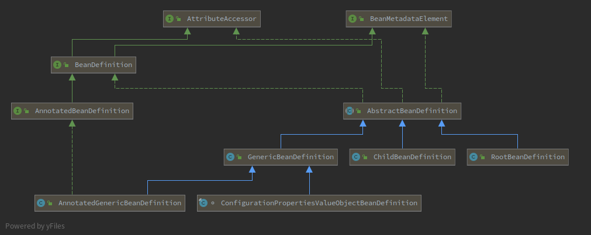
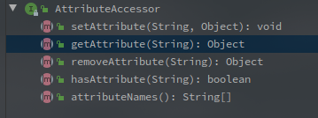
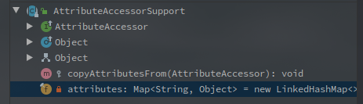
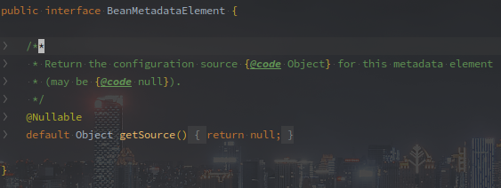
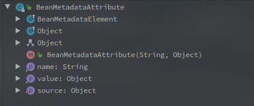
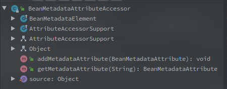
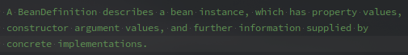
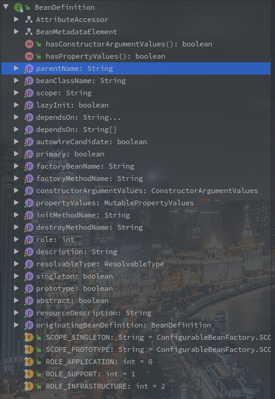
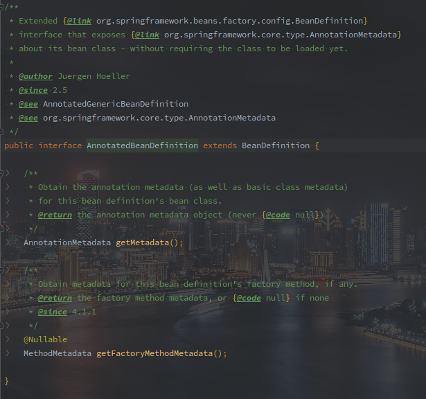
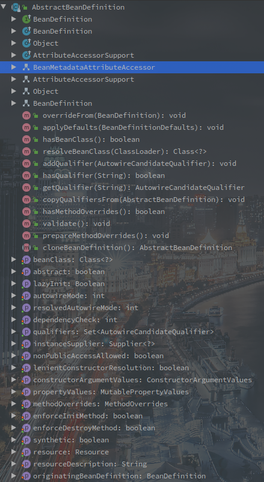

# BeanDefinition类族简介

> BeanDefinition即为Bean定义，是IOC容器的基本族类，每一个Bean对象都会有一份BeanDefinition，保存其基本信息。

- 如下是BeanDefinition主要的类图：

Spring真的是面向对象的典范啊，接口分得很细（乱，多，杂）。

简单介绍，整体掌握整个类族，对于单个类不会有过多描述。

<!-- more -->

---

[TOC]

## AttributeAccessor 接口

**属性访问接口，声明了对Attribute的访问方法。**

 

### AttributeAccessorSupport

Spring中的惯例，XXXSupport类基本都是相关的基本功能实现类。

AttributeAccessorSupport就是AttributeAccessor的简单实现。

 

AttributeAccessorSupport中使用了LinkedHashMap保存了对应的attribute。

算是定下了Attribute的具体保存方式。

## BeanMetadataElement 接口

Bean的元数据获取接口。

该类只提供了一个方法，获取当前BeanDeinition的数据源。

 

### BeanMetadataAttribute 

BeanMetadataElement的基础实现方法。

 

该类中定义了name，value，source等基本成员变量。

## BeanMetadataAttributeAccessor - BeanMetadataElement和AttributeAccessor的集成类

 

该类继承了AttributeAccessorSupport，又实现了BeanMetadataElement，是两者的集成实现。

**提供了Object的成员变量，用来保存配置源。**

另外也提供了

## BeanDefinition 接口

BeanDefinition定义了基本的Bean信息。

Spring中的Bean信息都会BeanDefinition的对象的形式保存，一个BeanDefinition对应一个Bean。

BeanDefinition的类注释如下：

 

一个BeanDefinition对象描述了Bean的实例，属性值，构造的参数值，以及其他信息。

以下是所有BeanDefinition的方法和变量图：

 

可以看到BeanDefinition同时继承了AttributeAccessor和BeanMetadataElement接口。

并提供了属性的SetXXX方法。

其中的属性包括：

1. Bean名称
2. 父类Bean名称
3. 是否懒加载
4. 依赖bean
5. 是否Primary
6. 作用域
7. 等

BeanDefinition可以说是Spring中蛮基础的一个类了，Bean的创建过程中也会依据BeanDefinition的属性进行各种配置。

## AnnotatedBeanDefinition 接口 - 注解性BeanDefinition

AnnotatedBeanDefinition是BeanDefinition的扩展，直接继承了BeanDefinition。

此类中声明了获取AnnotationMetadata的相关方法。

 

## AbstractBeanDefinition - 抽象的BeanDefinition

也是BeanDefinition接口的子类，实现了一个基本的方法，并添加了包括Qualifier在内的一些属性配置，和工具方法。

 

## GenericBeanDefinition - 泛型的BeanDefinition定义

相较于AbstractBeanDefinition抽象类，该类声明了成员变量`parentName`