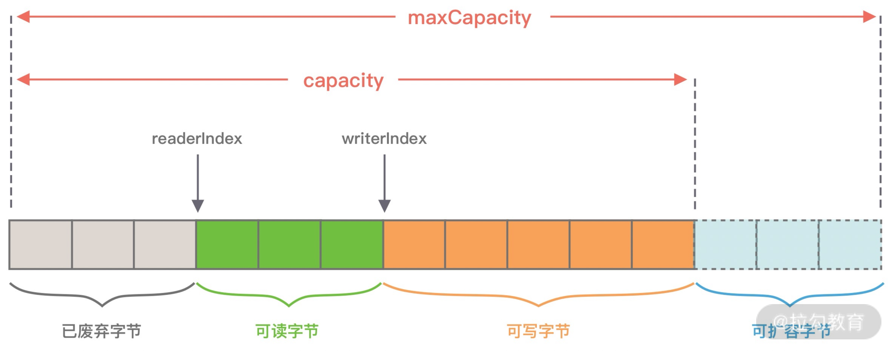

# ByteBuf

## ByteBuffer

JDK 原生的 ByteBuffer 创建的时候分配的内存就是固定的，无法动态缩扩容，并且 API 是真他娘的复杂（还要 flip 啥的，妈哟）。

Netty 针对 ByteBuffer 改进了其复杂的 API：

- 容量可以按需动态扩展，类似于 StringBuffer；
- 读写采用了不同的指针（readIndex 和 writeIndex ），读写模式可以随意切换，不需要调用 flip 方法；
- 通过内置的复合缓冲类型可以实现零拷贝；
- 支持引用计数；
- 支持缓存池。

ByteBuffer 中包含的指针：limit，capaity，mark，position

ByteBuf 中的指针：readIndex，writeIndex，capaity，maxCapacity

## CompositeByteBuf