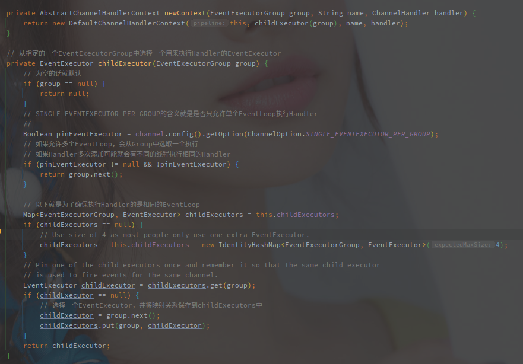

# ChannelOption配置项整理

## SINGLE_EVENTEXECUTOR_PER_GROUP

该配置作用于Pipeline#addLast等方法。

**配置了该方法之后，每个Pipeline只能从指定的EventExecutorGroup中获取到特定的EventExecutor，相当于变相的绑定关系。**

以下是DefaultChannelPipeline#newContext的源码:

**在ChannelHandler添加到Pipeline之前都会将其包装为一个ChannelHandlerContext。**

如果该配置项为false，会直接从group中选取任意一个EventExecutor。

举例来说，比如如下场景，希望使用一个Group去执行Pipeline中多个Handler：

如果配置为false，那么可能就会由Group中不同的Executor来执行，这是不推荐的，因为还存在着线程上下文切换的问题。

但配置为true之后，首次addLast方法就会将选择的线程保存在一个Map的缓存中，键是EventExecutorGroup，值就是选择的EventExecutor，以后每次都会选择这个缓存的EventExecutor，也就是指定的Handler都会由Group中的单个线程来处理，减少了上下文切换的消耗。

为什么只能选择单个的EventExecutor原因不明？

因为每个Pipeline对应的一个Channel的IO事件或者业务逻辑，Pipeline本身的执行就是串行的，不存在并行处理任务的情况。