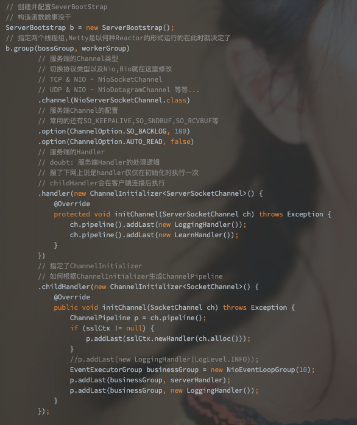
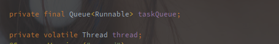
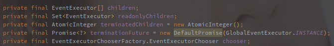
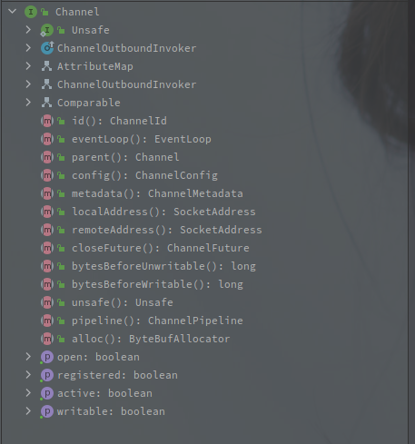
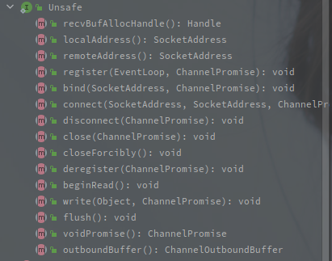
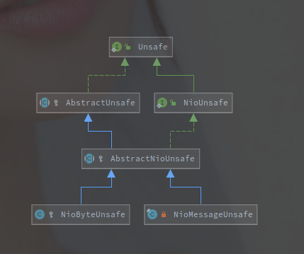
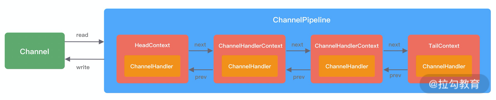

# Netty组件概述

>  基于4.1.53.Final版本

## 脑图

Netty 是用 Java 实现的高性能网络框架，它所做的事情基本就是对 Java 原生API的再次封装和扩展。

以下对Netty中涉及的各类组件进行一个系统性的概述，不会涉及很深。

---

[TOC]

## Bootstrap

Bootstrap 是 Netty 引导类，**负责整合其他的相关组件并对外提供服务**，利用 Bootstrap 可以快速地拉起一个服务。

**在 Netty 中，ServerBootstrap 提供服务端功能，Bootstrap 提供客户端功能。**

以上是服务端 ServerBootstrap 的创建样例，包含了以下的配置内容：

- EventLoopGroup - 通过 EventLoopGroup 的配置，可以确定服务端的 Reactor 模型。
- Channel - 通过不同的 Channel 确定服务端的传输层协议以及对应的基础实现，比如 NioServerSocketChannel 就表示底层使用的 TCP 协议并且使用 Java Nio 体系
- Option - 表示对底层协议的配置，比如半连接，全连接队列大小，是否对连接保活（Keep-Alive）等等
- Handler - 表示 Reactor 模型中 Boss 线程的执行流程，发生在连接的初始阶段（响应 Accpet 事件
- ChildHandler - 表示 Reactor 模型中 Worker 线程的执行流程（响应 Read/Write 事件

ServerBootstrap 中持有了父子 Channel 的C hannelOption 以及 AttrbuteMap 集合。

  

ServerBootstrap和Bootstrap的类图也非常简单，不做介绍了。

## EventLoop & EventLoopGroup

EventLoop就是事件轮询器，而EventLoopGroup就是多个EventLoop的组合。

对于一般的服务端程序来说，会创建单个EventLoop的BossEventLoopGroup负责接受客户端连接请求，由多个线程的WorkerEventLoopGroup来负责IO读写的操作，另外的业务线程执行一些容易阻塞的业务逻辑(新版本可以直接使用JDK的线程池)。    static final SelectStrategy INSTANCE = new DefaultSelectStrategy();

以下是NioEventLoop的基本类图，以此来分析整个NioEventLoop的作用。

 		

根本上，EventLoop还是继承自JUC中的Executor接口，所以也就具有了**执行任务(Runnable)**的功能。

NioEventLoop直接继承自SingleThreadEventLoop，SingleThreadEventLoop提供了低级别任务的集合实现。

往上的SingleThreadEventExecutor则是实现了完整的执行器逻辑，持有具体的任务队列，以及Thread对象。

再往上一层的AbstractScheduledEventExecutor，持有的是一个优先级队列，以任务的执行时间为排序依据，实现的是定时任务。

从上往下可以说，**NioEventLoop已经具有了多个任务执行模式，定时任务，普通任务以及低级别任务。**

​		 

上图是NioEventLoopGroup的类族结构。

发现NioEventLoopGroup和NioEventLoop继承了基本类似的JUC原生接口，所以NioEventLoopGroup也会有类似于NioEventLoop的API方法。

MultithreadEventExecutorGroup抽象类提供了对子类的组合以及选择功能，以下是类中的成员变量:

有数组和Set两种形式保存EventExecutor，再通过EventExecutorChooser来选择。

上面说的就是Netty中常见的一种代码结构，组合和继承。

例如EventLoopGroup中保存了EventLoop的集合，并和EventLoop继承相同的父类，然后EventLoopGroup中的实现就是选择集合中其中一个的EventLoop并调用一样的方法。

以下是AbstractEventExecutorGroup的默认实现，可以很清楚的看到这种实现形式。

next方法就是对Group中单个NIoEventLoop的选择方法，很显然Group的执行逻辑就是选择已有的EventLoop指派执行。

从这种层面可以验证，Group就是对多个NioEventLoop的整合和管理以及任务的分派，类似于线程池中ThreadPool和Worker的概念。

## Future

> Future是Netty基于JDK的Future接口扩展实现的异步接收接口。

Netty中所有 IO 都是异步的，所以作为**异步结果的接收类**，Future也是相当重要的。

下图就是 Netty 中 Future 的大部分类族。

Netty 中并没有直接采用 JUC 中定义的 Future，因为原生的接口有些简陋，所以Netty自定义了一个Future。

 

以下是 Netty#Future 的方法列表:

从以上的方法可以很明显的看出Netty的Future接口比原生接口多实现的地方。

1. **增加了方法回调功能**
2. **增加了等待方法（可以把异步操作转化为同步**
3. **对任务是否可取消的配置**

 

### Promise

Promise 直接继承了 Future 接口，但是和 Future 不同的是 Promise 提供了在异步测对结果设置功能。

在使用上，如果一个方法返回 Future 供调用者判断是否执行成功或者添加监听器，而方法侧创建的可能就是 Promise，并且通过 Promise 来实现和调用者的交互。

需要注意的是了**理论上 setFailure()和setSuccess() 方法只能执行一个（你要是可以修改结果也可以。**

 

### ChannelFuture

**对于ChannelFuture，主要是增加了Channel的绑定方法，用于Channel相关的异步操作。**

ChannelFuture 的注释中提供了对应不同的完成阶段验证的方法。

如图中所示，如果 Future 对应的事务执行成功，isDone和isSuccess 都为 true，失败的话 isDone 为 true 但是 cause 不为空。

另外注释中还说了 Netty 开发过程中特别要注意的点，就是在 ChannelHandle 的方法中切勿直接调用 await 方法，该种代码大概率会造成死锁，而导致整个 Pipeline 失效。

类族中的 CompleteFuture 以及 SuccessedFuture 和FailedFuture 都是特定状态下的 Future，不关心结果，但方便用来设置方法回调。

最后还有 ChannelPromise，也就是 Promise + Channel。

> 异步方法返回的是 Future 引用，可以返回 Promise，然后在结束之后设置结果，或者替换引用。

## Channel

> Channel 指的是 io.netty.channel.Channel，而不是 JDK 原生的 Channel。
>
> 以下内容没有特指都是 Netty 的 Channel。

**Channel 在 Netty 中是实际连接（Socket）的抽象，是网络通信的载体，集成了基本的网络读写等操作。**

Netty 中对于服务端和客户端也有不同的区分，例如 NioServerSocketChannel 和 NioSocketChannel 分别对应服务端和客户端。

相对于 JDK 原生的 Channel，Netty 自定义的 Channel 会承担更多的职责。

以上是 Netty#Channel 的方法和变量表。

首先 Channel 类中包含了一个 Unsafe 的接口，里面定义了 bind，register 等偏向底层的操作，是作为上层业务开发人员不需要去管的地方（包含的都是底层逻辑。

其次它继承了 AttributeMap，也就获得配置属性的方法。 

另外实现了 ChannelOutboundInvoker，表明 Channel 可以用来触发各类出站事件。

 

Channel每个实际的Channel中都包含一个Unsafe的实现，以下是Unsafe接口的API部分:

看到的都是和JDK底层实现有关，包括 Channel 到 Selector 的注册，本地端口的绑定，远程服务的连接。

以上是 Unsafe 的部分类图结构，主要是 Nio 部分，NioMessageUnsafe 主要用于服务端的 Channel 实现，例如NioServerSocketChannel，而 NioByteUnsafe 主要是客户端 Channel 的实现，例如 NioSocketChannel。

## ChannelHandler

##  ChannelPipeline

**ChannelPipeline 是 Netty 中核心的编排组件，负责协调管理各种 ChannelHandler（就当作是 ChannelHandler 的集合。**

ChannelHandler 并不是直接作为 ChannelPipeline 的成员而存在的，在添加到 ChannelPipeline 中时会被包装为 ChannelHanlderContext。

ChannelHandlerContext 之间组成了双向链表，也包含了当前 Handler 执行的线程池。

ConnelHandlerContext 中包含了 ChannelHandler 生命周期的所有事件，包含 connect，bind，read，flush，write 等。

## Netty相关流程

