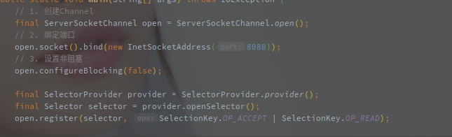

# NIO服务端启动流程

> 本文主要介绍Netty NIO服务端的启动流程。
>
> 会忽略一些异常以及一些中间代码，主要希望总结整个启动的步骤和流程。

[TOC]

---


## 概述

Netty 是对 JDK NIO 的进一步封装和扩展，所以Netty服务端的启动流程是基本保持Nio的模式不变，两者可以相互对照来看。

以下是原生的Nio服务端启动代码(最最简单的版本):



总体步骤可以分为以下几步：

1. 创建并配置服务端Channel
2. 绑定端口
3. 创建Selector
4. 将Channel注册到Selector


**在EventLoopGroup的初始化流程中，创建EventLoop的过程就会通过SelectorProvider生成一个Selector，**相当于提前生成了Selector，所以剩下的就是Channel的创建，初始化以及注册。


## 源码分析

以下是整体的Netty Nio服务端启动流程:


整个启动流程可以简单分为以下两步:

1. 初始化Bootstrap
2. 绑定端口


### 初始化Bootstrap

Bootstrap是Netty中的引导类，可以帮助用户快速配置并拉起一个服务。


以下是一些常用的配置方法:

- **group - 配置工作线程池**

该方法**传入至少一个EventLoopGroup用于处理Channel上的IO事件。**

一般来说，第一个用于响应请求，建立连接，可以采用单线程方式，第二个用于处理子Channel的IO事件，当然也可以只指定一个EventLoopGroup用于所有IO事件。

**EventLoop在创建的时候就会通过SelectorProvider创建一个Selector对象。**


- **channel - 配置服务端Channel类型**

**该方法的作用是指定服务端本地Channel的类型**，利用该方法可以很方便的切换UDP和TCP协议。

例如将NioServerSocketChannel替换为NioDatagramChannel，就可以从TCP服务端转化为UDP服务端。


- **option - 服务端Channel的配置项**

**该方法用于配置TCP的基本参数。**

例如图中的SO_BACKLOG，就是配置TCP的半连接队列长度，另外的还有SO_KEEPLIVE，SO_SNDBUF等配置参数。


- **childHandler - 配置针对子Channel的业务逻辑**

**该方法用与指定ChannelPipeline中前后的业务逻辑。**

因为不能多次调用，所以如果需要配置多个ChannelHandler，就需要拼装成一个ChannelInitializer来实现。


> ServerBootstrap相当于一个启动器，可以通过简单的配置启动一个可用的TCP服务端。

> Option中包含了很多TCP的底层参数，包括KEEPALIVE之类的，能起到非常关键的作用。

> 在addLast中有一个可选参数，可以选择与一个EventLoopGroup，这个就相当于业务逻辑的线程池，区别于Accept和IO线程池。


### 绑定端口


说是绑定端口，但是该方法中包含了Channel的创建和初始化以及注册的逻辑。Bootstrap的bind方法在经过简单的验证之后就会调用到AbstractBootstrap的doBind方法，具体的源码如下：


接下来细致的看一下流程代码。

#### 1. Channel的创建

在initAndRegister中，首先就对ServerSocketChannel进行了创建。

```java
    final ChannelFuture initAndRegister() {
        Channel channel = null;
        try {
            // 创建新的Channel,根据ChannelFactory不同获取不同的Channel
           // channelFactory就是通过Bootstrap创建时的channel设置的
            channel = channelFactory.newChannel();
            
    ...
    
        
```

通过ChannelFactory.newChannel创建了服务端的SocketChannel，这里的ChannelFactory就是在ServerBootStrap创建过程中定义的。


如上，最终生成了`ReflectiveChannelFactory`的工厂类。

另外`channel`方法中的参数Class也指定了服务端Channel的具体类型，再通过ChannelFactory反射生成，所以说在Netty中TCP和UDP的协议转换非常简单。

以下是ReflectiveChannelFactory的工厂方法:


接下来还有NioServerSocketChannel的初始化流程，通过反射调用后了对应的构造函数，以下就是NioServerSocketChannel的无参构造。


**最主要的就是通过SelectorProvider创建了Channel对象**，之后再以Channel为参进一步调用构造函数。


这里值得注意的是初始化参数中带上了`SelectionKey.OP_ACCEPT`，以下是AbstractNioChannel的构造函数。


这里将NioServerSocketChannel中传入的`SelectionKey.OP_ACCEPT`赋值给了`readInterestOp`。

`readInterestOp`就表示Channel的读事件，表明是是Channel需要专注的事件。

NioServerSocketChannel负责接收客户端连接，而不是一些IO事件的处理，所以此处传的是Accept，如果是ServerSocketChannel就变成了`SelectionKet.OP_READ`。


还有一个重点就是，**在这里将channel设定为了非阻塞模式！！！**

阻塞模式下的Channel在accept之后会阻塞等待客户端的连接，明显不符合Netty异步事件驱动网络框架的定位。


##### 1.2 对于服务端Channel创建的总结

> Channel类型在Bootstrap的channel方法中指定

在创建ServerBootStrap的时候指定的channel，会以此Class对象为参数，创建一个ChannlFactory对象，以此创建服务端的Channel。


> NioServerSocketChannel创建之初就是非阻塞的，并且已经指定了对应的读事件


#### 2. Channel的初始化

服务端Channel(NioServerSocketChannel)创建完成之后的初始化。


初始化一共涉及以下的流程:

1. 配置ChannelOptions
2. 配置Attributes
3. 添加服务端Channel的ChannelHandler

重点在第3步，首先是从Bootstrap中捞出配置的Handler，之后还会增加了一个`ServerBootstrapAcceptor`的Handler。

> 这个ServerBootstrapAcceptor非常关键，它用于响应OS_ACCEPT方法，并创建Channel，以及注册到对应的WorkerGroup中。

> 到目前位置都是同步执行的，Channel也咩有绑定到某个EventLoop上进行监听。
>
> 之前创建的EventLoop也咩有启动。

至此ServerSocketChannel已经初始化完成，再来就是注册流程了，将生成的Channel注册到EventLoopGroup中

#### 3. Channel的注册

这里说的注册到EventLoopGroup是指从中挑一个EventLoop注册，将创建好的ServerSocketChannel绑定在EventLoop的Seletcor上。


以下是#register()的源码


next()方法就是从EventLoopGroup管理的EventLoop中选一个，具体的选择逻辑在EventExecutorChooser中实现。

**返回值是ChannelFutures类型就表明Channel的注册流程是异步的。**

最终register会调用到AbstractChannel$AbstractUnsafe#register(EventLoop,ChannelPromise)


这个方法整个的重点就是进一步调用register0方法，但是有意思的是它调用前的判断。

Callback pending如果当前线程为EventLoop就直接调用，否则通过EventLoop执行最终的注册流程，这里就体现了Netty的一个执行原则：**Channel相关的事件都由Channel绑定的EventLoop执行。**

> 注意这里是服务端启动以来第一次调用EventLoop.execute方法。
>
> 首次调用该方法会调用doStartThread方法，开启EventLoop的轮询流程，执行run方法的逻辑。
>
> 相当于EventLoop中的线程也是懒(延迟)启动。


再来看register0方法：


`doRegister()`方法是个模板方法，真实的注册逻辑会延迟到子类实现。

以下是`doRegister()方法`在AbstractNioChannel的实现:


这里的注册就是将Channel注册到Selector上，**参数0表示此时并不会关注Channel上任何的事件**。

> 这里有一个细节，就是注册的时候会带上当前对象(NioServerSocketChannel)作为attribute。
>
> 即之后可以通过channel.get()方法获取到NioServerSocketChannel对象。


注册成功之后调用了DefaultChannelPipline#invokeHandlerAddedIfNeeded方法，该方法用于拼装Pipeline的整个业务链表。

方法的作用就是在首次注册的时候完成Pipeline的拼装，也就是调用延迟的handlerAdded方法。

> 这里必须要先完成组装的原因是因为后面就要触发ChannelRegistered事件了，可能需要调用到内嵌的ChannelHandler的逻辑。

之后是设置Promise为成功，并触发`ChannelRegistered`事件。

如果首次注册还会额外触发`ChannelActive`事，如果不是首次触发，并且配置中开启了`AutoRead`选项(ChannelIOption.AUTO_READ)，则直接调用beginRead()方法，开始接受请求。

beginRead方法会一步步调用到AbstractNioChannel的doBeginRead方法:


该方法就是为注册到Selector的SelectionKey增加`readInterestOp`的值。

`readInterestOp`是构造函数中传入的从NioServerSocketChannel的构造函数中指定的`SelectionKey.OP_ACCEPT`。


以上就完成了Channel的整个创建，初始化并注册流程，逻辑不复杂，但是调用的链路真的多。

返回的一个ChannelFuture实际就是为了传递Channel。


#### 4. 真实端口绑定

Channel创建之后就需要绑定本地的端口。

**bind事件在Netty中被定义为出站事件，相关API在ChannelOutboundInvoker定义。**

以下是doBind0()方法的源码:


会调用Channel绑定的EventLoop来执行绑定的事件，经过AbstractChannel#bind() -> DefaultChannelPipeline#bind() -> AbstractChannelHandlerContext#bind()的调用链。

以下是AbstractChannelHandlerContext中的bind方法，也是bind事件的响应处理方法:


findContextOutbound方法就是找到下一个含有bind方法的AbstractChannelHandlerContext。

简单提一句，ChannelHandler最终会被包装成HandlerContext存放在Pipeline的双向链表中，通过掩码MASK的方式确定各自实现的方法。

在这里，整个事件从TailContext传递到HeadContext，并在HeadContext完成最终的绑定，此时如果我们有自定义的outbountHandler完全可以将bind事件拦截下来。

以下是HeadContext的bind方法源码:


不出意外的是还是借用unsafe完成相对比较底层的操作，以下是AbstractChannel$AbstractUnsafe的bind方法:


源码中的doBind方法是个模板方法延迟到了子类实现，最终Channel的子类自然是NioServerSocketChannel。


也就是根据JDK的版本选择不同的绑定方式，到此就完成了端口的绑定。

## 总结


> 端口绑定流程，在ServerBootstrap初始化完毕之后，ServerBootstrap如何快速建立起服务


整个服务端的启动流程步骤如下:

1. 创建对应的EventLoopGroup

   EventLoopGroup会自行去创建EventLoop，对于每个创建的EventLoop都会创建各自的Selector。

   此时EventLoop对应的线程并未开启，对Selector的轮询也并未开始，但各自的线程都已经准备好了。

   默认的EventLoopGroup会创建两倍CPU个数的线程。

2. 初始化Bootstrap

   指定两个EventLoopGroup，ChannelOption，ChannelHandler等服务端配置。

3. 创建Channel

   Channel是根据Bootstrap中的配置，通过反射创建的，创建之后就会设置为非阻塞模式

4. 初始化Channel

   包括ChannelOption的配置，以及父子Channel的Handler配置。

5. 注册Channel

   这里的注册是指注册到EventLoop绑定的Selector中，并触发ChannelRegistered事件。

   注册的事件，EventLoopGroup会选择一个EventLoop并调用EventLoop的executor方法，首次调用executor方法也就开启了对Selector的轮询。

6. 绑定本地端口

   绑定完本地端口成了最后的事情，绑定成功之后就可以监听对应端口的事件。


> 注意一个点，在服务注册之前对应的线程池EventLoopGroup是没有启动的。
>
> 在第一次执行executor方法之后线程才被启动。