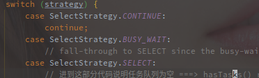
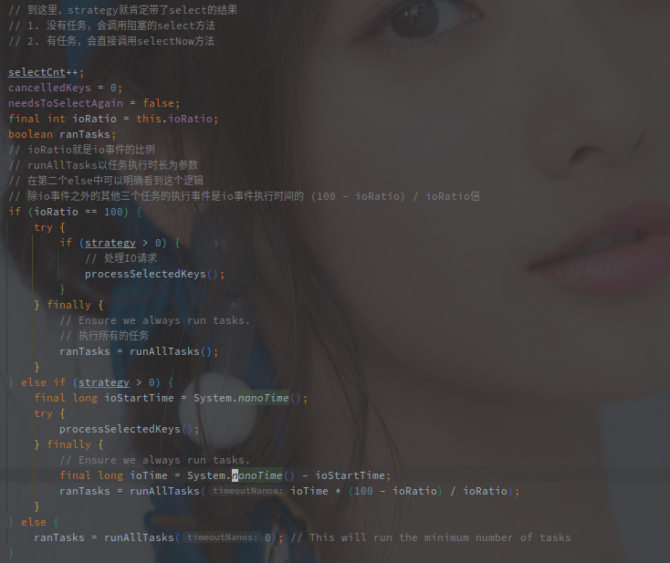
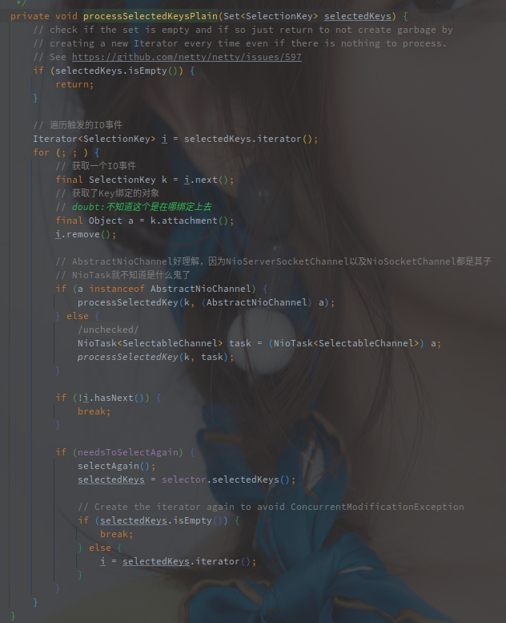
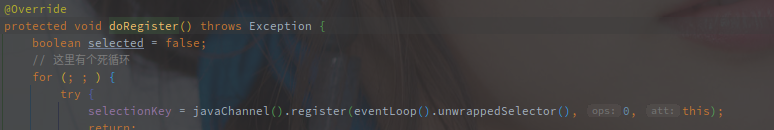

# NioEventLoop的事件轮询

> 以NioEventLoop为例子，分析EventLoop对Channel事件的处理流程。
>

[TOC]

---

## 概述

NioEventLoop 是 Netty 中事件轮询器，负责处理 Netty 框架中产生的一些 Event。

> 这里的事件处理机制可以类比于 Redis 的事件处理器，不过 Redis 毕竟是单线程处理事件比较简单。

**Event 包括 Selector 产生的 I/O 事件，以及直接对类提交的任务。**

<br>

例如，NioEventLoop 在初始化的时候就会绑定一个 Selector 对象，而 NioServerSocketChannel 在初始化之后会直接被绑定在 NioEventLoop 上，并监听 Accpet 事件。

NioEventLoop 自身只会绑定单个线程，所以线程的轮询以及对事件的处理在无额外配置的情况下都是单线程执行的。

另外 NioEventLoop 本身也属于 ExecutorService 类族，所以也可以用通过 submit  以及 schedule 等方法提交任务执行。

<br>

>简单来说，**EventLoop 就是 Netty 中的事件轮询器，它持有 JDK 原生的Selector的引用，并且负责其上就绪的所有 IO事件，同时作为执行器和线程池可以提交并执行各类任务。**

<br>


## EventLoop的结构

以上时 NioEventLoop 的类图：


NioEventLoop 继承了 SingleThreadEventLoop 类，所以是**绝对单线程结构**。

另外，NioEventLoop 存在如下四种类型的任务：

1. 延时任务，这个是在 AbstractScheduledEventExecutor 中提供的 scheduledTaskQueue
2. 正常任务，这是 SingleThreadEventExecutor 中提供的 taskQueue
3. 低优先级任务，这是 SingleThreadEventLoop 中提供的 tailTasks
4. Selector 触发的 IO 事件

> 注意，Nio的轮询逻辑不仅仅包含了Selector的IO事件的处理，还有以上三级任务的处理。
>
> 延时任务会在到期之后转入正常任务队列，ioRatio 控制了正常任务和 IO 事件的执行比例，低优先级任务不受 ioRatio 影响会被全部执行。


## EventLoop什么时候开启轮询

**NioEventLoop 采用的是懒开始的策略，只有在执行第一次任务的时候才会开启线程**。

以下是 EventLoop 实现的几种 execute 方法:


在最后一个 executor 方法中，会先调用 addTask 添加任务到 taskQueue。

再判断 EventLoop 事都是当前线程，如果不是当前线程则会调用 startThread 方法开启线程，因为 startThread 方法会多次被调用，但是线程不能被多次开启，所以方法内部应该是会有相应的判断限制。

以下是 startThread 的源码:


好像是的，只有EventLoop的状态为`ST_NOT_STARTED`的时候才会替换状态为`ST_STARTED`，然后继续进一步线程启动调用。

doStartThread方法很长，这里直接去catch之前的部分。


就是直接调用的当前类的run方法，调用的形式是`SingleThreadEventExecutor.this.run()`。


确定了EventLoop是在第一次调用executor方法的时候开启的线程，那么什么时候会首先调用executor方法呢?

> 在NioEventLoop的生命周期中，一般是Channel异步注册的事情首次调用到executor，触发线程的启动。

在创建了EventLoopGroup的时候就已经定义了n个EventLoop对象，并且以数组形式存放，但是此时并没有开启事件轮询，线程并没有开启。

在有Channel注册进来之后才开始轮询，但此时Channel可能并没有注册到Selector，甚至Channel都没有绑定到本地端口。

以下代码是AbstractChannel$AbstractUnsafe#register方法的节选:


在判断当前线程并不是希望注册到的EventLoop中的线程时，会直接调用eventLoop.executor方法，也就开启了线程的轮询方法。


## EventLoop的轮询逻辑

> 开启线程轮询之后很明显调用的是NioEventLoop#run方法，因此run方法也就成了EventLoop的主要轮询逻辑。

以下为`NioEventLoop#run()`的源码分析。

### 1. 获取IO就绪事件

第一步就是通过selectStrategy获取需要需要执行的任务。


NioEventLoop中的`selectStrategy`是使用的`DefaultSelectStrategty`，以下是DefaultSelectStrategty的源码:


结合上文源码，可以看出是由`hasTasks()`方法的返回值决定返回什么，以下是hasTasks的源码:


> 该方法实现定义在`SingleThreadEventExecutor`，这个类中保存了EventLoop作为常规线程池的任务队列。
>
> `taskQueue`就是任务队列。

所以`hasTask()`方法就是**判断当前是否有任务需要执行**，结合`calculateStrategy()`方法源码，在有任务需要执行的时候就需要调用SelectSupplier#get方法，方法如下:


这里的get方法实际上调用的是`selectNow()`方法，也就是说**有需要执行的任务时就直接调用get方法获取Selector上就绪的IO事件**。

> `selectNow()`就是JDK原生的NIO Api中非阻塞模式的方法，不论是否有事件准备就绪都会立即返回，**不会阻塞线程**。
>
> 另外的还有`select()`和`select(long timeout)`都是会阻塞线程的，返回的都是当前准备就绪的事件的个数。

如果没有任务的话返回的会是SelectStrategt.SELECT，这里先看一下相关的常量的定义:


> 结合以上所有，总结NioEventLoop的选择策略中，如果有常规任务需要执行就调用selectNow直接返回当前准备好的事件个数，如果没有任务则返回-1。

接下来的逻辑就是对返回值做`switch`判断，



存在任务的时候会跳过switch的执行，但如果没有存在任务的话，会进入switch的SELECT分支，代码如下:


**该分支会计算下一次延时任务的时间，然后调用阻塞的select方法，阻塞对应时间来等待Selector对象上的事件就绪**。


>整个第一步获取事件的过程就是通过hasTasks方法来区分获取Selector上就绪的IO事件的方法:
>
>1. 如果hasTasks有任务，直接调用selectNow方法，不阻塞线程
>2. 如果hasTasks没有任务，计算下一个延时任务的时间，然后调用select方法阻塞相应事件

整个流程就是有任务往下走，没任务阻塞线程直到有事件再往下走。

到这里就获取了所有就绪的IO事件或者常规任务事件，之后继续接下来的处理流程了，以下是下面两步的全部代码:



其他都是虚的，主要还是调用`processSelectKeys()`以及`runAllTasks()`方法。

> `processSelectKeys()`方法会处理所有的就绪IO事件，而`runAllTasks()`方法会执行NioEventLoop中**部分或者全部**就绪的任务。
>
> 这个执行部分还是全部就是通过ioRatio参数来控制的。

### 2. 执行就绪的IO事件


以上就是处理就绪事件的上层方法，processSelectedKeysOptimized是经过优化后的方法，优化对SelectedKeys的选择遍历方式。

小优化暂时忽略，直接来看未优化的版本吧，源码如下:



方法就是通过iterator遍历所有就绪的IO事件，也就是SelectedKeys。

attachment方法获取的a对象就是Channel，在Channel绑定到Selector的时候添加的，以下是AbstractNioChannel的注册方法，注意最后面的this参数。



所以很明显，我们因该走的是processSelectedKey方法，这个方法有点长，而且很重要:

```java
    private void processSelectedKey(SelectionKey k, AbstractNioChannel ch) {
        final AbstractNioChannel.NioUnsafe unsafe = ch.unsafe();
        // 检测Channel是否合法
        if (!k.isValid()) {
       			// 省略部分代码
        }

        try {
            // 返回对应Channel上就绪的事件
            int readyOps = k.readyOps();
            // 如果readyOps中有CONNECT事件
            // CONNECT发生在客户端侧，连接到服务端之后
            /** {@link NioServerSocketChannel#doFinishConnect()}  } **/ // 所以这里看直接是抛异常
            /** {@link NioSocketChannel#doFinishConnect()} **/ // 这里看就是直接调用java原生的finishConnect
            // doubt:【没有验证】,JavaNio中连接事件也是异步的，发起连接即返回true，握手是否成功，连接建立是否成功都需要通过finishConnect来判断
            if ((readyOps & SelectionKey.OP_CONNECT) != 0) {
                // 清除OP_CONNECT位的标记
                int ops = k.interestOps();
                ops &= ~SelectionKey.OP_CONNECT;
                k.interestOps(ops);
                // 结束连接
                unsafe.finishConnect();
            }
            // 处理写事件
            if ((readyOps & SelectionKey.OP_WRITE) != 0) {
                // 遇到写事件就直接强制Flush输出
                ch.unsafe().forceFlush();
            }
            // 检查写和连接就绪事件 或者 没有事件就绪
            // ACCEPT和READ都是通过read方法触发的
            if ((readyOps & (SelectionKey.OP_READ | SelectionKey.OP_ACCEPT)) != 0 || readyOps == 0) {
                unsafe.read();
            }
        } catch (CancelledKeyException ignored) {
            unsafe.close(unsafe.voidPromise());
        }
    }
```

所有的包括OP_READ，OP_WRITE，OP_ACCEPT在内的事件都是经过unsafe处理的。

NioEventLoop中的unsafe对象是在AbstractNioMessageChannel中定义的NioMessageUnsafe类。


抛开unsafe的底层实现，轮询中的IO时间相对好理解，就是从就绪的IO事件中获取，然后根据事件类型最后都是丢给unsafe类去执行。

另外这里对SelectedKey的优化，在我看来其实可有可无，Netty无愧优化狂魔之称。


### 3. 执行所有任务

执行所有任务的方法分为两种，带超时时间和不带超时时间的

先来看不带超时时间的:


方法中先通过的fetchFromScheduledTaskQueue方法获取到延时的任务。


该方法的逻辑和简单，循环从延时任务的队列中获取Runnable形式的任务，然后将任务添加到taskQueue，如果失败再加回到scheduledTaskQueue。

关联pollScheduledTask方法看，其实有一点疑问：


上述方法先检查队列首元素是否到期，到期的话先移除，然后设置为已消费状态，最后才返回。

但是在fetchFromScheduledTaskQueue方法中，如果添加到任务队列失败又添加到了队列中，这个已消费的状态不是没有移除吗？

虽然点进去看了方法，看到逻辑上是无所谓的，但是还是有点别扭。


通过fetchFromScheduledTaskQueue方法，将队列首部所有到期的延时任务添加到taskQueue之后就是调用runAllTasksFrom方法执行了。


就是一个遍历taskQueue执行所有任务的过程。

执行完taskQueue的任务之后是设置最后一次执行的时间戳lastExecutionTime。

最后是调用afterRunningAllTasks执行其他任务，以上的任务执行都是在SingleThreadEventExecutor类完成的，afterRunningAllTasks是该类提供的钩子方法，在SingleThreadEventLoop中，借此实现了一个低优先级的任务队列，在taskQueue执行之后在执行。


以上是SingleThreadEventLoop的方法实现，直接调用了上述的runAllTasksFrom方法，但是队列换成了自己的tailTasks。

以上就是不限时的任务执行逻辑:

1. 将到期的延时任务从优先级队列转移到taskQueue
2. 执行所有的taskQueue的任务，包括之前就在其中的以及从延时任务转来的
3. 执行低优先级任务


不限时任务会执行以上所有的任务，再来看看限时的。


首先看看限时的规则，这个时长是怎么计算的:

限延时长 = 处理所有IO事件的时长 × （100 - ioRatio） / ioRatio

接下来看看它的限时实现逻辑:


首先还是一样的将延时任务的优先级队列中到期的任务转移到taskQueue。

**然后开始执行taskQueue里的任务，每间隔64个任务检查一下是否超时，超时之后退出循环，此时taskQueue中可能还有任务**。

这里可以看出就算配置了延时任务，也不一定是准确的，因为有个限时，所有转移到taskQueue的任务甚至需要下一轮大循环才能执行。

最后会去完整的执行tailQueue中的任务。

需要注意的是，**方法的限时仅仅针对于taskQueue中的任务，tailQueue的任务反而被完整执行，说它是低优先级任务好像有点偏颇。*


最后的runAllTasks(0)就更明显了，就是执行一轮64个任务之后。


对于执行任务的总结如下:

1. 根据ioRatio选择对应限时的执行方法
2. 首先方法会将延时任务的优先级队列中的任务移动到taskQueue
3. 然后执行taskQueue，以64个任务为一轮，每一轮间隔检查一次是否超时，超时则退出，未超时继续下一轮
4. 执行tailQueue中的任务


## 总结和扩展

> NioEventLoop中的任务类型

上文也有说过，

整个事件轮询的流程还是简单的，先执行所有就绪的IO事件，然后执行延时任务，正常任务以及低优先级任务。

延时任务是通过先添加到taskQueue，然后在执行的方式处理，那么如果每次延时任务很多，但是ioRatio计算出的限时又短，感觉上会出现任务堆积的情况。

照这种逻辑看，Netty的EventLoop并不适合执行精确的延时或者定时任务，默认的ioRatio是50，也就是说和处理IO时间和任务执行时间相等，那么此时IO事件少但是定时任务多时就会造成任务的堵塞。

反倒是tailQueue，被我称为低优先级任务的是全部都要执行的。

