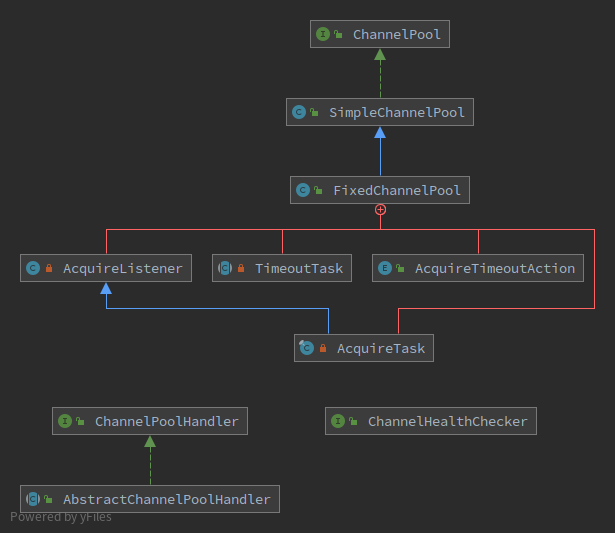

# ChannelPool

---

[TOC]

---

## 概述

ChannelPool 就是 Netty 中的对 Channel 的池化实现。

ChannelPool 一般用于客户端的实现，在客户端和服务端之间通信繁忙是单个 Channel 可能来不及处理，所以采用池化的方式，**弹性获取和释放 Channel。**

因此 ChannelPool 和 Bootsrtap 也是一对一的关系，从 ChannelPool 获取的也是固定格式的 Channel，拥有相同的处理链。

<br>

## ChannelPool 类图



<br>

SimpleChannelPool 是基本的池化实现，**创建的所有 Channel 都保存在该类定义的 Deque中。**

<br>


## Channel 获取流程

以下是 SimpleChannelPool 的获取流程：

```java
    private Future<Channel> acquireHealthyFromPoolOrNew(final Promise<Channel> promise) {
        try {
            // 从 Deque 中获取
            final Channel ch = pollChannel();
            // channel 不存在所以需要新建
            if (ch == null) {
                // No Channel left in the pool bootstrap a new Channel
               	 // 克隆同一个 Bootstrap，保证产生的 Channel 都是一致的。
                Bootstrap bs = bootstrap.clone();
                // bs中保存了 channelPool 的对象引用
                bs.attr(POOL_KEY, this);
                // 连接并获取 ChannelFuture,这里是 Channel 的创建流程
                ChannelFuture f = connectChannel(bs);
                // Channel 的获取是异步的
                if (f.isDone()) {
                    notifyConnect(f, promise);
                } else {
                    f.addListener(new ChannelFutureListener() {
                        @Override
                        public void operationComplete(ChannelFuture future) throws Exception {
                            notifyConnect(future, promise);
                        }
                    });
                }
                return promise;
            }
            // Channel 存在的时候，检查 Channel 的健康状况
            // Netty 中 Channel 相关的操作全部在其绑定的 EventLoop 中
            EventLoop loop = ch.eventLoop();
            if (loop.inEventLoop()) {
                doHealthCheck(ch, promise);
            } else {
                loop.execute(new Runnable() {
                    @Override
                    public void run() {
                        doHealthCheck(ch, promise);
                    }
                });
            }
        } catch (Throwable cause) {
            promise.tryFailure(cause);
        }
        // 返回异步过程
        return promise;
    }
```

整个流程并不复杂，在未从队列中获取到 Channel 的时候直接创建。

<br>

在来看 FixedChannelPool

## Channel 创建流程

### Channel 如何初始化 Handler

## Channel 释放流程

## Channel 健康检查