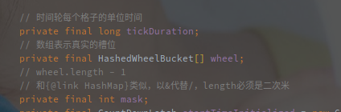
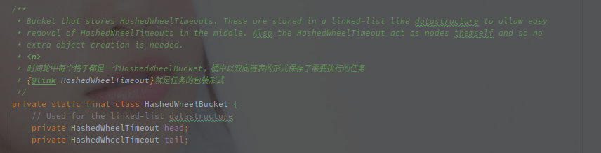
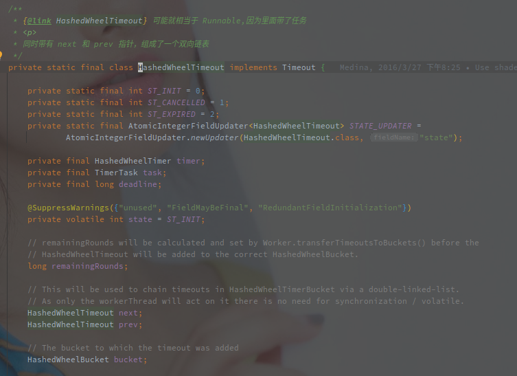
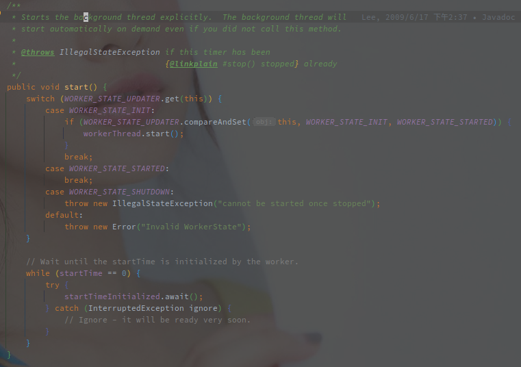
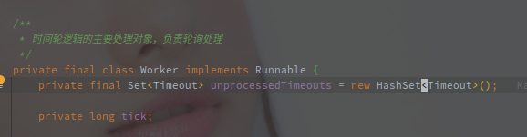
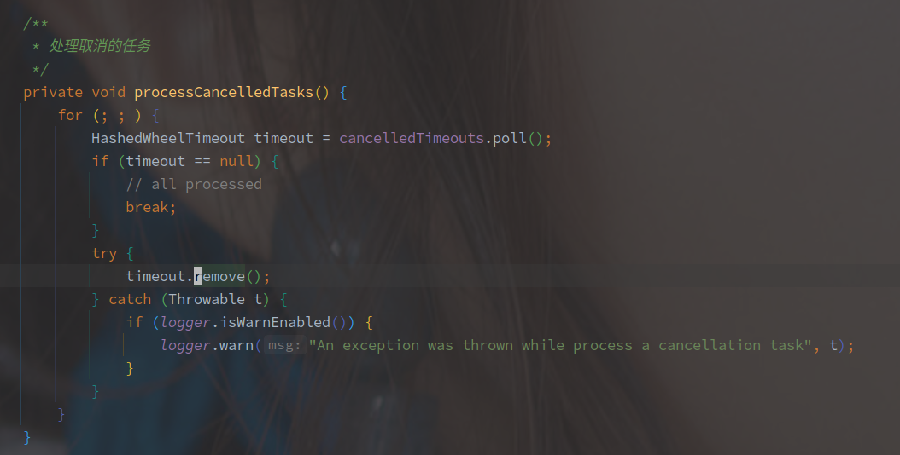
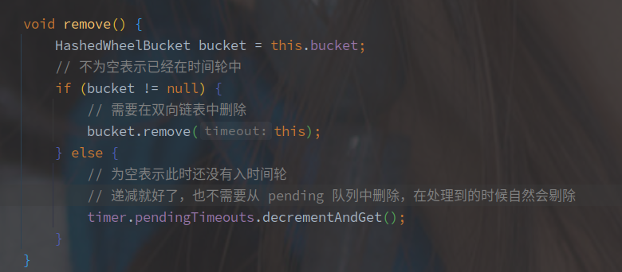
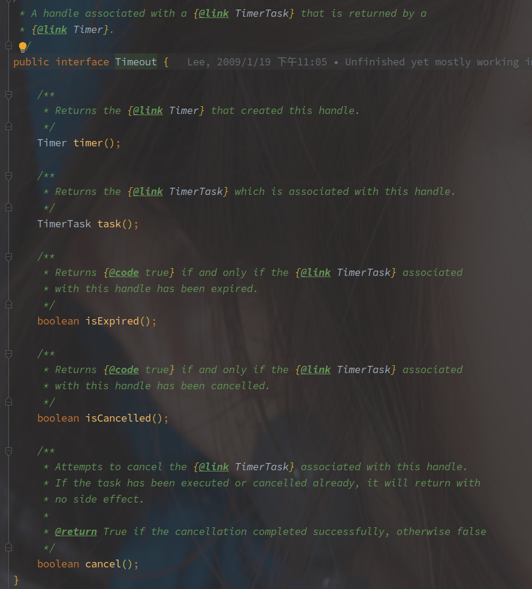
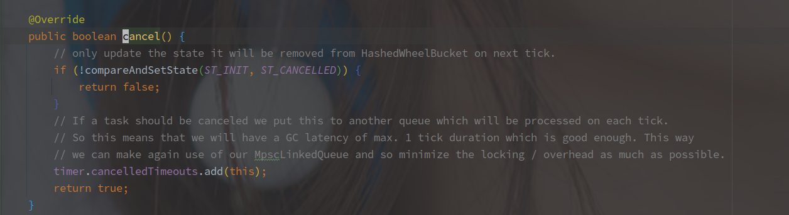

# HashedWheelTimer 源码分析

> 2021/10/09


## 概述

HashedWheelTimer 是 Netty 中实现的时间轮结构（在Kafka，Akka，Zookeeper 中都有时间轮的实现。

**时间轮的主要作用就是存储并调度延时任务。**

> JDK 的 ScheduledThreadPoolExecutor 使用的是小顶堆（二叉树）来完成任务的延时调度。
>
> 存放的时候以执行时间作为排序依据，每次判断堆顶任务是否到期来确定是否需要调度执行，相对于时间轮来说，小顶堆的维护更加复杂，接近 O(logN) 的复杂度。

时间轮的整体结构如下：


（盗我杰哥一个图。

时间轮可以简单看作一个环形队列，队列中每个 Bucket（槽或者桶，怎么叫都行），都保存了一个任务链表，另外的每个槽位代表一定的时间跨度，时间到了之后将槽内的任务全部取出来执行。

添加任务的时候需要根据执行的时间，将任务插入到不同的槽位，然后等待具体的调度时间。

**因为是以槽作为一个调度时间单位，所以时间轮的精度就不会太高，**另外的事件轮中需要使用**单个线程去遍历整个环形队列**，取出任务。


## HashedWheelTimer 的基本结构

HashedWheelTimer 的主要成员变量如下：


含义分别如下：

| 参数名            | 含义                                                         |
| ----------------- | ------------------------------------------------------------ |
| tickDuration      | 每个桶表示的时间间隔，单位为ms                               |
| workerThread      | 用来转动时间轮，获取任务的工作线程                           |
| workerState       | 当前时间轮状态                                               |
| wheel             | 时间轮的真实实现，使用数组 + mod 的形式组成一个循环队列      |
| mask              | HashedWheelTimer 中要求桶的数量必须为2次幂，mask 等于 2^n - 1，用于计算桶的下标 |
| timeouts          | 任务的暂存队列，其中的任务（timeout）会被工作线程插入到轮中  |
| cancelledTimeouts | 取消的任务队列，也是暂存区                                   |
| pendingTimeouts   | 正在等待入时间轮的任务数                                     |
| startTime         | 对齐时间，**HashedWheelTimer 中计算桶的下标的形式就是 ((当前时间 - 对齐时间)) / tickDuration & mask**<br />经过 n 个 tick 时间就变成了 startTime + tickDuration * tick |

<br>

### 时间轮的结构

> 指保存任务和执行时间的结构。

**HashedWheelTimer 中保存了 HashedWheelBucket 的数组，作为任务的存储结构**（就是上述环形队列的简单实现。



**其中单个 Bucket 的表示是其内部类 HashedWheelBucke**t，结构如下：



HashedWheelBucket 中持有任务 HashedWheelTimeout 的头尾节点，相当于**持有当前 Bucket 的任务链表**，以下是 HashedWheelTimer 的结构：



**HashedWheelTimer 中所以的定时任务都会被包装为 HashedWheelTimeout，自身通过前驱（prev）和后继（next）节点组成了一个双向的链表。**

相关参数含义如下：

| 参数名          | 含义                                                         |
| --------------- | ------------------------------------------------------------ |
| next / prev     | 链表的前驱和后继                                             |
| deadline        | 与时间轮启动时间对齐的相对执行时间                           |
| remainingRounds | 剩余的轮次，每个轮次表示时间轮转动一周，每次访问到该节点算是一个轮次 |
| state           | 任务状态                                                     |
| task            | 需要执行的任务                                               |

> **HashedWheelTimer 中整个时间轮的结构就是双向链表组成的数组，数组中每个元素就是所谓的 Bucket，任务保存在双向链表中。**


<br>

## 时间轮的开启流程

**HashedWheelTimer 在第一次添加任务的时候或者手动调用 start() 方法开启工作线程**（也就启动了时间轮。

以下是 HashedWheelTimer#start() 方法实现：



简单逻辑就是**替换当前 Worker 线程的状态，并启动线程。**

主要还是后面的 await，在工作线程启动前阻塞当前线程。

> 不是很明确这里的原因，具体的目的就是添加任务的线程需要等待工作线程先启动（不确定。
>


## 时间轮的任务调度（转动）流程

（就是时间轮每次轮转需要执行的逻辑分析。

**HashedWheelTimer 中包含一个 Worker 线程，来负责期间的任务调度等逻辑。**

Worker 线程中有一个非常关键的变量：



**unprocessedTimeouts 用来存储在关闭 HashedWheelTimer 时来不及执行的任务。**

**tick 是一个逻辑时钟周期，每次经过 tickDuration 的时间 tick 会 +1，时间轮就是根据这个变量确定当前应该从哪个 Bucket 中获取任务。**

> tick 非常重要，时间轮的一个轮次只能表示一定的时间，比如 tickDuration = 1000，并且有60个桶时，一个轮次只代表一分钟，所以10分钟之后的任务的 tick = 当前的 tick + 10。 

<br>

以下是 HashedWheelTimer$Worker#run 的实现（Worker 肯定是继承 Runnable 的：

```java
        @Override
        public void run() {
            // 初始化时间轮开始执行的时间
            startTime = System.nanoTime();
            if (startTime == 0) {
            // We use 0 as an indicator for the uninitialized value here, so make sure it's not 0 when initialized.
                startTime = 1;
            }
	   // 唤醒在 start() 方法中被阻塞的线程
            // CountDownLatch 先执行 countDown 之后，await 也不会阻塞了
            startTimeInitialized.countDown();
            
            // 以下就是主要的轮询任务逻辑
            
            do {
                    // 睡眠直到下次任务时间到
                    final long deadline = waitForNextTick();
                    // 方法中的定义,deadline为负表示下次任务已经到期
                    if (deadline > 0) {
                        // tick表示当前轮次
                        // 求出应该执行任务的桶下标
                        int idx = (int) (tick & mask);
                        // 清空取消的任务
                        processCancelledTasks();
                        // 取出桶
                        HashedWheelBucket bucket = wheel[idx];
                        // 处理timeouts中的任务，将其分配到具体的桶中
                        transferTimeoutsToBuckets();
                        // 执行bucket中的所有任务
                        bucket.expireTimeouts(deadline);
                        // 时钟周期+1
                        tick++;
                }
                // 判断工作状态来确定好似否
            } while (WORKER_STATE_UPDATER.get(HashedWheelTimer.this) == WORKER_STATE_STARTED);

            // 到这里就表示 HashedWheelTimer 就被关了
            // Fill the unprocessedTimeouts so we can return them from stop() method.
            // 收集未执行的任务
            for (HashedWheelBucket bucket : wheel) {
                	bucket.clearTimeouts(unprocessedTimeouts);
            }
            for (; ; ) {
                    HashedWheelTimeout timeout = timeouts.poll();
                    if (timeout == null) {
                        break;
                    }
                    if (!timeout.isCancelled()) {
                        unprocessedTimeouts.add(timeout);
                    }
            }
            // 清空取消的任务
            processCancelledTasks();
        }
```

HashedWheelTimer 中任务调度线程的执行逻辑如下：

1. 等待一个 tickDuration 的时间（Thread.sleep() 方法实现挂起）
2. 计算当前时间对应的桶的下标（tick & mask，tick = currtime - startTime / tickDuraction
3. **处理所有取消的任务**（将取消的任务从时间轮中去除
4. 获取当前的桶
5. **处理暂存区（timeouts）的任务**，计算对应的桶的下标和 需要等待的轮次（remainingRounds），并插入桶中（最多一次 100000 个任务
6. **执行到期任务**（根据 tick 和 deadline 获取到期的任务，两样都是小于等于是到期，取消则删除，未到轮次建议
7. 状态未关闭则继续到流程 1，关闭则遍历所有集合的任务并取消

<br>

HashedWheelTimer 使用了 cannelTimeouts 和 timeouts 两个队列来作为暂存区保存对应的任务，由单线程来进行调度（出入时间轮，主要应该还是并发安全考虑。

另外需要注意，HashedWheelTimer 中任务的执行是单线程的（除非在 TimerTask 中使用线程池去执行），所以执行可能会拖慢下次的任务调度。


（接下来细聊一些实现。


### 处理取消任务



取消任务的实现就是从队列里面获取 timeout，并且逐个的 remove。

> 没有上限，是不是也有数量过多的风险，毕竟单线程的执行。

remove 的方法实现如下：



存在 bucket 表示已经加入到时间轮需要从时间轮中删除。


### 往时间轮中插入任务

```java
/**
         * 将timeouts中的任务移动到桶中,最多移动 1000000 个
         */
private void transferTimeoutsToBuckets() {
  for (int i = 0; i < 100000; i++) {
    HashedWheelTimeout timeout = timeouts.poll();
    // 没有任务了
    if (timeout == null) {
      break;
    }
    // 任务被取消了
    if (timeout.state() == HashedWheelTimeout.ST_CANCELLED) {
      continue;
    }
    // 任务的 deadline 是任务真实的执行时间和 startTime 对齐的时间
    // tickDuration 表示的是一个槽位的时间
    // 所以 calculated 表示的是任务执行的逻辑时钟
    long calculated = timeout.deadline / tickDuration;
    // tick 表示当前的逻辑时钟周期
    // remainingRounds 表示的是时间轮的完整轮次
    // 当前是第一次，每次转到之后 remainingRounds 减1，到0的时候表明时间到了
    timeout.remainingRounds = (calculated - tick) / wheel.length;
    // 如果tick大说明任务执行时间已经过了,所以当前轮次就需要执行
    // 如果任务的时钟周期比当前的短，则直接在当前的时钟执行
    final long ticks = Math.max(calculated, tick); // Ensure we don't schedule for past.
    // 计算插入的桶的下标
    int stopIndex = (int) (ticks & mask);
    // 插入到桶中
    HashedWheelBucket bucket = wheel[stopIndex];
    bucket.addTimeout(timeout);
  }
}
```

插入任务时需要确定两个参数，**任务对应的桶的下标以及剩余需要等待的轮次。**

下标使用目标的逻辑时间 & mask 计算，而剩余的轮次则是间隔的时间 / 桶的大小。


### 执行到期的任务

以下是 HashedWheelTimer$HashedWheelBucket#expireTimeouts 的方法实现：

```java
/**
 * Expire all {@link HashedWheelTimeout}s for the given {@code deadline}.
 * 执行桶中的到期任务
 */
public void expireTimeouts(long deadline) {
    HashedWheelTimeout timeout = head;
    // 这里需要遍历整个链表
    while (timeout != null) {
        HashedWheelTimeout next = timeout.next;
        // 当前的执行轮次
        if (timeout.remainingRounds <= 0) {
            // 先从链表中删除
            next = remove(timeout);
            if (timeout.deadline <= deadline) {
                    // 执行任务
                    timeout.expire();
            } else {
                // The timeout was placed into a wrong slot. This should never happen.
                throw new IllegalStateException(String.format(
                        "timeout.deadline (%d) > deadline (%d)", timeout.deadline, deadline));
            }
        } else if (timeout.isCancelled()) {
            // 任务已经被取消，从链表中删除
            next = remove(timeout);
        } else {
            // 任务需要等待的轮次减1
            timeout.remainingRounds--;
        }
        timeout = next;
    }
}
```

整个执行过程就是遍历桶中所有的任务，状态正常并且剩余轮次小于等于0就可以执行。

剩余轮次大于0的需要递减，已便后续执行。

取消的任务直接从链表中剔除。

<br>

## 添加定时任务

往 HashedWheelTimer 中添加任务，以下是 HashedWheelTimer#newTimeout 的源码实现：

```java
@Override
public Timeout newTimeout(TimerTask task, long delay, TimeUnit unit) {
  // 前置的参数检查
  ObjectUtil.checkNotNull(task, "task");
  ObjectUtil.checkNotNull(unit, "unit");
  // 当前等待的任务数+1
  long pendingTimeoutsCount = pendingTimeouts.incrementAndGet();
  // maxPendingTimeouts 默认为-1，表示无上限
  if (maxPendingTimeouts > 0 && pendingTimeoutsCount > maxPendingTimeouts) {
    pendingTimeouts.decrementAndGet();
    throw new RejectedExecutionException("Number of pending timeouts ("
                                         + pendingTimeoutsCount + ") is greater than or equal to maximum allowed pending "
                                         + "timeouts (" + maxPendingTimeouts + ")");
  }
  // 开启时间轮
  start();
  // 任务执行的时间
  // 不是真实的时间，需要于 startTime 对齐 
  long deadline = System.nanoTime() + unit.toNanos(delay) - startTime;
  // Guard against overflow.
  if (delay > 0 && deadline < 0) {
    deadline = Long.MAX_VALUE;
  }
  // 包装为 HashedWheelTimeout
  HashedWheelTimeout timeout = new HashedWheelTimeout(this, task, deadline);
  // 保存到 timeouts
  timeouts.add(timeout);
  return timeout;
}
```

整个添加的过程除了基本的检查就是往 timeouts 中添加。


timeouts 就是一个简单的任务队列，此时并没有往时间轮中插入任务。

> 具体的插入到桶其实是通过时间轮的工作线程来完成的。
>
> **单线程的进行桶中任务的添加可以完全避免上锁的问题，避免任务调度期间因为插入过于频繁而导致的迟滞。**


## 取消定时任务

在添加任务的时候会返回一个 HashedWheelTimeout 的对象，包含需要执行的 Task 任务以及 deadline 等信息，该对象用于查询以及控制任务的状态。

该对象继承于 Timeout 接口，所以提供了以下方法实现：



获取包装的 HashedWheelTimeout 对象，获取任务，是否到期，是否取消，以及取消方法。

cancel 方法的实现也很简单，源码如下：



CAS 替换任务状态并且将任务添加到 cancelledTimeouts 的队列中，就可以了。

**后续的从时间轮移除的步骤将在 Worker 线程中完成。**


## 总结

> 时间轮的基本实现

时间轮使用一个环形数组存储定时任务，每个 Bucket 表示一段时间，在由单线程负责从 Bucket 获取到期的任务并执行（执行可以使用线程池。

因此时间轮存在以下几个明显的问题：

1. 定时时间不够精细（基本上由 Bucket 表示的时间单位决定
2. 代表的时间范围有限（环形数组长度 * Bucket Time Unit
3. 任务量少时，存在频繁空轮询的问题。

在时间范围有限的问题上，可以使用多级时间轮或者类似 Netty 的 tick 表示具体轮次来解决。

空轮询的问题，可以使用 DelayQueue 来调度最近任务时间。


> HsahedWheelTimer 的实现：

HashedWheelTimer 使用 Bucket 表示一小段事件，整个时间轮表示大段的事件，超出的部分使用 tick（轮次）表示（表示的间隔有限是时间轮最明显的缺点。

通过工作线程（Worker）定时对数组以及其上的链表的遍历获取到期的任务并执行，时间到了之后会将桶的任务迁移到中间数组中，后续遍历执行。

添加和删除任务都是多线程入队列（入缓冲队列，由工作线程单线程遍历缓冲队列，在插入或移除出时间轮。

（直观来看，Netty 的实现感觉上更像是 EventLoop 的形式。


> 对比 JDK 原生 ScheduledThreadPoolExecutor 和 Netty 的 HashedWheelTimer 实现： 

ScheduledThreadPoolExecutor **使用堆来保存队列，获取的事件复杂度为O(1)，但是维护确实O(LogN)**，所以在任务数多的时候会出现性能降低的问题，而**时间轮采用数组+链表的实现，维护和插入成本极低，就是在执行时需要遍历全部的链表。**

个人看来 HashedWheelTimer 会更适合于短定时多任务的场景。

另外 HashedWheelTimer 中的任务依靠单个 Worker 线程执行，所有在耗时任务中需要另起线程异步执行（或者使用额外使用线程池，而 ScheduledThreadPoolExecutor 自身就是依托于线程池实现的，依靠于阻塞队列完成任务的调度。

<br>

> Netty 中单层时间轮的缺点：

1. 在任务量少的时候存在空轮询的情况（这个完全可以避免
2. 任务量多的时候，单个 Bucket 可能保存过多的任务，遍历效率低下。
