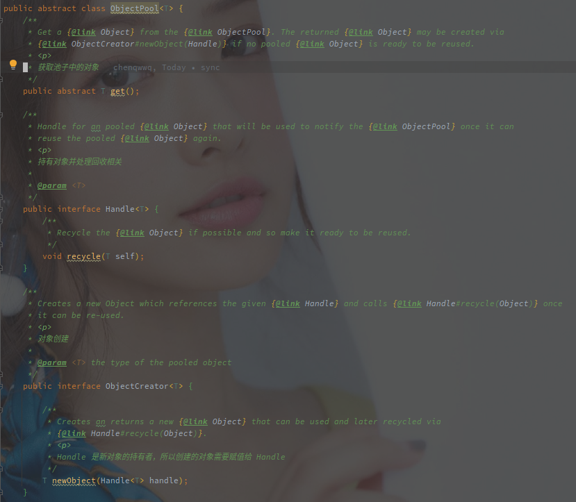
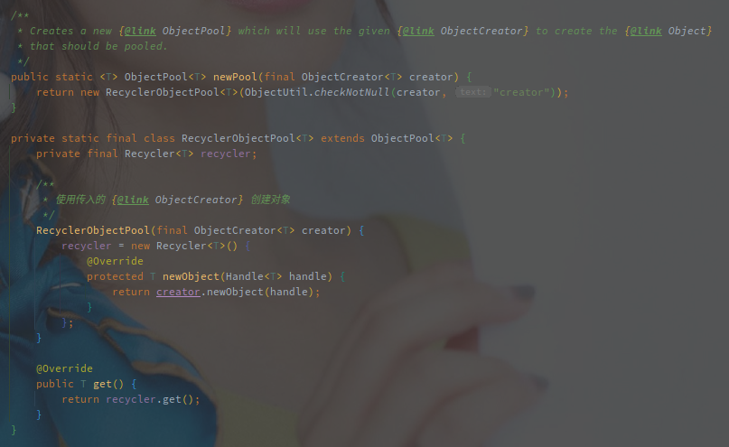

# Recycler

---

[TOC]

---


## 概述

对象池和连接池之类的一样都是享元模式的实现，减少对象的重复创建和回收，减少 GC 压力。

Netty 针对于对象池有一个轻量级的实现 ObejctPool，其基本实现就是 Recycler。

基本使用如下：

```java
	public class Main {

	static class Obj {
		static AtomicInteger idGen = new AtomicInteger();
		int id;
		ObjectPool.Handle<Obj> handle;

		public Obj(ObjectPool.Handle<Obj> handle) {
			this.id = Obj.idGen.incrementAndGet();
			this.handle = handle;
		}

		@Override
		public String toString() {
			return "Obj{" +
					"id=" + id +
					'}';
		}
		
        // 这个方法实现有点膈应
		public void recycle() {
			handle.recycle(this);
		}
	}

	public static void main(String[] args) {
		ObjectPool<Obj> objPool = ObjectPool.newPool(new ObjectPool.ObjectCreator<Obj>() {
			@Override
			public Obj newObject(ObjectPool.Handle<Obj> handle) {
				return new Obj(handle);
			}
		});

		final Obj o1 = objPool.get();
		o1.recycle();
		final Obj o2 = objPool.get();
		System.out.println(o1);
		System.out.println(o2);
		System.out.println(o1 == o2);
	}
}

// 输出如下:
// Obj{id=1}
// Obj{id=1}
// 	true
```

使用的时候不推荐直接实现 Recycler，而是采用 ObjectPool.newPool() 去创建。

## ObjectPool 

ObjectPool 中定义了如下三种对象：

1. ObjectPool - 最上层的对象池，负责持有所有对象并对获取方法进行调度
2. ObjectCreator - 对象创建
3. Handle - 对对象进行回收



并且默认使用 Recycler 作为基础实现：



RecyclerObjectPool 直接创建了 Recycle 作为其基础实现，构造函数中传入一个 ObjectCreator 就可以创建一个对象池。


## 随记

Stack 是一个用数组模拟的栈，每一个线程都会绑定一个 Stack 对象，使用 FastThreadLocal 作绑定。

所有的对象都被包装为 DefaultHandle，DefaultHandle 是 Recycler 的内部类，它的 recycle 方法实现了对象重入 Stack 的逻辑。

理论上，因为用线程做了对象的区分，所以应该由获取的线程去释放对象的使用，但是可能会出现引用逃逸的情况，当前线程可能将对象传递给别的线程，此时释放就需要由别的线程完成。

多线程归还对象（将对象添加到 Stack 底层的数组中，此时就需要上锁保证其并发安全性。

Netty 做了无锁化处理，即只有 Stack 的线程才可以处理 Stack 中的数组（添加或者删除。

所以由别的线程归还对象时，并不是直接归还到该 Stack 中，而是保存在 WeakOrderQueue 中，使用另外一个 FastThreadLocal 保存了 Stack 和 WeakOrderQueue（持有着对象）的映射关系。

一个 Stack 中不同的 Thread 会创建不同的 WeakOrderQueue，然后添加当前线程所释放的对象。


> 获取对象的流程：

1. 获取当前线程绑定的 Stack（通过 FastThreadLocal
2. 获取 Stack 数组中的对象，如果不存在则尝试从 WeakOrderQueue 中回收（由其他线程所释放的对象，WeakOrderQueue 中使用 Link 保存对象
3. 如果还没有获取到对象，则直接使用 newObject 创建对象（该方法需要自定义


> 对象释放的流程：（对象的释放由于 DefaultHandle 触发，在创建的时候就会传递一个 Handle  进参数，但是真实的逻辑是在 Stack 中

1. 判断当前线程是否是 Stack 绑定的 Thread
2. 如果是则直接添加到数组（中间还有扩容以及部分丢弃的逻辑
3. 如果不是则尝试添加到当前 Stack 的 WeakOrderQueue


## 参考

- [netty源码学习笔记——对象池](https://huzb.me/2019/10/17/netty%E6%BA%90%E7%A0%81%E5%AD%A6%E4%B9%A0%E7%AC%94%E8%AE%B0%E2%80%94%E2%80%94%E5%AF%B9%E8%B1%A1%E6%B1%A0/)

- [Netty源码之对象池](https://juejin.cn/post/6922779981101662222#heading-15)