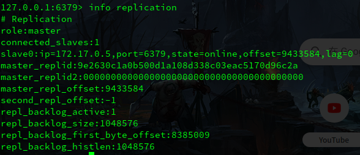

# Redis的Sentinel 哨兵模式

---

[TOC]

---


##  概述

Sentinel 是 Redis 的高可用解决方案，是对 Redis 主从模式的补充，Redis 的主从模式最大的问题还是单点故障问题（只有主节点可以写入，只支持单主集群。

**Sentinel 模式就是指一个或者多个 Sentinel 服务器，以一个监察者的身份监视一个或多个的主服务器及其从服务器。**

在主服务器宕机时，激活故障转移功能，从该主服务器下的从服务器中选取一台作为新的主服务器，从而保证整个系统在短时间内恢复可用。

<br>Sentinel 就是特殊的 Redis 服务器，和普通的 Redis 服务器共用大部分代码，但又有一套自己的数据结构和指令集（所以 GET/SET 等命令也就不可用。


## Sentinel建立的相关流程

### 1. 根据配置，初始化 Master 服务器连接

 Sentinel 服务器初始化时就会在自身的 sentinelRedisInstance.masters 中记录下所监视的所有主服务器信息，并逐个连接并获取其信息。

<br>

连接服务器时，Sentinel 不仅仅会建立普通的**命令连接**，也会建立一个**订阅连接**，用于创建并订阅主服务器的 `_sentinel_:hello` 频道。

> 额外创建**订阅连接**的原因除了订阅之外，是因为 Redis 的发布订阅模块并不提供确保到达的机制，消息发送时如果因为网络抖动而未到达接收方，那就会直接丢失这条消息。

完成第一步骤后， Sentinel 就有了包含主服务器在内的初始集群拓扑。

> 此时可能有些主节点并未在配置中，也未获取到其他的 Sentinel 和 Redis 从节点。

<br>

### 2. 获取从服务器信息

 Sentinel 会以 INFO 命令的形式，来获取对应初步中主服务器中的各类信息。

> INFO 命令是 Redis 查询当前节点信息的重要命令。

获取到的信息里面包括主从消息 Replication ，因此也就获取到了从服务器的信息。 

> Sentinel 会以一定的频率轮询的调用 INFO 命令，以此监视集群内的变化（并不是只在初始的时候调用。

<br>

### 3. 连接从服务器

 在上一步获取到从服务器的信息以后， Sentinel 同样也会和每个从服务器建立两条连接。

并按一定频率发送 INFO 命令，获取从服务器的具体信息。

至此 Sentinel 的当前网络结构拓扑中新增了从服务器。

<br>

### 4. 向订阅的所有主从服务器的 _sentinel:hello_ 频道发送消息

发送的命令如以下形式：

```
PUBLIC _sentinel:hello_  "s_ip,s_port,s_runId,s_epoch,m_name,m_ip,m_port,m_epoch"
```

消息中包含的分别是**Sentinel 的 ip、端口、runId、年代，主服务器的 name、ip、port、epoch**等。

因为所有的 Sentinel 服务器都会定于这个频道，所以也就相当于发送给所有的 Sentinel 服务器。

<br>

### 5. 接收 _sentinel:hello_ 频道的消息，发现新加入的Sentinel

通过频道的订阅， Sentinel 会收到集群中其他 Sentinel 的消息。

**以此为根据 Sentinel 会在该主节点的数据实例中记录下所有监听他的 Sentinel 的相关信息。**

<br>

### 6. 和其他的 Sentinel 建立命令连接

 Sentinel 之间不会建立订阅连接，仅仅只有命令连接。

至此， Sentinel 系统完整的拓扑图构造完成。

<br>

和主服务器建立连接没得说，监视的就是主服务器的情况。

和从服务器建立连接则是为了故障转移之后的选主，需要和从服务器交互。

和其他的 Sentinel 则是因为选主，不可能在失效之后每个 Sentinel 各自选择一个从服务器升为主服务器。


## 故障转移流程

### 1. 主观下线检测

Sentinel 每秒都会向命令连接(包括主从服务器以及其他Sentinel)发送一个 PING 命令，并通过返回确定对方当前的状态。

有效返回有以下几种：PONG、LOADING、MASTERDOWN。(这里暂时忽略有效返回代表的意思)

如果对方服务器在 down-after-milliseconds 毫秒内（配置文件），没有返回任意一个有效返回，则当前服务器认定对方为主观下线，并修改实例对象中的状态。

如果是主服务器则进入客观下线检测的流程（**如果是从服务器，那么在修改完对象中的状态后，就不会有别的操作。**

从服务器重新开启在线状态就需要通过 Sentinel 向其主服务器发送的 INFO 命令中的返回信息。

<br>

### 2. 客观下线检测

 Sentinel 会发送如下命令询问别的 Sentinel 服务器是否认为该主服务器已经下线：

```
SENTINEL is-master-down-by-addr ip port epoch runId
```

在接收到超过 quorum （配置文件配置，一般是1/2）的确认下线之后，当前 Sentinel 才会认为目标服务器确实下线了，并开启以下的故障转移流程。

前三个参数都是下线的 Master 的，但是 runId不是，runId可以为符号 ***** 表示此次仅为客观下线检测，也可以为当前 Sentinel 的 runId，该参数用于此后的选举过程，表示希望选举自己为头节点。

对于以上命令，接收的 Sentinel 会回复三个参数：

1.  down_state    -   目标主服务器下线状态，1为已下线，0为未下线
2.  leader_runid   -   表示当前 Sentinel 选定的头节点的run id， * 表示此次仅为客观下线检测
3.  leader_epoch   -   表示选定的头节点的 epoch


### 3. 选举头节点

**监视下线节点的所有 Sentinel 会协商，选举出一个 Leader，来完成接下来的故障转移功能。**

> 故障转移的流程由单个的 Sentinel 就可以完成，集群部署也是为了高可用。

Redis 的选举算法是对 Raft 算法 简单实现。

Raft 算法 是一种分布式日志共识算法，如果不了解 Raft算法 ，可以参考[Raft算法的动画演示](http://thesecretlivesofdata.com/raft/)做一个简单了解。

选举有以下规则：

1. 每次选举不论是否成功，当前 epoch 自增一次。
2. 每次选举，每个 Sentinel 都只能选举一个头节点，且不能修改。
3. 每个 Sentinel 都有资格成为头节点。
4. 每个发现客观下线的 SENTINEL 都会要求其他节点选举自己为头节点。
5. 如果超过半数以上的 Sentinel 选了同一个 Sentinel ，那么选举成功，该 Sentinel 成为头节点。
6. 给定时限之内没有结果，则当前选举失败，开启下一轮选举。
7.  SENTINEL is-master-down-by-addr 作为 Sentinel 节点间的通信。


### 4. 故障转移

由上一步选举产生的头节点执行故障转移操作。


**选择新的主服务器**

从下线主服务器的所有从服务器中挑选一个作为新的主服务器，发送 SLAVEOF NO ONE 命令，并以每秒一次的频率发送 INFO 命令，监控该从服务器当前的状态。

 SLAVEOF NO ONE 并不一定能很快到达并执行，所以需要状态监控。



就是上图中的 role 字段从 slave 变为 master ，表示从服务器已经变为主服务器。

**修改其他从服务器的复制目标**

直接发送 SLAVEOF ip port 命令，将其他从服务器的复制目标指向新的主服务器

**将旧主服务器降为从服务器**

和第二步的发送命令不同，此时旧服务器可能还处于掉线状态并没办法接受到 SLAVEOF 命令，所以此处的修改仅仅在 Sentinel 内部的数据结构中。


