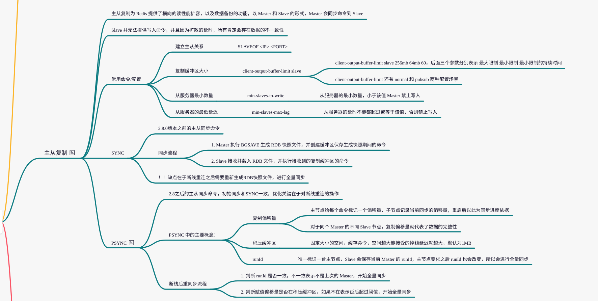
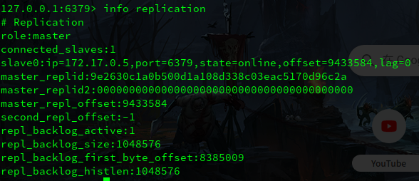
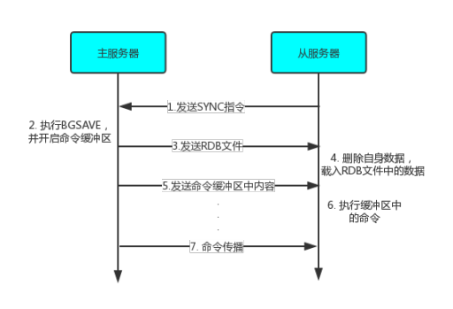
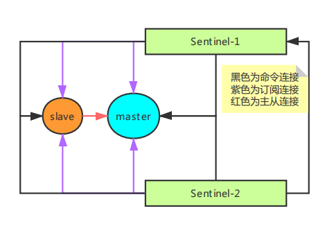

# 浅谈Redis的主从复制和 Sentinel

---

[TOC]

---


## 概述

Redis 的主从模式和 Sentinel机制，分别解决的是 Redis 的读性能瓶颈以及单点故障问题。


## Redis的主从复制

### 思维脑图




### 相关原理

Redis 服务器可以通过 `SLAVEOF <ip> <port>` 指令或者配置文件 `slavof <ip> <port>` 的方式，让当前服务器去复制另外一个 Redis 服务器。

被复制的服务器称为主服务器，当前服务器则称为从服务器，以此形成一种主从关系 (Master-Slave 关系)。


建立主从关系之后，从服务器就无法再执行写命令了，而是完全同步主服务器的数据。

> 就算在执行 AOF 或者 RDB 文件的过程中发现有过期的键也不能主动删除，只能等主服务器的同步。
>
> 因为无法执行命令，无法写入，所以主从模式仅仅只扩展了读属性，写入瓶颈依然存在。


通过指令 `info replication`，可以单独查看服务器此时的主从信息。如下：



> role 表示当前节点的身份，master 表示是主节点
>
> connected_slave 表示当前的子节点数，以及 slave0 就表示子节点信息。


该种主从复制模型非常适合读多写少的环境，而且仅从主服务器写入一定程度上也不需要担心数据一致性问题。

复制相当于为主服务器中的数据创建多个复本，也算是一种**容错策略**。

> 这里的一致性都是指最终一致性，**因为命令的扩散也会有延迟**，卡着延迟从从服务器中读取就会有数据不一致的问题。
>
> 因此如果对一致性的要求很高，或者必须要强一致性，建议还是不要从从服务器读取。


复制模式可以分为**数据同步**以及**命令传播**两个阶段。

数据同步就是从服务器刚开始连接时的操作，全盘同步主服务器上的数据。

命令传播就是主服务器将本地执行过的命令再发送到从服务器(主服务器以客户端的身份发送命令到从服务器)。


Redis 中对应数据同步的命令有两个 SYNC 和 PSYNC。

#### SYNC - 旧版复制

旧版的数据同步就是依托于 SYNC 命令，从服务器向住服务器发送该命令表示开启同步数据流程。



主服务器首次接收到 `SYNC` 命令之后，会执行 BGSAVE 命令生成 RDB 文件，并在此时开启**命令缓冲区**，记录备份期间所有执行的写命令。

BGSAVE 执行完之后，会将生成的RDB文件发送给从服务器。

> 此时如果于多个从服务器连接，RDB 文件是可以直接共享的。

从服务器在接收到主服务器发送的 RDB 文件之后，会清空本地的所有数据，全盘载入 RDB 文件中的数据。

之后主服务器还会将缓冲区中的数据发送到从服务器，从服务器执行完缓冲区中的写命令，就达到了和主服务器的完全一致。


> 旧版的复制很简单，主要就是生成 RDB 文件并传播指令。
>
> 问题就在于太过简单，**即使网络波动导致的瞬时断连，在重连之后也会进行全量同步。**


#### PSYNC - 新版本的数据同步

PSYNC 命令是对 SYNC 命令的进一步优化，主要是 SYNC 只能进行全量同步，效率真的就不高，为此在 Redis2.8 版本之后，新增加了一个 PSYNC 命令。

PSYNC 命令完整的形式是 `PSYNC <runid> <offest>`，**在全量同步的基础上增加了一个增量同步的过程判断。**

下面是增量同步中增加的概念：

1. 复制偏移量

   按照字面意思也很好理解，是主从服务器各自维护的**以字节为单位**的属性，表示复制的进度。

   比如当前主服务器的复制偏移量为10000，在发送了50个字节的内容之后，就变为了10050，可以认为是主从服务器数据不一致性程度的表示。

   在 Sentinel 执行故障转移的时候也会以复制偏移量作为主要的参考依据。

   > 一定程度上，复制偏移量就表示从节点数据的完整性。

   

2. 复制缓冲区

   复制缓冲区是由主服务器维护的一个固定长度的 FIFO 队列，该队列会缓存近期主服务器所执行的写命令。

   

3. 主服务器 run ID

   run ID 唯一标识一个 Redis 服务器。

   实际上不论主从在服务器启动时都会生成一个 run ID，由40位随机的16进制字符组成。

   此处的 run ID 是在从服务器连接到主服务器是由主服务器下发的自身的 run ID，重连之后通过判断 run ID 来确定是否为同一个 Master。
   


PSYNC 的执行流程如下：

1. 判断 run ID 是否相同，不相同会直接开启全量同步的逻辑，相当于直接走 SYNC。
2. run ID 相同表示是断线重连，判断复制偏移量是否还在复制缓冲区中，如果超出表示超时时间过长，也需要走 SYNC。
3. 如果复制偏移量未超出复制缓冲区，则直接将复制缓冲区中的命令发送到从服务器，从而避免全量同步。


> Q: PSYNC 的优化

PSYNC 借由复制缓冲区实现了对断线重连的容忍机制，如果断线时间断，可以从复制缓冲区中找到缺失的命令就可以进行部分重同步，而避免每次都是全量同步。


> Q: 主从模式的存在的问题

1. 处于一致性的考虑，Redis 的主从模式并不允许从从服务器写入。
2. 

但整个的存储上限仍然受单台服务器的限制，主从模式保存相同的数据仅仅是一个数据备份，

更重要的是单主结构会带来单点问题，如果主服务器宕机，基本全完。


##  Sentinel 哨兵模式

`Sentinel`是Redis的高可用解决方案，仅仅依靠主从复制在主服务器宕机之后主服务器所在的整个模块就会进入只读状态(Redis不存在主主复制的模式)，无法写入或更新数据。

`Sentinel模式`就是指一个或者多个Sentinel服务器，监视一个或多个的主服务器及其从服务器。

在主服务器宕机时，激活故障转移功能，从该主服务器下的从服务器中选取一台作为新的主服务器，从而保证整个系统在短时间内恢复可用。

`Sentinel`就是特殊的`Redis`服务器，和普通的`Redis`服务器共用一部分代码，但又有一套自己的数据结构和指令集(所以GET/SET等命令也就不可用)。


#### Sentinel建立的相关流程


##### 1. 根据配置，初始化Master服务器连接

`Sentinel`服务器初始化时就会在自身的`sentinelRedisInstance.masters`中记录下所监视的所有主服务器信息。

连接服务器时，`Sentinel`不仅仅会建立普通的**命令连接**，也会建立一个**订阅连接**，用于创建并订阅主服务器的`_sentinel_:hello`频道。

额外创建**订阅连接**的原因除了订阅之外，是因为`Redis`的发布订阅模块并不提供确保到达的机制，消息发送时如果因为网络抖动而未到达接收方，那就会直接丢失这条消息。

完成第一步骤后，`Sentinel`就有了包含主服务器在内的集群拓扑。


##### 2. 获取从服务器信息

`Sentinel`会以**一定的频率**向所监视的主服务器发送`INFO`命令，来获取对应主服务器的消息。

获取到的信息里面包括主从消息`Replication`，因此也就获取到了从服务器的信息。 


##### 3. 连接从服务器

 在上一步获取到从服务器的信息以后，`Sentinel`同样也会和每个从服务器建立两条连接。

并按一定频率发送`INFO`命令，获取从服务器的具体信息。

至此`Sentinel`的当前网络结构拓扑中新增了从服务器。


##### 4. 向订阅的所有主从服务器的`_sentinel:hello_`频道发送消息

```
PUBLIC _sentinel:hello_  "s_ip,s_port,s_runId,s_epoch,m_name,m_ip,m_port,m_epoch"
```

消息中包含的分别是**Sentinel的ip，端口，runId，年代，主服务器的name，ip，端口，年代**

注意，Sentinel向从服务器发送的消息，是他们所复制的主服务器的信息。

同样的消息是以一定的频率循环发送的。

因为所有的Sentinel服务器都会定于这个频道，所以也就相当于发送给所有的Sentinel服务器。


##### 5. 接收`_sentinel:hello_`频道的消息，发现新加入的Sentinel

通过频道的订阅，`Sentinel`会收到急群众其他`Sentinel`的消息。

以此为根据`Sentinel`会在该主节点的数据实例中记录下所有监听他的`Sentinel`的相关信息。


##### 6. 和其他的`Sentinel`建立命令连接

`Sentinel`之间不会建立订阅连接，仅仅只有命令连接。

至此，`Sentinel`系统完整的拓扑图构造完成。


和主服务器建立连接没得说，监视的就是主服务器的情况。

和从服务器建立连接则是为了故障转移之后的选主，需要和从服务器交互。

和其他的`Sentinel`则是因为选主，不可能在失效之后每个`Sentinel`各自选择一个从服务器升为主服务器。




#### 故障转移流程

##### 1. 主观下线检测

 **`Sentinel`每秒都会向命令连接(包括主从服务器以及其他Sentinel)发送一个`PING`命令**,并通过返回确定对方当前的状态。

有效返回有以下几种:`PONG`，`LOADING`，`MASTERDOWN`。(这里暂时忽略有效返回代表的意思)

如果对方服务器在`down-after-milliseconds`毫秒内(配置文件中指明)，没有返回一个有效返回，则当前服务器认定对方为主观下线，并修改实例对象中的状态。

如果是主服务器则进入客观下线检测的流程。

**如果是从服务器，那么在修改完对象中的状态后，就不会有别的操作。**

从服务器重新开启在线状态就需要通过`Sentinel`向其主服务器发送的`INFO`命令中的返回信息。


##### 2. 客观下线检测

`Sentinel`会发送如下命令询问别的`Sentinel`服务器是否认为该主服务器已经下线：

```
SENTINEL is-master-down-by-addr ip port epoch runId
```

在接收到超过`quorum`(配置文件配置，一般是1/2)的确认下线之后，当前`Sentinel`才会认为目标服务器却是下线了，并开启以下的故障转移流程。

前三个参数都是下线的Master的，但是run Id不是。

run Id可以为符号`*`表示此次仅为客观下线检测，也可以为当前`Sentinel`的run Id，该参数用于此后的选举过程，表示希望选举自己为头节点。

对于以上命令，接收的`Sentinel`会回复三个参数：

1. `down_state`   -   目标主服务器下线状态，1为已下线，0为未下线
2. `leader_runid`  -   表示当前`Sentinel`选定的头节点的run id，`*`表示此次仅为客观下线检测
3. `leader_epoch`  -   表示选定的头节点的 epoch


##### 3. 选举头节点

首先，监视下线节点的所有`Sentinel`会协商，选举出一个Leader，来完成接下来的故障转移功能。

Redis的选举算法是对`Raft算法`简单实现。

`Raft算法`是一种分布式日志共识算法，如果不了解`Raft算法`，可以参考[Raft算法的动画演示](http://thesecretlivesofdata.com/raft/)做一个简单了解。

选举有以下规则：

1. 每次选举不论是否成功，当前`epoch`自增一次。
2. 每次选举，每个`Sentinel`都只能选举一个头节点，且不能修改。
3. 每个`Sentinel`都有资格成为头节点。
4. 每个发现客观下线的`SENTINEL`都会要求其他节点选举自己为头节点。
5. 如果超过半数以上的`Sentinel`选了同一个`Sentinel`，那么选举成功，该`Sentinel`成为头节点。
6. 给定时限之内没有结果，则当前选举失败，开启下一轮选举。
7. `SENTINEL is-master-down-by-addr`作为`Sentinel`节点间的通信。


##### 4. 故障转移

由上一步选举产生的头节点执行故障转移操作。


**选择新的主服务器**

从下线主服务器的所有从服务器中挑选一个作为新的主服务器，发送`SLAVEOF NO ONE`命令，并以每秒一次的频率发送`INFO`命令，监控该从服务器当前的状态。

`SLAVEOF NO ONE`并不一定能很快到达并执行，所以需要状态监控。


就是上图中的`role`字段从`slave`变为`master`，表示从服务器已经变为主服务器。

**修改其他从服务器的复制目标**

直接发送`SLAVEOF ip port`命令，将其他从服务器的复制目标指向新的主服务器

**将旧主服务器降为从服务器**

和第二步的发送命令不同，此时旧服务器可能还处于掉线状态并没办法接受到`SLAVEOF`命令，所以此处的修改仅仅在`Sentinel`内部的数据结构中。


