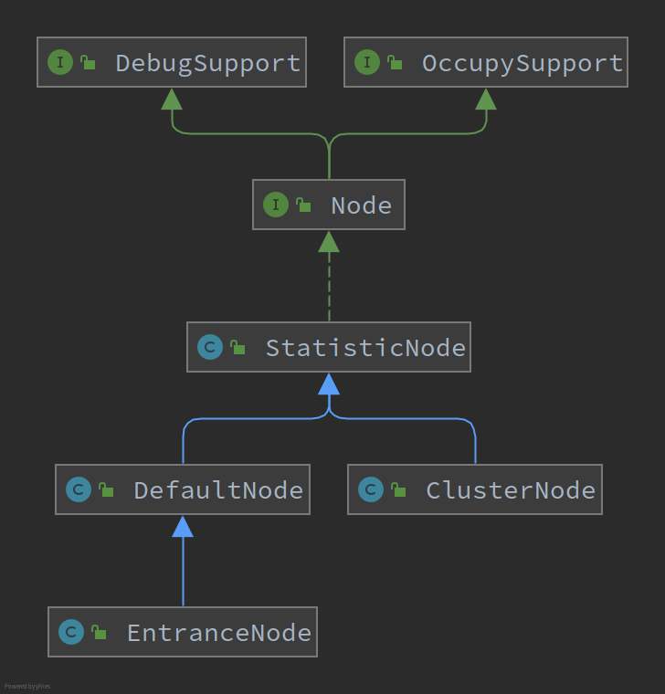

# Sentienl 中的 Node

## 概述

 Sentinel 中的各类统计信息都保存在 Node 中，并且使用不同的 Node 链表表示不同的调用链路。

Sentinel 一共有以下三种 Node，都继承于 StatisticNode：

1. EntranceNode
2. DefaultNode
3. ClusterNode

## StatisticNode 

统计节点，该类节点提供了数据统计的功能（秒级和分钟级的统计信息，以及当前进行中的线程数。

## DefaultNode

该节点继承于 StatisticNode，所以也能提供数据统计的功能，另外保存了 childNode（后继的调用接点，所以也提供看了调用链路的功能。

## EntranceNode

入口节点，在 Context#enter 的时候创建，每个上下文名称绑定一个 EntranceNode。

> 在 ContextUtil#contextNameNodeMap 中保存<上下文名称,EntranceNode>的映射关系。

EntranceNode 直接继承了 DefaultNode，提供了相同的功能，但是统计和表示的维度不同。

EntranceNode 统计的是相同上下文名称的调用信息，而 DefaultNode 是单个资源的统计信息（EntranceNode 根据上下文名创建，而 DefaultNode 根据资源名称创建。

### ClusterNode

ClusterNode 区别于 DefaultNode，它并不表示任何的调用链路，而是根据资源名称单独统计。

> 在 ClusterBuilderSlot#clusterNodeMap 中保存了<资源名称，ClusterNode>的映射关系。

