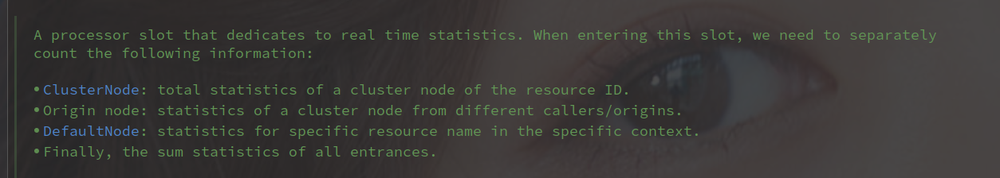

# ProcessorSlot 相关

---

[TOC]

## ProcessorSlotChain

从 Ctspn 中获取的 ProcessorSlotChain，缓存在 static 的 chainMap 中，以 ResourceWrapper 作为 Key。

> **所以全局范围内，对于相同的 ResourceWrapper 获取的都是同个 ProcessorSlotChain**

 

默认加载到的 ProcessorSlot 如下：

使用 ProcessorSlotProvider 创建，内部又包含了 SlotChainBuilder（可以通过  SpiLoader 加载），Builder 中又包含了 ProcessorSlot 的创建（同样可以通过 SpiLoader 加载）。

> SlotChainBuilder 和 ProcessorSlot 都可以通过 SpiLoader 做自定义配置。

## NodeSelectorSlot 

**NodeSelectorSlot 中保存了不同上下文（Context）中对相同资源（ResourceWrapper）的节点信息（DefaultNode）**

获取是按照上下文名称获取的，不同上下文名称对应的不同不的 DefaultNode（DefaultNode 对应的 ResourceWrapper 是一样的）。

在后续统计的过程中统计数据也就可以针对上下文作出隔离。

> NodeSelectorSlot 保存了相同资源针对不同上下文的统计节点，并且使用该节点组成一个调用链。

## ClusterBuilderSlot

该槽位保存了资源（resource）的运行统计信息，包括：

- 响应时间（response time ）
- QPS
- 线程数
- 异常
- 由 ContextUtil#enter 标记的调用方列表

clusterNode 作为一个成员变量，因为 Slot 以资源做隔离，所以 clusterNode 也一样做了隔离。

> 可以理解为每个资源都有自己的 clusterNode，以成员变量的形式保存在 ClusterBuilderSlot。
>
> **对于不同的上下文使用的同一个 ClusterNode。**

clusterNodeMap 作为一个静态变量，保存了全局的 clusterNode。

 

> 需要主要 ClusterNode 的保存形式，他并不是保存在上下文（Context）中，而是保存在 node（也就是在 NodeSelectorSlot 的 DefaultNode 中。

## StatisticSlot 

用于实时统计的处理器槽位，

## AuthoritySlot

校验权限的处理槽位，通过 AuthorityRule 来检查权限。

通过 AuthorityRuleManager 获取所有需要检查的 AuthorityRule。

## SystemSlot

通过 SystemRule 来检查相关内容。

## FlowSlot

流量控制相关，相关作用如下：

- Traffic Shapping
- Warmup
- Immediately reject
- Uniform Rate Limiting

## DegradeSlot 

请求降级相关处理槽位。

## 参考

- [Sentinel 官方文档](https://github.com/alibaba/Sentinel/wiki/Sentinel%E5%B7%A5%E4%BD%9C%E4%B8%BB%E6%B5%81%E7%A8%8B)