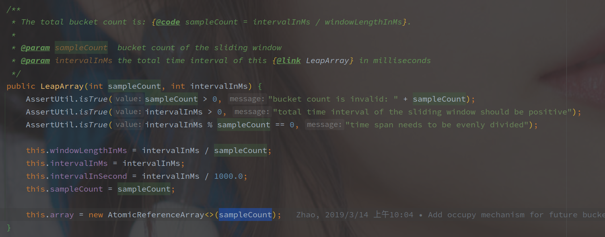

# Sentinel 中的滑动窗口


## 概述

滑动窗口在实时数据统计时用于平滑过渡。

> 例如在分钟的统计中，可以细分为 60 秒，以秒为单位进行窗口滑动，每秒废弃最远的一个窗口，而新建一个窗口。
>
> 以分钟为单位时，0.5 ~ 1.5 分的统计数据就会失去精度（过了最后一秒当前数据全清了，比如当前一分钟的数据全部集中在最后一秒，但是过了最后一秒之后数据重置了，此时又放进来一堆数据，0.5 ~ 1.5 的实际数据就会超出设定值。


Sentinel 中的滑动窗口最基础的实现就是 LeapArray（本文以分析 LeapArray 的实现实现为主。

LeapArray 作为基础的滑动窗口结构，而在其上有对应的统计接口 Metric（Metric 中指定了统计的指标数据。

## 窗口结构

Sentinel 中实现的 LeapArray 作为滑动窗口的基本实现（保存窗口数组。


泛型 T 就是指保存的数据内容，直接从初始化开始看，LeapArray 的构造函数如下：



参数含义如下：

| 参数             | 含义                                    |
| ---------------- | --------------------------------------- |
| windowLengthInMs | 每个桶代表的时间                        |
| sampleCount      | 桶的数目                                |
| intervalInMs     | 整个 LeapArray 代表时间跨度（毫秒为单位 |
| intervalInSecond | 整个 LeapArray 代表时间跨度（秒为单位   |
| array            | 整个窗口数组                            |

参数中指定了窗口数和整个数组代表的毫秒数，所以直接使用 intervalInMs / sampleCount 计算出了每个窗口的时间。

LeapArray 中的数组实现使用了 AtomicReferenceArray，并且以 WindowWrap 作为桶。

<br>

以下是 WindowWrap 的变量定义：


| 参数             | 含义             |
| ---------------- | ---------------- |
| windowLengthInMs | 窗口代表的毫秒数 |
| windowStart      | 窗口开始时间     |
| value            | 窗口中的数据     |


> **整个的滑动窗口结构就是以 WindowWrap 作为桶（单个窗口）的 AtomicReferenceArray 数组。**

## 获取当前窗口

根据当前的时间戳获取对应的窗口对象，直接调用的就是 LeapArray#currentWindow 方法：


（TimeUtil.currentTimeMillis 好像也有蛮复杂的实现，但是此处可以简单当做 System。

之后的完整逻辑如下：

```java
public WindowWrap<T> currentWindow(long timeMillis) {
   if (timeMillis < 0) {
      return null;
   }
   // 求当前时间戳对应的下标
   // 当前时间除以窗口时间，并对窗口个数取模
   int idx = calculateTimeIdx(timeMillis);
   // 计算窗口开始时间
    // 对于窗口时间取整，例如 10410 对于 100 取整为 10400
   // important: 其实就是窗口时间的规整，按照当前的窗口大小来
   long windowStart = calculateWindowStart(timeMillis);

   /*
    * Get bucket item at given time from the array.
    *
    * (1) Bucket is absent, then just create a new bucket and CAS update to circular array.
    * 窗口不存在
    * (2) Bucket is up-to-date, then just return the bucket.
    * 窗口存在，且时间正确
    * (3) Bucket is deprecated, then reset current bucket and clean all deprecated buckets.
    * 窗口存在，但开始时间以过期
    */
   while (true) {
       // 通过下标获取窗口
      WindowWrap<T> old = array.get(idx);
      if (old == null) {
         // 旧窗口为空
         /*
          *     B0       B1      B2    NULL      B4
          * ||_______|_______|_______|_______|_______||___
          * 200     400     600     800     1000    1200  timestamp
          *                             ^
          *                          time=888
          *            bucket is empty, so create new and update
          *
          * If the old bucket is absent, then we create a new bucket at {@code windowStart},
          * then try to update circular array via a CAS operation. Only one thread can
          * succeed to update, while other threads yield its time slice.
          */
          // 新建窗口
         WindowWrap<T> window = new WindowWrap<T>(windowLengthInMs, windowStart, newEmptyBucket(timeMillis));
         if (array.compareAndSet(idx, null, window)) {
            // Successfully updated, return the created bucket.
            return window;
         } else {
            // Contention failed, the thread will yield its time slice to wait for bucket available.
            Thread.yield();
         }
      } else if (windowStart == old.windowStart()) {
         // 窗口可以费用
         /*
          *     B0       B1      B2     B3      B4
          * ||_______|_______|_______|_______|_______||___
          * 200     400     600     800     1000    1200  timestamp
          *                             ^
          *                          time=888
          *            startTime of Bucket 3: 800, so it's up-to-date
          *
          * If current {@code windowStart} is equal to the start timestamp of old bucket,
          * that means the time is within the bucket, so directly return the bucket.
          */
         return old;
      } else if (windowStart > old.windowStart()) {
         // 窗口过期
         /*
          *   (old)
          *             B0       B1      B2    NULL      B4
          * |_______||_______|_______|_______|_______|_______||___
          * ...    1200     1400    1600    1800    2000    2200  timestamp
          *                              ^
          *                           time=1676
          *          startTime of Bucket 2: 400, deprecated, should be reset
          *
          * If the start timestamp of old bucket is behind provided time, that means
          * the bucket is deprecated. We have to reset the bucket to current {@code windowStart}.
          * Note that the reset and clean-up operations are hard to be atomic,
          * so we need a update lock to guarantee the correctness of bucket update.
          *
          * The update lock is conditional (tiny scope) and will take effect only when
          * bucket is deprecated, so in most cases it won't lead to performance loss.
          */
         if (updateLock.tryLock()) {
            try {
               // Successfully get the update lock, now we reset the bucket.
                // 重置窗口
               return resetWindowTo(old, windowStart);
            } finally {
               updateLock.unlock();
            }
         } else {
            // Contention failed, the thread will yield its time slice to wait for bucket available.
            Thread.yield();
         }
      } else if (windowStart < old.windowStart()) {
         // Should not go through here, as the provided time is already behind.
         return new WindowWrap<T>(windowLengthInMs, windowStart, newEmptyBucket(timeMillis));
      }
   }
}
```

