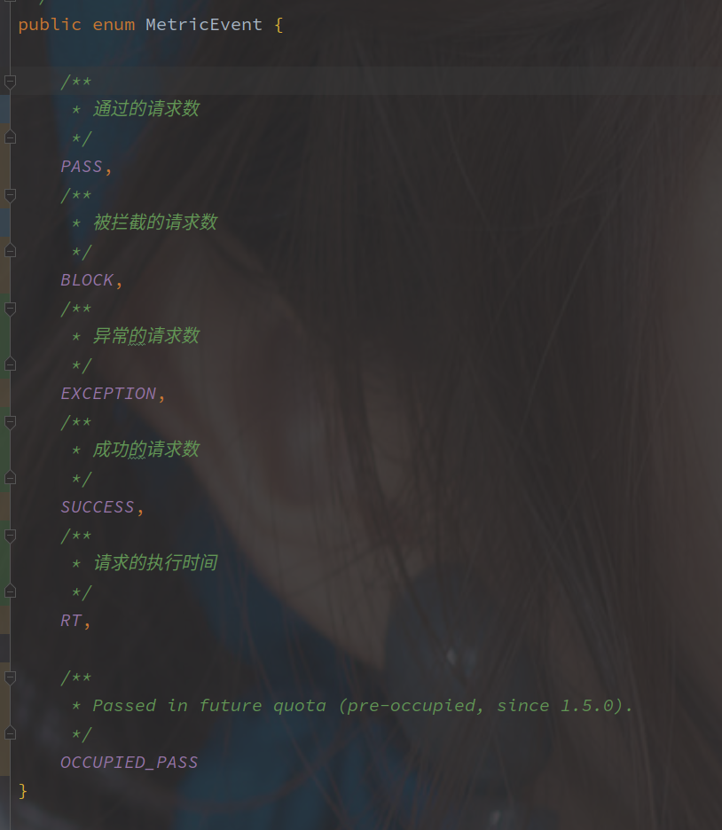
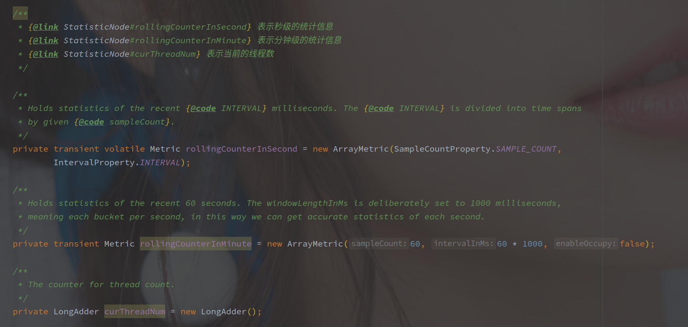

# Sentinel 中的统计信息

[TOC]

---

## 概述

Sentinel 中**使用 Node 类（具体是 StatisticNode）保存所有运行时的相关数据**，简单包括如下几项：

（OCCUPIED_PASS 的逻辑还没看。

> Sentinel 以窗口形式同个统计每个时间片的数据，每个窗口都是一个数组，根据以上  MetricEvent 枚举类的 ordinal 确定各类数据在数组中的下标。

## StatisticNode 

StatisticNode 是 ClusterNode，DefaultNode，EntranceNode 的父类实现，是 Sentinel 中统计信息集中实现。

**StatisticNode 中保存了分钟级和秒级别的信息，以及当前执行的线程数。**

通过 StatisticNode 可以获取到以下信息（从 MetricEvent 的几种数据中计算：

| 方法名           | 含义                                                         |
| ---------------- | ------------------------------------------------------------ |
| totalRequest     | 分钟级别）总请求数（ totalRequest = totalPass + blockRequest |
| blockRequest     | 分钟级别）总拦截数                                           |
| blockQps         | 秒级）被拦截的每秒请求数                                     |
| totalPass        | 分钟级别）总通过请求数（通过并不一定成功，可能还有异常，totalPass = totalException + totalSuccess |
| totalException   | 分钟级别）总异常数                                           |
| totalSuccess     | 分钟级别）请求成功数目                                       |
| previousBlockQps |                                                              |
| previousPassQps  |                                                              |
| totalQps         | 每秒的请求书                                                 |
| exceptionQps     |                                                              |
| totalException   |                                                              |
| passQps          | 每秒通过的请求树                                             |
| successQps       | 每秒请求成功的数目                                           |
| maxSuccessQps    |                                                              |
| occupiedPassQps  |                                                              |
| avgRt            | 平均响应事件                                                 |
| minRt            | 最小响应时间                                                 |
| curThreadNum     | 当前正在执行的请求线程数                                     |
|                  |                                                              |

1. 总共的请求数（PASS）
2. 通过的请求数
3. 被拦截的请求数（BLOCK）
4. 成功返回的请求数
5. 异常数

> 以上请求都包含分钟级和秒级，**秒级通过的请求数目就是 QPS。**

6. 每秒的平均 RT（Response Time）
7. 每秒的最小 RT
8. 当前正在执行的线程数
9. 前一秒的 QPS 和被阻塞的请求数

