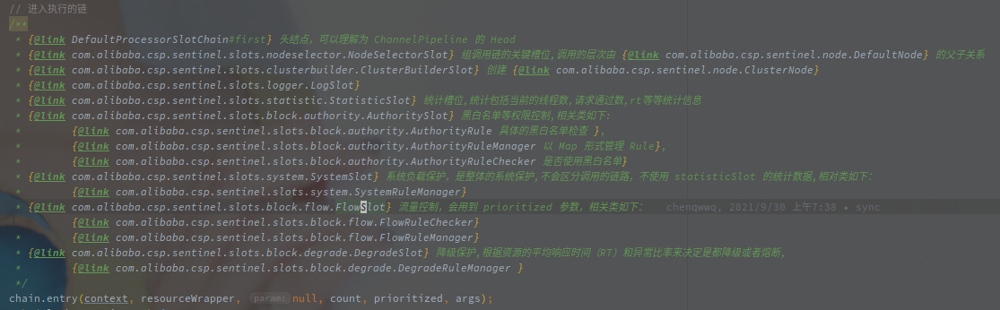

# 随记

## 基础流程

### 1. 确定调用上下文

Context 是基于 ContextUtil#enter(String name,String origin) 指定的上下文名称创建的（如果没有则使用默认的上下文的。

### 2. 查找执行链

Sentinel 中使用 ProcessorSlot 表示每个中间处理的流程，对于降级检查或者黑白名单检查或者系统负载的检查都在不同的 ProcessorSlot。

**ProcessorSlot 是根据 ResourceWrapper 获取的（可以直接理解为和资源绑定，进入同一个资源会经过相同的 ProcessorChain 处理。**

## 

>  ProcessorSlotChain 和 ResourceWrapper 在全局范围内绑定

CtSpn 中使用静态变量的 Map 保存了 ResourceWrapper 和 ProcessorSlotChain 的映射关系

 

> Entry 和 Node 维护的树形调用关系

Entry 本身就是一个双向链表的节点，带有 parent 和 child 两个变量，指向前驱和后继。

**所以一次调用经过多个 Resource 的时候，多次创建 Entry 会通过当前上下文（Context）传递之前的 Entry 为父节点。**

Node 本身维护了一个 childList 列表，表示是单向的树形关系。

 

> Constans.ROOT 

是全部节点的入口。

会按照上下文的名称创建 EntranceNode，然后下挂到下面，每次 entry 尝试获取 Entry 的时候会创建一个 childNode（DefaultNode。

 