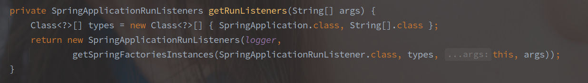
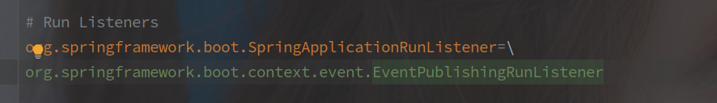
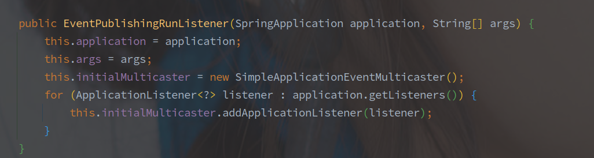
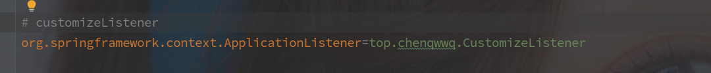

# SpringBoot的事件模型

> 首先明确，Spring 中的事件模型是基于**观察者模式**设计的，观察者模式的重点在于由被观察者持有观察者的引用。

<!-- more -->

---

[TOC]


## 基类接口/抽象类

### ApplicationListener   -   监听者

Spring 中所有监听器的顶级接口，所有子类对象必须在 onApplicationEvent() 方法中实现对事件的处理。

```java
@FunctionalInterface
public interface ApplicationListener<E extends ApplicationEvent> extends EventListener {
	/**
	 * Handle an application event.
	 * @param event the event to respond to
	 */
	void onApplicationEvent(E event);
}
```

接口中也限制了监听的事件对象，必须是 ApplicationEvent 的子类。


### ApplicationEventMulticaster   -  事件广播器

```java
public interface ApplicationEventMulticaster {
	// 对监听者的增删操作
    // Bean是原来就在IOC容器中的
	void addApplicationListener(ApplicationListener<?> listener);
	void addApplicationListenerBean(String listenerBeanName);
	void removeApplicationListener(ApplicationListener<?> listener);
	void removeApplicationListenerBean(String listenerBeanName);
	void removeAllListeners();
	// 事件发布的两个重载方法,ResolvableType表示的是事件的类型
	void multicastEvent(ApplicationEvent event);
	void multicastEvent(ApplicationEvent event, @Nullable ResolvableType eventType);
}
```

以上是事件广播器的方法列表。

事件广播器就是 ApplicationListener 的持有者，负责维护坚挺着列表，并广播对应的事件。	

> ApplicationContext 以及应用启动初期的 EventPublishingRunListener 都是通过 ApplicationEventMulticaster 实现的事件广播功能。


### ApplicationEvent   -   监听事件

ApplicationEvent 是 Spring 中所有事件的基类，继承自 JDK 中的 EventObject。

> 在 EventObject 中事件源的基础上又封装了一个 timestamp 的属性。

```java
// EventObject 是 JDK 中对观察者模式的原生实现
public abstract class ApplicationEvent extends EventObject {
	private static final long serialVersionUID = 7099057708183571937L;
       	// 增加了一个时间戳字段。
	private final long timestamp;
	public ApplicationEvent(Object source) {
		super(source);
		this.timestamp = System.currentTimeMillis();
	}
	public final long getTimestamp() {
		return this.timestamp;
	}
}
```

Spring 中有两个直接继承 ApplicationEvent 的子类：

- SpringApplicationEvent - 在应用启动时触发的相关事件，在 SpringApplication 中触发，以 SpringApplication 作为事件源。

- ApplicationContextEvent - 表示从 ApplicationContext 中广播的事件，以 ApplicationContext 为事件源头。

```java
// ApplicationContextEvent
public ApplicationContextEvent(ApplicationContext source) {
    super(source);
}

// SpringApplication
public SpringApplicationEvent(SpringApplication application, String[] args) {
    super(application);
    this.args = args;
}
```

从构造函数中也可以看出，SpringApplicationEvent 的事件源必须是 SpringApplication，而 ApplicationContextEvent 的事件源必须是 ApplicationContext。


### ApplicationEventPublisher   -  事件发布器

事件发布动作的顶级接口

```java
@FunctionalInterface
public interface ApplicationEventPublisher {
    // 接口中就定义了两个方法，像List那种顶级接口一样的方法规范接口
	default void publishEvent(ApplicationEvent event) {
		publishEvent((Object) event);
	}

	void publishEvent(Object event);
}
```

ApplicationContext 接口继承了该接口，具体的实现在 AbstractApplicationContext，其中也会调用广播器 ApplicationEventMulicaster 作为工具类进行广播。


## SpringBoot 启动过程中的事件

> SpringBoot 的启动过程中发布的主要事件就是 SpringApplicationEvent。

首先在初始化 SpringApplication 时就会通过工厂加载机制获取并保存所有的  ApplicationListener 实现。

[SpringBoot 的启动流程](./SpringBoot的启动流程.md)

但是在容器启动早期，连 ApplicationContext 都还没创建，所有的事件其实是通过 SpringApplicationRunListener 发布的。



同样是通过工厂加载模式获取的 SpringApplicationRunListener 实现，并且默认的只有 EventPublishingRunListener。



EventPublishingRunListener 在初始化的时候会从 SpringApplication 中抽取所有的 ApplicationListener 。

而且其内部的广播还是依靠的 SimpleApplicationEventMulticaster，



> 在 SpringBoot 启动初期当然是 Bean 对象都未加载，所以自定义监听器仅仅是声明为 Bean 肯定是无法接收到早期的事件的。
>
> **需要借助工厂加载模式，在 spring.factories 中声明监听器，使其在第一时间被加载。**



## ApplicationContext 的事件发布流程

Spring 中事务的发布流程的核心方法其实实现在 AbstractApplicationContext 中。

> AbstractApplicationContext 继承自 ConfigurableApplicationContext 接口，间接继承了 ApplicationEventPublisher 接口，所以 AbstractApplicationContext也实现了publishEvent 的方法。

<br>

对应的发布流程很简单：

1. 获取匹配的监听者
2. 调用监听者的触发方法
3. **在父容器继续发布事件**

**！！事件的发布是会从子容器传递到父容器的，但不会从父容器到子容器。**

<br>

以下为事件发布的流程代码：

```java
  // AbstractApplicationContext#publishEvent
  protected void publishEvent(Object event, @Nullable ResolvableType eventType) {
		Assert.notNull(event, "Event must not be null");
      	// 转化事件源类型方便解析和使用  object -> other
		ApplicationEvent applicationEvent;
		if (event instanceof ApplicationEvent) {
			applicationEvent = (ApplicationEvent) event;
		}else {
            // 包装为负载的应用事件
			applicationEvent = new PayloadApplicationEvent<>(this, event);
            // 获取事件类型
			if (eventType == null) {
				eventType = ((PayloadApplicationEvent<?>) applicationEvent).getResolvableType();
			}
		}

       	 // earlyApplicationEvent 是否为空表示是否需要收集事件，
       	 // 等事件广播器初始化完成之后统一下发
      	if (this.earlyApplicationEvents != null) {
			this.earlyApplicationEvents.add(applicationEvent);
		}else {
             // 事件发布的主要流程 
			getApplicationEventMulticaster().multicastEvent(applicationEvent, eventType);
		}

      	 // 同样在父容器中发布该事件
		if (this.parent != null) {
			if (this.parent instanceof AbstractApplicationContext) {
				((AbstractApplicationContext) this.parent).publishEvent(event, eventType);
			}else {
				this.parent.publishEvent(event);
			}
		}
	}
```

> 方法实现中有一个 earlyApplicationEvents 用于记录早期的事件。

在 ApplicationContext 未初始化完毕的时候，如果发布某事件没有 ApplicationEventMulticaster 来发布，则会将事件保存在该集合中。

如果没有指定，ApplicationContext 中使用的也是 SimpleApplicationEventMulticaster 来发布对应的事件。

## 自定义监听器的女方是

实现自定义的事件监听有以下三种方式:

1. @EventListener 注解

```java
@Component
public class TestApplicationListener{
    // 方法上标注EventListener就可以监听方法入参类型的事件
    @EventListener
    public void onApplicationEvent(ApplicationEvent event) {
       ...
    }
}
```

该注解需要标注的类是一个 Bean 对象，并且参数就是关注的事件类型。

该参数的解析由 EventListenerMethodProcessor 完成，并通过 EventListenerFactory 创建对应的监听者对象，默认使用 ApplicationListenerMethodAdapter 类。

<br>

2. 继承 ApplicationListener 或其子类

只要继承了 ApplicationListener，就是一个标准的监听器，但是使监听器生效还需要声明为 Bean 或者使用工厂加载模式。

```java
// 实现ApplicationListener接口
// 接口中的泛型类型就是想要监听的事件类型
@Component
public class TestApplicationListener implements ApplicationListener<ContextRefreshedEvent>{
    @Override
    public void onApplicationEvent(ContextRefreshedEvent event) {
       ...
    }
}
```

<br>


工厂加载模式下，CustomizeListener 也必须要实现 ApplicationListener 接口。

**相对来说，工厂加载模式生效的事件更早，也早于 @EventListener，因为在 SpringApplication 的构造函数中就已经加载了。**


## 总结

SpringBoot 的事件模式总体还是依托于观察者模式，关键就在于 **被观察者持有观察者的引用**。

> 个人感觉最主要的还是**事件发布的时候还会扩散到父类容器。**