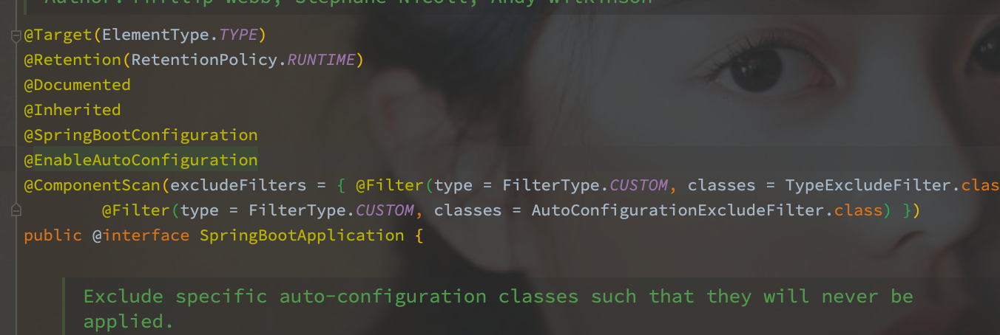
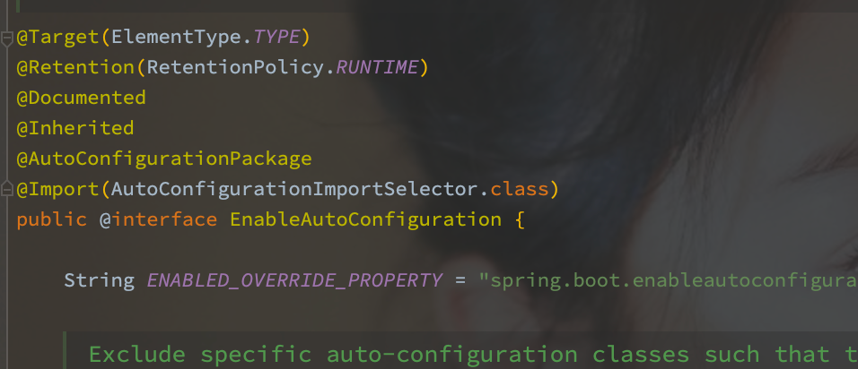
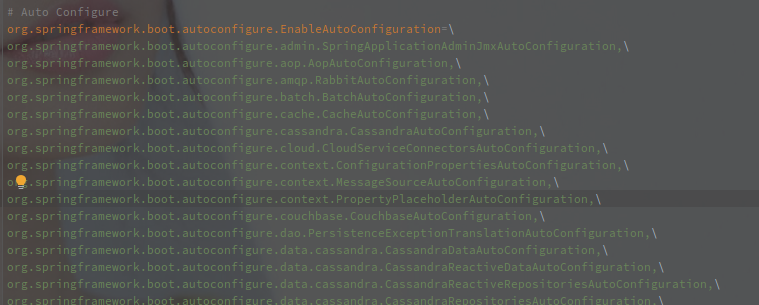
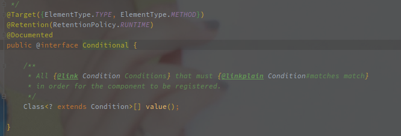
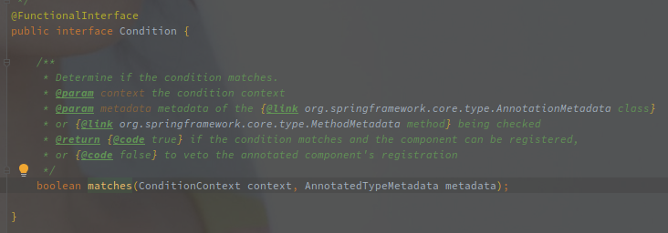

# SpringBoot 的自动化配置

[TOC]


## 概述

自动化配置的意义在于，在 SpringBoot 的应用中，可以通过引入单个启动包（类似 spring-boot-starter-data-redis）就可以完成对某个功能的基础配置。

首先加载主 Configuration 类：

1. 工厂加载模式 - 在 starter 包的 resource 目录下面创建 spring.factories 并添加上定义的主配置类（最终也是通过工厂加载模式加载主配置类。

2. Import 加载 - 定义 EnableXXX 注解，注解中使用 ImportSelector 返回主配置类。

加载到配置类之后，根据主应用到开发环境决定一些 Bean 的加载，使用 Condition 类注解。

另外可以混合使用 @ConfigurationProperties 加载配置项。


## EnableAutoConfiguration

该注解直接标注在 SpringBootApplication 中，所以随着应用的加载就会出发自动化配置。



EnableAutoConifguration 中又包含了 AutoConfigurationImportSelector 的 Import 触发。



import 会在 ConfigurationClassPostProcessor 被解析（该类继承 BeanFactoryPostProcessor 是在 refresh 刚开始就被调用的），然后调用 SpringFactoriesLoader#loadFactory 加载对应配置类。

```java
protected List<String> getCandidateConfigurations(AnnotationMetadata metadata, AnnotationAttributes attributes) {
   List<String> configurations = SpringFactoriesLoader.loadFactoryNames(getSpringFactoriesLoaderFactoryClass(),
         getBeanClassLoader());
   Assert.notEmpty(configurations, "No auto configuration classes found in META-INF/spring.factories. If you "
         + "are using a custom packaging, make sure that file is correct.");
   return configurations;
}
```

SpringFactoriesLoader 指定的顺序就是 META-INF/spring.factories。



以上是 spring-boot-autoconfiguration 包下面的 META-INF/spring.factories 实现。

[SpringBoot 的工厂加载模式](./SpringBoot的工厂加载模式.md)

此时，Configuration 类就已经被加载到 SpringBoot 容器中了。


## ConditionalOnXX 实现

ConditionalOn 用来实现 Bean 的筛选，在自动化配置流程中获取到的 Bean 定义中，只有满足了 ConditionalOn 的才会被真实加载到 BeanFactory 中。

ConditionalOn 的注解依赖于 SpringBoot 提供的元注解 @Conditional。



Conditional 注解中只有指定 Condition 接口实现的数组，用于判断是否可以校验。



Condition 只有 match 方法用于判断当前 Bean 是否应该被加载。


## 总结

SpringBoot 的自动化配置的源头是 @SpringBootApplication 注解，注解中包含了 @EnableAutoConfiguration 注解，该注解包含了一个 @Import，指定了 AutoConfigurationImportSelector 类作为引导类。

> @Import 注解会在 ConfigurationClassPostProcessor 类中被解析，该类继承于 BeanFactoryPostProcessor，会在 BeanFactory#refresh 方法前期就被调用。

AutoConfigurationImportSelector 中会通过 SpringFactoriesLoader（SpringBoot 的工厂加载模式）来获取 classpath 所有 MEAT-INF 目录下的 spring.factories 类中 EnableAutoConfiguration 注解对应的实现类。

