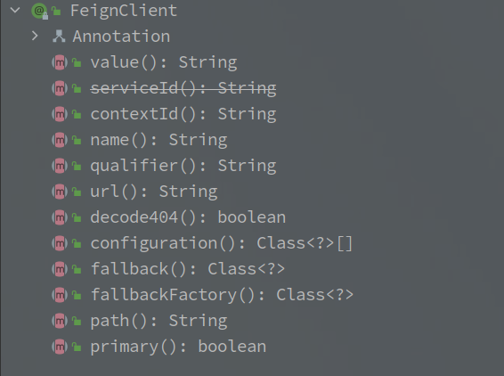
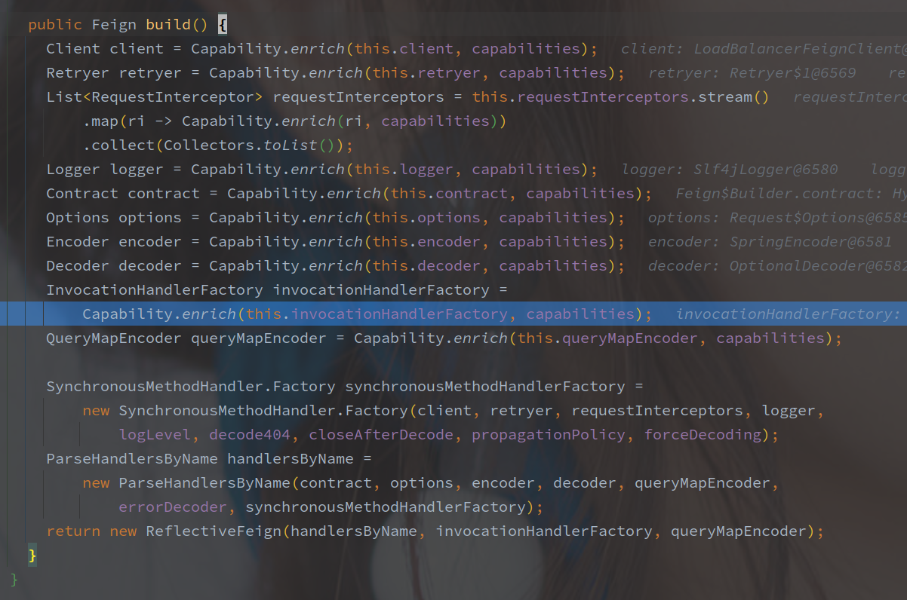
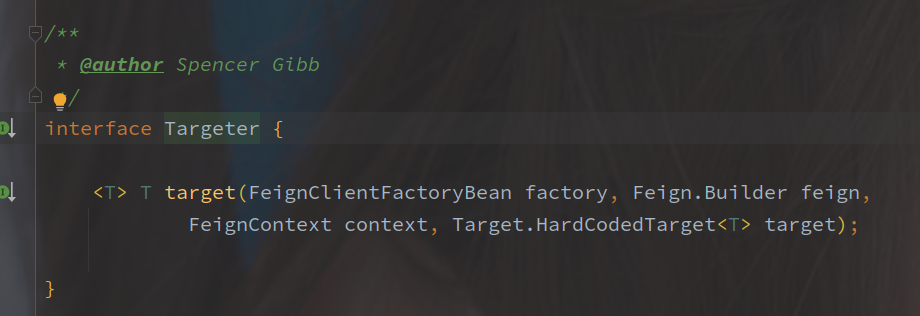
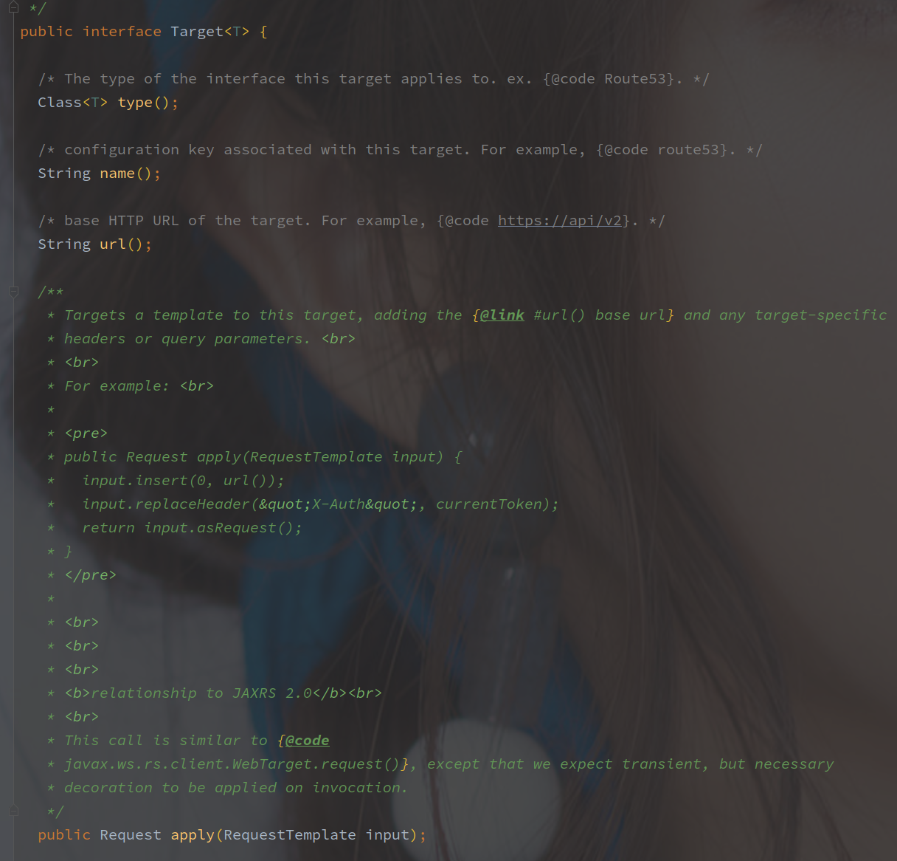
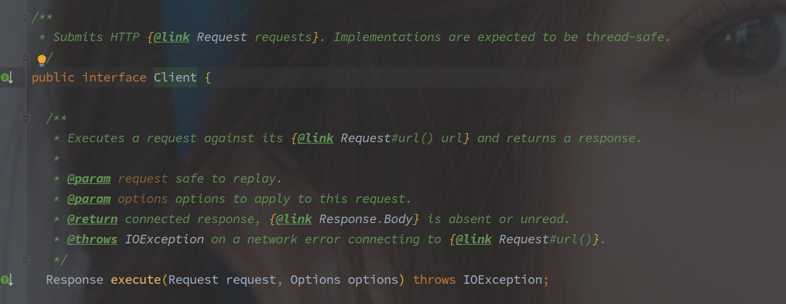
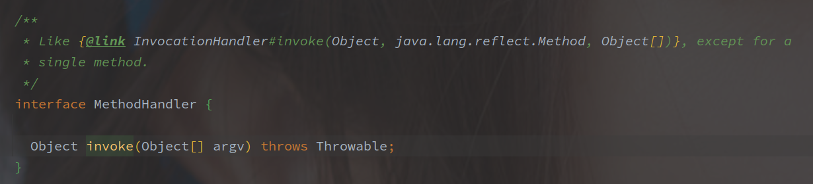

# Feign

> 基于 spring-cloud-openfeign-core-2.2	.4.RELEASE

---

[TOC]

---

## 整体架构图

[图片来源博客 - Feign原理 （图解）](https://www.cnblogs.com/crazymakercircle/p/11965726.html)

## 一、FeignClient 注解

> 该注解就是用来声明一个远程服务的，基于该注解代理整个接口为一个服务调用类。

| 属性名          | 属性含义                                                     |
| --------------- | ------------------------------------------------------------ |
| value           | 服务名称，如果采用 ribbon 会使用该服务名称从注册中心拉取地址 |
| name            | 等同于 value                                                 |
| contextId       | 上下文 Id，默认为服务名称                                    |
| qualifier       | 服务别名                                                     |
| url             | 请求的绝对URL，例如微信的接口，url 就可以定义为：https://api.weixin.qq.com/ |
| decode404       | 对于404异常是否需要解码                                      |
| fallback        | 降级策略，继承定义的接口方法实现就是服务降级的逻辑，实现类需要注册为Bean |
| fallbackFactory | 降级策略工厂，继承定义的接口方法实现就是服务降级的逻辑       |
| path            | 请求地址的统一前缀                                           |
| primary         | 等同于 @Primary 是不是主要的 Bean 对象，默认为 true          |

 

## 相关组件

### FeignContext 

FeignContext 就是 FeignClient 的上下文，保存着每个服务对应的 ApplicationContext，并且该 ApplicationContext 以 SpringBoot 的 ApplicationContext 为父上下文。

为了**每个服务调用之间的配置隔离**，FeignContext **根据服务名字区分**，使用如下四个属性逐次获取：

1. contextId
2. serviceId
3. name
4. value
5. （根据 Bean 对象生成

相同的上下文共用同一套配置类。

Feign 中的配置以 Java Config 类实现，默认的可以参考 **FeignClientsConfiguration**。

相关配置中包含如下：

- **Logger.Level**  - 日志级别
- **Retryer** - 重试方案
- **ErrorDecoder** - 异常编码，将非 200 的调用，转化为本地的异常
- **Request.Options** - 超时时间配置
- **Collection<RequestInterceptor>** - 请求的拦截器
- **Encoder / Decoder** - 请求/响应的编解码器
- 404

等等等等。。。

 

### Feign

Feign 的创建接口，核心方法其实只有一个：

**newInstance 方法用于根据 Contract 创建一个 HTTP API 的代理对象。**

Feign 中的默认实现是 ReflectiveFeign，并且 Feign 的抽象类定义中就包含了默认的 Builder（建造者模式）。

Builder 中持有了大部分的常规配置，包括 Contract 以及 Encode / Decoder，并且基本都是默认配置。

> 源码中好像很少直接调用 Fiegn$Builder#build 方法，而是调用另外一个 target 方法。

通过 build 创建出 Feign 之后，直接 newInstance 出代理对象。

 

### Targeter

> （其实我也不是很理解 Targeter 的作用。
>
> 2022/01/10 - Targeter 是对 Builder 的创建，Builder 用于创建 Feign 对象（类似 ReflectiveFeign / HysrtrixTargeter）。

明面上就是接收 FeignClientFactoryBean 、Feign.Builder 、FeignContext、Tareget 等参数，创建一个最终可用的代理对象，所以简单的理解是一个串联的类。

**Targeter 整合现有资源创建了最终的代理对象。**

targeter 的默认实现如下：

就是调用 Feign.Builder#target 方法。（甚至好几个参数没用上

另外是在 Hystrix 整合的时候，Targeter 通过判断 Feign$Builder 的类型来抽取出  Fallback 相关配置，并创建各自对象。

### Target

**Target 是对被代理对象的封装。**

三个方法返回**被代理的接口，服务名称，请求地址**。

**Target 的默认实现是 HardCodedTarget，默认来首**

### Encoder / Decoder

Feign 的编解码。

### Contract

FeignClient 接口中各方法的上的注解解析。

### Client 

Cleint 接口用于执行请求，并返回结果。

每个 FeignClient 实例都会有一个 Client 的实现，然后由上层将请求包装为 Request 和 Options 的形式进行调用。

**Feign 使用的是装饰器模式**，层层包装完成不同的功能，例如 Ribbon 使用 LoadBalanceFeignClient 完成负载均衡的功能。

### InvocationHandler

> InvocationHandler 严格来说并不算是 SpringCloud 中的相关组件。

InvocationHandler 就是 JDK 中，对于动态代理的实现的关键，Feign 的基本原理就是通过对接口的动态代理转发接口的调用请求，所以 InvocationHandler 也是非常关键的一环。

**Feign 中默认的是  ReflectiveFeign.FeignInvocationHandler，**该类通过工厂模式创建，也就是 InvocationHandlerFactory。

### MethodHandler

Feign 基于动态代理完成的请求转发也是间接的，**InvocationHandler 完成的只是 Method 到 MethodHandler 的映射和转发调用。**

内部还会对每个 FeignClient 中的每个方法都会进行包装，将每个方法包装为一个 MethodHandler。

**MethodHandler 的默认实现是 SynchronousMethodHandler。**

类和 MethodHandler 在 InvocationHandler 中以 dispatch（Map<Method,MethodHandler>）的形式保存。

> 请求调用的粗略过程：

使用 Feign 的调用，首先通过的是接口的 InvocationHandler，通过 Map 映射获取到对应的 MethodHandler。

每个 FeignClient 接口对应一个代理对象，接口中每个方法对应每个 MethodHandler

 

> 老子发现 Feign 很喜欢使用建造者模式或者工厂模式，而且写在一个类里面。
>
> ReflectiveFeign 的创建方法竟然在 Feign$Builder 里面，

 

## 二、Bean 注册流程

> 注册流程就是解析 FeignClient 并且创建 Bean 对象的过程。

FeignClient 会对所有 @FeignClient 注解标注对接口进行代理（必须是接口，并且是从根文件开始逐个类的搜索。

具体的注册逻辑在 FeignClientsRegistrar 中，由 @Import 注解触发。

简单可以分为如下步骤:

> 1. 注册默认的 Feign 配置
> 2. Scanner 扫描指定目录，定位 FeignClient 接口
> 3. 根据 FeignClient 注册对应的 Configuration
> 3. 注册 FeignClientFactoryBean

 

Feign 的注册流程在创建完 FactoryBean 的时候就结束了，实际的代理对象创建在 FactoryBean 的逻辑中。

 

## 三、代理创建流程

 

> 在 Bean 的注册流程可以发现，最终注册的 Bean 对象为 FeignClientFactoryBean 类型。

FeignClientFactoryBean 直接继承了 FatcoryBean（FactoryBean 接口就是 Spring 对**工厂方法模式的实现**，**所有的创建流程包含在 getObject() 方法中**。

**特别需要关注的就是 InvocationHandler 的具体实现（FeignClient 是通过 JDK 动态代理实现的代理模式）。**

创建流程中先获取服务的上下文（如果没有则新建，之后获取 Feign。

Feign 就是 FeignClient 代理对象的创建者，Feign.Builder 就是 Feign 的创建者，通过 Targeter 对象调用 Builder。

Targeter 是在 Feign.Builder 和 代理对象之间一层调用，用于对 Builder 对象进行一定的修改。

例如在 HystrixTargeter 中：

会根据 FactoryBean 中 FallbackFactory 和 Fallback 的配置，转而去调用 HystrixFeign.Builder，借此干预代理对象的创建。

传入的 FallbackFactory 对象进一步传递给 InvocationHandlerFactory 对象，从而干预了代理对象的逻辑（InvocationHandlerFactory 负责创建 JDK 动态代理最重要的 InvocationHandler。

 

## 四、默认服务调用流程

> 通过 JDK 动态代理创建了真实的代理对象之后，具体的服务调用过程。
>
> 基本的 Http 调用以及 **LoadBalance 调用（和 Ribbon 的整合）**，以及**和 Hystrix 的整合过程**。
>
> 有一个需要关注的点就是，Feign 如何映射真实接口方法和具体的功能实现。

## Feign 中的设计模式

 

## 相关参考

[Feign 终级解析](https://mp.weixin.qq.com/s?__biz=MzUwOTk1MTE5NQ==&mid=2247483724&idx=1&sn=03b5193f49920c1d286b56daff8b1a09&chksm=f90b2cf8ce7ca5ee6b56fb5e0ffa3176126ca3a68ba60fd8b9a3afd2fd1a2f8a201a2b765803&token=302932053&lang=zh_CN&scene=21#wechat_redirect)

[Feign原理 （图解）](https://www.cnblogs.com/crazymakercircle/p/11965726.html)

[OpenFeign与Ribbon源码分析总结与面试题](https://juejin.cn/post/6844904200841740302)

[Spring Cloud OpenFeign源码分析](https://blog.csdn.net/baidu_28523317/article/details/106935370)