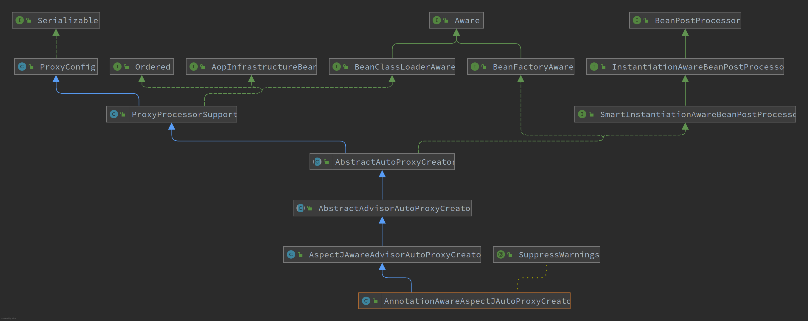
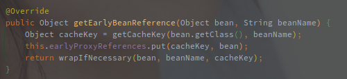
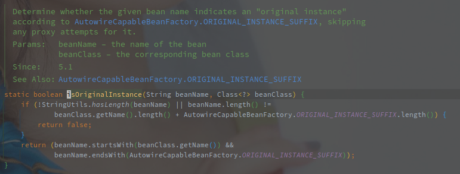
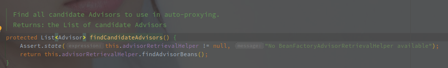
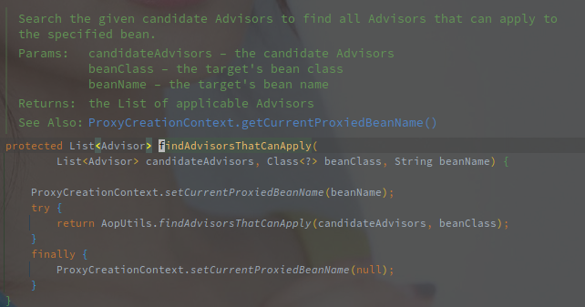

# AnnotationAwareAspectJAutoProxyCreator 

## 类图



该类实现了 SmartInstantiationAwareBeanPostProcessor 接口，通过该接口实现了对容器中 Bean 对象创建过程的钩子。

实现了 ProxyProcessorSupport 类，可以用于创建代理对象，是 Aop 的基础设施类（AopIntrastructureBean）。

> Bean 的代理对象的创建逻辑主要在 AbstractAutoProxyCreator。

另外的实现了 BeanClassLoaderAware 以及 BeanFactoryAware，所以类中包含了当前所在的容器对象。

<br>

AnnotationAwareAspectJAutoProxyCreator 由 AspectJAutoProxyRegistrar 注入到当前容器中，AspectJAutoProxyRegistrar 由 @EnableAspectJAutoProxy 注解触发。

> AspectJAutoProxyRegistrar 主要的作用就是注册并配置 AnnotationAwareAspectJAutoProxyCreator。


## 概述

AbstractAutoProxyCreator 的有效实现包括如下几个方法：（按照可能的调用顺序

1. SmartInstantiationAwareBeanPostProcessor#predictBeanType(Class<?> beanClass, String beanName)
2. SmartInstantiationAwareBeanPostProcessor#getEarlyBeanReference(Object bean, String beanName)
3. InstantiationAwareBeanPostProcessor#postProcessBeforeInstantiation(Class<?> beanClass, String beanName)
4. BeanPostProcessor#postProcessAfterInitialization(Object bean, String beanName)


### predictBeanType - 推断 Bean 的类型

```java
@Override
@Nullable
public Class<?> predictBeanType(Class<?> beanClass, String beanName) {
    // proxyTypes 保存的代理之后的类型
    if (this.proxyTypes.isEmpty()) {
        return null;
    }
    // 获取缓存的 Key，
    // 如果 beanName 不为空则以 beanName 作为 Key，如果是 FatcoryBean 则加上 &
    //  beanName 为空的时候以 beanClass 作为 Key
    Object cacheKey = getCacheKey(beanClass, beanName);
    // 从缓存中获取
    return this.proxyTypes.get(cacheKey);
}
```

proxyTypes 中保存的是对代理对象的映射，**该缓存在代理对象创建之后添加。**


<br>


### getEarlyBeanReference - 获取早期引用



获取缓存的 Key，并且会**添加原始 bean 实例（未经过属性填充和初始化的对象）到 earlyProxyReferences** ，之后尝试代理该对象。


### wrapIfNecessary - 尝试创建代理对象

```java
//  AbstractAutoProxyCreator#wrapIfNecessary
protected Object wrapIfNecessary(Object bean, String beanName, Object cacheKey) {
    // targetSourcedBeans 保存的是自定义 TargetSource 创建之后填充的
    // 如果 targetSourcedBeans 存在该 Bean 表示已经创建过该代理
    if (StringUtils.hasLength(beanName) && this.targetSourcedBeans.contains(beanName)) {
        return bean;
    }
    // 这里可以表明 advisedBeans 为 FALSE 的时候，是可以跳过创建
    if (Boolean.FALSE.equals(this.advisedBeans.get(cacheKey))) {
        return bean;
    }
    // 创建的 Class 是基础类型或者需要跳过当前创建流程
    if (isInfrastructureClass(bean.getClass()) || shouldSkip(bean.getClass(), beanName)) {
        // 设置缓存，下次可以跳过
        this.advisedBeans.put(cacheKey, Boolean.FALSE);
        return bean;
    }
    // 获取切到当前对象拦截器？
    Object[] specificInterceptors = getAdvicesAndAdvisorsForBean(bean.getClass(), beanName, null);
    if (specificInterceptors != DO_NOT_PROXY) {
        this.advisedBeans.put(cacheKey, Boolean.TRUE);
        Object proxy = createProxy(
            bean.getClass(), beanName, specificInterceptors, new SingletonTargetSource(bean));
        this.proxyTypes.put(cacheKey, proxy.getClass());
        return proxy;
    }
	// 创建过一次之后就直接跳过了
    this.advisedBeans.put(cacheKey, Boolean.FALSE);
    return bean;
}
```

首先是四类判断，判断对象是否可以被跳过。

第一类 targetSourceBeans，该缓存在自定义 TargetSource 创建之后添加。

第二类 advisedBeans 直接表明需要跳过本地代理创建流程。

第三类判断是否是基础类型（包括 Pointcut、Advisor、Advice、AopInfrastructureBean，因此可以通过继承该类跳过代理流程

第四类算是模板方法模式，可以让子类自定义其跳过代理的逻辑。

```java
// AspectJAwareAdvisorAutoProxyCreator#shouldSkip 
@Override
protected boolean shouldSkip(Class<?> beanClass, String beanName) {
	// 获取候选的所有 Advisor 
   List<Advisor> candidateAdvisors = findCandidateAdvisors();
    // 遍历所有的 AspectJPointcutAdvisor
   for (Advisor advisor : candidateAdvisors) {
      if (advisor instanceof AspectJPointcutAdvisor &&
            ((AspectJPointcutAdvisor) advisor).getAspectName().equals(beanName)) {
         return true;
      }
   }
   return super.shouldSkip(beanClass, beanName);
}
```

如果此时创建的 Bean 对象被 AspectJPointcutAdvisor 切到就返回 TRUE，则直接跳过当前对象的代理创建。

之后在根据父级方法判断，父级方法直接调用的 AutoProxyUtils.isOriginalInstance(beanName, beanClass)。



根据类名称判断，如果是以 ORIGINAL_INSTANCE_SUFFIX 为结尾的话就需要跳过。

> **在被 AspectJPointcutAdvisor 切到或者 BeanName 以 ORIGINAL_INSTANCE_SUFFIX 结尾的时候需要跳过。**

<br>

#### getAdvicesAndAdvisorsForBean - 获取合适的 Advice

> 在 wrapIfNecessary 方法前面的判断中排除了不需要代理的情况，跑到这里的时候就已经开始准备创建代理对象了。

创建的第一步就是获取合适的 Advice，通过 Pointcut 判断。

> Pointcut 包括 ClassFilter 以及 MethodMatcher 两类。

```java
// AbstractAdvisorAutoProxyCreator#getAdvicesAndAdvisorsForBean
// 传入的参数包括是 Bean 类型，名称，以及 TargetSource（从 wrapIfNecessary 中调用是 targetSource 为空
protected Object[] getAdvicesAndAdvisorsForBean(Class<?> beanClass, String beanName, @Nullable TargetSource targetSource) {
    // 找到合格的 Advisor 
    List<Advisor> advisors = findEligibleAdvisors(beanClass, beanName);
    if (advisors.isEmpty()) {
        return DO_NOT_PROXY;
    }
    return advisors.toArray();
}

// 找到合格的 Advisor 
protected List<Advisor> findEligibleAdvisors(Class<?> beanClass, String beanName) {
    // 找到所有备选的 Advisor
    List<Advisor> candidateAdvisors = findCandidateAdvisors();
   // 从 Advisor 中找到可应用的（canApply
    List<Advisor> eligibleAdvisors = findAdvisorsThatCanApply(candidateAdvisors, beanClass, beanName);
    // 扩展 Advisor
    extendAdvisors(eligibleAdvisors);
    // 排序
    if (!eligibleAdvisors.isEmpty()) {
        eligibleAdvisors = sortAdvisors(eligibleAdvisors);
    }
    return eligibleAdvisors;
}

// 找到所有备选的 Advisor
protected List<Advisor> findCandidateAdvisors() {
    Assert.state(this.advisorRetrievalHelper != null, "No BeanFactoryAdvisorRetrievalHelper available");
    // 借由 AdvisorRetrievalHelper 找到所有 Advisor 的 Bean 对象（AdvisorRetrievalHelper  包含 BeanFactory
    return this.advisorRetrievalHelper.findAdvisorBeans();
}
```


> 找到所有备选的 Advisor 的方法：（由 AnnotationAwareAspectJAutoProxyCreator 继承实现

```java
// AnnotationAwareAspectJAutoProxyCreator#findCandidateAdvisors
@Override
protected List<Advisor> findCandidateAdvisors() {
   // Add all the Spring advisors found according to superclass rules.
    // 调用父类方法获取所有可用的 Advisor
   List<Advisor> advisors = super.findCandidateAdvisors();
   // Build Advisors for all AspectJ aspects in the bean factory.
   if (this.aspectJAdvisorsBuilder != null) {
       // 调用 aspectJAdvisorsBuilder 增加部分 Advisor
      advisors.addAll(this.aspectJAdvisorsBuilder.buildAspectJAdvisors());
   }
   return advisors;
}
```

首先会调用父类的 findCandidateAdvisors() 方法：



直接调用的 BeanFactoryAdvisorRetrievalHelper#findAdvisorBeans：

```java

// BeanFactoryAdvisorRetrievalHelper#findAdvisorBeans
public List<Advisor> findAdvisorBeans() {
    // Determine list of advisor bean names, if not cached already.
    // 获取缓存中的名称
    String[] advisorNames = this.cachedAdvisorBeanNames;
    // 缓存为空则需重新获取
    if (advisorNames == null) {
        // Do not initialize FactoryBeans here: We need to leave all regular beans
        // uninitialized to let the auto-proxy creator apply to them!
        // 获取所有的 Advisor 类（包括 Advisor 的子类
        advisorNames = BeanFactoryUtils.beanNamesForTypeIncludingAncestors(
            this.beanFactory, Advisor.class, true, false);
        this.cachedAdvisorBeanNames = advisorNames;
    }
    // 短路，为空直接退出
    if (advisorNames.length == 0) {
        return new ArrayList<>();
    }
    List<Advisor> advisors = new ArrayList<>();
    for (String name : advisorNames) {
        if (isEligibleBean(name)) {
            if (this.beanFactory.isCurrentlyInCreation(name)) {
               //  logger
            }else {
				// 初始化并获取 Bean 对象
                try {
                    advisors.add(this.beanFactory.getBean(name, Advisor.class));
                }catch (BeanCreationException ex) {
                    throw ex;
                }
            }
        }
    }
    return advisors;
}
```

**候选的 Advisor 就是所有当前 BeanFactory 下的 Advisor 类 Bean。**

另外的就是本地的 BeanFactoryAspectJAdvisorsBuilder 创建的 Advisor：

```java
// BeanFactoryAspectJAdvisorsBuilder#buildAspectJAdvisors
public List<Advisor> buildAspectJAdvisors() {
    // 缓存的 Bean 对象
    List<String> aspectNames = this.aspectBeanNames;
    if (aspectNames == null) {
        synchronized (this) {
            aspectNames = this.aspectBeanNames;
            if (aspectNames == null) {
                List<Advisor> advisors = new ArrayList<>();
                aspectNames = new ArrayList<>();
                String[] beanNames = BeanFactoryUtils.beanNamesForTypeIncludingAncestors(
                    this.beanFactory, Object.class, true, false);
                for (String beanName : beanNames) {
                    if (!isEligibleBean(beanName)) {
                        continue;
                    }
                    // We must be careful not to instantiate beans eagerly as in this case they
                    // would be cached by the Spring container but would not have been weaved.
                    Class<?> beanType = this.beanFactory.getType(beanName);
                    if (beanType == null) {
                        continue;
                    }
                    if (this.advisorFactory.isAspect(beanType)) {
                        aspectNames.add(beanName);
                        AspectMetadata amd = new AspectMetadata(beanType, beanName);
                        if (amd.getAjType().getPerClause().getKind() == PerClauseKind.SINGLETON) {
                            MetadataAwareAspectInstanceFactory factory =
                                new BeanFactoryAspectInstanceFactory(this.beanFactory, beanName);
                            List<Advisor> classAdvisors = this.advisorFactory.getAdvisors(factory);
                            if (this.beanFactory.isSingleton(beanName)) {
                                this.advisorsCache.put(beanName, classAdvisors);
                            }
                            else {
                                this.aspectFactoryCache.put(beanName, factory);
                            }
                            advisors.addAll(classAdvisors);
                        }
                        else {
                            // Per target or per this.
                            if (this.beanFactory.isSingleton(beanName)) {
                                throw new IllegalArgumentException("Bean with name '" + beanName +
                                                                   "' is a singleton, but aspect instantiation model is not singleton");
                            }
                            MetadataAwareAspectInstanceFactory factory =
                                new PrototypeAspectInstanceFactory(this.beanFactory, beanName);
                            this.aspectFactoryCache.put(beanName, factory);
                            advisors.addAll(this.advisorFactory.getAdvisors(factory));
                        }
                    }
                }
                this.aspectBeanNames = aspectNames;
                return advisors;
            }
        }
    }
    if (aspectNames.isEmpty()) {
        return Collections.emptyList();
    }
    List<Advisor> advisors = new ArrayList<>();
    for (String aspectName : aspectNames) {
        List<Advisor> cachedAdvisors = this.advisorsCache.get(aspectName);
        if (cachedAdvisors != null) {
            advisors.addAll(cachedAdvisors);
        }
        else {
            MetadataAwareAspectInstanceFactory factory = this.aspectFactoryCache.get(aspectName);
            advisors.addAll(this.advisorFactory.getAdvisors(factory));
        }
    }
    return advisors;
}
```


> 过滤 Advisor 的方法：



对当前的 Bean 名称使用 ThreadLocal 缓存，并且使用 AopUtils.findAdvisorsThatCanApply 对所有备选进行过滤。

```java
// AopUtils.findAdvisorsThatCanApply(candidateAdvisors, beanClass)
public static List<Advisor> findAdvisorsThatCanApply(List<Advisor> candidateAdvisors, Class<?> clazz) {
    // 入参为空短
    if (candidateAdvisors.isEmpty()) {
        return candidateAdvisors;
    }
    List<Advisor> eligibleAdvisors = new ArrayList<>();
    for (Advisor candidate : candidateAdvisors) {
        if (candidate instanceof IntroductionAdvisor && canApply(candidate, clazz)) {
            eligibleAdvisors.add(candidate);
        }
    }
    boolean hasIntroductions = !eligibleAdvisors.isEmpty();
    for (Advisor candidate : candidateAdvisors) {
        if (candidate instanceof IntroductionAdvisor) {
            // already processed
            continue;
        }
        if (canApply(candidate, clazz, hasIntroductions)) {
            eligibleAdvisors.add(candidate);
        }
    }
    return eligibleAdvisors;
}

// AopUtils.canApply
public static boolean canApply(Advisor advisor, Class<?> targetClass) {
    return canApply(advisor, targetClass, false);
}

// AopUtils.canApply
public static boolean canApply(Advisor advisor, Class<?> targetClass, boolean hasIntroductions) {
    // IntroductionAdvisor 只包含 ClassFilter
    if (advisor instanceof IntroductionAdvisor) {
        // 获取 ClassFilter 去匹配当前的类
        return ((IntroductionAdvisor) advisor).getClassFilter().matches(targetClass);
    // 包含 Pointcut 的 Advisor，所以 ClassFilter 和 MethodMatch 都需要匹配
    } else if (advisor instanceof PointcutAdvisor) {
        PointcutAdvisor pca = (PointcutAdvisor) advisor;
        return canApply(pca.getPointcut(), targetClass, hasIntroductions);
    }   else {
        // It doesn't have a pointcut so we assume it applies.
        // 没有过滤器就默认是通用的
        return true;
    }
}
```

