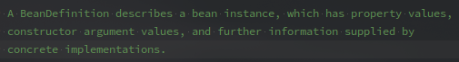
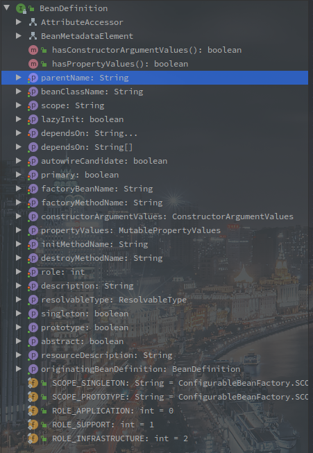
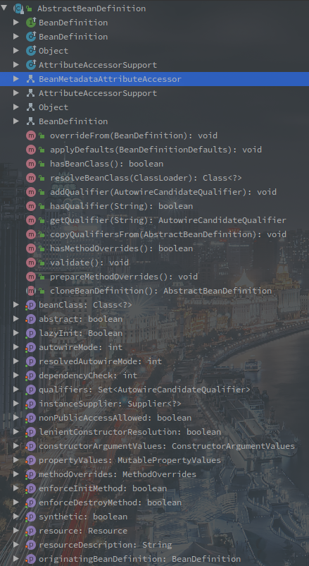

# BeanDefinition类族简介

> BeanDefinition即为Bean定义，是IOC容器的基本类族，每一个Bean对象都会有一份BeanDefinition，保存其基本信息。

如下是BeanDefinition主要的类图：

<!-- more -->

---

[TOC]

## BeanDefinition 接口

**BeanDefinition定义了基本的Bean信息。**

Spring中的Bean信息都会BeanDefinition的对象的形式保存，一个BeanDefinition对应一个Bean。

BeanDefinition的类注释如下：

 

翻译如下：一个BeanDefinition对象描述了Bean的实例，属性值，构造的参数值，或者进一步提供

以下是所有BeanDefinition的方法和变量图：

 

可以看到BeanDefinition同时继承了AttributeAccessor和BeanMetadataElement接口。

并提供了属性的SetXXX方法。

其中的属性包括：

1. Bean名称
2. 父类Bean名称
3. 是否懒加载
4. 依赖bean
5. 是否Primary
6. 作用域
7. 等

BeanDefinition可以说是Spring中蛮基础的一个类了，Bean的创建过程中也会依据BeanDefinition的属性进行各种配置。

## AnnotatedBeanDefinition 接口 - 包含注解的BeanDefinition

 

AnnotatedBeanDefinition是BeanDefinition的扩展，直接继承了BeanDefinition，并扩展了AnnotationMetadata的获取方法。

## AbstractBeanDefinition - 抽象的BeanDefinition

也是BeanDefinition接口的子类，实现了一个基本的方法，并添加了包括Qualifier在内的一些属性配置，和工具方法。

 

## GenericBeanDefinition - 泛型的BeanDefinition定义

相较于AbstractBeanDefinition抽象类，该类声明了成员变量`parentName`