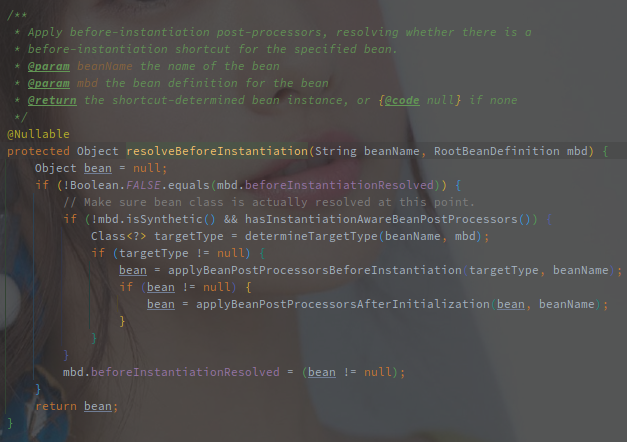
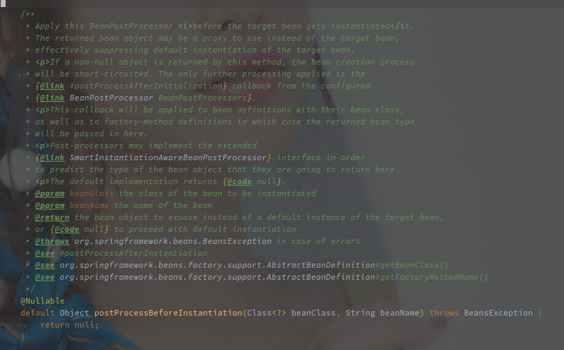

# Spring 中 Bean 对象的创建流程

---

[TOC]

---


## 概述

Spring 将 Bean 对象的创建分为了两大块内容:

1. 实例化 - 根据 BeanDefinition 创建具体的实例对象
2. 初始化 - 对创建的实例对象进行一系列的配置

在以上两个步骤中再穿插着各类 BeanPostProcessor 的调用，就组成了 Bean 对象基本的创建流程。

> 再细化的话还有属性填充，不过此处也可以归为 Bean 的初始化。


<br>


> 在 AbstractBeanFactory#getBean 的源码实现中，AbstractBeanFactory#createBean 被包装为 ObjectFactory ，作为核心的创建 Bean 实例的逻辑传入。

## 源码实现

```java
// AbstractBeanFactory#createBean
protected Object createBean(String beanName, RootBeanDefinition mbd, @Nullable Object[] args)
      throws BeanCreationException {
   RootBeanDefinition mbdToUse = mbd;
   // 解析出 Class 对象
   Class<?> resolvedClass = resolveBeanClass(mbd, beanName);
   // 塞回到 BeanDefinition 
   if (resolvedClass != null && !mbd.hasBeanClass() && mbd.getBeanClassName() != null) {
      mbdToUse = new RootBeanDefinition(mbd);
      mbdToUse.setBeanClass(resolvedClass);
   }

   // Prepare method overrides.
   // 处理方法覆写（应该也没啥使用场景了
   try {
      mbdToUse.prepareMethodOverrides();
   }  catch (BeanDefinitionValidationException ex) {}

   try {
       // 调用 InstantiationAwareBeanPostProcessor#postProcessBeforeInstantiation 尝试自定义实例化
       // 如果实例化成功，则跳过后续的流程，直接执行 BeanPostProcessor#postProcessAfterInitialization
      Object bean = resolveBeforeInstantiation(beanName, mbdToUse);
       // 创建成功则直接返回
      if (bean != null) {
         return bean;
      }
   } catch (Throwable ex) {}

   try {
       // 采用框架的实例化方法创建实例
      Object beanInstance = doCreateBean(beanName, mbdToUse, args);
      return beanInstance;
   } catch (BeanCreationException | ImplicitlyAppearedSingletonException ex) {}
      catch (Throwable ex) {}
}
```

以上是创建 Bean 实例的最上层代码。

### 解析 Class 对象


### 处理 Override 方法

> 方法的覆写已经没什么使用场景了，忽略吧。

### 执行前置实例化方法

> 这里是 Spring 提供的 Callback 方法，用于用户实现自定义的 Bean 创建。

前置化实例方法就是 InstantiationAwareBeanPostProcessor#postProcessBeforeInstantiation 是 Spring 框架中提供的一种钩子方法，供用户实现自定义的 Bean 实例化过程。 



方法的逻辑如下：

1. 执行  **InstantiationAwareBeanPostProcessor#postProcessBeforeInstantiation** 创建失败则直接返回
2. 创建成功继续执行 **BeanPostProcessor#postProcessAfterInitialization（后置初始化方法**

> **即使是自定义的实例化，后置的初始化方法还是会执行的。**

<br>

标题的前置实例化方法就是指 **InstantiationAwareBeanPostProcessor#postProcessBeforeInstantiation**，该方法用于自定义类的实例化过程。



该方法在对象实例化之前被调用，返回的结果可能是代理用来代替原始的 Bean，如果返回不为 NULL 的对象则可以跳过默认的实例化方式。

（可以和 SmartInstantiationAwareBeanPostProcessor 联合使用推断返回的类型。

> **AbstractAutoProxyCreator 实现了该方法，用于对有自定义 TargetSource 的类进行代理对象的创建。**

<br>

而 **BeanPostProcesspr#postProcessAfterInitialization** 则是在初始化完毕之后调用的钩子方法。


在 Bean 初始化完毕之后调用（初始化例如 InitializingBean#afterPropertiesSet 以及自定义的 init-method），Bean 实例已经填充（populated）完毕，返回的 Bean 实例可能是包装了原始的 Bean。

在 FactoryBean 对象创建以及 FactoryBean 内部对象的创建都会被调用。

通过 InstantiationAwareBeanPostProcessor#postProcessBeforeInstantiation 也会被调用。


> **AbstractAutoProxyCreator 同样实现了该方法，用于代理对象的创建。**
>
> 另外 ApplicationListenerDetector 实现了该方法，用于将 ApplicationListener 的 Bean 添加到 ApplicationContext。


之后就是框架提供了创建逻辑（框架会更具 BeanDefinition 来决定具体的创建和初始化方式。

### doCreateBean - Spring 的 Bean 创建逻辑

```java
// AbstractAutowireCapableBeanFactory#doCreateBean
protected Object doCreateBean(String beanName, RootBeanDefinition mbd, @Nullable Object[] args)
    throws BeanCreationException {
    // Instantiate the bean.
    // Bean 的实例化
    BeanWrapper instanceWrapper = null;
    // 如果是单例，尝试从缓存中获取对象 
    if (mbd.isSingleton()) {
        instanceWrapper = this.factoryBeanInstanceCache.remove(beanName);
    }
   // 执行实际的实例化方法
    if (instanceWrapper == null) {
        instanceWrapper = createBeanInstance(beanName, mbd, args);
    }
    // 获取到真实的 Bean 对象
    Object bean = instanceWrapper.getWrappedInstance();
    Class<?> beanType = instanceWrapper.getWrappedClass();
    if (beanType != NullBean.class) {
        mbd.resolvedTargetType = beanType;
    }

    // 调用 BeanDefinition 合并的后置处理器
    synchronized (mbd.postProcessingLock) {
        if (!mbd.postProcessed) {
            try {
                applyMergedBeanDefinitionPostProcessors(mbd, beanType, beanName);
            } catch (Throwable ex) {}
            mbd.postProcessed = true;
        }
    }

    // Eagerly cache singletons to be able to resolve circular references
    // even when triggered by lifecycle interfaces like BeanFactoryAware.
    // 暴露早期引用，用于解决循环依赖问题
    boolean earlySingletonExposure = (mbd.isSingleton() && this.allowCircularReferences &&  isSingletonCurrentlyInCreation(beanName));
    if (earlySingletonExposure) {
        addSingletonFactory(beanName, () -> getEarlyBeanReference(beanName, mbd, bean));
    }

    // Initialize the bean instance.
    // 接下来就是初始化的逻辑
    Object exposedObject = bean;
    try {
        // 填充属性
        populateBean(beanName, mbd, instanceWrapper);
        // 初始化
        exposedObject = initializeBean(beanName, exposedObject, mbd);
    }catch (Throwable ex) { }

    if (earlySingletonExposure) {
        Object earlySingletonReference = getSingleton(beanName, false);
        if (earlySingletonReference != null) {
            if (exposedObject == bean) {
                exposedObject = earlySingletonReference;
            } else if (!this.allowRawInjectionDespiteWrapping && hasDependentBean(beanName)) {
                String[] dependentBeans = getDependentBeans(beanName);
                Set<String> actualDependentBeans = new LinkedHashSet<>(dependentBeans.length);
                for (String dependentBean : dependentBeans) {
                    if (!removeSingletonIfCreatedForTypeCheckOnly(dependentBean)) {
                        actualDependentBeans.add(dependentBean);
                    }
                }
                if (!actualDependentBeans.isEmpty()) {}
            }
        }
    }
    // Register bean as disposable.
    // 注册注销时的钩子方法
    try {
        registerDisposableBeanIfNecessary(beanName, bean, mbd);
    }
    catch (BeanDefinitionValidationException ex) { }

    return exposedObject;
}
```

（方法也是很长啊...

方法的简略流程如下：

1. 实例化对象（对象会通过框架提供了的几种方法进行实例化
2. 早期对象的提前暴露（没有完成属性填充和初始化的
3. 填充实例属性
4. 初始化实例对象
5. 注册注销方法


#### 实例化 Bean 对象

```java
// AbstractAutowireCapableBeanFactory#createBeanInstance
protected BeanWrapper createBeanInstance(String beanName, RootBeanDefinition mbd, @Nullable Object[] args) {
    // 重新获取 Class 对象，确保已经解析出可用的 Class 类
    Class<?> beanClass = resolveBeanClass(mbd, beanName);
    if (beanClass != null && !Modifier.isPublic(beanClass.getModifiers()) && !mbd.isNonPublicAccessAllowed()) {
    // Bean 不能为空 || 类可修改 || 类允许访问非 public 的构造方法
    }
    // 1. 使用 Supplier 接口实例化
    Supplier<?> instanceSupplier = mbd.getInstanceSupplier();
    if (instanceSupplier != null) {
        return obtainFromSupplier(instanceSupplier, beanName);
    }
    // 2. 使用工厂方法实例化（ FactoryMethod
    if (mbd.getFactoryMethodName() != null) {
        return instantiateUsingFactoryMethod(beanName, mbd, args);
    }
    // Shortcut when re-creating the same bean...
    // 短路策略，使用缓存尝试跳过实例化之前的解析流程流程
    boolean resolved = false;
    boolean autowireNecessary = false;
    if (args == null) {
        synchronized (mbd.constructorArgumentLock) {
            if (mbd.resolvedConstructorOrFactoryMethod != null) {
                resolved = true;
                autowireNecessary = mbd.constructorArgumentsResolved;
            }
        }
    }
    // 确定解析过该对象，则直接走实例化流程
    if (resolved) {
        if (autowireNecessary) {
            return autowireConstructor(beanName, mbd, null, null);
        } else {
            return instantiateBean(beanName, mbd);
        }
    }
    // 走到这里就是无缓存可用的场景了，需要当场创建
    // Candidate constructors for autowiring?
    // 使用 SmartInstantiationAwareBeanPostProcessor#determineCandidateConstructors 推断预备的构造函数
    // Spring 默认提供的主要是 AutowiredAnnotationBeanPostProcessor，
    // 会选择 Primary 或者 Autowired 标注的构造函数，如果仅仅只有一个构造函数也就直接选择
    Constructor<?>[] ctors = determineConstructorsFromBeanPostProcessors(beanClass, beanName);
    if (ctors != null || mbd.getResolvedAutowireMode() == AUTOWIRE_CONSTRUCTOR ||
        mbd.hasConstructorArgumentValues() || !ObjectUtils.isEmpty(args)) {
        return autowireConstructor(beanName, mbd, ctors, args);
    }

    // Preferred constructors for default construction?
    // 获取首选的构造函数
    ctors = mbd.getPreferredConstructors();
    if (ctors != null) {
        return autowireConstructor(beanName, mbd, ctors, null);
    }

    // No special handling: simply use no-arg constructor.
    // 使用无参构造函数
    return instantiateBean(beanName, mbd);
}
```

官方提供的实例化方法有如下几种：

1. Supplier 接口
2. FactoryMethod 方法
3. 含参构造函数
5. 无参构造函数


[AutowiredAnnotationBeanPostProcessor - 构造函数的选择](beanpostprocessor/AutowiredAnnotationBeanPostProcessor源码分析.md)

