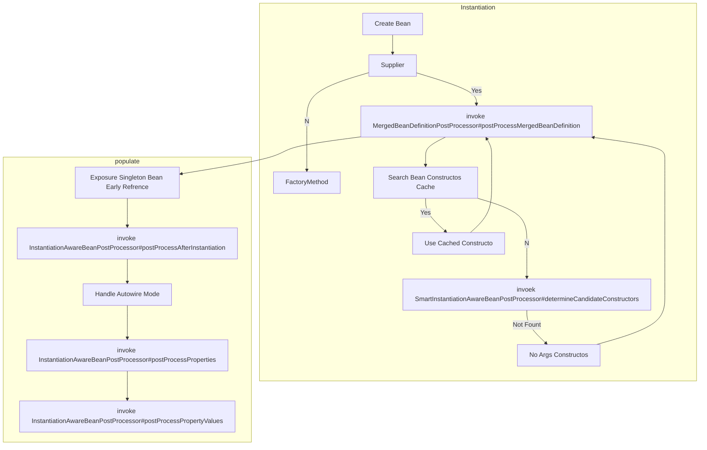

# Bean 对象的获取和创建

## Bean（单例）的获取流程

1. AbstractBeanFactory#doGetBean
2. 解析 Bean 名称（去除$等）
3. 从缓存中获取目标 Bean，singletonObjects / earlySingletonObjects / singletonFactories （singletonFactories 是在 Bean 实例化成功之后塞进去的 ObjectFactory 对象，用于早期引用的暴露。
4. 获取成功之后根据 Bean 的类型解析，如果是 FactoryBean 则调用 getObject 方法，不是则直接返回
5. 当前容器没有该对象，尝试从父容器获取 
6. 从父容器中获取失败，则开始尝试在当前容器创建
7. 获取 BeanDefinition，此时会合并父子 Bean（XML 时期的遗留产物，目前父子 Bean 的形式基本过时
8. 处理 DependsOn（@DependOn 强依赖注解或者配置文件
9. 前后标记正在创建，然后开始创建流程（创建流程在 doCreateBean 中
10. 创建成功之后经过类型转换，最终返回

> 父上下文的 Bean 会和子上下文共享。
>
> 三级缓存解决了部分循环依赖问题，之所以是部分是因为实例化选择带参构造函数的时候循环依赖无法解决。

## Bean（单例）的创建流程

1. AbstractAutowiredCapableBeanFactory#createBean（起手式
2. 获取 Class 对象（基本就是 Class.forName 方法
3. 处理 Ovriride 方法（类似 Lookup 注解，最终解析的就是 LookupOverride，还有 ReplaceOverride
4. **InstantiationAwareBeanPostProcessor#postProcessBeforeInstantiation(Class<?> beanClass, String beanName)** （可以自定义实现对象的创建流程
   - 创建成功，继续执行 **BeanPostProcessor#applyBeanPostProcessorsAfterInitialization(Object existingBean, String beanName)**（**然后就直接退出了**，所以该方法算是兜底
5. AbstractAutowiredCapableBeanFactory#doCreateBean （灭有自己的创建流程就走官方提供的。

> 官方提供的创建流程包含以下三个部分：
>
> 1. 实例化（会有不同的方式，也有自定义的扩展点，自定义构造函数推断
> 2. 属性填充（填充前会有钩子方法修改 BeanDefinition，以及暴露早期引用，填充第一步就是调用实例化后置的钩子方法，之后会有 AutowiredMode 的处理，并且会有 postProcessProperties 和  postProcessPropertyValues 两类钩子的执行
> 3. 初始化（先处理部分的 Aware，在处理初始化前置钩子（这里面也会处理 Aware），调用初始化方法，包括 InitializingBean 和 自定义的 Init-Method，在执行初始化后置钩子

6. 先尝试获取缓存，没有获取到则实例化具体对象，返回 BeanWrapper，包括如下几种方法：
   - Supplier
   - FactoryMethod（factory-method，以及 @Bean 标注在方法上（标注的方法就作为 FactoryMethod）
   - Constructor（借由 **SmartInstantiationAwareBeanPostProcessor#determineCandidateConstructors(Class<?> beanClass, String beanName)** 推断出构造函数，没有走默认的无参
7. **MergedBeanDefinitionPostProcessor#postProcessMergedBeanDefinition(RootBeanDefinition beanDefinition, Class<?> beanType, String beanName)** 可以在初始化前修改 BeanDefinition（基本同时期调用的还有实例化后置钩子，区别就在于入参是 BeanDefinition，**而当前钩子入参没有 Bean 对象**
   - 之后可能需要提前暴露早期引用（对于单例），通过 **SmartInstantiationAwareBeanPostProcessor#getEarlyBeanReference(Object bean, String beanName**)
8. **开始填充属性**，调用 **InstantiationAwareBeanPostProcessor#postProcessAfterInstantiation(Object bean, String beanName)** （实例化后置钩子
9. 处理 AutowireMode（此处不确定来源，其一有 @Bean 解析的 autowired 属性），会直接使用当前容器的对象，按照 byType / byName 两种方式，此时并未具体填充，解析出来的依赖暂存 PropertyValues 对象
10. 执行 **InstantiationAwareBeanPostProcessor#postProcessProperties(PropertyValues pvs, Object bean, String beanName)** （属性填充钩子，返回的属性和上一步的合并，传入的 Bean 也可以直接填充，Autowired 的实现好像是直接塞到 Bean 实例的
11. 返回为空，进一步执行 **InstantiationAwareBeanPostProcessor#postProcessPropertyValues( PropertyValues pvs, PropertyDescriptor[] pds, Object bean, String beanName)**（该方法已被标记过时，pds 是经过筛选的待填充的属性
12. **开始初始化实例**，先处理部分的 Aware 接口（这里只处理部分，后续的会用钩子处理
13. 执行 **BeanPostProcessor#postProcessBeforeInitialization(Object bean, String beanName)** ，初始化前置钩子（这里也会对部分 Aware 进行处理，传入了 Bean
14. 真实的初始化 Bean 对象，包含如下两种：
    - **如果 Bean 实现了InitializingBean 会调用 InitializingBean#afterPropertiesSet**
    - 调用自定义的钩子方法（可以再 Init-Method 中指定，XML 和 @Bean 中都有
15. 执行 **BeanPostProcessor#postProcessAfterInitialization(Object bean, String beanName)** 初始化之后对 Bean 的自定义改动
16. 注册 DisposableBean

### 相关参考

[BeanPostProcessor相关类](beanpostprocessor/BeanPostProcessor类族概述.md)