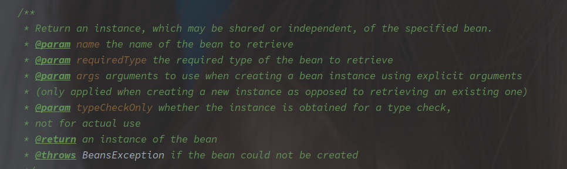
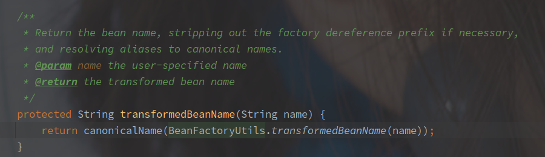
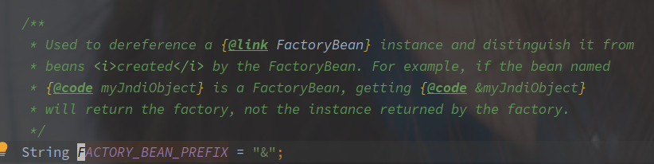
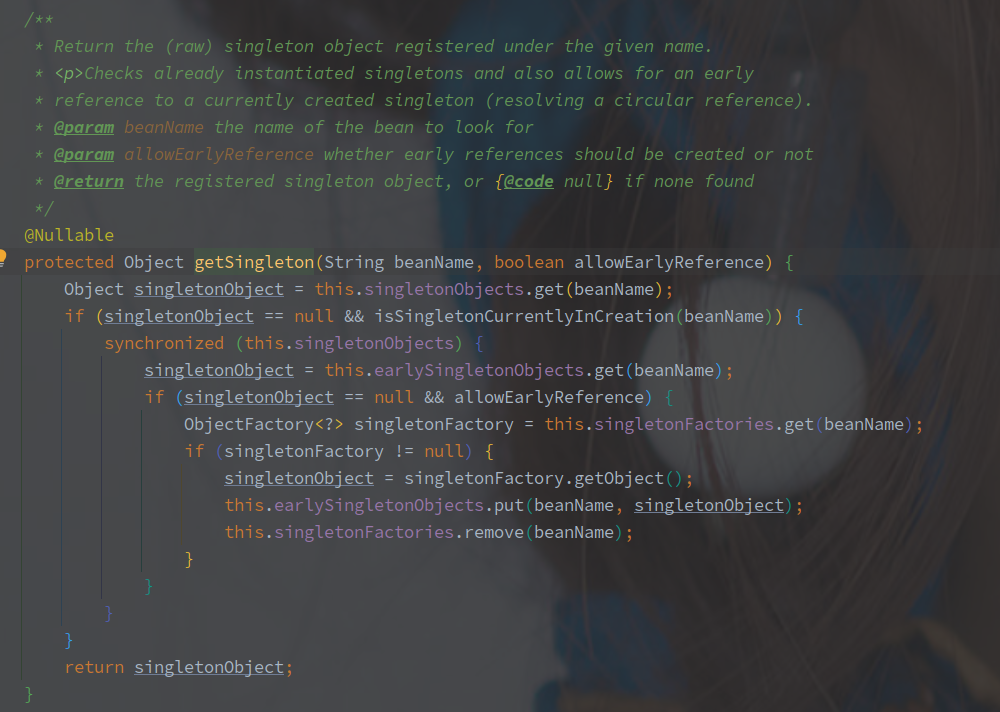

# Spring 中 Bean 对象的获取流程

---

[TOC]

---


## 概述

Spring 提供的 IOC 模块，可以简单的理解为一个 Map，里面包含了 BeanName / BeanType -> Bean 的映射。


## doGetBean - 获取 Bean 

（源码长成一匹马了，淦

```java
// AbstractBeanFactory#doGetBean
protected <T> T doGetBean(String name, @Nullable Class<T> requiredType, @Nullable Object[] args, boolean typeCheckOnly)
    throws BeansException {
    // 名字转换，去除 & 并且转换别名到真实的 Bean 名称
    String beanName = transformedBeanName(name);
    Object bean;
   // 从缓存中获取，此中的缓存包括三层
    Object sharedInstance = getSingleton(beanName);
    if (sharedInstance != null && args == null) {
        // ...
        // 转换获取的实例，如果是 ObjectFactory 或者 FactoryBean 则需要进一步完成创建
        bean = getObjectForBeanInstance(sharedInstance, name, beanName, null);
    }else {
        // Fail if we're already creating this bean instance:
        // We're assumably within a circular reference.
        // 如果是 Property 类型的 Bean 对象，并且处于创建流程
        if (isPrototypeCurrentlyInCreation(beanName)) {
            throw new BeanCurrentlyInCreationException(beanName);
        }
        // Check if bean definition exists in this factory.
        // 获取父 BeanFactory
        BeanFactory parentBeanFactory = getParentBeanFactory();
       // 父类不为空并且当前的 BeanFactory 不包含 beanName 对应的 Bean 对象
        if (parentBeanFactory != null && !containsBeanDefinition(beanName)) {
            // Not found -> check parent.
            // 去除 Bean 名称带的 & 前缀
            String nameToLookup = originalBeanName(name);
            // 尝试从父容器获取对象，创建的流程也在父容器完成
            
            // 下面是四种父 BeanFactory 的调用方式
            if (parentBeanFactory instanceof AbstractBeanFactory) {
                return ((AbstractBeanFactory) parentBeanFactory).doGetBean(
                    nameToLookup, requiredType, args, typeCheckOnly);
            }  else if (args != null) {
                // Delegation to parent with explicit args.
                return (T) parentBeanFactory.getBean(nameToLookup, args);
            }  else if (requiredType != null) {
                // No args -> delegate to standard getBean method.
                return parentBeanFactory.getBean(nameToLookup, requiredType);
            } else {
                return (T) parentBeanFactory.getBean(nameToLookup);
            }
        }
	
        // 是否需要检查类型
        if (!typeCheckOnly) {
            markBeanAsCreated(beanName);
        }

        try {
            // 获取 BeanDefinition，已经经过合成
            RootBeanDefinition mbd = getMergedLocalBeanDefinition(beanName);
            // 检查 BeanDefinition
            checkMergedBeanDefinition(mbd, beanName, args);
	   		// 解决 Bean 对象的显式依赖问题，显示依赖是无法解决循环依赖的
            // Guarantee initialization of beans that the current bean depends on.
            String[] dependsOn = mbd.getDependsOn();
            if (dependsOn != null) {
                for (String dep : dependsOn) {
                    if (isDependent(beanName, dep)) {
                        throw new BeanCreationException(mbd.getResourceDescription(), beanName,
                                                        "Circular depends-on relationship between '" + beanName + "' and '" + dep + "'");
                    }
                    registerDependentBean(dep, beanName);
                    try {
                        getBean(dep);
                    }  catch (NoSuchBeanDefinitionException ex) {
                        throw new BeanCreationException(mbd.getResourceDescription(), beanName,
                                                        "'" + beanName + "' depends on missing bean '" + dep + "'", ex);
                    }
                }
            }

            // Create bean instance.
            // 单例 Bean 的创建
            if (mbd.isSingleton()) {
                sharedInstance = getSingleton(beanName, () -> {
                    try {
                        // Bean 的创建流程
                        return createBean(beanName, mbd, args);
                    }
                    catch (BeansException ex) {
                        // Explicitly remove instance from singleton cache: It might have been put there
                        // eagerly by the creation process, to allow for circular reference resolution.
                        // Also remove any beans that received a temporary reference to the bean.
                        destroySingleton(beanName);
                        throw ex;
                    }
                });
                // 进一步完成 Bean 的创建
                bean = getObjectForBeanInstance(sharedInstance, name, beanName, mbd);
            }else if (mbd.isPrototype()) {
                // Propertype 类型的 Bean 的创建
                // It's a prototype -> create a new instance.
                Object prototypeInstance = null;
                try {
                    beforePrototypeCreation(beanName);
                    prototypeInstance = createBean(beanName, mbd, args);
                }  finally {
                    afterPrototypeCreation(beanName);
                }
                bean = getObjectForBeanInstance(prototypeInstance, name, beanName, mbd);
            } else {
                // 其他声明周期的 Bean 的创建
                String scopeName = mbd.getScope();
                // ...
                // Scope 是否有注册
                Scope scope = this.scopes.get(scopeName);
                // ...
                try {
                    // 通过自定义的 Scope 生命周期去初始化 Bean 对象
                    Object scopedInstance = scope.get(beanName, () -> {
                        // 还是标记创建，创建，去除标记的流程
                        beforePrototypeCreation(beanName);
                        try {
                            return createBean(beanName, mbd, args);
                        }   finally {
                            afterPrototypeCreation(beanName);
                        }
                    });
                    bean = getObjectForBeanInstance(scopedInstance, name, beanName, mbd);
                }   catch (IllegalStateException ex) {
                }
            }
        }  catch (BeansException ex) {
            cleanupAfterBeanCreationFailure(beanName);
            throw ex;
        }
    }

    // Check if required type matches the type of the actual bean instance.
    // 进行 Bean 的类型转换，如果无法转化抛出异常。
    if (requiredType != null && !requiredType.isInstance(bean)) {
        try {
            T convertedBean = getTypeConverter().convertIfNecessary(bean, requiredType);
            if (convertedBean == null) {
                throw new BeanNotOfRequiredTypeException(name, requiredType, bean.getClass());
            }
            return convertedBean;
        } catch (TypeMismatchException ex) {
        }
    }
    return (T) bean;
}
```

> 整体流程整理如下：

1. 转换 BeanName
2. 尝试从缓存中获取（三级缓存
3. 尝试从父容器中获取（当存在父容器，并且当前容器不存在相应的 BeanDefinition 时
4. 获取 BeanDefinition 并合并（开启当前容器的创建流程
5. 处理 DependsOn 注解（

### doGetBean 相关参数



简单翻译如下：

| 参数名称      | 参数类型 | 参数含义                                                   |
| ------------- | -------- | ---------------------------------------------------------- |
| name          | String   | Bean 名称，前缀为 & 直接获取 FactoryBean，可以使用别名     |
| requiredType  | Class    | Bean 的类型，不为空时方法会帮忙进行类型转换                |
| args          | Object[] | 创建的参数集合，用于创建的时候实例化  Bean                 |
| typeCheckOnly | Boolean  | 是否仅仅用于类型检查，如果仅用于检查则不需要标记为正在创建 |


###  转换 BeanName



转换实际包含了两个步骤：

1. 去除 & 前缀 - BeanFactoryUtil#transformedBeanName
2. 别名转换 - SimpleAliasRegistry#canonicalName

去除 & 前缀的逻辑非常简单，也加了缓存避免多次处理字符串，其中 & 的含义是：



**灭有 & 前缀表示获取真实的对象，即使是 FactoryBean 也会进一步调用 FactoryBean#getObejct，而带有 & 的 beanName 表示直接获取 FactoryBean。**

别名转换的逻辑也不难，就是拿 aliasMap 反复转换到获取不到就好。


### BeanFactory 的三级缓存



该方法中涉及的三级缓存如下：

| 缓存名称              | 缓存作用                                                     |
| --------------------- | ------------------------------------------------------------ |
| singletonObjects      | 存放完全创建完毕的对象                                       |
| earlySingletonObjects | 存放早期的引用对象                                           |
| singletonFactories    | 存放 ObjectFactory 对象，对于单例对象一般默认在创建的时候会先添加到该类。 |

> 添加到 singletonFactory 的 ObjectFactory 是借由 Lambda 表示的 AbstractAutowireCapableBeanFactory#getEarlyBeanReference 方法的调用。


### 处理 FactoryBean 对象

缓存中获取的 Bean 对象可能是最终的也可能是 FactoryBean 对象，此时就需要进一步判断需要获取的对象。

获取规则如下：

1. & 前缀的 BeanName 表示获取 FactoryBean 对象
2. 无 & 前缀表示获取真实对象，如果是 FactoryBean 则进一步调用 FactoryBean#getObjcet 方法。

```java
protected Object getObjectForBeanInstance(
      Object beanInstance, String name, String beanName, @Nullable RootBeanDefinition mbd) {

   // Don't let calling code try to dereference the factory if the bean isn't a factory.
    // 根据 BeanName 判断是否为 BeanFactory
   if (BeanFactoryUtils.isFactoryDereference(name)) {
       // 如果属于 NullBean 直接返回
      if (beanInstance instanceof NullBean) {
         return beanInstance;
      }
       // 名称带 & 前缀但是对象不是 FactoryBean 类型直接抛出异常
      if (!(beanInstance instanceof FactoryBean)) {
         throw new BeanIsNotAFactoryException(beanName, beanInstance.getClass());
      }
      if (mbd != null) {
         mbd.isFactoryBean = true;
      }
       // 直接返回 FactoryBean
      return beanInstance;
   }
	// 如果不是 FactoryBean，则直接返回
   if (!(beanInstance instanceof FactoryBean)) {
      return beanInstance;
   }
  // 到这里 Bean 肯定是 FactoryBean 类型
   Object object = null;
   if (mbd != null) {
      mbd.isFactoryBean = true;
   }  else {
       // 从缓存中获取
      object = getCachedObjectForFactoryBean(beanName);
   }
    // 缓存中没有则直接创建，最终会调用 FactoryBean#getObject 方法
   if (object == null) {
      // Return bean instance from factory.
      FactoryBean<?> factory = (FactoryBean<?>) beanInstance;
      // Caches object obtained from FactoryBean if it is a singleton.
      if (mbd == null && containsBeanDefinition(beanName)) {
         mbd = getMergedLocalBeanDefinition(beanName);
      }
      boolean synthetic = (mbd != null && mbd.isSynthetic());
      object = getObjectFromFactoryBean(factory, beanName, !synthetic);
   }
   return object;
}
```

整个的逻辑就是根据 name 判断最终类型。（这个前缀的约定有点粗暴啊

#### 调用 FactoryBean#getObject 

该流程方法就是从 FactoryBean 中获取真实的对象。

[FactoryBean](spring/spring-core/ioc/FactoryBean.md)

```java
// FactoryBeanRegistrySupport#getObjectFromFactoryBean
// shouldPostProcess 表示是否需要执行 BeanPostProcess
protected Object getObjectFromFactoryBean(FactoryBean<?> factory, String beanName, boolean shouldPostProcess) {
    // 是否是单例对象，是否已经创建过
    if (factory.isSingleton() && containsSingleton(beanName)) {
        // 上锁
        synchronized (getSingletonMutex()) {
            /// 再次查询缓存
            Object object = this.factoryBeanObjectCache.get(beanName);
            // 为空则继续调用 FactoryBean#getObject 方法
            if (object == null) {
                // 调用 FactoryBean#getObejct，如果为空包装为 NullBean 返回
                object = doGetObjectFromFactoryBean(factory, beanName);
                // Only post-process and store if not put there already during getObject() call above
                // (e.g. because of circular reference processing triggered by custom getBean calls)
                // 以否已经存在
                Object alreadyThere = this.factoryBeanObjectCache.get(beanName);
                if (alreadyThere != null) {
                    object = alreadyThere;
                } else {
                    if (shouldPostProcess) {
                        if (isSingletonCurrentlyInCreation(beanName)) {
                            // Temporarily return non-post-processed object, not storing it yet..
                            return object;
                        }
                        // 标记已经开始创建
                        beforeSingletonCreation(beanName);
                        try {
                            // 调用 postProcessAfterInitialization 初始化后置方法
                            object = postProcessObjectFromFactoryBean(object, beanName);
                        }  catch (Throwable ex) {
                        }  finally {
                            // 标记创建结束
                            afterSingletonCreation(beanName);
                        }
                    }
                    if (containsSingleton(beanName)) {
                        this.factoryBeanObjectCache.put(beanName, object);
                    }
                }
            }
            return object;
        }
    }  else {
        // 非单例模式的创建，不需要缓存
        Object object = doGetObjectFromFactoryBean(factory, beanName);
        if (shouldPostProcess) {
            try {
                object = postProcessObjectFromFactoryBean(object, beanName);
            }  catch (Throwable ex) {
            }
        }
        return object;
    }
}
```

**单例和非单例的 FactoryBean 的调用流程就是是否使用缓存（换句话来说，就是通过 Map 作为注册表来保证 Bean 的单例性。**

 

> 在从三级缓存获取一波之后，如果存在父容器并且当前容器不存在对应的 BeanDefinition 则直接委托给父容器。
>
> 如果当前容器存在 BeanDefinition，则直接进入到创建流程。


### 获取合成的 BeanDefinition

BeanDefinition 的合**成对象就是父子 BeanDefinition**。（不确定在注解形式下能否定义

```java
// AbstractBeanFactory#getMergedBeanDefinition
// containingBd 是包含的 Bean 定义
protected RootBeanDefinition getMergedBeanDefinition(
      String beanName, BeanDefinition bd, @Nullable BeanDefinition containingBd)
      throws BeanDefinitionStoreException {
    // mergedBeanDefinitions 存放的是 beanName -> 合并的 BeanDefinition 
    // 整体上锁
   synchronized (this.mergedBeanDefinitions) {
      RootBeanDefinition mbd = null;
      RootBeanDefinition previous = null;

      // Check with full lock now in order to enforce the same merged instance.
      if (containingBd == null) {
          // 尝试从缓存中获取
         mbd = this.mergedBeanDefinitions.get(beanName);
      }

      if (mbd == null || mbd.stale) {
         previous = mbd;
          // 没有父容器就不需要合并
         if (bd.getParentName() == null) {
            // Use copy of given root bean definition.
            // 复制基础的 BeanDefinition
            if (bd instanceof RootBeanDefinition) {
               mbd = ((RootBeanDefinition) bd).cloneBeanDefinition();
            } else {
               mbd = new RootBeanDefinition(bd);
            }
         }  else {
             // 存在父 BeanDefinition
             // 此时就要将父子的 BeanDefinition 合并
            // Child bean definition: needs to be merged with parent.
            BeanDefinition pbd;
            try {
                // 精简父 BeanDefinition 的 BeanName
               String parentBeanName = transformedBeanName(bd.getParentName());
               if (!beanName.equals(parentBeanName)) {
                   // 获取父 BeanDefinition
                  pbd = getMergedBeanDefinition(parentBeanName);
               }  else {
                  BeanFactory parent = getParentBeanFactory();
                  if (parent instanceof ConfigurableBeanFactory) {
                     pbd = ((ConfigurableBeanFactory) parent).getMergedBeanDefinition(parentBeanName);
                  }   else {
                     throw new NoSuchBeanDefinitionException(parentBeanName,
                           "Parent name '" + parentBeanName + "' is equal to bean name '" + beanName +
                           "': cannot be resolved without an AbstractBeanFactory parent");
                  }
               }
            }  catch (NoSuchBeanDefinitionException ex) {
            }
            // Deep copy with overridden values.
            mbd = new RootBeanDefinition(pbd);
            mbd.overrideFrom(bd);
         }

         // Set default singleton scope, if not configured before.
         if (!StringUtils.hasLength(mbd.getScope())) {
            mbd.setScope(SCOPE_SINGLETON);
         }

         // A bean contained in a non-singleton bean cannot be a singleton itself.
         // Let's correct this on the fly here, since this might be the result of
         // parent-child merging for the outer bean, in which case the original inner bean
         // definition will not have inherited the merged outer bean's singleton status.
         if (containingBd != null && !containingBd.isSingleton() && mbd.isSingleton()) {
            mbd.setScope(containingBd.getScope());
         }

         // Cache the merged bean definition for the time being
         // (it might still get re-merged later on in order to pick up metadata changes)
         if (containingBd == null && isCacheBeanMetadata()) {
            this.mergedBeanDefinitions.put(beanName, mbd);
         }
      }
      if (previous != null) {
         copyRelevantMergedBeanDefinitionCaches(previous, mbd);
      }
      return mbd;
   }
}
```

该方法很长不过全部都是对于 BeanDefinition 的处理。（父子 Bean 应该基本也不用了把。


### 处理 DependsOn 依赖项

主要是根据解析出来的 BeanDefinition，然后遍历 @DependsOn 的数组，获取每个依赖的 Bean 对象。

对于 DependsOn，会保存依赖和被依赖双向的映射关系（都是多对多的。

> 处理完以上流程之后就开始 Bean 对象的创建流程，根据 Scope 的不同会有不同的创建方式。

DependsOn 注解指定的依赖无法避免循环依赖的问题。

<br>

### 单例 Bean 的创建

说是单例 Bean，但其实并没有使用常规的单例实现方式，而是**采用一种注册表的形式**。

简单来说，注册表就是一个 Map，通过同步的判断 Map 是否存在 Bean 对象的形式判断实例是否已经创建，仅仅保证在容器范围内只有单个类实例（相当简陋，你如果愿意是可以自行创建对象的。

```java
// DefaultSingletonBeanRegistry#getSingleton
public Object getSingleton(String beanName, ObjectFactory<?> singletonFactory) {
    // 再次尝试从缓存中获取
    Object singletonObject = this.singletonObjects.get(beanName);
    // 标记创建，使用的是 singletonsCurrentlyInCreation（Set）
    beforeSingletonCreation(beanName);
    // 真实的创建逻辑
    singletonObject = singletonFactory.getObject();
    // 去除创建标记
    afterSingletonCreation(beanName);
    // 添加缓存
    if (newSingleton) {
        addSingleton(beanName, singletonObject);
    }
    return singletonObject;
}
```

DefaultSingletonBeanRegistry#getSingleton 原始代码很长，但掐头去尾就是上面的内容，创建对象并添加缓存。

**ObjectFactory 就是以 createBean 的 Lambda 调用形式，**所以 Bean 的创建流程就在 AbstractBeanFactory#createBean 中。

[Bean 的创建流程](/home/chen/_note/spring/core/ioc/Bean对象的创建流程.md)

<br>

### 原型 Bean 的创建

原型 Bean 的创建和单例 Bean 的区别就在于是否会先查询缓存，原型 Bean 会直接调用  AbstractBeanFactory#createBean。

<br>

### 自定义的 Scope 创建


### 总结

> 整体的获取流程？

（相当重要，面试高频

1. 名称转换（去除 & 前缀，别名转换
2. 从三层缓存中获取，并解开包装对象（ObjectFactory 或者 FactoryBean）
3. 从父容器中获取（父容器会和子容器共享 Bean 
4. 获取 BeanDefinition，并合并（父子 Bean 关系基本无人再用
5. 处理 @DependsOn（该依赖在创建之前就要解决，所以其中的循环依赖无法解决
6. 创建 BeanDefinition


> 三级缓存的作用：

一般理解上缓存一层就够了，单个 Map 就可以保存创建好的对象。

二级缓存是为了保存提前暴露的引用，用于解决循环依赖问题

三次缓存中缓存的是 ObjectFactory，用于包裹对象整个的创建流程


> 父子容器之间的关系

子容器可以获取到父容器的 Bean 对象，可以理解为子容器共享父类的 Bean 对象。

父子容器的具体实现如下：

1. Spring MVC 容器以启动的 SpringBoot 容器为父容器
2. SpringCloud 会在 SpringBoot 环境对象构造好之后初始化，并作为 SpringBoot 容器的父容器
3. Feign 中每个服务都会创建一个上下文，以 SpringBoot 容器作为父容器

