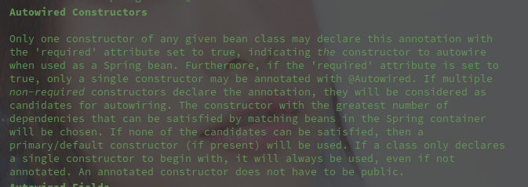
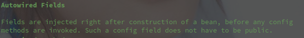
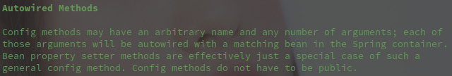
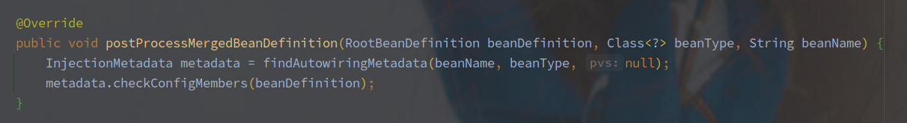

# AutowiredAnnotationBeanPostProcessor 

## 概述


AutowiredAnnotationBeanPostProcessor 是非常重要的一个 BeanPostProcessor，它的作用主要有如下几种：

> 一、 选择自动装配的构造函数

实现了 SmartInstantiationAwareBeanPostProcessor#determineCandidateConstructors 方法，用于在对象的实例化过程中选择指定的构造函数。



具体规则如上：

只有一个构造函数可以被标明为 `Autowired(require = true)`，此时就会选择改构造函数，如果多个构造函数声明为 `Autowired(require = false)`，它们会成为候选者，会从中选择最多依赖被满足调用。

如果没有后选择全部满足则选择 @Primary （default 是什么鬼）标注的构造函数。

如果该类只有一个构造函数，那么就时钟会使用该构造函数进行实例化，即使它没有注解。

另外注意，构造函数并不一定需要是 public。


> 二、 属性的自动装配



在实例化之后，配置之前调用，用于装配被 Autowired 标注的属性。

属性不需要声明为 public。


> 三、方法的自动装配



方法中任意名称和数量的参数会从 Spring 容器中找到对应的 Bean，Setter 方法只是众多使用的一个特例（非 Setter 方法也可以注入。

方法同样也不需要为 public。

<br>

由 AutowiredAnnotationBeanPostProcessor 处理的注解如下:

| 注解名称   | 注解作用                                                   |
| ---------- | ---------------------------------------------------------- |
| @Autowired | 属性注入，可以标注在方法，属性，构造函数，方法参数等       |
| @Value     | 动态的依赖注入，基于表达式解析，可以标注于参数，属性，方法 |
| @Inject    | 属性注入，同 @Autowired                                    |
| @Lookup    | 仅可以标注于方法，相当于 BeanFactory#getBean               |

<br>


## 推断构造函数 - determineCandidateConstructors

```java
@Override
@Nullable
public Constructor<?>[] determineCandidateConstructors(Class<?> beanClass, final String beanName)
    throws BeanCreationException {
    // Let's check for lookup methods here...
    if (!this.lookupMethodsChecked.contains(beanName)) {
        // 类中是否包含 Lookup 注解
        if (AnnotationUtils.isCandidateClass(beanClass, Lookup.class)) {
            try {
                Class<?> targetClass = beanClass;
                do {
                    // 遍历类中的所有方法
                    ReflectionUtils.doWithLocalMethods(targetClass, method -> {
                        Lookup lookup = method.getAnnotation(Lookup.class);
                        if (lookup != null) {
                            // 存在 Lookup 注解的情况，重写改方法替换为从 LookupOverride
                            LookupOverride override = new LookupOverride(method, lookup.value());
                            try {
                                RootBeanDefinition mbd = (RootBeanDefinition)
                                    this.beanFactory.getMergedBeanDefinition(beanName);
                                mbd.getMethodOverrides().addOverride(override);
                            }
                        }
                    });
                    targetClass = targetClass.getSuperclass();
                }while (targetClass != null && targetClass != Object.class);
            } catch (IllegalStateException ex) { }
        }
        this.lookupMethodsChecked.add(beanName);
    }
    // Quick check on the concurrent map first, with minimal locking.
    // 尝试从缓存中获取，使用最小的缩锁范围
    Constructor<?>[] candidateConstructors = this.candidateConstructorsCache.get(beanClass);
    if (candidateConstructors == null) {
        // 双重锁获取
        synchronized (this.candidateConstructorsCache) {
            candidateConstructors = this.candidateConstructorsCache.get(beanClass);
            if (candidateConstructors == null) {
                Constructor<?>[] rawCandidates;
                try {
                    // 获取所有的构造函数
                    rawCandidates = beanClass.getDeclaredConstructors();
                }catch (Throwable ex) {}
                List<Constructor<?>> candidates = new ArrayList<>(rawCandidates.length);
                Constructor<?> requiredConstructor = null,defaultConstructor = null;
                // 推断主要的构造函数
                Constructor<?> primaryConstructor = BeanUtils.findPrimaryConstructor(beanClass);
                int nonSyntheticConstructors = 0;
                for (Constructor<?> candidate : rawCandidates) {
                    if (!candidate.isSynthetic()) {
                        nonSyntheticConstructors++;
                    }  else if (primaryConstructor != null) {
                        continue;
                    }
                    // 查找自定注入的注解
                    // 主要就是 @Autowired 和 @Inject
                    MergedAnnotation<?> ann = findAutowiredAnnotation(candidate);
                    // 没有找到注解，进一步在原始类里面找，如果有的话
                    if (ann == null) {
                        // 找到用户类，没经过 CGLIB 等修饰的原始类
                        Class<?> userClass = ClassUtils.getUserClass(beanClass);
                        if (userClass != beanClass) {
                            try {
                                Constructor<?> superCtor =userClass.getDeclaredConstructor(candidate.getParameterTypes());
                                ann = findAutowiredAnnotation(superCtor);
                            }  catch (NoSuchMethodException ex) {}
                        }
                    }
                    if (ann != null) {
                        // 存在多个必要的构造函数，多个 Autowired 标注的构造函数
                        // 不能存在多个必要构造函数
                        if (requiredConstructor != null) {}
                        boolean required = determineRequiredStatus(ann);
                        if (required) {
                            // 有必要构造函数时候不应该有别的候选者
                            if (!candidates.isEmpty()) { }
                            requiredConstructor = candidate;
                        }
                        // 存在自动注入注解的就是候选者
                        candidates.add(candidate);
                        // 默认的构造函数就是无参构造
                    } else if (candidate.getParameterCount() == 0) {
                        defaultConstructor = candidate;
                    }
                }
                if (!candidates.isEmpty()) {
                    // 如果存在必要构造函数
                    if (requiredConstructor == null) {
                        // 将无参构造加入到候选者
                        if (defaultConstructor != null) {
                            candidates.add(defaultConstructor);
                        }   else if (candidates.size() == 1 && logger.isInfoEnabled()) {
                        	// 只有一个候选者的时候，
                        }
                    }
                    candidateConstructors = candidates.toArray(new Constructor<?>[0]);
                } else if (rawCandidates.length == 1 && rawCandidates[0].getParameterCount() > 0) { 
                    // 只有一个含参构造
                    candidateConstructors = new Constructor<?>[] {rawCandidates[0]};
                }  else if (nonSyntheticConstructors == 2 && primaryConstructor != null &&
                         defaultConstructor != null && !primaryConstructor.equals(defaultConstructor)) {
                    // 只有主要构造函数和默认的无参构造函数
                    candidateConstructors = new Constructor<?>[] {primaryConstructor, defaultConstructor};
                } else if (nonSyntheticConstructors == 1 && primaryConstructor != null) {
                    // 主要构造函数是 Kotlin 中指定5的
                    candidateConstructors = new Constructor<?>[] {primaryConstructor};
                } else {
                    candidateConstructors = new Constructor<?>[0];
                }
                this.candidateConstructorsCache.put(beanClass, candidateConstructors);
            }
        }
    }
    return (candidateConstructors.length > 0 ? candidateConstructors : null);
}
```

该方法的主要作用就是推断构造函数，提供上层方法的实例化作用。

**额外的处理了 Lookup 注解，使用 LookupOverride 表示方法被复写。**

> Lookup 该注解用于查找对应类型的 Bean 对象，标注该注解的方法会被容器“重写”，最终的调用会使用 BeanFactory#getBean 来获取对应的返回。
>
> 默认 Lookup 由 AutowiredAnnotationBeanPostProcessor 唯一处理。

AutowiredAnnotationBeanPostProcessor 中包含了对应的缓存，可以跳过解析的流程（所以实例化所用的构造函数是一开始就确定不变的？

从所有的构造函数中选择标注了自动注入的注解的，**Autowired(required = false) 为候选者，Autowired(required=true) 为必要，无参构造为默认，Kotlin 中可以指定主要构造函数。**

以下两种情况会直接抛出异常：

1. 多个必要构造函数
2. 存在必要构造函数时，同时存在需要自动注入的构造函数

<br>

选择的时候，如果存在必要函数就返回该函数（因为如果存在别的函数就抛异常了。

如果没有自动注入函数，并且存在唯一含参构造函数就选它，另外的还有主要和默认两种构造函数。


## 查找并构建自动注入元数据



这是 findAutowiringMetadata() 方法首次调用的时机，实现的是 MergedBeanDefinitionPostProcessor#postProcessMergedBeanDefinition。

**具体的调用实际在 Bean 实例化成功后，并且未填充属性和初始化之前。**


findAutowiringMetadata() 方法就是在真实的 InjectionMetadata 创建的方法上增加了一层缓存。

（直接来看 buildAutowiringMetadata() 方法吧。

```java
// MergedBeanDefinitionPostProcessor#buildAutowiringMetadata
// 仅仅使用 Class 对象作为入参
private InjectionMetadata buildAutowiringMetadata(final Class<?> clazz) {
    // 该类是否包含 autowiredAnnotationTypes 中表示的注解
    // 默认包含 @Authwired 和 @Value 以及 @Inject 三类注解
   if (!AnnotationUtils.isCandidateClass(clazz, this.autowiredAnnotationTypes)) {
      return InjectionMetadata.EMPTY;
   }
   List<InjectionMetadata.InjectedElement> elements = new ArrayList<>();
   Class<?> targetClass = clazz;
   do {
      final List<InjectionMetadata.InjectedElement> currElements = new ArrayList<>();
       // 遍历所有的本地属性
      ReflectionUtils.doWithLocalFields(targetClass, field -> {
          // 找到包含的 AutowiredAnnotation（就是 @Authwired 或者 @Value
         MergedAnnotation<?> ann = findAutowiredAnnotation(field);
         if (ann != null) {
             // ！！！静态方法不包含
            if (Modifier.isStatic(field.getModifiers())) {
               return;
            }
             // 是否必要，此处解析的是注解的 required 属性
            boolean required = determineRequiredStatus(ann);
             // 保存，使用 AutowiredFieldElement 描述一个本地变量的自动注入元数据
            currElements.add(new AutowiredFieldElement(field, required));
         }
      });
      // 遍历本地方法
      ReflectionUtils.doWithLocalMethods(targetClass, method -> {
          // 解析方法 （bridged 好像是一种 JVM 的修改手段 
         Method bridgedMethod  = BridgeMethodResolver.findBridgedMethod(method);
         if (!BridgeMethodResolver.isVisibilityBridgeMethodPair(method, bridgedMethod)) {
            return;
         }
          // 继续查找 AutowiredAnnotation
         MergedAnnotation<?> ann = findAutowiredAnnotation(bridgedMethod);
         if (ann != null && method.equals(ClassUtils.getMostSpecificMethod(method, clazz))) {
             // 静态方法同样不适用自动注入
            if (Modifier.isStatic(method.getModifiers())) {
               return;
            }
             // 方法没有参数也会被添加
            if (method.getParameterCount() == 0) {}
             // 是否必要
            boolean required = determineRequiredStatus(ann);
             // 找到方法对应的 PropertyDescriptor 
             // ？ 这里代码很多，好像是会整个类一起解析
            PropertyDescriptor pd = BeanUtils.findPropertyForMethod(bridgedMethod, clazz);
             // 以 AutowiredMethodElement 保存结果
            currElements.add(new AutowiredMethodElement(method, required, pd));
         }
      });

      elements.addAll(0, currElements);
      // 继续往父类找 
      targetClass = targetClass.getSuperclass();
   }while (targetClass != null && targetClass != Object.class);

   return InjectionMetadata.forElements(elements, clazz);
}
```

该方法的主要作用就是找到所有被相关注解（自动注入注解，默认为 @Autowired，@Value，@Inject）标识的变量或者方法。

**解析结果使用 AutowiredFieldElement 类保存**，并且会向上查找父类。

最终将类和解析结果保存在 InjectionMetadata 中，并返回。

<br>

**静态变量和静态方法无法使用属性的自动注入。**

> 判断是否是静态使用的是 Method 或者 Filed 的 getModifiers() 方法，用于获取方法或变量的相关属性。
>
> 返回值具体代表什么可以在 Modifier 类的静态变量中找到。

<br> 总的来说，该方法就是在类实例化成功之后，在初始化之前查找所有自动注入相关的变量和方法。

> buildAutowiringMetadata() 方法不仅仅在 postProcessMergedBeanDefinition() 方法中调用，还有别的调用途径。
>
> 但是在 postProcessMergedBeanDefinition() 调用后会留有缓存，实例化之后即将开始填充属性和初始化了，所以这个检查时机非常合理。

