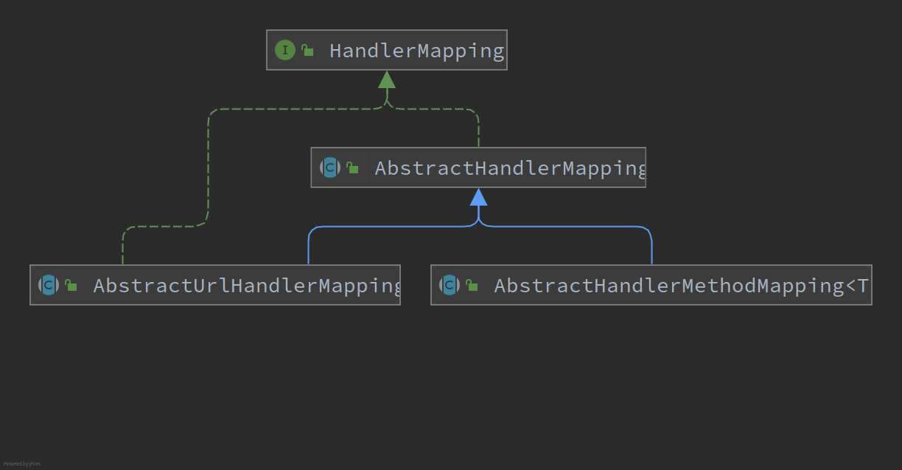

#      HandlerMapping

---

[TOC]

---


## 概述





## AbstractUrlHadnlerMapping


## AbstractHandlerMethodMapping 


### 匹配过程


```java
@Override
protected HandlerMethod getHandlerInternal(HttpServletRequest request) throws Exception {
    // 查找到具体的地址
    String lookupPath = getUrlPathHelper().getLookupPathForRequest(request);
    // 存放在 LOOKUP_PATH
    request.setAttribute(LOOKUP_PATH, lookupPath);
    // 需要上锁
    this.mappingRegistry.acquireReadLock();
    try {
        HandlerMethod handlerMethod = lookupHandlerMethod(lookupPath, request);
        // 创建HandlerMethod
        // 如果匹配到的 handlerMethod  是 String 类型，进一步找到容器中对应的 Bean 对象
        return (handlerMethod != null ? handlerMethod.createWithResolvedBean() : null);
    }  finally {
        this.mappingRegistry.releaseReadLock();
    }
}

```

> 获取用来搜索的地址

```java
public String getLookupPathForRequest(HttpServletRequest request) {
    // Always use full path within current servlet context?
    // 始终使用全路径匹配（默认为 false
    if (this.alwaysUseFullPath) {
        return getPathWithinApplication(request);
    }
    // Else, use path within current servlet mapping if applicable
    String rest = getPathWithinServletMapping(request);
    if (!"".equals(rest)) {
        return rest;
    } else {
        return getPathWithinApplication(request);
    }
}

```

> 根据地址查询 HandlerMethod

```java
@Nullable
protected HandlerMethod lookupHandlerMethod(String lookupPath, HttpServletRequest request) throws Exception {
    List<Match> matches = new ArrayList<>();
    // 直接匹配，就是 Map.get() 方法
    List<T> directPathMatches = this.mappingRegistry.getMappingsByUrl(lookupPath);
    if (directPathMatches != null) {
        addMatchingMappings(directPathMatches, matches, request);
    }
    // 如果没有匹配上，则直接将全部的 Mapping 都带上
    if (matches.isEmpty()) {
        // No choice but to go through all mappings...
        addMatchingMappings(this.mappingRegistry.getMappings().keySet(), matches, request);
    }
    // 存在匹配的 Handler
    if (!matches.isEmpty()) {
        // 先获取到第一个
        Match bestMatch = matches.get(0);
        if (matches.size() > 1) {
            // 如果大小大于1，则直接使用 Comparator 进行对比排序
            Comparator<Match> comparator = new MatchComparator(getMappingComparator(request));
            matches.sort(comparator);
            bestMatch = matches.get(0);
            if (CorsUtils.isPreFlightRequest(request)) {
                return PREFLIGHT_AMBIGUOUS_MATCH;
            }
            // 对比第二个匹配，如果相同的的表示并没有最匹配的
            Match secondBestMatch = matches.get(1);
            if (comparator.compare(bestMatch, secondBestMatch) == 0) {
                throw new IllegalStateException(
            }
        }
        // 将匹配的Handler 保存在 BEST_MATCHING_HANDLER_ATTRIBUTE
        request.setAttribute(BEST_MATCHING_HANDLER_ATTRIBUTE, bestMatch.handlerMethod);
        // 找到匹配之后的钩子方法 
        handleMatch(bestMatch.mapping, lookupPath, request);
        // 返回最匹配的 HandlerMethod
        return bestMatch.handlerMethod;
    }    else {
        // 未匹配的钩子函数
        return handleNoMatch(this.mappingRegistry.getMappings().keySet(), lookupPath, request);
    }
}
```

如果 Rest 风格的 URL，例如 /user/{userId}/info，该请求地址就无法直接匹配，此时会将所有的地址都存入并排序匹配（基本就是两两比较的排序，时间复杂度肯定远大于 hash 的 O(1)，匹配的效率也就大幅的降低。