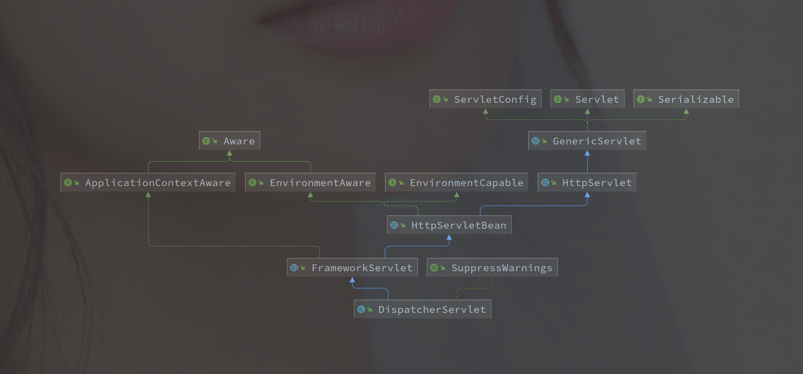
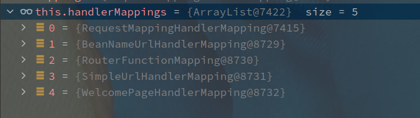

# DispatcherServlet 的处理流程

---

[TOC]


---


## 概述

Spring MVC 是基于 Servlet 容器实现的，所有请求都会先经过 Filter -> Servlet 的流程，其中最关键的 Servlet 就是 **DispatcherServlet**。

以下是 **DispatcherServlet** 的类图结构：




## doDispatch 入口


```java
protected void doDispatch(HttpServletRequest request, HttpServletResponse response) throws Exception {
		HttpServletRequest processedRequest = request;
		HandlerExecutionChain mappedHandler = null;
		boolean multipartRequestParsed = false;
		WebAsyncManager asyncManager = WebAsyncUtils.getAsyncManager(request);
		try {
			ModelAndView mv = null;
			Exception dispatchException = null;
			try {
                		  // 1. 检查是否是文件
				processedRequest = checkMultipart(request);
				multipartRequestParsed = (processedRequest != request);

				// Determine handler for the current request.
               			// 2. 获取处理器的执行链 HandlerExecutionChain
				mappedHandler = getHandler(processedRequest);
				if (mappedHandler == null) {
                    		        // 404 返回
					noHandlerFound(processedRequest, response);
					return;
				}

				// Determine handler adapter for the current request.
                		  // 3. 获取处理器适配器
				HandlerAdapter ha = getHandlerAdapter(mappedHandler.getHandler());

				// Process last-modified header, if supported by the handler.
                		  // 处理 last-modified 请求头
				String method = request.getMethod();
				boolean isGet = "GET".equals(method);
				if (isGet || "HEAD".equals(method)) {
					long lastModified = ha.getLastModified(request, mappedHandler.getHandler());
					if (new ServletWebRequest(request, response).checkNotModified(lastModified) && isGet) {
						return;
					}
				}
				
                		  // 4. 执行前置拦截器，失败则返回
				if (!mappedHandler.applyPreHandle(processedRequest, response)) {
					return;
				}

				// Actually invoke the handler.
                		  // 调用方法处理请求
				mv = ha.handle(processedRequest, response, mappedHandler.getHandler());

				if (asyncManager.isConcurrentHandlingStarted()) {
					return;
				}

				applyDefaultViewName(processedRequest, mv);
               			 // 5. 执行拦截器后置处理器
				mappedHandler.applyPostHandle(processedRequest, response, mv);
			}
		。。。（省略部分异常处理
			}
            	      // 后置处理结果
			processDispatchResult(processedRequest, response, mappedHandler, mv, dispatchException);
		}
		。。。（省略部分异常处理
```


doDispatch 的整体方法主要逻辑如下:

1. 检查请求类型是否为文件相关，是则另外处理
2. 获取处理器执行链（HandlerExecutionChain）
3. 获取 HandlerExecutionChain 的对应处理器（HandlerAdapter）
4. 执行 HandlerInterceptor 前置处理方法（preHandler）
5. 执行具体的方法逻辑
6. 引用默认视图（可能涉及服务端渲染）
7. 执行 HandlerInterceptor 后置处理方法（postHandler）
8. 后置结果处理，里面包含了 HandlerInterceptor 的 afterCompletion 方法的执行


## HandlerMapping 

对于各类处理器的映射，常规 HandlerMapping 如下：



RequestMappingHandlerMapping 就是用来保存 RequestMapping 注解表示的接口的映射。

