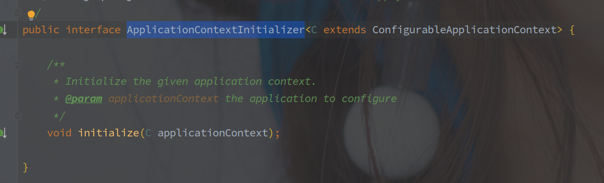

# ApplicationContextInitializer 

---

[TOC]

---

## ApplicationContextInitializer 的作用

ApplicationContextInitializer 中只有一个 initialize(ConfigurableApplicationContext) 方法，用于对应用上下文做自定义的修改。

> 参数就是 ConfigurableApplicationContext，可以在方法中对应用上下文做任意的修改。

调用时机是在 SpringBoot 的启动过程中 prepareContext 阶段。

> **具体点说，是在设置环境之后，但是在加载所有的 BeanDefinition 之前。**

## 具体实现

### PropertySourceBootstrapConfiguration

该类用于 SpringCloud 环境，加载远程配置中心的配置响。