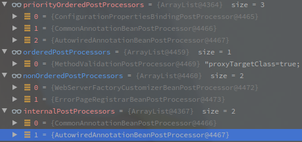

## SpringBoot源码计划

因为SpringBoot的代码真的太复杂了,为了尽快理清整个流程,有些过程会暂时简写带过.

下面就是计划列表,以后打算要看的

1. ConfigurationClassPostProcessor类的执行
2. `1   的什么时候会执行刷新逻辑
3. prepareBeanFactory中注册的ApplicationListenerDetector
4. BeanPostProcess的执行逻辑

 

5. finishRefresh方法
6. Role注解的作用

### 主要流程

1. 启动流程
2. BeanDefinition加载流程
3. Bean创建、获取流程
4. 配置文件加载流程
5. 事件发布流程
6. SpringMVC 和 父子容器
7. SpringMVC的执行流程
8. Aop流程

